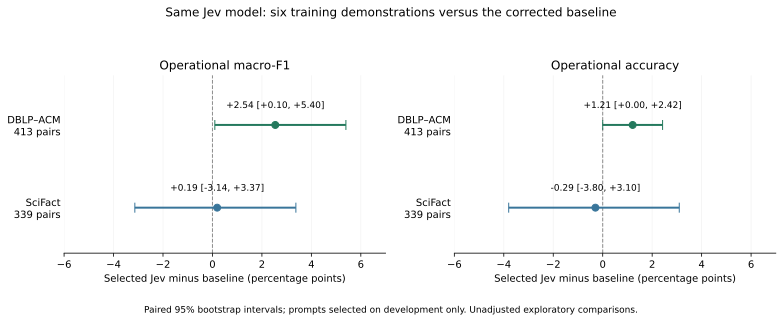

<div align="center">

# Jev Research · Evidence & Reproduction

**Follow the claim. Inspect the evidence. Replay the result.**

 

[Manuscript](../manuscript/paper.md) · [Claim map](../supplementary/CLAIM_EVIDENCE.md) · [Graph research](../graph_synthesis/README.md) · [Reproduction](#reproduce-and-verify)

</div>

---

A research package connecting a Jev decision study with source-bound graph-synthesis experiments. It includes manuscript drafts, recorded model responses, methods, figures, and executable verification.



## What the original study found

| Task | Held-out evidence | Interpretation |
| --- | --- | --- |
| Entity matching | 413 DBLP–ACM pairs; macro-F1 0.9605 → 0.9859; false merges 8 → 2 | A narrow improvement on the fixed split, with one additional missed match |
| Relation verification | 339 SciFact examples; paired macro-F1 interval includes zero | No resolved improvement |

The intervention combines question formulation and demonstrations. These findings do not establish general model superiority or independently attribute the effect to either component. See the [methods](../supplementary/METHODS_AND_REPRODUCIBILITY.md) and [submission-readiness checklist](../supplementary/SUBMISSION_READINESS.md).

## Choose a reading path

| Goal | Start here |
| --- | --- |
| Read the original decision study | [Manuscript](../manuscript/paper.md) and [tables](../tables/TABLES.md) |
| Audit an empirical claim | [Claim-to-evidence map](../supplementary/CLAIM_EVIDENCE.md) and [frozen run](../reproduction/results/jev/run-20260918/) |
| Explore graph synthesis | [Extension guide](../graph_synthesis/README.md), [illustrated paper](../graph_synthesis/paper.md), and [figure gallery](../graph_synthesis/figures/README.md) |
| Understand data provenance | [Source and data notes](../supplementary/REFERENCES_AND_DATA.md) |
| Inspect the original package | [Archival README](../README.md) and [reproduction notes](../REPRODUCE.md) |

## Reproduce and verify

From the repository root, use Python 3.12 and an isolated environment:

```sh
python -m pip install -r graph_synthesis/requirements-verification.txt
python -B scripts/download_datasets.py
python -B -m graph_synthesis.verify --replay --tests
```

Dependency installation and the pinned dataset download need network access. The subsequent replay and original tests use a temporary runtime with network connections blocked and make no live model calls. The [extension guide](../graph_synthesis/README.md) explains cross-platform numerical tolerances and further experiments.

Use the extension verifier for this expanded repository. The original `scripts/verify_package.py` expects the original closed inventory and rejects the additional extension files.

## Archive integrity

This GitHub landing page is separate from the original [root README](../README.md): that file and the baseline `MANIFEST.json` are immutable inputs to the research verifier. The archived evidence remains byte-exact.

Public datasets are downloaded and hash-checked on demand. Dataset rights, attribution, and research limitations remain documented in the [source supplement](../supplementary/REFERENCES_AND_DATA.md); this landing page grants no additional license.
