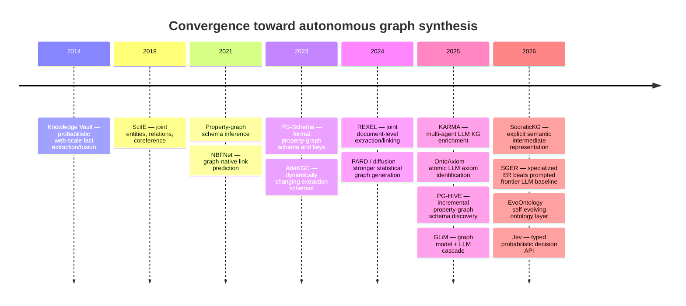
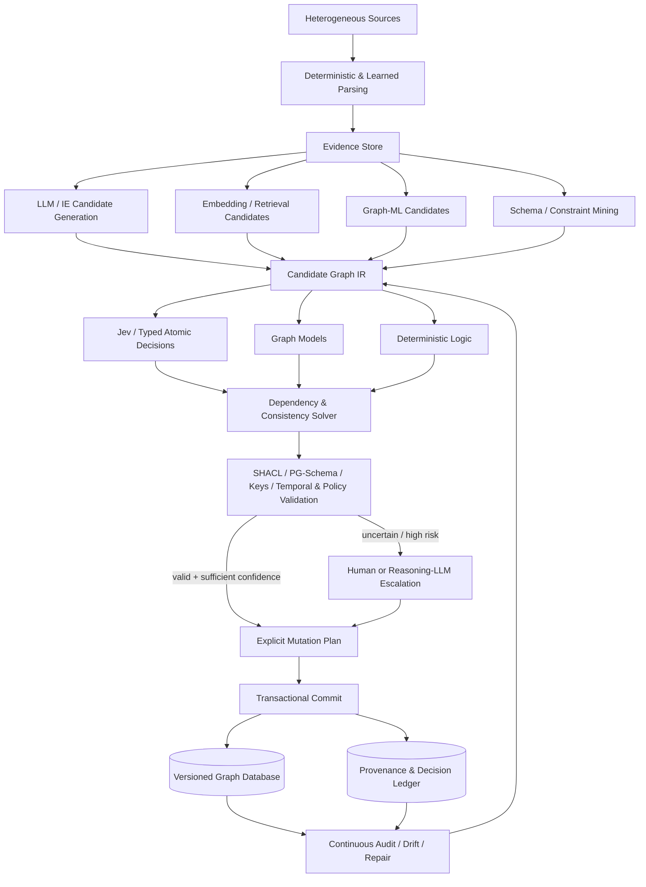

# Autonomous Graph Synthesis as a Typed Probabilistic Graph Compiler

## Executive summary

**Bottom line.** There is a credible research direction here, but the defensible contribution is **not** “KARMA with Jev substituted for some agents.” The stronger idea is to reconceptualize autonomous graph construction as a **transactional compilation problem**:

> heterogeneous evidence → candidate semantic structure → typed probabilistic decisions → global constraint solving → explicit mutation plan → transactional commit → continuous audit.

In that architecture, generative models discover possibilities; graph and retrieval models narrow search spaces; a bounded decision model such as TypeSafe AI's Jev adjudicates many local semantic questions; deterministic software enforces invariants; and uncertainty, evidence, provenance, model/version information, and rejected alternatives remain first-class data. I will call the research architecture **Probabilistic Graph Compiler, or PGC**, below.

The literature strongly supports *pieces* of this design, but I did not find a peer-reviewed system that unifies all of them into the proposed end-to-end abstraction. Classical automated KG construction already separates acquisition, refinement, fusion, and evolution; Knowledge Vault already treated extracted facts probabilistically; probabilistic databases already combine lineage with uncertainty; entity-resolution systems already separate candidate generation from matching; graph-learning models already specialize in structural completion; SHACL and related formalisms already provide deterministic graph validation; modern ontology/schema systems already perform iterative or incremental induction; and recent systems such as SocraticKG explicitly introduce intermediate representations before triple generation. Therefore, none of those ingredients alone is novel. citeturn6academia36turn6search0turn19search21turn17search0turn21search1

The potentially publishable novelty is the **composition and formalization** of these ideas: an evidence-preserving Graph IR that represents candidates and unresolved decisions rather than prematurely materialized facts; a heterogeneous decision fabric in which each operation is assigned to the computational mechanism best suited to it; transaction semantics for AI-generated graph changes; and a benchmark that directly tests whether atomic typed decomposition improves calibration, auditability, cost, and graph quality without sacrificing recall or contextual reasoning. The novelty confidence for that *combined* contribution is **moderate, not high**, because a proper systematic-review protocol and citation-graph search would still be necessary before a paper could make a priority claim. Recent work is rapidly converging on intermediate representations, dynamic ontologies, incremental schema discovery, and self-evolving semantic layers. citeturn21search1turn9academia24turn20academia27turn20academia24

**KARMA is an important but narrower baseline.** The NeurIPS 2025 KARMA paper by Lu, Wu, Zhao, Peng, and Wang is specifically a multi-agent LLM framework for **enriching an existing biomedical KG from scientific publications**. Its formal target is new triples, not autonomous database design across the full lifecycle defined in the research brief. It orchestrates LLM-driven ingestion, reading, summarization, entity extraction/normalization, relation extraction, schema alignment, conflict resolution, evaluation, and graph storage; it evaluates on 1,200 PubMed papers across genomics, proteomics, and metabolomics. The paper reports up to 38,230 new entities in its genomics setting, an LLM-based correctness score of 0.831, and lower conflict incidence after conflict-resolution processing. citeturn13view0turn14view0turn15view0turn15view2

KARMA also exposes precisely the opening that PGC should investigate. Much of its semantic pipeline is mediated by LLM prompts, including bounded operations that can naturally be posed as classification or verification problems. Its own appendix acknowledges that the evaluation relies primarily on LLM-based metrics rather than direct domain-expert validation, and the paper does not establish calibrated probabilities, transaction-level safety, autonomous schema synthesis, or comprehensive provenance semantics. citeturn16view1

**Jev is unusually well matched to some—but emphatically not all—of those bounded operations.** Current TypeSafe documentation defines Jev as the first “System One” model: text state goes in; typed `Choice`, `Score`, and `Noul` judgments with probabilities come out. `Choice` provides a distribution over an explicitly enumerated set, `Score` operates over ordered semantic levels, and `Noul` produces a probability for a yes/no proposition. Questions can be evaluated together, and the documentation explicitly recommends narrow independent judgments combined by ordinary program logic. Jev is text-only today and does not generate replies, explanations, code, arbitrary entity names, or other free-form strings. A `Choice` is currently limited to 255 options. citeturn22view0turn22view1turn22view2

That creates a compelling fit for **candidate acceptance**, but a poor fit for **open-world candidate discovery**. Entity deduplication against a precomputed shortlist, relation support, bounded entity/relation typing, schema alignment to an existing vocabulary, contradiction classification, routing to review, and some evidence-quality judgments are plausible Jev tasks. Novel concept induction, naming new ontology concepts, parsing multimodal documents, generating descriptions, writing migration code, discovering arbitrary relations without a candidate vocabulary, and unconstrained long-chain reasoning are not. TypeSafe itself publishes a KG entity-alignment cookbook in exactly this style: a cheap first pass has already generated 450 possible pairs, then Jev decides among “different,” “curator review,” and “same,” while additional binary judgments inspect fields. That is encouraging evidence for the *decision-layer* hypothesis—but it is a vendor example, uses an older Jev 1.12 release, and does not establish state-of-the-art entity-resolution performance. citeturn23view1

The most important caveat is **type safety is not semantic correctness**. TypeSafe can make it impossible for a Choice answer to fall outside the declared alternatives, but Jev can still choose the wrong valid alternative. TypeSafe's own documentation explicitly says calibration is a property measured across groups of predictions and does not guarantee an individual answer is correct. Its launch blog further clarifies that the company's reported “0%” schema/type-error value is a structural guarantee, not an empirical semantic-accuracy result. citeturn22view1turn23view2

Jev is also exceptionally new. As of September 17, 2026, current documentation lists Jev 1.13 (`jev-1.13.0`) at **$0.042 per million input tokens, no output-token charge**, with published dynamic limits of 250,000 tokens/second and 1,200 requests/minute. TypeSafe advertises 70–500 ms latency and large speed/cost improvements, but those performance figures and workflow comparisons are vendor-reported. The workflow benchmark uses consensus probabilities from large external models as its reference rather than independent human ground truth, and TypeSafe itself acknowledges possible evaluation bias. I found no public peer-reviewed TypeSafe paper independently validating Jev's architecture or its “Reinforcement Learning for Calibrated Decisions” training method in this search. citeturn23view0turn23view2turn23view3

The central hypothesis should therefore be framed for falsification:

> **Does candidate generation + a separately trained bounded decision model + deterministic global validation outperform end-to-end LLM or multi-agent LLM construction at equal candidate recall?**

That is considerably stronger—and more scientifically interesting—than asking whether Jev happens to work well.

The uploaded specification defines the intended scope as graph synthesis across source understanding, ontology/schema induction, instance construction, entity resolution, fusion, refinement, physical graph engineering, evolution, auditing, and self-repair; the analysis below follows that broader definition rather than treating “KG construction” as triple extraction alone. fileciteturn0file0

## Scope, definitions, and methodology

**Working definition.** Autonomous graph synthesis is the continuous transformation of heterogeneous evidence into a versioned graph database in which the system may create and revise **schema, ontology, identity, facts, relations, constraints, provenance, uncertainty, and physical representations**, subject to explicit correctness and governance rules. This is deliberately broader than conventional information extraction. The automatic-KG-construction literature itself distinguishes acquisition from refinement, evolution, and fusion, while database/schema research addresses additional concerns that semantic-web pipelines normally omit. citeturn6academia36turn10search7turn9academia26

A useful decomposition is:

| Layer | Core question | Typical mechanisms | Primary failure mode |
|---|---|---|---|
| Source understanding | What does the input actually contain? | parsers, OCR, IE, multimodal models, LLMs | omitted/misparsed evidence |
| Concept discovery | What kinds of things and relations exist? | clustering, embeddings, ontology induction, LLM generation | invented or unstable concepts |
| Schema synthesis | What structure should the database permit? | schema inference, ontology learning, constraint mining | over/under-generalized schema |
| Instance synthesis | Which entities/events/facts appear? | NER, event extraction, LLM IE | hallucination/omission |
| Entity resolution | Which mentions/records are identical? | blocking + classifiers/LLMs/graph matching | catastrophic false merges |
| Relation synthesis | Which edges are justified? | RE, graph models, LLMs, rules | unsupported edge |
| Fusion | Which conflicting claims coexist or dominate? | truth discovery, temporal logic, source models | information destruction |
| Refinement | What is missing or wrong? | KGC, GNNs, rules, anomaly detection | plausible but false completion |
| Evolution | How should facts/schema change over time? | streaming maintenance, clustering, schema evolution | schema churn/history loss |
| Physical engineering | How should the graph be stored/indexed? | optimizer/statistics/workload models | poor performance |
| Governance | Why did every mutation happen? | provenance, validation, transactions | unauditable graph |

**RDF and labeled property graphs must not be conflated.** RDF offers a standards-based triple model with IRIs, ontology languages, and SHACL-style shape validation. Labeled property graphs attach labels and properties directly to vertices and edges and often operate with less rigid schema discipline; property-graph research must cope explicitly with multi-label nodes, edge properties, property datatypes, keys, and optional or inferred structural types. PG-Schema formalizes property-graph types and constraints, while EDBT work on property-graph schema inference demonstrates that useful schemas can be inferred from graph instances. SHACL, by contrast, is a W3C graph-validation language for RDF. citeturn9academia26turn10search7turn17search0

This distinction matters for the proposed system. An RDF backend could compile semantic constraints to SHACL/OWL-oriented artifacts; a Neo4j-like LPG backend needs a different target containing labels, property types, edge endpoint types, uniqueness/cardinality rules, indexes, and potentially backend-specific physical-design decisions. A storage-neutral Graph IR should therefore sit **above** either representation.

**Methodology and assumptions.** Research was treated as global and English-language, with coverage through **September 17, 2026**. I prioritized conference proceedings, official standards/documentation, original papers, and first-party technical material, and used surveys mainly to establish taxonomy and citation trails. The search covered automatic KG construction, LLM and multi-agent construction, ontology induction and axiom learning, property-graph schema inference/evolution, graph generation, completion, entity resolution, probabilistic databases/KGs, provenance, neuro-symbolic reasoning, graph validation, evolving ontologies, and database-oriented schema/physical design. TypeSafe was researched separately beginning from its current documentation index, as the brief requested. citeturn22view0

This is broad research, but it should **not** be called a formal exhaustive systematic literature review: a defensible novelty claim would still require a reproducible bibliographic database query, inclusion/exclusion criteria, backward/forward citation counts, duplicate removal, and ideally dual-reviewer coding. That limitation matters especially because 2025–2026 work is rapidly filling the space.

A simplified research timeline illustrates how the proposed architecture sits at the convergence of previously separate lines:



The entries above are supported by the respective original sources; importantly, they represent different tasks and should not be interpreted as one continuous benchmark lineage. citeturn6search0turn6search13turn10search7turn12search0turn9academia26turn6search15turn6search17turn11search3turn13view0turn8academia36turn9academia24turn7search2turn21search1turn18search0turn20academia27turn22view1

## Literature landscape and state of the art

### Research taxonomy

**Table A — representative research taxonomy.** “Probabilistic” here means uncertainty/probability is structurally meaningful in the method, not merely that a neural model internally uses logits. “Incremental” means designed to accommodate evolving inputs/schema rather than merely rerunnable.

| Approach | Year | Paper/system | Task | Graph type | Inputs | Outputs | Architecture | Generative? | Probabilistic? | Schema-aware? | Provenance-aware? | Incremental? | Code availability | Dataset | Strength | Main limitation |
|---|---:|---|---|---|---|---|---|---|---|---|---|---|---|---|---|---|
| Probabilistic web extraction | 2014 | Knowledge Vault | extraction + fusion | KG | web text/tables/markup | weighted facts | IE + prior KB + fusion | No | **Yes** | Yes | evidence-oriented | pipeline refresh | official research system | web-scale sources | major precedent for probabilistic facts | not autonomous schema synthesis citeturn6search0 |
| Joint scientific IE | 2018 | SciIE | entities, relations, coref | semantic graph | scientific text | document graph | multitask neural IE | No | classifier scores | fixed | limited | No | research implementation | SciERC | avoids some pipeline cascade errors | fixed schema/domain citeturn6search13 |
| Graph-native completion | 2021 | NBFNet | link prediction | KG | existing graph | candidate links | GNN/path reasoning | No | scores | relation schema fixed | No | inference can generalize | official NeurIPS work | KGC benchmarks | structural reasoning specialist | predicts plausibility, not sourced evidence citeturn12search0 |
| LPG schema inference | 2021 | Schema Inference for Property Graphs | infer structure | LPG | graph instances | schema | inference over labels/properties | No | not central | **Yes** | No | rerunnable | academic prototype | property graphs | specifically addresses LPG peculiarities | does not create semantic facts citeturn10search7 |
| Formal LPG schema | 2023 | PG-Schema | schema/keys | LPG | graph design | formal schema | declarative formalism | No | No | **Yes** | No | schema-editable | specification/research artifact | examples | expressive types + keys | not automatic synthesis itself citeturn9academia26 |
| Dynamic-schema IE | 2023 | AdaKGC | KGC under schema change | KG | text + evolving schema | entities/relations | schema graph + dynamic decoding | Yes | model scores | **Yes** | No | **Yes** | paper artifact | dynamic-schema benchmark | explicitly tests schema expansion | still bounded by provided schema evolution setup citeturn6search15 |
| Joint document enrichment | 2024 | REXEL | mention/type/link/coref/relation | KG | document + reference KG | linked graph facts | unified discriminative model | No | classifier scores | Yes | limited | No | reported research system | doc-level datasets | 11× faster and +6 F1 avg. over cited baselines | relies on reference KG/schema citeturn6search17 |
| Statistical graph generation | 2024 | PARD | graph generation | generic graph | graph training corpus | new graphs | AR + diffusion | **Yes** | **Yes** | structural rather than semantic | No | No | research implementation | graph-generation benchmarks | strong topology generation | generated structure is not evidence-backed truth citeturn11search3 |
| Multi-agent enrichment | 2025 | KARMA | scientific KG enrichment | KG | PubMed PDFs + KG | new triples/entities | LLM agents + embeddings + evaluator | **Yes** | prompt/model scores | **Yes** | limited | modular updates | paper details | 1,200 PubMed papers | modular verification/conflict handling | evaluation heavily LLM-based; not full graph synthesis citeturn14view0turn16view1 |
| Explicit iterative KG generation | 2025 | Tree-KG | text → KG | KG | text | expanding graph | LLM + tree operators | **Yes** | not central | emergent | source-derived | iterative | paper artifact | text-KG benchmarks | iterative recovery of hidden relations | generative verification remains concern citeturn7search3 |
| Graph/LLM cascade | 2025 | GLiM | relation extraction | KG | text/entity pairs/graph | relations | graph model narrows choices, LLM handles hard cases | Hybrid | scores | Yes | No | No | paper artifact | RE benchmarks | evidence for specialist cascade over all-LLM | not lifecycle synthesis citeturn7search2 |
| Ontology axiom learning | 2025 | OntoAxiom | identify axioms | ontology | ontology/content | logical axioms | LLM evaluation, including axiom-by-axiom prompting | Yes | confidence not core | **Yes** | limited | No | benchmark | 9 ontologies / 2,771 axioms | atomic formulation improves F1 | accuracy still insufficient for autonomous ontology engineering citeturn8academia36 |
| Incremental LPG discovery | 2025 | PG-HIVE | latent schema discovery | LPG | evolving graph | node/edge types + constraints | LSH/clustering/inference | No | clustering | **Yes** | No | **Yes** | preprint implementation status varies | property graphs | incremental, unlabeled-friendly | semantic naming/ontology meaning still external citeturn9academia24 |
| LLM + global ER constraints | 2025 | GER-LLM | entity resolution | spatial entities | candidate records | alignments | spatial blocking + grouped LLM + graph conflict resolution | Hybrid | scores | record schema | limited | applicable streaming | research paper | real geospatial datasets | recognizes global consistency problem | domain-specific and LLM-cost sensitive citeturn18search2 |
| Fully inductive graph completion | 2025 | TRIX | link prediction | KG | unseen-domain graph | missing links | graph-native model | No | scores | relation-aware | No | inductive | research paper | KGC benchmarks | strong zero-shot structural completion | not evidence extraction/fusion citeturn12search4 |
| Intermediate-representation KGC | 2026 | SocraticKG | document → KG | KG | documents | QA IR → facts | LLM semantic expansion | **Yes** | not core | partially | grounded to document | iterative | paper | MINE | explicit IR mitigates premature triple collapse | IR is QA-oriented, not transactional/database-level citeturn21search1 |
| Specialized ER | 2026 | SGER | person-name ER | records | noisy name pairs | same/different | structure-guided fine-tuned LLM | discriminative | classifier scores | implicit | No | production inference | production system | 50k held-out pairs | 0.994 F1 reported, above GPT-4o prompting | narrow name/KYC domain citeturn18search0 |
| Self-evolving semantic layer | 2026 | EvoOntology | ontology creation/evolution | ontology/data layer | heterogeneous data + agent behavior | typed ontology edits | builder agent + attribution-guided edits + paired eval | **Yes** | acceptance scoring | **Yes** | evaluation lineage | **Yes** | code reported | 3 data-agent benchmarks | directly competes with “self-evolving schema” novelty | recent preprint; ontology serves data agents rather than graph-DB synthesis citeturn20academia27 |

Several conclusions emerge.

**Classical pipelines remain competitive components, not obsolete baselines.** Scientific IE systems such as SciIE demonstrate the advantage of jointly modeling extraction dependencies; REXEL pushes this further by jointly performing mention detection, typing, disambiguation, coreference, and relation classification. That matters because a naïvely decomposed PGC can actually be *worse*: splitting strongly coupled variables into independent judgments may discard exactly the joint structure that these systems exploit. citeturn6search13turn6search17

**LLMs are strongest where the output space itself must be invented or interpreted from open-ended language.** Recent LLM KG systems can induce schemas, iteratively expand graphs, and work with minimal supervision, but research continues to find hallucination, consistency, coverage-connectivity, and verification problems. Taxonomy-guided and iterative verification approaches improve extraction, while SocraticKG's explicit intermediate semantic layer is evidence that direct “text → triples” is not necessarily the best representation boundary. citeturn7search4turn7search8turn21search1

**Graph-native models should remain in control of graph-native prediction where they are stronger.** NBFNet, GNN-QE, TRIX, tensor-factorization systems, and related work exist because graph topology contains signals that a text-only decision model does not naturally exploit. Their outputs are useful for candidate generation, structural completion, and anomaly prioritization; however, link-prediction probability is not equivalent to evidence that a real-world fact is true. citeturn12search0turn12search12turn12search4turn12search6

**Statistical graph generation is adjacent rather than substitutable.** Diffusion and autoregressive graph generators such as PARD or latent graph diffusion learn distributions over plausible graphs. They can generate topology, molecules, or attributed structures, making them useful for synthetic test generation, priors, or structural proposals. They do not by themselves answer “Does this document establish that company X acquired company Y on date T?” A synthetically plausible graph can be completely factually false. citeturn11search3turn11search4

**Ontology/schema induction is already an active field.** OntoAxiom's result is especially relevant to the Jev hypothesis: converting ontology learning into many small axiom-specific questions improves performance relative to more monolithic prompting, but absolute results remain inadequate for unrestricted automation. That is exactly the kind of result PGC should attempt to replicate with a dedicated decision model rather than assume. RIGOR, TaxoAdapt, PG-HIVE, AdaKGC, and the very recent EvoOntology further reduce the novelty space around “AI that changes the schema.” citeturn8academia36turn8academia38turn8search8turn9academia24turn6search15turn20academia27

**Entity resolution is probably the strongest initial Jev target, but it also provides the strongest falsification baselines.** Modern work demonstrates several successful alternatives: LLMs reformulating entity linking as multiple choice, LLM + graph consistency in GER-LLM, calibrated conventional encoders, specialized fine-tuned models such as SGER, and LLM-teacher/small-model-student workflows in which the expensive model labels training data and a much faster specialist performs production matching. In the latter 2026 study, student matchers were reported to stay within two F1 points of benchmark-trained counterparts and Ditto inference was 41.5–534× faster than direct LLM matching. A Jev-based ER system therefore has to beat **specialist classifiers and distillation**, not merely GPT prompting. citeturn18search6turn18search2turn18search8turn18search0turn18academia27

**Uncertainty should be preserved, but not by multiplying local model probabilities blindly.** Knowledge Vault already treated web-extracted facts probabilistically. Trio demonstrated that data lineage and uncertainty interact, while PrDB modeled correlated uncertain tuples/attributes using graphical models. Neuro-symbolic work such as pLogicNet, DiffLogic, and A-NeSI similarly shows that local neural beliefs and logical constraints can be combined, but global inference is a distinct computational problem. citeturn6search0turn19search21turn19search8turn19search14turn19search0turn19search5

This gives the clearest task allocation.

**Table B — graph-synthesis tasks and computational ownership**

| Task | Strong current approaches | Deterministic option | LLM option | Graph-ML option | Jev applicability | Recommended owner |
|---|---|---|---|---|---|---|
| PDF/JSON/XML/DB parsing | native parsers + document models | **Excellent** where formats are explicit | useful on messy text/layout | little | weak; text-only judgment model | **D + L** |
| Multimodal understanding | multimodal foundation models | metadata parsing only | **Strong** | limited | **None today**; Jev text-only citeturn22view1 | **L/D** |
| NER/event candidate discovery | joint IE, generative IE | dictionaries/regex | **Strong open-world recall** | sequence/encoder models | validation only | **L / specialist model** |
| New concept discovery | clustering + ontology learning | statistics | **Strong for naming/description** | embeddings/clustering | cannot invent arbitrary names | **G + L + H** |
| Existing entity type | classifiers | schema/rule cases | strong | strong | **Excellent bounded Choice** | **J/G** |
| New entity-type creation | ontology induction | frequency/support tests | **Necessary for open naming** | clustering evidence | vote on pre-generated candidates | **L + G + H** |
| Relation candidate discovery | RE/LLMs | pattern rules | **Strong** | link/relation models | cannot discover unknown labels without candidates | **L/G** |
| Candidate relation support | NLI/verifiers | exact evidence rules | strong | possible | **Excellent Noul** | **J + D** |
| Relation typing | classifiers | endpoint-domain rules | strong | strong | **Excellent Choice** for bounded vocabulary | **J/G** |
| Entity candidate blocking | ANN, lexical, graph neighborhood | **Strong** | expensive | **Strong** | poor at whole-corpus search | **D/G** |
| Entity-match adjudication | specialist cross-encoders/LLMs | exact identifiers | strong | graph alignment | **Very strong candidate** | **G/J**, benchmark against specialist ER |
| Cluster consistency | correlation/clustering | union-find + constraints | can reason | **Strong** | local pair judgments insufficient alone | **G/D** |
| Contradiction candidate discovery | temporal/rule/query systems | **Strong where formalizable** | strong semantic detection | anomaly models | Noul on proposed pair | **D/G → J/L** |
| Conflict action | policies + truth discovery | policy/rules | strong | source models | **Excellent bounded Choice** | **J + D + H** |
| Source reliability | source modeling | explicit trust policy | qualitative | statistical truth discovery | Score possible, but context-sensitive | **G/D/J** |
| Missing-link prediction | KGE/GNNs | rules | possible | **Best fit** | secondary verifier only | **G** |
| Constraint validation | SHACL, OWL, keys, DB constraints | **Best fit** | inappropriate as authority | secondary | unnecessary | **D** citeturn17search0 |
| Schema induction | inference/clustering | cardinality/type mining | **Strong semantic synthesis** | clustering | adjudicate candidates | **D/G/L/J** |
| Schema migration | DB migration tooling | **Essential** | plan/code proposal | little | choose among validated plans | **D + L + H** |
| Index/partition/projection design | optimizers/workload analysis | **Strong** | advisory | learned cost models | limited scoring | **D/G** |
| Provenance recording | PROV-O/lineage | **Essential** | no need | no need | supplies decision metadata | **D** citeturn17search3 |
| Transaction commit/rollback | DBMS | **Exclusive authority** | should never directly commit | no | should never directly commit | **D** |
| Human escalation | workflow | threshold/policy | recommendation | anomaly routing | **Excellent confidence gate** | **D + J + H** |

The strongest architectural principle is therefore **heterogeneity**. A credible graph synthesizer should not have a single “AI brain”; it should compile each uncertainty into the form best served by the appropriate mechanism.

## KARMA and Jev deep dives

**KARMA baseline.** The NeurIPS paper describes a hierarchical multi-agent system under a Central Controller. Its formal system section names Ingestion, Reader, Summarizer, Entity Extraction, Relationship Extraction, Schema Alignment, Conflict Resolution, and Evaluator agent classes; Figure 2 visualizes parsing, extraction/alignment/conflict handling, evaluation, and KG storage. The paper repeatedly calls the system “nine collaborative agents,” although the formal bullet list contains eight functional agent categories under the controller—a minor presentation/counting ambiguity worth avoiding in a reproducible reimplementation. citeturn14view0turn15view0

Its pipeline can be reconstructed as:

```text
PubMed PDF
   │
   ├─ Ingestion Agent
   │      normalize document + metadata
   ↓
Reader Agent
   │      segment + relevance filter
   ↓
Summarizer Agent
   │      high-signal domain summary
   ↓
Entity Extraction Agent
   │      LLM NER + dictionary/ontology filter
   │      embedding-based normalization against existing V
   ↓
Relationship Extraction Agent
   │      LLM relation distribution / thresholding
   ↓
Schema Alignment Agent
   │      classify entity/relation to valid schema types
   ↓
Conflict Resolution Agent
   │      LLM contradiction debate
   ↓
Evaluator Agent
   │      confidence + clarity + relevance aggregation
   ↓
KG storage
```

Entity normalization is notably **not purely agentic LLM reasoning**: the paper defines nearest-neighbor matching in a joint embedding space and marks an entity as new when distance exceeds a threshold. Relation extraction is then framed as an LLM distribution over known relationship types; schema alignment similarly selects a valid type; conflict resolution uses an LLM decision between agreement and contradiction; and the Evaluator combines multiple signals before integration. citeturn15view1

The evaluation uses 720 genomics, 360 proteomics, and 120 metabolomics PubMed articles. The tested backbones are GLM-4, GPT-4o, and DeepSeek-v3. DeepSeek-v3 yields the largest genomics coverage gain of 38,230 entities in Table 1, while GPT-4o obtains the highest reported LLM-based correctness value in some domain settings. The paper's own results emphasize a recall/precision tradeoff among backbones rather than a universally dominant model. citeturn14view0turn15view2turn16view3

Its “cost analysis” reports prompt/completion token and processing-time distributions rather than a portable dollar-cost comparison. Genomics has mean completion tokens around 550.64 in the cited analysis, while proteomics reports mean processing time about 96.58 in the paper's units. More importantly, the authors acknowledge that quality evaluation relies mainly on LLM-based metrics and that direct biomedical expert validation is ultimately necessary. citeturn16view0turn16view1

A genuine advance over KARMA therefore needs to do more than swap models:

| KARMA capability | Existing KARMA method | PGC replacement/augmentation | Expected advantage | Main risk |
|---|---|---|---|---|
| Ingestion | LLM normalization | native parsers first; LLM only for malformed/unstructured regions | lower cost, deterministic extraction | parser coverage gaps |
| Reading/relevance | LLM relevance score | retrieval/specialist classifier → Jev only if semantic ambiguity remains | high throughput | over-filtering destroys recall |
| Summarization | LLM summary | preserve evidence spans; optional compression | avoids information lost before extraction | more state/tokens |
| Entity discovery | LLM NER | joint IE/LLM candidate generation | retain open-world recall | still expensive |
| Entity normalization | embedding nearest neighbor | ANN blocking → graph/lexical features → Jev bounded adjudication | calibrated routing and explicit `new_entity` outcome | Jev may underperform specialized ER |
| Relation extraction | LLM generation/classification | candidate generator → Jev support Noul + relation Choice | proposal/acceptance independence | missed candidates unrecoverable |
| Schema alignment | LLM type classification | bounded Jev Choice for known schema; LLM proposal only for genuinely new types | fewer malformed/open-schema mutations | 255-option limit; hierarchy needed |
| Conflict detection | LLM debate | deterministic candidate detection + Jev semantic contradiction + temporal/source solver | auditability, less prompt debate | global conflicts need joint inference |
| Evaluator | LLM-derived scores | calibrated decision outputs + explicit policy/risk solver | measurable selective automation | calibration unproven on graph tasks |
| Integration | thresholded storage | typed mutation IR → formal constraints → transaction | rollback, reproducibility, provenance | engineering complexity |
| Evolution | modular reruns | explicit graph/schema versioning + reevaluation triggers | true continuous lifecycle | schema oscillation |
| Evidence trail | limited | immutable evidence and decision lineage | “why does this edge exist?” | storage overhead |

**TypeSafe/Jev technical findings.** The current documentation index explicitly enumerates Jev's primitives, patterns, SDKs, model reference, model “jaggedness,” batching examples, hierarchical classification, re-ranking, citation checking, entity alignment, RAG classification, and other examples. Python and JavaScript SDKs are documented; the API is `POST /v1/systemone`. citeturn22view0turn22view1

Current documented contract:

| Property | Current documented behavior | Research implication |
|---|---|---|
| Input | text; strings, JSON objects, arrays of text | Graph IR can serialize evidence/state, but raw images/audio/video need upstream models. citeturn22view1 |
| Free-form generation | not a System One capability | candidate names/descriptions/code require another model. citeturn22view1 |
| Noul | probability of a yes/no proposition | natural relation-support, duplicate, contradiction, sufficiency primitive. citeturn22view0 |
| Choice | one option + full option probability distribution + confidence | natural type/action/canonical-candidate primitive. citeturn22view2 |
| Choice cardinality | up to 255 options | entity resolution requires blocking/hierarchical search above that size. citeturn22view2turn23view2 |
| Score | ordered semantic scale + distribution/confidence | useful for ordered risk/evidence quality, not arbitrary generation. citeturn22view0 |
| Parallel questions | multiple questions can be evaluated in one request | directly supports atomic decomposition/fan-out. citeturn22view2 |
| Question dependence | docs present questions as independent judgments over state | downstream solver must restore cross-decision dependencies. citeturn22view1 |
| Model | Jev 1.13.0 | pin version for calibrated thresholds. citeturn23view0 |
| Price | $0.042/M input tokens; output free | potentially excellent for high-volume validation. citeturn23view0 |
| Published limits | 250k tokens/s; 1,200 requests/min, currently dynamic | batching architecture matters. citeturn23view0 |
| Vendor latency | 70–500 ms | promising, but not an independent SLA/benchmark. citeturn23view2 |
| Calibration | trained/positioned for calibrated decisions; group-level property | must be re-tested per graph task and model version. citeturn22view1 |
| Semantic correctness guarantee | **none** | a valid typed answer can still be wrong. citeturn22view1turn23view2 |
| Repeatability guarantee | no deterministic repeatability guarantee found in reviewed official pages | log model version + output distribution; test variance empirically. citeturn23view0 |
| Published context window | not specified in the official pages reviewed | do not design around an unofficial context-size claim. citeturn22view0turn23view0 |

TypeSafe's batching claim is unusually relevant. Its documentation index describes a 13-question regulatory example in which batching the questions into one call is reported as 12.2× cheaper and 10× faster with unchanged answers. That is **vendor-reported cookbook evidence**, not an independent graph benchmark, but it makes the “thousands of atomic decisions” hypothesis technically plausible enough to test. citeturn22view0

The launch evaluation should be interpreted cautiously. TypeSafe's workflow harness deliberately decomposes policies into narrow Noul/Choice/Score questions plus deterministic code; all compared models run the same harness. But reference targets are generated from consensus of large external models, not independently adjudicated ground truth. TypeSafe also says the workflow tasks were created by people on its model-capabilities team, so bias may exist. citeturn23view2turn23view3

The distinction between probability and confidence also matters. For a Choice, TypeSafe returns a full distribution over alternatives and separately derives a confidence measure from how concentrated that distribution is. Therefore `P(Person)=0.82` and “confidence in the Choice” should not be stored as interchangeable quantities. citeturn22view2

**Illustrative Jev economics.** At the current list price, the decision-layer charge is simply:

\[
\text{cost} =
\frac{\text{billed input tokens}}{1{,}000{,}000}\times \$0.042
\]

so, ignoring batching and every other system cost:

| Atomic decisions | Mean billed input/decision if sent separately | Input tokens | Jev list-price component |
|---:|---:|---:|---:|
| 1,000 | 1,000 | 1M | $0.042 |
| 1M | 500 | 500M | $21 |
| 1M | 1,000 | 1B | $42 |
| 1M | 5,000 | 5B | $210 |
| 10M | 1,000 | 10B | $420 |

Those are **not end-to-end PGC cost estimates**. Real cost can be lower per decision when shared state/questions are batched, and total graph-construction cost can be much higher once LLM candidate generation, embedding search, document parsing, graph computation, storage, and human review are included. The table merely shows why an inexpensive decision layer could make continuous rechecking economically interesting. Current pricing itself may change. citeturn23view0turn22view2

**Table C — Jev primitive mapping**

| Graph operation | Noul | Choice | Score | Candidate generation required first? | Deterministic validation | Suitability |
|---|---|---|---|---|---|---|
| “Evidence supports edge” | **Primary** | — | evidence-strength bands optional | yes, edge candidate | source-span existence | **Excellent J** |
| Same-entity pair | **Strong** | possible | ordered merge/review/separate | **Yes** | ID/key contradictions | **Excellent J/G hybrid** |
| Select canonical entity | per-candidate support | **Primary** | — | shortlist mandatory | uniqueness | **High**, ≤255/direct or hierarchy |
| New-vs-existing entity | Noul “none match” | candidates + `new` | — | blocking | keys | **High** |
| Entity type | one-vs-rest | **Primary** | — | ontology labels | domain constraints | **Excellent** |
| Relation type | support per relation | **Primary** | — | relation vocabulary | domain/range | **Excellent** |
| New relation name | — | choose among proposals only | — | **LLM must propose** | naming/collision checks | **Poor as generator** |
| Source credibility | proposition checks | categorical tier | **Primary ordered rubric** | source metadata | policy | **Moderate**; risk of contextual bias |
| Contradiction | **Primary** | contradiction type | severity | conflict candidate | temporal/logical checks | **High hybrid** |
| Conflict-resolution action | supporting Nouls | **Primary**: retain/replace/bitemporal/uncertain/escalate | — | conflict detected | policy + transaction | **Excellent** |
| Property replacement | “new supersedes old?” | action | — | candidate values | datatype/time rules | **High** |
| Schema fit | “fits class?” | **Primary** | fit quality | candidate class | SHACL/PG rules | **High** |
| Create new class | assess proposed class | accept/reject/proposal choice | novelty/support | **LLM/G proposes** | collision/coherence | **Secondary J** |
| Link prediction | verify proposed link | relation among shortlist | — | **G generates** | schema | **Verifier only** |
| Graph anomaly severity | anomaly proposition | anomaly category | **Primary** | graph model flags | invariants | **J + G** |
| Materialize fact | sufficient-evidence Noul | action | risk band | fact candidate | **mandatory constraints** | **Excellent routing role** |
| Physical index selection | weak | among optimizer plans | workload score | DB optimizer generates | cost model | **Low J; D/G preferred** |
| Mutation commit | never authoritative | never authoritative | — | mutation plan | **transaction engine** | **D only** |

The entity-alignment example in TypeSafe's own documentation follows almost exactly this decomposition—candidate blocking exists before Jev, semantic matching is a bounded decision, and arithmetic comparison remains ordinary code. That is a good design principle beyond TypeSafe: **do not spend semantic-model capacity on arithmetic, IDs, types, transaction semantics, or constraints that software can determine exactly.** citeturn23view1

## Proposed probabilistic graph compiler

The strongest architecture supported by the evidence is a **compiler-like system in which AI never directly mutates the production graph**.



This architecture deliberately separates **semantic evidence** from **materialized graph state**. SHACL already demonstrates the value of representing graph conditions separately from data, while PROV-O provides a standardized vocabulary for entities, activities, agents, and derivation relationships. PGC extends this idea by making model decisions and rejected mutation candidates first-class provenance. citeturn17search0turn17search3

**The Graph IR is the central proposed abstraction.** Existing work already uses intermediate structures: SocraticKG uses question-answer pairs to unfold semantics before fact extraction, and recent query systems use structured intermediate representations for graph reasoning. What appears less established in the sampled graph-construction literature is an IR whose job is simultaneously to represent **evidence, unresolved alternatives, probability observations, constraint results, and database mutations**. That combination—not the mere word “IR”—is where the research opportunity lies. citeturn21search1

A minimal IR object might look conceptually like:

```text
GraphCandidate {
    candidate_id

    evidence[] {
        source_id
        source_version
        source_location
        exact_span_or_record
        observed_at
        content_hash
        parser
    }

    semantic_object {
        kind: NODE | EDGE | PROPERTY | SCHEMA_CHANGE
        candidate_labels[]
        candidate_types[]
        candidate_values[]
        candidate_endpoints[]
        temporal_validity
    }

    resolution_candidates[] {
        graph_object_id
        retrieval_method
        retrieval_score
    }

    decision_requirements[] {
        decision_id
        primitive: NOUL | CHOICE | SCORE | GRAPH_MODEL | RULE | HUMAN
        question
        admissible_outputs
        dependencies[]
    }

    decision_observations[] {
        model_family
        model_version
        distribution
        confidence
        timestamp
        state_hash
    }

    constraints[] {
        constraint_id
        status
        evidence
    }

    proposed_mutations[] {
        operation
        preconditions
        postconditions
        inverse_operation
        risk_class
    }
}
```

The important feature is that `candidate` and `committed fact` are separate types. A candidate can survive for months without becoming an asserted production fact. Likewise, a previously committed assertion can become `contested` or `superseded` without being erased.

**Probabilistic graph compilation should preserve uncertainty, but Jev outputs should not be mistaken for a coherent joint probability model.** Suppose Jev independently reports:

```text
type(x):
  Person        .82
  Organization  .11
  ResearchGroup .05
  Unknown       .02

same_entity(x, A) = .94
works_for(x, Y)   = .87
```

It is mathematically unsafe to infer a global graph probability by naïvely multiplying `.82 × .94 × .87`. The decisions share evidence and may be strongly correlated. Probabilistic-database research has long treated correlation and lineage as substantive modeling issues rather than assuming independent tuples, and neuro-symbolic systems explicitly introduce global inference over weighted facts/rules. citeturn19search8turn19search21turn19search14turn19search0

A better design stores Jev outputs as **local calibrated observations** and constructs a separate dependency layer:

\[
P(G \mid E) \propto
\prod_i \phi_i(D_i,E_i)
\prod_j \psi_j(D_{j_1},D_{j_2},\ldots)
\]

where the \(\phi_i\) terms encode model observations and \(\psi_j\) terms encode schema, identity, temporal, logical, and graph dependencies. This does not imply that a full probabilistic graphical model must be solved globally for every mutation; approximate/local inference, constraint propagation, or optimization can be substituted according to scale.

For materialization, facts should occupy states such as:

```text
PROPOSED
  ↓
EVIDENCE_SUPPORTED
  ↓
CONSTRAINT_VALID
  ↓
AUTO_COMMITTABLE ─────┐
  │                   │
  └→ REVIEW_REQUIRED  │
                      ↓
                   COMMITTED
                      ↓
          ┌───────────┴───────────┐
       CONTESTED              SUPERSEDED
```

The threshold should be based on **expected mutation risk**, not one universal probability. A false merge is normally more destructive than leaving two duplicates separate; TypeSafe's own entity-alignment example explicitly makes that asymmetry part of the routing design. citeturn23view1

**The graph mutation protocol is as important as extraction quality.** Every AI-initiated change should compile to operations such as:

```text
CREATE_NODE
CREATE_EDGE
SET_PROPERTY
ADD_TYPE
MERGE_ENTITIES
SPLIT_ENTITY
SUPERSEDE_FACT
CREATE_NODE_TYPE
CREATE_EDGE_TYPE
ADD_PROPERTY
ADD_CONSTRAINT
RELAX_CONSTRAINT
DEPRECATE_TYPE
MIGRATE_INSTANCES
```

Each mutation needs a precondition, inverse/rollback operation where possible, affected-object set, supporting evidence, decision lineage, schema version, and validation result. The transaction engine—not an LLM and not Jev—checks preconditions against the current graph version and either commits the entire plan or rejects it.

**Provenance should answer causal questions, not merely record a source URL.** W3C PROV-O provides a natural standards layer for representing entities, activities, agents, generation, derivation, and attribution. On top of it, PGC should store fields such as `mutation_id`, source/version/location, candidate-generator version, decision model/version, primitive and distribution, constraint results, transaction ID, graph version, temporal validity, reviewer identity if applicable, and `superseded_by`. citeturn17search3

Then a query such as “Why does this edge exist?” can yield:

```text
edge e472
 ├─ asserted by transaction tx_9918
 ├─ derived from candidate c_771
 ├─ candidate generated by relation-extractor v3.2
 ├─ evidence:
 │    paper_123, Results §4, chars 18,291–18,436
 ├─ support decision:
 │    Jev 1.13.0 Noul = 0.973
 ├─ relation type:
 │    Choice {inhibits=.91, regulates=.07, other=.02}
 ├─ schema validation:
 │    PASS domain/range
 ├─ independent evidence verifier:
 │    PASS
 └─ graph version:
      2026-09-17T14:03:11Z
```

That structure is substantially more useful for research reproducibility than storing `confidence=.97` directly on an edge.

**Self-repair should be event-driven rather than repeatedly asking an LLM to reread the whole graph.** A scalable audit subsystem can generate work from deterministic and graph-native signals: new conflicting evidence, changed sources, schema violations, high-uncertainty committed decisions, anomalous graph neighborhoods, entity clusters near merge boundaries, temporal expiration, model upgrades, and schema drift. Graph models then nominate anomalous or missing structure; Jev can cheaply re-evaluate narrow semantic questions; formal constraints reject impossible repairs. ReGraphRAG, graph-completion work, and neuro-symbolic inference demonstrate relevant pieces, but none is sufficient as a complete self-repair system. citeturn20search0turn12search0turn19search0

**Schema evolution requires more restraint than fact insertion.** PG-HIVE already investigates incremental property-graph schema discovery, AdaKGC explicitly evaluates changing extraction schemas, TaxoAdapt addresses evolving taxonomies, and EvoOntology now proposes autonomous ontology refinement via typed edits and paired evaluation. Thus “self-evolving schema” is no longer a clean novelty claim. citeturn9academia24turn6search15turn8search8turn20academia27

PGC should instead test **safe schema compilation**:

```text
observed drift
   ↓
cluster/statistics detect recurring structure
   ↓
LLM proposes human-readable schema mutation
   ↓
Jev / specialist models assess bounded hypotheses
   ↓
deterministic impact analysis
   ↓
shadow schema + migration simulation
   ↓
quality comparison
   ↓
human approval for high-impact changes
   ↓
versioned transactional migration
```

`ADD_PROPERTY` on a low-risk optional field could become highly automated. `MERGE_NODE_TYPES`, `SPLIT_NODE_TYPE`, `RELAX_CONSTRAINT`, and mass `MIGRATE_INSTANCES` should initially be treated as high-impact operations requiring shadow evaluation and human approval.

**Table D — architecture comparison**

| Architecture | Candidate recall | Semantic precision | Calibration | Structural consistency | Provenance/auditability | Latency/throughput | Relative cost | Maturity | Expected impact | Principal risk |
|---|---|---|---|---|---|---|---|---|---|---|
| Traditional IE | medium–high in trained domain | high in-domain | calibratable | fixed-schema good | good if engineered | **Excellent** | **Low** | **High** | dependable extraction backbone | weak open-world adaptation |
| Graph ML | poor for raw-text discovery | high for learned structural patterns | model-dependent | **Excellent graph-native signal** | weak evidence semantics | **Excellent inference** | low–medium | **High** | completion/anomaly/candidate generation | plausible ≠ factual |
| Monolithic frontier LLM | **high open-world** | variable | generally task-dependent | weak without tools | moderate if prompted | low | high | high model maturity | fastest prototype | hallucination, cost, opaque coupling |
| Generic multi-agent LLM | high | often better than one prompt | still weakly characterized | improved by review agents | moderate–high | **low** | **very high** | medium | modular semantic workflows | repeated LLM cost and correlated errors |
| KARMA | high scientific extraction coverage | promising, but evaluation partly LLM-judged | not established as calibrated | conflict agent + schema alignment | partial | processing time substantial | high | research prototype | strong KG-enrichment baseline | limited gold validation; fixed enrichment framing citeturn14view0turn16view1 |
| **PGC: generator + Jev + G + D** | depends on generator | potentially high | **testable first-class property** | **strong via solver/constraints** | **designed-in** | potentially high after candidate generation | low decision cost; generator may dominate | **low/new** | strong if atomic decisions validate cheaply | candidate-recall ceiling; dependency errors; unproven Jev calibration |
| Jev-heavy / LLM escalation only | lower if candidate methods weak | potentially high on bounded tasks | testable | strong if deterministic solver | high | **potentially highest** | potentially lowest | experimental | attractive for continuous audit | inability to discover genuinely new semantics |

The most important row is the risk column. **PGC cannot recover information its candidate generator never proposes.** Separating proposal from acceptance can increase precision while silently destroying recall. That is the system's central architectural vulnerability.

## Experimental program and novelty tests

The implementation should begin with narrow experiments where reliable labels exist, and only then progress toward autonomous graph evolution.

| Experiment | Question | Dataset/test construction | Baselines | Primary metrics | Falsification condition |
|---|---|---|---|---|---|
| Relation validation | Does evidence support a candidate triple? | annotated scientific/document relation corpora + adversarial unsupported triples | Jev, frontier LLM, small LLM, NLI, deterministic rules | P/R/F1, Brier, ECE, selective risk | Jev offers no accuracy/calibration/cost frontier |
| Entity resolution | Is mention/record X entity A/B/.../new? | Magellan-style record matching plus harder heterogeneous domains | Jev, SGER-like specialist, cross-encoder, prompted LLM, embedding threshold | pairwise P/R/F1; cluster metrics; false-merge cost; calibration | specialist matcher dominates at lower cost |
| Relation typing | Which existing predicate applies? | closed ontology relation sets | Jev Choice, LLM structured output, graph classifier | accuracy/F1, calibration | Jev loses materially at equal latency/cost |
| Entity typing | Which ontology class applies? | hierarchical ontology classes | Jev hierarchical Choice, encoder, LLM | micro/macro F1, hierarchical error | decomposition gives lower semantic consistency |
| Conflict resolution | retain/replace/bitemporal/uncertain/escalate? | constructed temporal/source conflicts + expert labels | Jev, LLM debate, rules, truth-discovery model | action accuracy, severe-error rate, calibration | atomic decisions miss contextual dependencies |
| Schema alignment | Map candidate onto existing schema | dynamic-schema benchmark + LPG schemas | Jev, embedding matcher, LLM | top-k, abstention quality, ECE | 255/hierarchy overhead removes efficiency advantage |
| Full document construction | Does PGC beat pipelines end to end? | scientific + open-domain corpora; include SocraticKG-style document benchmark | monolithic LLM, KARMA-style agents, LLM+D, LLM+G, PGC | node/edge/property F1, consistency, provenance, cost | local gains disappear end to end |
| Streaming evolution | Can it update without corrupting history? | chronological document stream | batch reconstruction, append-only KG, PGC | stale-fact rate, rollback rate, temporal correctness, schema churn | repeated revision destabilizes graph |
| Adversarial ingestion | Is the compiler robust? | duplicates, prompt injection, misinformation, ambiguous identity, stale claims | same architectures | false automatic mutation, attack success, escalation | untrusted source text changes decision instructions |
| Scale | Do atomic decisions actually scale? | 1K → 10M decisions; extrapolate only after measured regimes | LLM agents, specialist models, PGC | decisions/s, $/M decisions, p50/p95 latency | candidate generation or solver dominates enough to erase benefit |

The entity-resolution experiment is especially important because the TypeSafe cookbook already supplies a direct proof-of-concept, while modern independent ER research provides strong specialist baselines. A victory over “LLM prompt” but a loss to a calibrated cross-encoder or distilled matcher would argue **against** Jev being the right production ER component. citeturn23view1turn18search0turn18search8turn18academia27

**Metrics must separate extraction, graph correctness, calibration, and operational quality.** Precision/recall/F1 should be reported independently for entities, edges, properties, and types. Entity resolution should measure both pair decisions and cluster-level merge/split errors. Calibration should include Brier score, ECE, reliability diagrams, selective accuracy, and risk/coverage curves. System metrics should include end-to-end and component latency, throughput, total billed tokens, dollars/document/entity/edge/million judgments, and human-review minutes. Graph metrics should include schema violations, contradiction rate, rollback rate, temporal inconsistency, provenance completeness, and reproducibility from the stored IR.

A particularly informative metric is:

\[
\text{False Automatic Mutation Rate}
=
\frac{\text{incorrect committed AI mutations}}
{\text{all automatically committed AI mutations}}
\]

because conventional extraction F1 can hide the difference between “the model suggested a wrong edge” and “the production graph was actually corrupted.”

Likewise:

\[
\text{Risk-Coverage}(\tau)
=
\left(
\frac{\#\text{automatic cases at threshold }\tau}{N},
\;
\text{error rate among automatic cases}
\right)
\]

is more relevant than raw model accuracy for an architecture allowed to abstain.

**Ablations are essential.** At minimum compare the complete system against removal of Jev, generative LLM, graph ML, formal validation, probability/confidence thresholds, provenance, independent verification, schema reasoning, and global dependency resolution. The two critical comparisons are:

```text
one large end-to-end prompt
        vs.
many atomic judgments + deterministic composition
```

and:

```text
one model proposes and judges
        vs.
generator proposes + architecturally distinct judge
```

A third ablation is necessary because TypeSafe itself advocates workflow decomposition:

```text
same atomic workflow
Jev
vs.
frontier LLM using identical bounded questions
vs.
specialized discriminative classifier
```

Without that comparison, an improvement could be caused by **workflow structure rather than Jev**. TypeSafe's own workflow evaluation actually suggests this possibility: it reports that models generally improve when policies are decomposed into structured workflows, not only that Jev is efficient. citeturn23view3

Another necessary experiment tests the independence assumption. Compare:

```text
independent pair/entity/relation decisions
vs.
joint decisions
vs.
independent local scores + global constraint optimization
```

GER-LLM's use of graph-based conflict resolution and the history of joint IE both suggest that global coupling can materially improve consistency. citeturn18search2turn6search13

**Table E — novelty-gap assessment**

| Proposed research gap | Closest work found | Difference that might remain | Evidence gap | Novelty confidence | Decisive test |
|---|---|---|---|---|---|
| Graph synthesis as compilation | SocraticKG IR; schema transformation research; conventional ETL compilers | evidence/candidate/decision/constraint/mutation IR with transaction semantics | systematic citation search incomplete | **Medium** | show IR enables interchangeable models/backends and safer commits |
| Typed probabilistic graph construction | Knowledge Vault; probabilistic DBs; Jev typed decisions | every uncertain mutation explicitly represented as bounded decision + lineage | no peer-reviewed Jev graph study | **Medium** | calibration + consistency benchmark |
| Proposal separated from acceptance | ER blocking/matching; verifier pipelines; GLiM | different model family as standardized acceptance fabric | concept is already common | **Low** | demonstrate unique benefit beyond ordinary classifier cascade |
| Massive atomic decomposition | joint-vs-pipeline IE; OntoAxiom atomic prompting; TypeSafe workflows | million-scale typed semantic decomposition | global dependency cost unclear | **Low–Medium** | atomic vs monolithic vs joint across same tasks citeturn8academia36turn23view3 |
| Continuous low-cost graph auditing | graph repair, completion, validation, anomaly detection | persistent re-evaluation tied to evidence/model/schema versions | few end-to-end cost studies | **Medium** | streaming benchmark measuring prevented corruption/$ |
| Probabilistic provenance graph | Knowledge Vault; Trio; PROV-O | combine source lineage *and decision-model distributions* for every mutation | integration not yet shown as novel | **Low–Medium** | provenance-aware rollback/explanation benchmark citeturn6search0turn19search21turn17search3 |
| Self-evolving LPG schema | PG-HIVE, AdaKGC, TaxoAdapt, EvoOntology | formally validated transactional schema evolution of a production LPG | field moved quickly in 2026 | **Low–Medium** | streaming schema-drift benchmark citeturn9academia24turn20academia27 |
| Transactional AI graph mutations | DB transaction principles + provenance + KG pipelines | AI can only emit a staged mutation plan with pre/postconditions and rollback | closest exact academic system not established in this review | **Medium–High** | prove safety properties; compare direct-agent editing |
| Confidence-aware materialization | probabilistic DBs, selective prediction, human routing | unified graph lifecycle states tied to calibrated semantic decisions | underlying idea is not new | **Low** | risk/coverage superiority |
| Hybrid global uncertainty solver | probabilistic DB + neuro-symbolic reasoning | treat Jev outputs as observations rather than final fact probabilities | factor design/scalability unknown | **Medium** | local-threshold vs global-inference benchmark |

Two recent papers materially narrow the novelty claim. **SocraticKG** already demonstrates that an intermediate representation before triples can improve KG construction, so “we use an IR” is not enough. **EvoOntology**, released just days before the present cutoff, explicitly uses attribution-guided typed ontology edits and a self-evolution loop, so “an ontology that evolves itself” is also not enough. citeturn21search1turn20academia27

Conversely, these works strengthen the case for a more precise contribution: **a database-oriented IR and commit protocol whose semantics include unresolved probabilities, formal constraints, transactions, evidence provenance, and heterogeneous model ownership.**

Five candidate papers are defensible enough to prototype:

| Candidate contribution | Hypothesis | Closest prior art | Implementation | Benchmark | Expected contribution | Falsification criterion |
|---|---|---|---|---|---|---|
| **Typed Probabilistic Graph Compiler** | compilation architecture improves graph integrity at equal recall | KARMA, SocraticKG, Knowledge Vault | Graph IR + candidate adapters + Jev/LLM/GNN + constraint engine | multi-domain full construction | new systems abstraction + empirical architecture comparison | no gain after controlling for model/candidate recall |
| **Atomic Graph Decisions Benchmark** | bounded decomposition improves calibration/selective automation | OntoAxiom, TypeSafe workflows | common Noul/Choice/Score-like interface for many models | relation/typing/ER/conflict suite | first architecture-neutral benchmark of atomic graph decisions | monolithic/joint models dominate quality-cost frontier |
| **Calibrated Entity Resolution Fabric** | shortlist + typed decision + global cluster solver reduces destructive merges | GER-LLM, SGER, calibrated ER | blocker + Jev/LLM/cross-encoder + correlation solver | Magellan + multilingual/noisy domains | calibrated risk-aware ER | specialist cross-encoder wins across quality, calibration, cost |
| **Transactional Self-Evolving Property Graph** | proposed schema changes can be safely automated through shadow compilation | PG-HIVE, AdaKGC, EvoOntology | drift detector + generator + adjudicator + migration simulator | streaming schema benchmark | DB-oriented schema evolution protocol | schema churn/error outweighs human/manual baseline |
| **Continuous Graph Verification at Scale** | cheap semantic rechecking prevents accumulated graph corruption cost-effectively | SHACL, KGC, graph anomaly detection | trigger queue + graph model + Jev verifier + rollback ledger | adversarial/streaming corpus to 10M decisions | operational graph-maintenance benchmark | candidate generation/auditing cost exceeds prevented-error value |

Of these, **the first and fifth are the most distinctive**, while the entity-resolution paper is the easiest to execute rigorously.

## Feasibility, recommendations, limitations, and references

**Feasibility assessment**

| Capability | Status in 2026 | Assessment |
|---|---|---|
| Extract entities/relations from documents | mature enough to prototype | **Possible today** |
| Candidate ER blocking | mature | **Possible today** |
| Bounded Jev entity/relation decisions | API supports required primitive shape | **Possible today, quality unproven** citeturn22view2turn23view1 |
| Deterministic constraint validation | mature via DB constraints/SHACL/etc. | **Possible today** citeturn17search0 |
| Full mutation/provenance ledger | standard software engineering + PROV-O mapping | **Possible today** citeturn17search3 |
| Probabilistic facts with lineage | precedented by uncertain/probabilistic DB work | **Possible with significant engineering** citeturn19search21turn19search8 |
| Global dependency inference over millions of candidates | methods exist, application-specific scaling hard | **Significant research/engineering** |
| Fully autonomous ontology discovery | active research, not reliably solved | **New research required** citeturn8academia36turn20academia27 |
| Safe automatic type split/merge and mass migration | pieces exist, risk high | **New research required** |
| Multimodal Jev decision directly on images/audio | unsupported currently | **Not supported by Jev today** citeturn22view1 |
| Jev generation of arbitrary entity/relation names | contrary to System One output model | **Not supported** citeturn22view1 |
| Independently proven Jev calibration on graph tasks | no such validation located | **Unsupported claim today** |
| Fully autonomous zero-human high-stakes graph synthesis | evidence insufficient | **Not scientifically justified today** |

**Prioritized recommendations**

| Priority | Recommendation | Why |
|---:|---|---|
| **P0** | Build **relation support + entity resolution** benchmark before building a full autonomous graph | They isolate the central Jev hypothesis with objective labels and strong alternatives. |
| **P0** | Implement Graph IR and immutable evidence/provenance ledger from day one | Retrofitting provenance after direct graph writes defeats the research thesis. PROV-O gives a standards-compatible base. citeturn17search3 |
| **P0** | Compare Jev against **specialist classifiers**, not only frontier LLMs | SGER and LLM→student ER research show specialists can be extremely strong and much faster. citeturn18search0turn18academia27 |
| **P0** | Never allow an AI model to commit graph mutations directly | The transaction boundary is one of the clearest systems contributions. |
| **P1** | Keep candidate generation and acceptance separate, but explicitly measure candidate recall | Otherwise high precision can disguise irreversible recall loss. |
| **P1** | Add a global dependency/constraint solver after local judgments | Independent probabilities will otherwise create mutually inconsistent nodes, merges, and edges. Probabilistic DB/neuro-symbolic work motivates this separation. citeturn19search8turn19search0 |
| **P1** | Pin Jev model versions in experiments | TypeSafe warns that aliases move and answers may change; calibrated thresholds should therefore target a fixed model ID. citeturn23view0 |
| **P1** | Treat all TypeSafe speed/calibration results as vendor evidence until reproduced | Current workflow references are model consensus, not independent labels. citeturn23view2turn23view3 |
| **P2** | Add schema evolution only after fixed-schema full-pipeline experiments succeed | Schema evolution dramatically expands the evaluation surface and already has close 2025–26 competitors. citeturn9academia24turn20academia27 |
| **P2** | Add continuous auditing as the first scale experiment | It may exploit Jev's economics without requiring Jev to solve open-world generation. |
| **P3** | Explore physical graph design after semantic correctness | Indexing/partitioning is primarily an optimizer/workload problem, not a semantic-model problem. |

The **minimum credible prototype** is substantially smaller than the full vision:


Build it against a **fixed schema first**. Support only `UPSERT_NODE`, `UPSERT_EDGE`, `SET_PROPERTY`, and `MERGE_ENTITY`. Require exact source spans. Keep an independent verifier. Run three model configurations through precisely the same IR:

```text
frontier LLM as decision model
specialist classifier as decision model
Jev as decision model
```

That isolates whether Jev itself creates value.

Only after that should the project add `CREATE_TYPE`, `SPLIT_TYPE`, `ADD_CONSTRAINT`, and automatic schema migrations.

**What would actually count as exceeding KARMA?** It would not be enough for PGC to use fewer tokens or return cleaner JSON. To establish a substantive advance, an experiment should show, on the same evidence stream and with human or gold adjudication:

\[
\text{PGC}
>
\text{KARMA-style pipeline}
\]

on at least several of the following simultaneously: factual precision at matched recall, calibration, false automatic mutation rate, schema violations, entity-resolution errors, provenance coverage, contradiction rate, human escalation burden, cost, latency, and stability under streaming updates. KARMA's own evaluation shows that adding evaluation/conflict components can improve quality, so PGC must establish that **architecturally distinct candidate adjudication plus deterministic compilation** adds value beyond simply adding more verifier prompts. citeturn16view3turn16view1

**The strongest expected negative result is also scientifically useful:** Jev may work well, but a domain-specific encoder may be better. Entity matching already provides evidence that specialized fine-tuning can outperform prompted frontier models, and graph completion provides analogous evidence that graph-native architectures should control structural reasoning. In that case, the Graph Compiler architecture could survive while Jev becomes merely one optional decision backend. citeturn18search0turn12search4

A second plausible negative result is that **open-world candidate generation dominates system economics and error**. If 95% of total compute and most false negatives arise before the decision layer, making adjudication 100× cheaper has little end-to-end impact. The experiments therefore must report component-level cost and candidate recall.

A third is that **atomic decomposition damages context**. Joint IE and ER work has repeatedly motivated reasoning over interacting decisions rather than isolated pairs. PGC therefore needs a global solver and experiments measuring whether independent local judgments introduce violations that joint models avoid. citeturn6search13turn18search2

A fourth is that Jev's reported probabilities may be well calibrated on its training/evaluation distribution but not on biomedical relations, enterprise entity resolution, temporal conflict, or ontology alignment. TypeSafe correctly describes calibration as a group-level empirical property rather than a per-answer guarantee; each graph decision family must therefore receive an independent reliability diagram and calibration test. citeturn22view1

A fifth is schema instability. Continually proposing new classes and relations can produce fragmentation rather than learning. Recent evolving-ontology work confirms that adaptation is now feasible enough to study, but it also means PGC needs explicit penalties for schema churn, semantic overlap, migration cost, and backward incompatibility. citeturn8search8turn20academia27

**Ultimate assessment.** The answer to the central research question is **yes, conditionally**:

> There is a credible architecture in which generative models discover possibilities, fast bounded models such as Jev adjudicate atomic semantic alternatives, graph models handle structural prediction, deterministic software enforces formal invariants, and a transaction/provenance layer continuously compiles heterogeneous evidence into an auditable graph.

What is **not** novel is proposal/verification separation, probabilistic facts, provenance, graph constraints, schema induction, entity-resolution blocking, graph completion, or evolving ontologies individually. Those all have substantial prior art. citeturn6search0turn19search21turn17search0turn18search2turn9academia24

What **may** be novel enough for a research contribution is the formal unification of those ideas into a **typed probabilistic Graph IR and transaction protocol**, coupled to an empirical demonstration that many semantic graph mutations can be decomposed into calibrated bounded decisions without giving up the contextual/global reasoning necessary for graph correctness.

The strongest intellectual move is also the one most likely to survive if Jev itself disappoints:

> **Treat graph synthesis as heterogeneous probabilistic compilation, not as an LLM agent writing triples.**

Jev makes that hypothesis unusually practical to test because its interface directly embodies bounded probabilistic decisions and parallel evaluation. It does **not** yet make the hypothesis true. citeturn22view1turn22view2turn23view0

**Limitations.** This review covers a broad set of primary sources through the requested cutoff but is not a PRISMA-style systematic review. Several 2025–2026 topics are represented by recent preprints whose claims have not yet received mature independent replication. TypeSafe/Jev launched only days before this cutoff; virtually all concrete performance evidence currently originates from TypeSafe itself, and no independent peer-reviewed graph-synthesis evaluation was located. Exact Jev architecture, training corpus, parameterization, and a formal RLCD publication were not available in the official material reviewed, so this report deliberately does not infer those properties. citeturn23view2turn23view3

**Selected primary references**

| Reference | Venue / identifier | Relevance |
|---|---|---|
| Dong et al., *Knowledge Vault: A Web-Scale Approach to Probabilistic Knowledge Fusion* | KDD 2014 | foundational probabilistic extraction/fusion architecture. citeturn6search0 |
| Luan et al., scientific information extraction with entity/relation/coreference modeling | EMNLP 2018 | joint IE rather than independent pipeline decisions. citeturn6search13 |
| Zhong et al., *A Comprehensive Survey on Automatic Knowledge Graph Construction* | arXiv:2302.05019 | acquisition/refinement/evolution/fusion taxonomy and large literature map. citeturn6academia36 |
| Qiu et al., *Neural Bellman-Ford Networks* | NeurIPS 2021 | graph-native relation/link prediction. citeturn12search0 |
| *Schema Inference for Property Graphs* | EDBT 2021, DOI 10.5441/002/EDBT.2021.58 | LPG schema inference. citeturn10search7 |
| *PG-Schema: Schemas for Property Graphs* | SIGMOD 2023; arXiv:2211.10962 | formal LPG types and keys. citeturn9academia26 |
| AdaKGC | Findings of EMNLP 2023 | KG extraction under dynamically changing schemas. citeturn6search15 |
| Chen et al., *Differentiable Neuro-Symbolic Reasoning on Large-Scale Knowledge Graphs* | NeurIPS 2023 | probabilistic soft logic + embeddings. citeturn19search0 |
| REXEL | NAACL Industry 2024 | joint document-level mention/type/link/coreference/relation processing. citeturn6search17 |
| PARD | NeurIPS 2024 | modern statistical graph generation. citeturn11search3 |
| Lu, Wu, Zhao, Peng & Wang, *KARMA: Leveraging Multi-Agent LLMs for Automated Knowledge Graph Enrichment* | NeurIPS 2025; DOI 10.52202/085713-1887 | mandatory multi-agent baseline. citeturn13view0turn14view0 |
| Tree-KG | ACL 2025 | iterative LLM KG construction. citeturn7search3 |
| GLiM | ACL Findings 2025 | graph-first narrowing + LLM handling of harder relations. citeturn7search2 |
| OntoAxiom | 2025 preprint | LLM axiom induction benchmark; atomic prompting result. citeturn8academia36 |
| PG-HIVE | 2025 preprint | incremental LPG schema discovery. citeturn9academia24 |
| Zhu, Li & Jin, *GER-LLM* | EMNLP 2025; DOI 10.18653/v1/2025.emnlp-main.1186 | blocking + LLM + global graph consistency for ER. citeturn18search2 |
| Kamsteeg et al., *Confidence Calibration in Large Language Model-Based Entity Matching* | UncertaiNLP 2025; DOI 10.18653/v1/2025.uncertainlp-main.12 | direct calibration baseline for entity matching. citeturn18search8 |
| Choi et al., *SocraticKG: Knowledge Graph Construction via QA-Driven Fact Extraction* | Findings of ACL 2026; DOI 10.18653/v1/2026.findings-acl.1951 | explicit semantic IR before graph extraction. citeturn21search1 |
| Chourasia, Kapoor & Patil, *Structure-Guided Entity Resolution* | ACL Industry 2026; DOI 10.18653/v1/2026.acl-industry.101 | strong specialist ER counter-baseline. citeturn18search0 |
| Steiner & Bizer, *Labeling Training Data for Entity Matching Using Large Language Models* | arXiv:2606.28823 | LLM-teacher/small-matcher alternative to production LLM decisions. citeturn18academia27 |
| Chong et al., *EvoOntology: A Self-Evolving Ontology Layer for Data Agents* | arXiv:2609.15779 | very recent direct competitor around typed ontology evolution. citeturn20academia27 |
| W3C, *Shapes Constraint Language (SHACL)* | W3C Recommendation | deterministic RDF graph validation and constraints. citeturn17search0 |
| W3C, *PROV-O: The PROV Ontology* | W3C Recommendation | standardized provenance representation. citeturn17search3 |
| TypeSafe AI, *System One* and primitive documentation | current official documentation, Sept. 17 2026 | authoritative Jev interface and limitation source. citeturn22view0turn22view1turn22view2 |
| TypeSafe AI, *Models* | current official model reference | Jev 1.13 model ID, pricing, rate limits and alias behavior. citeturn23view0 |
| TypeSafe AI, *Knowledge graph entity alignment* | official cookbook | direct demonstration of candidate-first Jev ER decisions. citeturn23view1 |
| TypeSafe AI, *Introducing System One Models & Jev* | official technical/launch blog | vendor architecture/performance claims and their stated caveats. citeturn23view2 |
| TypeSafe AI, *Workflow evals* | official evaluation site | decomposition methodology and model-consensus reference design. citeturn23view3 |