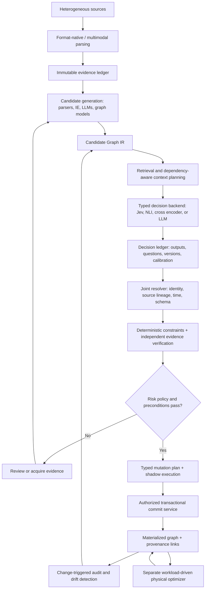

"C:\Users\timot\Downloads\deep-research-report (2).md"   Executive Summary

**Yes—there is a credible architecture here, but the defensible research contribution is narrower than “use Jev to build graphs.”** The promising direction is an **evidence-preserving, dependency-aware graph compiler** that separates candidate discovery, uncertain semantic judgments, formal validation, and transactional database changes.

Your brief’s central hypothesis—generative systems propose possibilities while typed probabilistic models decide among them—is technically plausible. However, it must be evaluated as a hypothesis, not accepted as an architectural advantage in advance. 

Several findings materially change the novelty assessment:

| Finding                                                                                                                          | Research implication                                                                        |
| -------------------------------------------------------------------------------------------------------------------------------- | ------------------------------------------------------------------------------------------- |
| DeepDive and Scallop already connect declarative computation, uncertain inference, and structured knowledge.                     | “Graph synthesis as probabilistic compilation” is not, by itself, new.                      |
| ATOM already decomposes documents into atomic facts, constructs temporal graphs, and merges them in parallel.                    | Atomic decomposition and parallel graph assembly are not sufficient novelty claims.         |
| TypeSafe already publishes a Jev knowledge-graph entity-alignment cookbook and a generative-extraction/Jev-verification cascade. | Those use cases have already been demonstrated by the vendor.                               |
| Jev’s constrained outputs do not establish factual correctness or calibration on graph tasks.                                    | Its value must be measured against specialist classifiers and constrained-output LLMs.      |
| Local decisions can be individually plausible but globally incompatible.                                                         | Dependency handling—not simply cheaper parallel decisions—is the central systems challenge. |

These findings follow from the primary papers and current TypeSafe documentation. ([arXiv][1])

I recommend the temporary research name **TRACE-GC: Typed, Risk-Aware Compilation of Evidence into Graphs**.

The strongest candidate contribution is:

> **Compile evidence-linked candidate claims and calibrated semantic judgments into globally constrained, auditable, reversible graph mutations—while explicitly accounting for dependencies, uncertainty, and the cost of mistakes.**

**Research materials:** [Comprehensive research workbook](sandbox:/mnt/data/trace_gc_research/trace_gc_research_workbook.xlsx) · [Technical companion ZIP](sandbox:/mnt/data/trace_gc_research_companion.zip) · [Complete reference catalogue](sandbox:/mnt/data/trace_gc_research/references.md)

The workbook contains the five requested comprehensive tables: **31 research-system entries, 25 lifecycle tasks, 21 primitive mappings, eight architecture families, and ten novelty tests**, plus experiments, a KARMA component comparison, and an editable cost model.

This is a primary-source research and architecture assessment as of **September 17, 2026**. No live Jev evaluations or head-to-head system benchmarks were performed; proposed advantages below are identified as hypotheses.

---

# 1. Definition of Autonomous Graph Synthesis

For this project, autonomous graph synthesis should mean:

> **The evidence-grounded construction and revision of a graph’s semantic model, instances, constraints, uncertainty, provenance, and physical representation through an explicit, inspectable update process.**

It is useful to separate four products:

| Product                 | What the system constructs                                                                     |
| ----------------------- | ---------------------------------------------------------------------------------------------- |
| **Semantic model**      | Concepts, entity and relation types, properties, logical constraints, temporal interpretation. |
| **Knowledge state**     | Entities, events, qualified claims, alternatives, contradictions, and unresolved hypotheses.   |
| **Operational history** | Evidence, decisions, graph versions, approvals, mutations, corrections, and retractions.       |
| **Physical database**   | Storage layout, indexes, partitions, projections, and migration execution.                     |

These should not share one undifferentiated “accuracy” metric. A system can produce a valid schema containing false facts, an accurate graph with poor query performance, or a fast graph whose provenance is unrecoverable.

### RDF and property graphs require different treatment

RDF/OWL research and labeled-property-graph research overlap, but their semantics are not interchangeable. RDF uses globally identified resources and triples; property graphs provide labeled nodes and first-class edges with properties. OWL reasoning, SHACL validation, and property-graph typing also answer different questions. In particular, OWL’s open-world entailment should not be treated as a closed-world database validator. ([W3C][2])

**Design consequence:** a common Graph IR should declare a supported semantic subset and backend mappings. It should not promise arbitrary lossless conversion between OWL ontologies and property-graph schemas.

---

# 2. Literature Taxonomy

The following is the compact research map. **Table A in the workbook includes the complete requested columns**, including inputs, outputs, architecture, probabilistic and generative status, schema/provenance/incremental support, code availability, datasets, strengths, and limitations.

| Research family                       | Representative work                                                   | Contribution relevant to this project                                                                   |
| ------------------------------------- | --------------------------------------------------------------------- | ------------------------------------------------------------------------------------------------------- |
| Statistical knowledge construction    | **DeepDive**, 2015                                                    | Declarative extraction and integration with statistical inference and incremental computation.          |
| Probabilistic fusion                  | **Knowledge Vault**, 2014                                             | Combines extraction evidence and existing knowledge to assess candidate facts.                          |
| Continual knowledge learning          | **NELL**, 2015                                                        | Continuously acquires beliefs and learns predicates; continual discovery predates modern LLM pipelines. |
| LLM construction and canonicalization | **EDC**, 2024; **iText2KG**, 2024                                     | Separate extraction/canonicalization or incremental entity/relation integration.                        |
| Multi-agent enrichment                | **KARMA**, NeurIPS 2025                                               | Specialized processing, alignment, conflict handling, and evaluation.                                   |
| Dynamic schema induction              | **AutoSchemaKG**, 2025; **OntoKG**, 2026                              | Concept/schema discovery and ontology-guided construction.                                              |
| Atomic and temporal construction      | **ATOM**, Findings EACL 2026; **Zep/Graphiti**, 2025                  | Atomic fact processing, temporal representations, and incremental updates.                              |
| Ontology and axiom learning           | **LLMs4OL**, 2023; **SPILDL**, 2024                                   | Language-model ontology tasks and expressive description-logic concept induction.                       |
| Property-graph schema engineering     | **PG-Schema**, 2023; **PG-HIVE**, 2026; output-schema inference, 2026 | Explicit graph contracts, schema discovery, and analysis of schemas after transformations.              |
| Entity resolution                     | **Ditto**, 2020; **ComEM**, 2025                                      | Strong learned matching and comparative/selective matching baselines.                                   |
| Neuro-symbolic inference              | **DeepProbLog**, 2018; **Scallop**, 2023; **PSL/HL-MRFs**             | Neural predicates combined with logical or structured dependencies.                                     |
| Graph completion                      | **ComplEx**, 2016; **NBFNet**, 2021; **ULTRA**, 2024                  | Structural candidate-link prediction, including transferable graph reasoning.                           |
| Statistical graph generation          | **GraphRNN**, 2018; **DiGress**, 2023                                 | Generates graph structures; does not establish source-grounded factual truth.                           |
| Repair and physical design            | **HoloClean**, 2017; **A+ indexes**, 2020                             | Constraint/statistical repair and workload-driven graph indexing.                                       |

Sources for the construction, fusion, continual-learning, and LLM families: ([arXiv][1])

Sources for temporal, ontology, schema, and entity-resolution work: ([arXiv][3])

Sources for neuro-symbolic inference, completion, generation, repair, and physical design: ([arXiv][4])

### What not to conflate

**Graph generation is not factual graph synthesis.** Autoregressive models, VAEs, GANs, flows, reinforcement-learning generators, and diffusion models can learn graph distributions. Their usefulness here is primarily candidate generation, structural priors, synthetic test data, or constrained domain generation—not certification that a relationship exists in the world. ([Proceedings of Machine Learning Research][5])

**Graph querying is not graph correctness.** GraphRAG evaluates the usefulness of graph-based indexing and summaries for answering questions. That is a valuable downstream workload, but successful answers do not independently establish the correctness of every underlying entity, edge, or mutation. ([arXiv][6])

---

# 3. State of the Art

There is no defensible single “best graph-synthesis model.” The strongest approach depends on which subproblem is being measured.

**For structured sources**, deterministic parsing and mapping should remain the baseline. A database foreign key or an exact identifier should not require a probabilistic language judgment. R2RML and semantic-mapping systems such as USC’s Karma are relevant prior art for this part of the pipeline. ([W3C][7])

**For semantic decisions**, compare specialized models before assuming another LLM is necessary. Ditto-style matching is an important entity-resolution baseline. Claim verification provides a natural comparison against NLI and evidence-verification models. Comparative matching research also directly challenges the assumption that isolated binary pair decisions retain enough context. ([arXiv][8])

**For graph-native decisions**, completion models and structured inference methods should remain serious competitors. NBFNet and ULTRA can propose structurally plausible links; PSL, DeepProbLog, and Scallop provide ways to represent dependencies that independent thresholding ignores. Their outputs still require appropriate interpretation and, where factual insertion is intended, evidence. ([arXiv][9])

My architectural recommendation is therefore **specialist-first and model-neutral**:

> Use deterministic software when the answer is computable, specialist models when the task is bounded, generative models when new hypotheses or vocabulary are needed, and explicit joint reasoning when decisions interact.

---

# 4. KARMA Deep Dive

## The correct KARMA

The mandatory baseline is **Lu et al., “KARMA: Leveraging Multi-Agent LLMs for Automated Knowledge Graph Enrichment,” NeurIPS 2025**. It is distinct from USC ISI’s older **Karma** semantic-integration system. ([NeurIPS Proceedings][10])

The published architecture comprises a controller and eight functional blocks: **Ingestion, Reader, Summarizer, Entity Extraction, Relation Extraction, Schema Alignment, Conflict Resolution, and Evaluator**. Its flow moves from normalized documents through segments and summaries to entities, candidate relations, aligned/filtered triples, and integration. It already combines model judgments with dictionary, embedding, schema, and logical mechanisms. ([NeurIPS Proceedings][11])

Its evaluation uses **1,200 PubMed papers**. For the genomics/DeepSeek configuration, the published table reports **38,230 new entities**, **0.831 LLM-verified correctness**, **0.625 human assessment**, and **0.186 conflict ratio**. Human assessment involved two experts; this is not an evaluation without humans. ([NeurIPS Proceedings][11])

## What those results do—and do not—establish

The important methodological distinctions are:

**Entity growth is not recall.** Adding many entities can be useful, but only against independently adjudicated targets can it establish coverage without duplication or error.

**LLM-verified correctness is not an independent factual gold standard.** A model can share systematic errors with the extractor. Human assessment helps, but its sample design and scope matter.

**Conflict filtering is not demonstrated error reduction.** KARMA’s conflict ratio measures removed candidate edges; it should not be restated as a corresponding percentage reduction in final graph errors. ([NeurIPS Proceedings][11])

The published main-results and ablation tables also contain metric-label/value discrepancies that should be resolved before an exact reproduction is claimed. The token/time comparisons likewise do not directly supply a portable cost per independently verified correct mutation. ([NeurIPS Proceedings][11])

## What would genuinely exceed KARMA?

Not simply replacing its evaluators with Jev.

A stronger system would need to demonstrate that it:

* Preserves original evidence and qualifiers through processing.
* Controls identity, temporal, and schema dependencies across decisions.
* Improves automatic-mutation quality at matched recall and review burden.
* Supports auditable corrections, retractions, and migrations.
* Reduces **complete-pipeline** cost rather than only one model stage.

The workbook’s **KARMA Components** sheet maps every functional component to proposed alternatives, expected advantages, and failure risks.

---

# 5. TypeSafe AI / Jev Deep Dive

## Documented interface

TypeSafe’s documentation describes a request containing shared **state** and a collection of typed questions. State can be text or structured JSON. Jev is text-only; image, audio, or video sources require a separate parsing or interpretation stage. Official Python and JavaScript/TypeScript SDKs are available. ([TypeSafe AI][12])

| Primitive  | Documented output                                                                                                       | Implication for graph synthesis                                                    |
| ---------- | ----------------------------------------------------------------------------------------------------------------------- | ---------------------------------------------------------------------------------- |
| **Choice** | Selection from supplied options, full option probabilities, and confidence; maximum **255 options**.                    | Appropriate for bounded entity, relation, action, or schema choices.               |
| **Score**  | Distribution over **2–10 ordered rubric levels**; the returned score is the probability-weighted mean of their indices. | Useful for graded quality or impact, but not automatically a probability of truth. |
| **Noul**   | A value representing **P(yes)** for a proposition; no separate confidence field.                                        | Natural for evidence support, identity hypotheses, or membership propositions.     |

These are documented primitive semantics, not independently established graph-task accuracy guarantees. ([TypeSafe AI][13])

### Probability, confidence, and correctness are different

For Choice and Score, TypeSafe’s confidence is derived from the shape of the returned distribution, rather than being an independent second prediction. A concentrated distribution can still be confidently wrong. It should not be multiplied by the selected probability as though it were independent evidence. ([TypeSafe AI][14])

Score deserves particular caution. Suppose a three-level rubric means “different,” “uncertain,” and “same.” A distribution split between the two endpoints can have an average at the middle level without actually assigning substantial probability to “uncertain.” Whether that average is an appropriate action rule is a policy question, not a mathematical guarantee.

## Current runtime and commercial details

As of the reviewed documentation snapshot:

| Item                 | Documented status                                               |
| -------------------- | --------------------------------------------------------------- |
| Pinned current model | `jev-1.13.0`                                                    |
| Input price          | **$0.042 per million input tokens**                             |
| Output price         | Free                                                            |
| Published limits     | **250,000 tokens/second; 1,200 requests/minute**                |
| Versioning           | Moving aliases exist; the response identifies the version used. |
| Limit stability      | Documentation explicitly says limits can change without notice. |

This is token pricing—not pricing per million decisions. ([TypeSafe AI][15])

The API can return authentication, validation, rate-limit, and overload errors. Typed inference does not eliminate operational failures. ([TypeSafe AI][16])

The reviewed sources did **not establish** a numerical maximum context length, maximum questions per request, or a bitwise determinism guarantee. Those should be treated as integration questions requiring explicit confirmation and testing, not filled in by assumption.

## What Jev cannot replace

The documented System One interface does not generate arbitrary free-form strings, descriptions, code, or explanations. Consequently, it cannot directly invent unrestricted ontology labels or write a migration program through these primitives. New names may instead be copied from evidence by parsers; genuinely open-ended invention or interpretation needs another component. ([TypeSafe AI][17])

It can select a candidate query or mutation type. It should not become the authority that decides whether generated code is safe to execute.

## RLCD and vendor benchmarks

TypeSafe attributes Jev’s behavior to **Reinforcement Learning for Calibrated Decisions**, or RLCD, and reports low latency and substantial workflow savings. Those remain vendor-reported results. The reviewed material did not provide a independently reproducible training specification establishing graph-task calibration or superiority. The public workflow evaluation is not an independent graph-construction benchmark. ([TypeSafe AI][18])

## Existing examples that constrain novelty claims

The official entity-alignment cookbook already applies Jev to **450 preselected Magellan Beer pairs**, using Score for routing and Nouls for field comparisons. Its displayed outcome counts—40 merge, 50 review, 360 unlinked—are routing results, not measured precision or a verified safe-merge rate. The example uses **Jev 1.12**, not the current 1.13 model. Its rounding rule also contains fixed decision boundaries even though no threshold is fitted to the dataset. ([TypeSafe AI][19])

The official extraction cascade already uses a generative extractor, Jev checks, and escalation to a stronger model. Therefore, **“LLM proposes, Jev verifies” is not a new architectural claim**. ([TypeSafe AI][20])

Finally, TypeSafe’s own **System One LLM adapter** provides a valuable experimental control: retain the typed interface while replacing Jev with a conventional LLM backend. ([GitHub][21])

---

# 6. Task-to-Primitive Mapping

Use these ownership labels:

**J** = Jev or another typed semantic decision model; **L** = generative LLM; **G** = graph algorithm or learned specialist; **D** = deterministic software; **H** = human review.

The complete **Tables B and C** are in the workbook. The most consequential assignments are:

| Operation                                               | Primitive or mechanism                                             | Ownership                  | Why                                                                            |
| ------------------------------------------------------- | ------------------------------------------------------------------ | -------------------------- | ------------------------------------------------------------------------------ |
| Discover entities, events, or novel relation names      | Extraction, parsing, generation                                    | **L/G/D**                  | Candidate discovery must precede bounded selection.                            |
| Resolve a mention to an existing entity                 | Choice over retrieved IDs plus new/unresolved; optional pair Nouls | **J/G/D**                  | Strong Jev application, but retrieval and cluster consistency remain separate. |
| Validate a candidate relation against a passage         | Noul or supported/refuted/insufficient Choice                      | **J/G/L**                  | An evidence-verification problem with strong NLI baselines.                    |
| Assign entity types                                     | Choice for exclusive types; multiple propositions otherwise        | **J/G/D**                  | Inheritance and overlapping classes are not mutually exclusive.                |
| Align a concept to an ontology                          | Choice over retrieved targets                                      | **J/G/D**                  | Semantic similarity must be followed by compatibility checks.                  |
| Resolve conflicting claims                              | Choice over retain/supersede/temporal coexistence/review           | **J/D/H**                  | Action selection requires time, authority, and loss policies.                  |
| Induce expressive axioms                                | Symbolic induction or generated candidates plus reasoning          | **D/G/L/H**                | A probabilistic answer cannot certify logical validity.                        |
| Predict missing links                                   | Graph completion and rules                                         | **G/D**, then verification | Structural likelihood is not evidence of truth.                                |
| Check uniqueness, cardinality, or referential integrity | Executable constraints                                             | **D**                      | These should not be delegated to a semantic confidence score.                  |
| Commit or migrate the database                          | Typed plan and transaction service                                 | **D/H**                    | Models propose; authorized software executes.                                  |

The primitive semantics and specialist alternatives underlying this mapping are documented in TypeSafe, entity-matching research, ontology-learning research, and graph-completion work. The ownership choices are my proposed design. ([TypeSafe AI][13])

**Most important boundary:** a question such as “Does this mutation violate a cardinality constraint?” should be answered by executing the constraint—not by asking Jev to estimate it.

---

# 7. Proposed Architecture

## TRACE-GC

I recommend the following model-neutral architecture:



### The architectural difference

The central unit is not an autonomous agent with broad permission to “update the graph.” It is a **proposed claim or mutation with explicit evidence, alternatives, dependencies, and preconditions**.

Jev belongs behind a replaceable decision interface. That keeps the research honest: the architecture should still work when a specialist classifier, constrained LLM, or deterministic rule is the better decision mechanism.

I would maintain four separate representations:

| Representation   | Purpose                                                                              |
| ---------------- | ------------------------------------------------------------------------------------ |
| **Evidence IR**  | Immutable source material, coordinates, timestamps, lineage, and access rules.       |
| **Candidate IR** | Possible entities, claims, properties, types, matches, and schema changes.           |
| **Decision IR**  | Exact questions, available alternatives, raw outputs, calibration, and dependencies. |
| **Mutation IR**  | Authorized operations, read sets, validations, versions, and rollback semantics.     |

The compiler analogy is useful because it encourages explicit stages and contracts. It is **not itself a novelty claim**: declarative probabilistic systems and graph-schema transformation research already establish closely related ideas. ([arXiv][1])

---

# 8. Graph Intermediate Representation

A candidate representation should preserve uncertainty rather than prematurely encoding a model choice as a database fact.

For example:

```json
{
  "ir_version": "trace-gc/0.1-proposal",
  "example_status": "synthetic; no model call or commit performed",
  "candidate_id": "candidate-demo-0001",
  "snapshot": {
    "graph_version": "g-042",
    "schema_version": "s-003",
    "policy_version": "p-002"
  },
  "evidence": {
    "source_id": "synthetic-document-001",
    "text": "Eli Chen worked for Acme from 2023 through 2024."
  },
  "candidate": {
    "subject_mention": "Eli Chen",
    "predicate": "worked_for",
    "object_mention": "Acme",
    "valid_time_precision": "year",
    "claim_target": "document_entailment_not_world_truth"
  },
  "decision": {
    "primitive": "Choice",
    "requested_model": "jev-1.13.0",
    "execution_status": "not_executed",
    "illustrative_raw_probabilities": {
      "SUPPORTED": 0.91,
      "REFUTED": 0.01,
      "INSUFFICIENT": 0.08
    },
    "calibrated_probabilities": null
  },
  "dependencies": [
    "resolve-subject-identity",
    "resolve-object-identity",
    "normalize-time-interval",
    "verify-original-source-span"
  ],
  "mutation_status": "PROPOSED_NOT_COMMITTED"
}
```

The [full example](sandbox:/mnt/data/trace_gc_research/graph_ir_example.json) includes a source hash, original character span, validation status, read set, preconditions, and idempotency-key recipe.

Three distinctions are essential:

**A mention is not an entity.** The surface string must survive even if canonical identity changes.

**A source assertion is not necessarily world truth.** Preserve what was asserted separately from whether it is believed.

**A hypothesis is not an accepted fact.** Completion results and unresolved alternatives need explicit status.

The potentially valuable IR contribution would be its **semantics and supported operations**—especially how evidence dependencies survive inference, commits, reversals, and schema changes—not the mere existence of a JSON object containing confidence fields.

---

# 9. Probabilistic Decision Model

## Preserve distributions, but do not invent joint certainty

A Choice distribution is conditional on the supplied context and alternatives. An omitted entity cannot be selected. Consequently, confidence over a poor shortlist can be misleading.

For the bounded candidate-acceptance stage:

$$
\text{Final recall} \leq \text{Candidate recall}.
$$

Cheap decisions cannot repair a candidate that was never proposed unless another stage explicitly expands the candidate set.

## Independent execution is not semantic independence

Consider entity identity:

$$
P(A=B)=0.99,\qquad P(B=C)=0.99,\qquad P(A=C)=0.01.
$$

These values cannot all be coherent probabilities over an equivalence relation, because:

$$
P(A=C)\geq P(A=B)+P(B=C)-1=0.98.
$$

Thus, individually confident pair judgments can produce a destructive merge cluster.

The proposed system should resolve connected groups of identity, temporal, cardinality, and source-dependence decisions rather than blindly accepting each local answer. Comparative entity-matching research provides an empirical reason to test these richer contexts. ([arXiv][22])

## A possible structured model

One candidate formulation is:

$$
q(z\mid E)\propto
\left[\prod_i \phi_i(z_i;E)\right]
\left[\prod_j \psi_j(z_{\mathcal N_j})\right]
\mathbf 1[C(z)].
$$

Here, \(z\) represents candidate assignments, \(\phi\) local evidence factors, \(\psi\) dependency factors, and \(C\) hard constraints.

This is a proposed modeling framework—not permission to multiply arbitrary Jev outputs. Local marginal probabilities are not automatically independent likelihoods. Copied sources, shared passages, and repeated priors can otherwise be counted multiple times.

Scallop, DeepProbLog, and PSL offer different foundations for structured inference. Their semantics differ, and optimized soft truth values should not be relabeled calibrated marginal probabilities. ([arXiv][23])

## Risk-aware materialization

Use a task-specific loss function:

$$
a^*=\arg\min_a \mathbb E[L(a,Y)\mid E].
$$

The cost of an incorrect identity merge can greatly exceed the cost of leaving a duplicate unresolved. Accept, reject, review, and acquire-more-evidence should therefore be distinct actions.

Calibration must be measured on held-out graph tasks. Report raw and calibrated results for **every** competing model; otherwise, the comparison can be biased by calibrating only the preferred system. ([Proceedings of Machine Learning Research][24])

If valid error upper bounds \(u_i\) were available:

$$
P(\text{any erroneous mutation in a batch})\leq\sum_i u_i.
$$

That union bound does not require independence. But setting \(u_i=1-p_i\) from an arbitrary model score does **not** establish valid bounds.

Conformal risk control may help construct a properly specified policy under its assumptions. It does not automatically guarantee every transaction, every subgroup, or a shifting stream is semantically correct. ([arXiv][25])

---

# 10. Graph Mutation Protocol

The mutation protocol should make model output an untrusted proposal, never an executable database command.

| Stage                | Required behavior                                                                                            |
| -------------------- | ------------------------------------------------------------------------------------------------------------ |
| **Propose**          | Create an immutable typed plan linked to evidence and model decisions.                                       |
| **Resolve**          | Settle—or explicitly preserve—identity, temporal, and schema dependencies.                                   |
| **Validate**         | Execute authorization, type, reference, cardinality, temporal, and domain checks.                            |
| **Verify**           | Recheck semantic claims against original evidence, independently of the candidate generator where practical. |
| **Prepare**          | Apply the patch to a shadow state and test declared invariants and query contracts.                          |
| **Revalidate state** | Check graph/schema versions and read-set preconditions immediately before committing.                        |
| **Commit**           | Atomically record the mutation, its lineage, idempotency key, and delivery event.                            |
| **Correct**          | Supersede with a compensating versioned change rather than erasing history.                                  |

The idempotency key should depend on the source version and logical operation, not a random request identifier. Retrying the same operation should not insert a duplicate.

For a prototype, use **one authoritative ledger with an outbox and derived graph projection**. A graph database plus a separate provenance database do not acquire cross-store atomicity merely because both individually support transactions.

For identity, initially prefer reversible canonicalization mappings over destructive physical merges. Retain original mentions and source claims so that later corrections remain possible.

These are proposed engineering requirements; they do not establish a new transaction theory by themselves.

---

# 11. Provenance Architecture

PROV-O provides a useful standard vocabulary:

| TRACE-GC object                                         | Possible PROV-O representation                                                        |
| ------------------------------------------------------- | ------------------------------------------------------------------------------------- |
| Source version, candidate artifact, model configuration | `prov:Entity`                                                                         |
| Extraction, decision, validation, or commit run         | `prov:Activity`                                                                       |
| Software service or human reviewer                      | `prov:Agent`                                                                          |
| Evidence and processing lineage                         | `prov:used`, `prov:wasDerivedFrom`, `prov:wasGeneratedBy`, and associated-agent links |

PROV-O supplies provenance relationships; it does not itself define the semantics of a model’s confidence or a graph fact’s probability. Those need additional explicit fields and definitions. ([W3C][26])

Every materialized fact should link to its claim and mutation records, permitting answers to:

> Which source passage supports this edge? Which entity-resolution decision did it depend on? Which model and calibration version produced the judgment? Which policy permitted the commit? What later evidence superseded it?

Store full decision records in an audit ledger rather than duplicating every diagnostic property onto every edge.

Also preserve **source-origin clusters**. Ten articles copied from one report should not silently become ten independent confirmations. Provenance-aware probabilistic inference and update provenance are relevant prior art for this problem. ([Google Research][27])

---

# 12. Self-Repair and Evolution

## Continuous auditing

I recommend change-triggered auditing supplemented by periodic sampling.

When a source is corrected, an entity match changes, or a schema is revised, traverse the dependency graph and reconsider affected claims. Do not repeatedly rescore the entire graph merely because individual judgments are inexpensive.

An audit priority can incorporate:

$$
\frac{
\text{estimated error impact}\times
\text{dependency fan-out}\times
\text{uncertainty}
}{
\text{audit cost}
}.
$$

This is a proposed scheduling heuristic, not a validated formula.

Continual knowledge revision and probabilistic repair already have substantial precedent in NELL, DeepDive, HoloClean, and temporal graph systems. The research opportunity is a better budgeted audit policy or stronger operational semantics—not the generic idea of self-repair. ([CMU School of Computer Science][28])

## Schema evolution

The proposed operation vocabulary should cover:

```text
CREATE_NODE_TYPE       CREATE_EDGE_TYPE
SPLIT_NODE_TYPE        MERGE_NODE_TYPES
ADD_PROPERTY          REMOVE_PROPERTY
CHANGE_CARDINALITY    ADD_CONSTRAINT
RELAX_CONSTRAINT      DEPRECATE_TYPE
MIGRATE_INSTANCES
```

Every schema proposal should include the affected population, migration mappings, query compatibility, validation tests, rollback strategy, and approval requirements.

A heterogeneous class is a reason to investigate; it is not proof that the class should split. Likewise, observed property frequency does not establish whether a domain property is logically required.

PG-HIVE, AutoSchemaKG, PG-Schema, and output-schema inference supply important competing components. A novel contribution would need to go beyond extracting types or adding labels—for example, evidence-carrying reversible migrations with explicit semantic and query contracts. ([OpenProceedings][29])

---

# 13. Comparison With Existing Systems

The following is an architectural assessment, **not a measured ranking**. Table D in the workbook covers the requested quality, calibration, consistency, latency, cost, reproducibility, provenance, scaling, and human-review dimensions.

| Architecture                               | Main potential advantage                                                | Main limitation to test                                                     |
| ------------------------------------------ | ----------------------------------------------------------------------- | --------------------------------------------------------------------------- |
| Traditional IE + deterministic integration | Efficient, controllable behavior in covered domains.                    | Domain shift and incomplete discovery.                                      |
| Graph ML + rules                           | Strong structural signals and scalable candidate scoring.               | Plausibility without external evidence.                                     |
| **A. Monolithic LLM**                      | Flexible contextual interpretation and open-ended discovery.            | Harder error attribution and uncontrolled omission/invention.               |
| **B. KARMA-style multi-agent LLM**         | Specialized stages and verification.                                    | Correlated errors, duplicated processing, and lossy intermediate summaries. |
| **C. LLM + deterministic validation**      | Simple, strong baseline for valid typed mutations.                      | Validators do not establish semantic truth.                                 |
| **D. LLM + graph ML**                      | Combines textual and structural proposals.                              | Additional model complexity and possible double-counting.                   |
| **E. Candidates + Jev + compiler**         | Explicit typed decisions, possible batching savings, auditable commits. | Candidate ceiling, calibration uncertainty, and global inconsistency.       |
| **F. Jev-heavy + LLM escalation**          | Potential efficiency in bounded, repetitive domains.                    | Poor fit for discovery outside the existing vocabulary.                     |

Architecture E is the best **research vehicle** because it makes components replaceable and measurable—not because Jev has already been shown to win.

Architecture C is especially important. If a straightforward constrained-output LLM plus good deterministic validation matches TRACE-GC at lower engineering cost, that is a meaningful negative result.

---

# 14. Experimental Design

## Two separate evaluation phases

**Phase 1: isolate the decision layer.** Keep candidate claims, source passages, ontology, retrieval, and output contract fixed. Swap only the decision backend.

**Phase 2: evaluate the entire pipeline.** Compare complete systems under matched evidence access, generation budget, verification budget, calibration data, and human-review capacity.

Without this separation, an improved candidate generator can be mistaken for a better decision model.

## Ten progressive experiments

| #  | Experiment                  | Suggested evidence or dataset                                               | Primary measurements                                                |
| -- | --------------------------- | --------------------------------------------------------------------------- | ------------------------------------------------------------------- |
| 1  | Relation support/refutation | SciFact plus evidence-grounded candidate triples                            | Support/refute/insufficient quality; calibration; risk–coverage.    |
| 2  | Entity resolution           | WDC Products; Magellan Beer as a small sanity check                         | Candidate recall@k; pair and cluster metrics; false merges.         |
| 3  | Relation typing             | ReDocRED/DocRED with fixed and unknown labels                               | Macro/micro F1; direction, qualifier, and abstention errors.        |
| 4  | Entity typing               | Ontology-linked entities and LLMs4OL tasks                                  | Hierarchical/multilabel F1; disjointness violations.                |
| 5  | Conflict resolution         | New expert-labeled conflicts, copies, and temporal changes                  | Unsupported replacements; preservation of historical truth.         |
| 6  | Schema alignment            | OAEI tracks; appropriate property-graph benchmarks                          | Mapping precision/recall and logical compatibility.                 |
| 7  | Full-document construction  | Scientific documents with independent graph gold                            | Node/edge/property quality, automatic-mutation risk, complete cost. |
| 8  | Streaming evolution         | New chronological benchmark with corrections and migrations                 | Convergence, temporal correctness, repair time, oscillation.        |
| 9  | Adversarial sources         | Negation, ambiguity, injection, misinformation, stale and corrupted records | Attack-induced commits, calibration shift, review load.             |
| 10 | Scale                       | 1K, 10K, 100K, 1M, 10M+ decisions                                           | Throughput, tail latency, tokens, retries, storage, and cost.       |

The existing datasets above cover useful subproblems; they do not collectively constitute an already available end-to-end lifecycle benchmark. ([arXiv][30])

## Baselines

Include exact rules, NLI, a Ditto-style cross encoder, graph-native completion, smaller and frontier constrained-output LLMs, the TypeSafe adapter, KARMA, and a simple LLM-plus-validator. Add ATOM/Graphiti and schema-specific systems for their relevant experiments. Their published roles justify inclusion; their relative performance must be measured. ([arXiv][8])

Do not force the LLM baseline to print verbose probability explanations while Jev returns compact native values, then attribute the entire cost difference to superior reasoning.

## Metrics and controls

**Semantic quality:** entity, edge, property, and schema precision/recall; source support versus world truth; contradiction rate.

**Identity quality:** pairwise metrics, B³/CEAF or comparable cluster measures, false merges/splits, and downstream cluster damage.

**Uncertainty quality:** Brier score, log loss, ECE with stated binning, reliability plots, selective risk, coverage, and subgroup behavior.

**Operational quality:** p50/p95/p99 latency, actual input/output usage, retries, rate-limit stalls, accepted-correct-edge cost, provenance completeness, review burden, rollback frequency, and migration regressions.

Split data by **entity, document/source, and time**. Near-duplicate records or copied reports must not leak across training, calibration, and test sets.

## Ablations

The program should remove Jev, the generative model, graph ML, deterministic constraints, calibration thresholds, provenance, independent verification, source-dependence handling, schema reasoning, and decomposition—one component at a time.

Also compare local questions against whole-document and dependency-component contexts, and shared-state batches against separate requests.

A possible preregistered critical-mutation target is **0.1% false automatic mutations**, but this is a proposed policy target. With zero errors, the approximate one-sided 95% binomial upper bound is \(3/n\); about 3,000 independent accepted cases are needed merely to approach that bound. Correlated cases require more careful analysis.

---

# 15. Research Gaps

Table E contains the detailed novelty assessment. The strongest conclusions are:

| Proposed novelty                                     | Assessment                                      | Closest competing work                                                                      |
| ---------------------------------------------------- | ----------------------------------------------- | ------------------------------------------------------------------------------------------- |
| Graph synthesis as compilation                       | **Not novel broadly.**                          | DeepDive, Scallop, mappings and schema analysis.                                            |
| Probabilistic graph/provenance representation        | **Not novel broadly.**                          | Knowledge Vault, probabilistic databases, provenance research.                              |
| Atomic parallel graph construction                   | **Not novel broadly.**                          | ATOM; parallel graph-generation methods.                                                    |
| Jev entity resolution                                | **Already explicitly demonstrated.**            | TypeSafe entity-alignment cookbook.                                                         |
| Generative extraction followed by Jev verification   | **Already explicitly demonstrated.**            | TypeSafe extraction cascade.                                                                |
| Continuous graph self-repair                         | **Established direction.**                      | NELL, incremental inference, HoloClean, temporal systems.                                   |
| Dependency-aware, risk-budgeted mutation compilation | **Potentially defensible narrow contribution.** | Must distinguish itself from structured probabilistic inference plus standard transactions. |
| Context/dependency-aware batch optimizer             | **Potentially defensible narrow contribution.** | Must beat simple batching and atomic temporal pipelines after all overhead.                 |
| Reversible evidence-carrying schema evolution        | **Potentially defensible, engineering-heavy.**  | Must exceed schema discovery and conventional migration tooling.                            |
| Full-lifecycle benchmark                             | **Potentially valuable contribution.**          | Requires new adjudicated data and failure modes, not only repackaged static tasks.          |

The established-prior-work judgments are supported by the corresponding primary systems. The “potentially defensible” judgments are research assessments, not claims of priority. ([arXiv][1])

Not finding an identical implementation in this review would not prove novelty. Before submission, the narrow proposed contribution should undergo a focused citation and systems search using its exact semantics and claims.

---

# 16. Failure Modes

| Failure mode                                 | Why the proposed system is vulnerable                                        | Necessary test or mitigation                                          |
| -------------------------------------------- | ---------------------------------------------------------------------------- | --------------------------------------------------------------------- |
| **Candidate omission**                       | Jev cannot select a missing entity, relation, or concept.                    | Measure retrieval and candidate recall separately; support expansion. |
| **Context fragmentation**                    | Atomic questions may lose negation, coreference, or cross-document evidence. | Compare local, document, and dependency-component context.            |
| **Correlated confidence**                    | Multiple decisions may reuse the same mistaken source or model prior.        | Track evidence lineage and avoid naïve probability multiplication.    |
| **Globally inconsistent identity**           | Locally accepted pairs can imply destructive transitive merges.              | Joint clustering, cannot-links, reversible canonicalization.          |
| **Valid but false graph**                    | A fact can pass every type and cardinality check while being wrong.          | Independent semantic evaluation against original evidence.            |
| **Schema overfitting**                       | A new batch can trigger unnecessary class splits or constraint relaxation.   | Held-out instances, query contracts, shadow migrations, review.       |
| **Prompt injection and authority confusion** | A source can contain instructions rather than trustworthy evidence.          | Treat source content as data; models have no write credentials.       |
| **Repair oscillation**                       | Repeated model judgments may alternately accept and reject a claim.          | Versioned policies, change reasons, budgets, and stability metrics.   |
| **Drift and moving aliases**                 | A model or data distribution can change after thresholds are chosen.         | Pin versions, recalibrate, and suspend unsafe automatic actions.      |
| **Illusory savings**                         | Generation, retrieval, global resolution, or review may dominate cost.       | Measure total cost at matched achieved quality.                       |

These are deliberate falsification targets for TRACE-GC. A successful demo on clean examples would not address them.

---

# 17. Feasibility Assessment

| Category                            | Assessment                                                                                                                                                                                           |
| ----------------------------------- | ---------------------------------------------------------------------------------------------------------------------------------------------------------------------------------------------------- |
| **Possible today**                  | Typed decision interfaces, evidence ledgers, candidate generation, deterministic validation, explicit patches, source-linked graph projections.                                                      |
| **Significant engineering**         | Dependency-aware scheduling, reliable identity clusters, consistent provenance across stores, reversible changes, streaming invalidation, production auditability.                                   |
| **Requires research**               | Robust calibration under shift, useful transaction-level semantic risk control, automated schema evolution with meaningful guarantees, efficient large-scale dependency handling.                    |
| **Unsupported by current evidence** | Zero factual errors from typed outputs; Jev superiority across graph tasks; unrestricted ontology generation through Jev primitives; globally coherent uncertainty from independent questions alone. |

The available TypeSafe interface supports the bounded decision component, but not the broader unsupported guarantees. ([TypeSafe AI][17])

## Analytical cost and throughput

For:

* \(N\): decisions;
* \(S\): shared-state tokens;
* \(Q\): per-question tokens, including options;
* \(B\): questions per shared-state request;

a simplified accounting model is:

$$
R=\lceil N/B\rceil,\qquad T=RS+NQ.
$$

At the current documented price:

$$
\text{Jev input cost}=0.042\,T/10^6.
$$

Using the published limits, an idealized lower bound on processing time is:

$$
t_{\min}\geq
\max\left(\frac{T}{250{,}000},\frac{R}{20}\right).
$$

The price and quotas are documented; the scenario assumptions and resulting estimates below are analytical. ([TypeSafe AI][15])

### Illustrative scenario—not a benchmark

Assume \(S=1{,}000\), \(Q=50\), and \(B=100\).

|  Decisions | Input tokens | Decision-layer cost | Idealized minimum time |
| ---------: | -----------: | ------------------: | ---------------------: |
|      1,000 |       60,000 |            $0.00252 |            0.5 seconds |
|     10,000 |      600,000 |             $0.0252 |              5 seconds |
|    100,000 |    6,000,000 |              $0.252 |             50 seconds |
|  1,000,000 |   60,000,000 |           **$2.52** |        **500 seconds** |
| 10,000,000 |  600,000,000 |              $25.20 |          5,000 seconds |

The reviewed documentation does not establish that a batch of 100 questions with this state is an accepted configuration. That must be tested first. These calculations exclude latency, concurrency restrictions, retries, generation, retrieval, global inference, writes, storage, and review.

Without shared-state batching, the same illustrative million decisions require **1.05 billion input tokens**, or **$44.10**, and at least **50,000 seconds** under the stated request quota.

More importantly, if unchanged candidate generation and other work account for 80% of total cost, making the remaining 20% one hundred times cheaper yields only:

$$
\frac{1}{0.8+0.2/100}\approx1.25\times
$$

overall improvement.

**Cheap atomic decisions are useful only if they improve the actual bottleneck.**

---

# 18. Candidate Paper Contributions

## Contribution 1 — Dependency-aware semantic risk at graph commit time

**Hypothesis:** resolving dependencies before acceptance improves automatic-mutation risk/coverage compared with independent thresholding.

**Potential novelty:** precisely connecting semantic decision uncertainty, graph dependencies, and transactional action policies.

**Closest prior work:** DeepDive, Scallop, PSL, calibrated selective prediction.

**Implementation:** decision-factor representation, identity/temporal resolver, risk policy, deterministic commit protocol.

**Benchmark:** clustered entity resolution and conflict-heavy graph construction.

**Expected contribution:** a formal account of hard-constraint preservation and an empirical account of semantic risk.

**Falsification:** standard structured inference plus an ordinary transaction service achieves the same behavior and quality/cost tradeoff without the proposed mechanisms.

## Contribution 2 — Dependency-aware context and batch optimization

**Hypothesis:** an optimizer that groups shared evidence while preserving required context beats naïve per-decision calls and naïve large batches.

**Potential novelty:** jointly optimizing context reuse, dependency staging, semantic quality, and resource limits.

**Closest prior work:** ATOM, TypeSafe fan-out, incremental computation.

**Implementation:** question dependency DAG, context-packing policy, cached evidence, cost instrumentation.

**Benchmark:** documents containing coreference, temporal qualifiers, shared entities, and contradictory passages.

**Expected contribution:** a measured efficiency frontier at matched risk and recall.

**Falsification:** savings disappear after counting repeated state, global repair, retries, and context-induced errors.

## Contribution 3 — Evidence-carrying reversible schema evolution

**Hypothesis:** schema mutations with explicit evidence and executable migration contracts reduce unsafe evolution and recovery cost.

**Potential novelty:** linking uncertain semantic proposals to reversible, tested transformations within a declared graph-model fragment.

**Closest prior work:** PG-Schema, PG-HIVE, AutoSchemaKG, output-schema inference.

**Implementation:** schema-mutation IR, affected-instance analysis, shadow migration, query regression tests, compensating updates.

**Benchmark:** evolving ontologies/property graphs with gold schema versions and downstream queries.

**Expected contribution:** stronger lifecycle semantics and measurable migration safety.

**Falsification:** the system only adds labels, cannot preserve its declared contracts, or contributes no behavior beyond existing schema inference and migration tooling.

## Contribution 4 — A full-lifecycle graph-synthesis benchmark

**Hypothesis:** static extraction scores miss failures that appear under correction, identity revision, temporal change, and schema migration.

**Potential novelty:** independently adjudicated, versioned evidence and graph histories that expose these failures.

**Closest prior work:** KARMA evaluation, DocRED/ReDocRED, SciFact, WDC Products, and schema benchmarks.

**Implementation:** licensed source collections, expert labels, corruption/retraction events, versioned gold graphs, reproducible evaluation harness.

**Expected contribution:** a public benchmark measuring safe autonomous graph maintenance rather than only extraction or query answering.

**Falsification:** the benchmark is merely a bundle of existing classification datasets and does not expose additional system-level failure modes.

These proposed papers do **not** all require Jev to win. A negative Jev result can coexist with a useful compiler, optimizer, or benchmark contribution.

---

# 19. Recommended Prototype

**Start with evidence verification and entity resolution under a fixed schema. Do not begin with autonomous ontology evolution.**

| Prototype stage           | Build                                                                                                  | Decision gate                                                         |
| ------------------------- | ------------------------------------------------------------------------------------------------------ | --------------------------------------------------------------------- |
| **1. Decision-head test** | Frozen candidates; exact original evidence; Jev, specialist, and constrained-LLM adapters.             | Does Jev improve cost or coverage at matched semantic risk?           |
| **2. Minimal compiler**   | Typed IR, deterministic checks, immutable decision ledger, parameterized mutations, one graph backend. | Are commits reproducible, auditable, idempotent, and reversible?      |
| **3. Dependency test**    | Identity components, temporal conflicts, source-copy lineage, joint acceptance.                        | Does dependency handling improve outcomes enough to justify its cost? |
| **4. Streaming test**     | Corrections, retractions, late evidence, incremental invalidation.                                     | Does the graph converge without excessive churn or review?            |

Use a small implementation surface: typed Python records, immutable evidence fixtures, one authoritative SQL ledger, one graph projection, asynchronous decision adapters, and a reproducible evaluation runner. The official Python SDK and LLM adapter support the interchangeable decision-backend approach. ([TypeSafe AI][31])

Pin every model, question specification, option set, schema, calibrator, and policy version. A cached replay proves that stored decisions can reproduce a graph state; it does **not** prove a fresh model invocation will return identical answers.

Only after these gates pass should the project add open-schema generation, multimodal sources, automated schema migration, and multi-backend compilation.

### Answer to the ultimate research question

**Yes, the architecture is credible. Only parts of the broad idea appear potentially novel.**

The reviewed literature already supplies much of the foundation: probabilistic knowledge construction, declarative inference, atomic temporal graphs, schema discovery, provenance, and model-assisted verification.

The most defensible research direction is:

> **A dependency-aware graph compiler that preserves evidence and uncertainty until it can produce an explicitly validated, risk-controlled, reversible mutation—and a benchmark that shows when this is better than simpler alternatives.**

Jev is a promising component to test within that system. **It is not yet an evidence-backed reason to assume the system will outperform KARMA, specialist models, or a well-engineered LLM-plus-validator pipeline.**

---

# 20. References

The [complete 69-entry reference catalogue](sandbox:/mnt/data/trace_gc_research/references.md) includes authors, titles, years, venues or identifiers, canonical links, and evidence-status notes. It distinguishes papers, standards, official documentation, vendor demonstrations, and metadata-only references.

The central starting points are:

| Reference                                                                                                                            | Canonical source                                                                                                                              |
| ------------------------------------------------------------------------------------------------------------------------------------ | --------------------------------------------------------------------------------------------------------------------------------------------- |
| Shin et al. (2015), **Incremental Knowledge Base Construction Using DeepDive**, PVLDB                                                | [arXiv:1502.00731](https://arxiv.org/abs/1502.00731)                                                                                          |
| Dong et al. (2014), **Knowledge Vault: A Web-Scale Approach to Probabilistic Knowledge Fusion**, KDD                                 | [Google Research paper page](https://research.google/pubs/knowledge-vault-a-web-scale-approach-to-probabilistic-knowledge-fusion/)            |
| Lu et al. (2025), **KARMA: Leveraging Multi-Agent LLMs for Automated Knowledge Graph Enrichment**, NeurIPS                           | [Published proceedings](https://proceedings.neurips.cc/paper_files/paper/2025/hash/517f9b9c227b9dd51dba4560f37165ed-Abstract-Conference.html) |
| Li, Huang, and Naik (2023), **Scallop: A Language for Neurosymbolic Programming**, PLDI                                              | [arXiv:2304.04812](https://arxiv.org/abs/2304.04812)                                                                                          |
| Zhang and Soh (2024), **Extract, Define, Canonicalize: An LLM-based Framework for Knowledge Graph Construction**                     | [arXiv:2404.03868](https://arxiv.org/abs/2404.03868)                                                                                          |
| Bai et al. (2025), **AutoSchemaKG: Autonomous Knowledge Graph Construction through Dynamic Schema Induction from Web-Scale Corpora** | [arXiv:2505.23628](https://arxiv.org/abs/2505.23628)                                                                                          |
| Lairgi et al. (2026), **ATOM: AdapTive and OptiMized Dynamic Temporal Knowledge Graph Construction Using LLMs**, Findings EACL       | [arXiv:2510.22590](https://arxiv.org/abs/2510.22590)                                                                                          |
| Angles et al. (2023), **PG-Schema: Schemas for Property Graphs**, SIGMOD                                                             | [arXiv:2211.10962](https://arxiv.org/abs/2211.10962)                                                                                          |
| Seifer et al. (2026), **Transforming Shape Schemas with Composable Property-Graph Queries**                                          | [arXiv:2606.14309](https://arxiv.org/abs/2606.14309)                                                                                          |
| Li et al. (2020), **Deep Entity Matching with Pre-Trained Language Models**, PVLDB                                                   | [arXiv:2004.00584](https://arxiv.org/abs/2004.00584)                                                                                          |
| Angelopoulos et al. (2024), **Conformal Risk Control**, ICLR                                                                         | [arXiv:2208.02814](https://arxiv.org/abs/2208.02814)                                                                                          |
| TypeSafe AI, **Documentation index**                                                                                                 | [Current documentation index](https://docs.typesafe.ai/llms.txt)                                                                              |
| TypeSafe AI, **Knowledge graph entity alignment**                                                                                    | [Official cookbook](https://docs.typesafe.ai/cookbooks/entity_alignment)                                                                      |
| TypeSafe AI, **System One LLM adapter**                                                                                              | [Official repository](https://github.com/typesafe-ai/system-one-adapter-python)                                                               |

**Deliverables:** [Research workbook](sandbox:/mnt/data/trace_gc_research/trace_gc_research_workbook.xlsx) · [Technical companion with Mermaid, Graph IR, CSV/JSON tables, and references](sandbox:/mnt/data/trace_gc_research_companion.zip)

[1]: https://arxiv.org/html/1502.00731v4 "https://arxiv.org/html/1502.00731v4"
[2]: https://www.w3.org/TR/owl2-primer/ "https://www.w3.org/TR/owl2-primer/"
[3]: https://arxiv.org/abs/2510.22590 "https://arxiv.org/abs/2510.22590"
[4]: https://arxiv.org/abs/1805.10872 "https://arxiv.org/abs/1805.10872"
[5]: https://proceedings.mlr.press/v198/zhu22a.html "https://proceedings.mlr.press/v198/zhu22a.html"
[6]: https://arxiv.org/abs/2404.16130 "https://arxiv.org/abs/2404.16130"
[7]: https://www.w3.org/TR/r2rml/ "https://www.w3.org/TR/r2rml/"
[8]: https://arxiv.org/abs/2004.00584 "https://arxiv.org/abs/2004.00584"
[9]: https://arxiv.org/abs/2106.06935 "https://arxiv.org/abs/2106.06935"
[10]: https://proceedings.neurips.cc/paper_files/paper/2025/hash/517f9b9c227b9dd51dba4560f37165ed-Abstract-Conference.html "https://proceedings.neurips.cc/paper_files/paper/2025/hash/517f9b9c227b9dd51dba4560f37165ed-Abstract-Conference.html"
[11]: https://proceedings.neurips.cc/paper_files/paper/2025/file/517f9b9c227b9dd51dba4560f37165ed-Paper-Conference.pdf "https://proceedings.neurips.cc/paper_files/paper/2025/file/517f9b9c227b9dd51dba4560f37165ed-Paper-Conference.pdf"
[12]: https://docs.typesafe.ai/concepts/state "https://docs.typesafe.ai/concepts/state"
[13]: https://docs.typesafe.ai/primitives/choice "https://docs.typesafe.ai/primitives/choice"
[14]: https://docs.typesafe.ai/confidence "https://docs.typesafe.ai/confidence"
[15]: https://docs.typesafe.ai/models "https://docs.typesafe.ai/models"
[16]: https://docs.typesafe.ai/api "https://docs.typesafe.ai/api"
[17]: https://docs.typesafe.ai/concepts/system-one "https://docs.typesafe.ai/concepts/system-one"
[18]: https://typesafe.ai/blog/introducing-system-one-models-and-jev "https://typesafe.ai/blog/introducing-system-one-models-and-jev"
[19]: https://docs.typesafe.ai/cookbooks/entity_alignment "https://docs.typesafe.ai/cookbooks/entity_alignment"
[20]: https://docs.typesafe.ai/cookbooks/sde_cascade "https://docs.typesafe.ai/cookbooks/sde_cascade"
[21]: https://github.com/typesafe-ai/system-one-adapter-python "https://github.com/typesafe-ai/system-one-adapter-python"
[22]: https://arxiv.org/abs/2405.16884 "https://arxiv.org/abs/2405.16884"
[23]: https://arxiv.org/abs/2304.04812 "https://arxiv.org/abs/2304.04812"
[24]: https://proceedings.mlr.press/v70/guo17a.html "https://proceedings.mlr.press/v70/guo17a.html"
[25]: https://arxiv.org/abs/2208.02814 "https://arxiv.org/abs/2208.02814"
[26]: https://www.w3.org/TR/prov-o/ "https://www.w3.org/TR/prov-o/"
[27]: https://research.google/pubs/knowledge-vault-a-web-scale-approach-to-probabilistic-knowledge-fusion/ "https://research.google/pubs/knowledge-vault-a-web-scale-approach-to-probabilistic-knowledge-fusion/"
[28]: https://www.cs.cmu.edu/~tom/pubs/NELL_aaai15.pdf "https://www.cs.cmu.edu/~tom/pubs/NELL_aaai15.pdf"
[29]: https://openproceedings.org/2026/conf/edbt/paper-328.pdf "https://openproceedings.org/2026/conf/edbt/paper-328.pdf"
[30]: https://arxiv.org/abs/2004.14974 "https://arxiv.org/abs/2004.14974"
[31]: https://docs.typesafe.ai/sdk/python/usage "https://docs.typesafe.ai/sdk/python/usage"
s  The above was my initial research possible not included.
