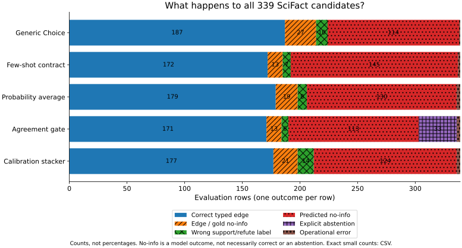
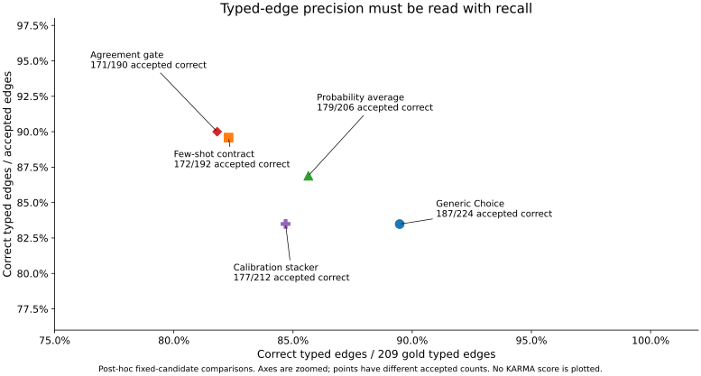
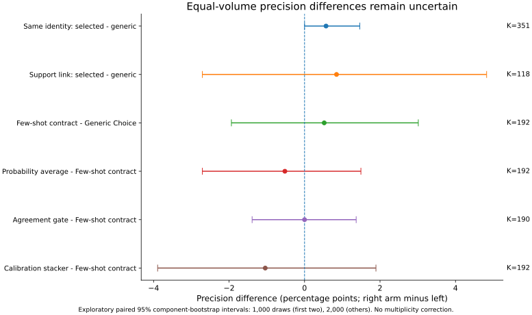
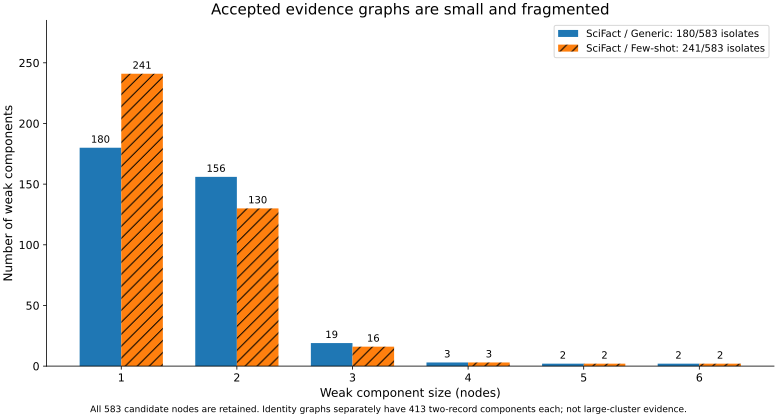
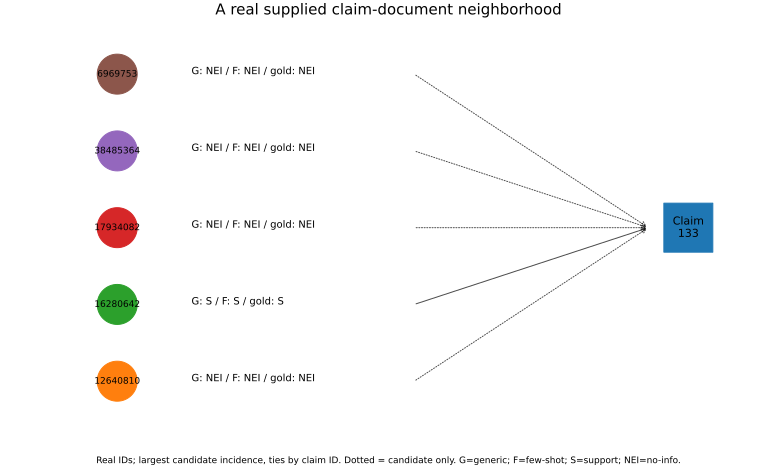
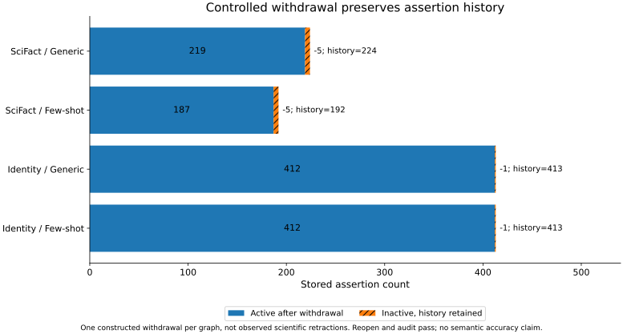
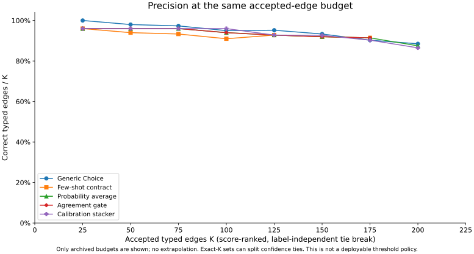
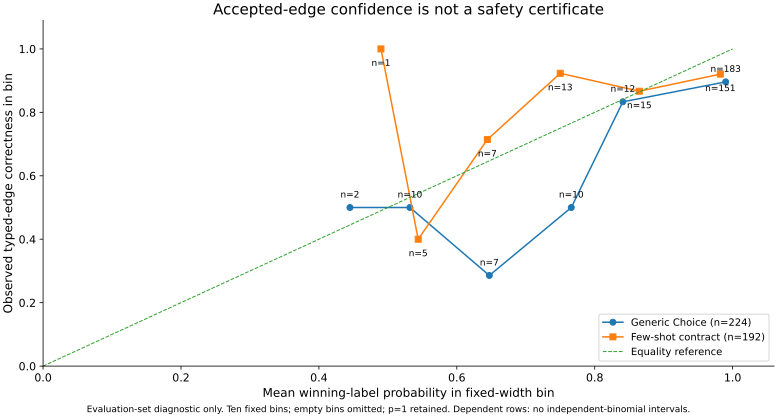
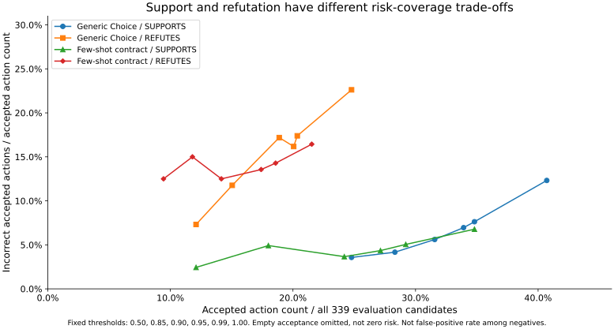
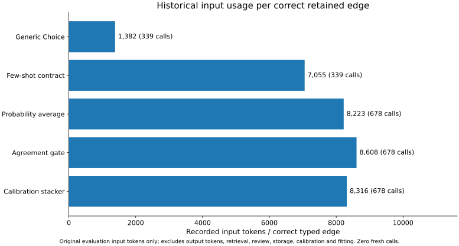

# From Typed Decisions to Repairable Evidence Graphs
## A frozen-Jev replay study with relationship semantics, visual error analysis, matched-coverage evaluation, and dependency-aware retraction

**Timothy Wayne Gregg**  
**Research manuscript draft — 17 September 2026, America/New_York; visual-analysis revision**  
Companion to the original Jev study at commit `5b511c88c011524ad6adb71f1d5fa22f3dc941e0`.

**Status.** This manuscript reports executed software tests and a post-hoc analysis of existing model observations. It is an author-review draft, not an independently reviewed or submitted publication. It does not report fresh Jev inference, new human annotation, or a KARMA replication. Affiliations, funding, conflicts, final authorship approval, release permissions, and submission venue have not been confirmed. AI assistance was used for implementation, analysis, and drafting; the named author must review and approve the final work.

## Abstract

A well-formed semantic decision is not yet a reliable graph update. We investigate the transition from bounded model judgments to evidence-preserving, repairable graphs using an immutable Jev research package. We implement explicit relationship contracts, source- and decision-bound assertions, durable versioned transactions, reversible identity views, and dependency-aware retraction. We reconstruct the original observations and compile the two retained formulations into four graph stores. On 413 DBLP–ACM pairs, the selected formulation produces 349 correct and two incorrect same-identity assertions, versus 350 and eight for the baseline. On 339 SciFact claim–abstract pairs, it produces 110 correct and eight incorrect support assertions, versus 122 and eighteen. However, at equal accepted counts, the identity comparison is four versus two errors and the support comparison is nine versus eight; both exploratory paired precision-difference intervals include zero. No operating threshold qualifies for the illustrative 1% conditional false-positive target. Controlled source withdrawal, durable reopen, and audit checks pass for all four stores; the original 136-test suite and the expanded 100-test extension/visualization suite provide regression coverage. These results establish executable graph acceptance and repair mechanisms, not general autonomous graph synthesis. Ten reproducible visualizations additionally separate unsupported edges from wrong-polarity edges, expose graph fragmentation, and compare five relationship formulations at matched acceptance volume. The strongest practical finding is that improvements in accepted-edge precision must be interpreted jointly with coverage, relationship semantics, and the dependency structure of committed assertions.

**Keywords:** knowledge graphs; entity resolution; evidence provenance; graph synthesis; typed decisions; selective prediction; reproducibility; truth maintenance.

## 1. Introduction

A graph-building system must decide not only whether a model output is plausible, but also what that output permits the system to assert. The judgments that two records describe one entity, that an abstract supports a claim, and that a proposed relation belongs to an ontology are different decisions. Treating them as interchangeable confidence scores obscures both their error consequences and the conditions under which a graph update should be reversed.

The preceding Jev study compared request formulations for bibliographic identity matching and supplied claim–abstract classification [1]. It provided evidence of improved entity macro-F1 on one custom split, but no resolved overall relation-classification gain. It explicitly excluded candidate discovery, cluster-level validation, and end-to-end graph construction. This work addresses an implementation gap within that boundary: can the saved decisions be bound to actual graph assertions, analyzed at useful acceptance coverage, and withdrawn without destroying source history?

Our contributions are a small durable graph compiler, an exact-input adapter for the recorded Jev formulations, and an executed graph-level reanalysis. We distinguish four evidence categories throughout: original model observations, newly computed descriptive statistics, controlled lifecycle interventions, and synthetic software tests. We do not combine these categories into a single semantic-accuracy claim. In particular, passing a constraint test establishes behavior under that test, not the truth of a biomedical statement.

The resulting artifact supports a bounded evidence-graph pilot. It does not implement an unrestricted document-to-ontology system. That distinction is central to both the comparison with KARMA and the interpretation of the numerical results.

## 2. Related work and positioning

KARMA v2 describes a multi-agent enrichment pipeline spanning entity discovery, relationship extraction, schema alignment, conflict handling, and integration. It permits multiple relationship labels, sends unsupported schema additions for review, and evaluates graph statistics alongside model-based and human assessments [2, Sections 3.7–3.10 and 4.3]. Its full-pipeline evaluation and our fixed-candidate replay therefore answer different questions. We neither execute KARMA nor transfer its reported scores into our tables.

Our design focus is the acceptance boundary after candidates exist. An appropriate future comparison would first hold candidate records and evidence fixed while varying acceptance and repair policies. A second experiment could compare complete candidate-generation pipelines under matched resource budgets. This two-level design would separate better discovery from more selective commitment and avoid crediting a system merely for declining more candidates.

SciFact supplies scientific claims, abstracts, and evidence annotations [3]. We reuse the preceding study's derived cited-abstract task, not the full retrieval benchmark. The identity records originate in the DBLP–ACM serialization distributed with Ditto [4], but our results are not a retraining or leaderboard comparison with Ditto. The custom splits and original data limitations remain those documented in the archived study [1].

TypeSafe documents bounded typed questions over application state [5]. Our adapter preserves those question meanings and recorded payloads; it does not interpret interface validity as factual validity. W3C SHACL provides a vocabulary for graph validation [6], while PROV-O models provenance relations among entities, activities, and agents [7]. The implementation is inspired by these separations of responsibility but is not a complete SHACL processor, PROV-O serializer, or OWL reasoner. No priority claim is made for provenance, transactional updates, selective classification, or dependency-based truth maintenance.

## 3. Representation and relationship semantics

### 3.1 Assertions, evidence, and accepted views

The stored unit is an assertion with an immutable identifier, subject, predicate, object, qualifier map, evidence identifiers, prerequisite assertion identifiers, and a decision record. A source snapshot contains its source identifier, version, origin, complete supplied text, and an exact nonempty character span. A content hash binds that representation. Hashes detect changes relative to a known snapshot; they do not authenticate the publisher or prove that its content is true.

The decision record binds the exact proposed assertion to a model identifier, request hash, task distribution, selected outcome, execution mode, and policy version. An accepted view groups equivalent relation representations while retaining their separate supporting assertions. Several sources can therefore support one displayed edge without being collapsed into one supposed independent probability. Evidence and prerequisites within an assertion are conjunctive. Alternative proofs are separate assertions, so withdrawal of one proof need not remove an independently supported edge.

For SciFact, an accepted edge is explicitly `Document -> supports|refutes -> Claim`. It reports a document's relationship to a supplied claim. It is not a directly extracted `Drug -> treats -> Disease` assertion. A refutation does not authorize inventing an opposite biomedical relation. Insufficient-information results and failed model responses create no support or refutation edge, although their candidate nodes and original observations remain available.

For entity matching, original record nodes remain distinct in storage. Accepted `same_as` assertions induce a reversible identity view; accepted `different_from` assertions are cannot-link constraints. No original record is deleted or permanently rewired by identity selection.

### 3.2 Predicate constraints

Each predicate has an explicit domain, range, symmetry flag, optional canonical inverse, incompatible predicates, transitivity annotation, and self-relation policy. Asymmetric relations preserve endpoint order. Declared inverse aliases reverse the endpoints and normalize to their canonical predicate. Symmetric relations canonicalize endpoint order, including after identity mapping. Distinct compatible predicates can coexist on one pair; each still requires a separate accepted judgment.

Incompatibility is checked for the same canonical endpoints and exactly equal qualifier maps. Qualifiers can preserve time, population, modality, or other supplied scope, but this implementation does not infer their meaning or detect partial interval overlap. Unknown predicates and malformed declarations fail closed. A domain/range violation, missing endpoint, disallowed self-loop, or inconsistent identity component rejects the transaction.

Only identity views use equivalence closure. A nonidentity predicate marked transitive does not cause automatic edge generation. Adding a derived relation would require its own assertion and explicit prerequisite links. This restriction avoids silently promoting a schema annotation into newly observed evidence.

### 3.3 Acceptance and transactional publication

Acceptance requires an explicit per-predicate outcome contract and threshold. A high `REFUTES` probability cannot authorize a `supports` edge. Probabilities must have exactly the task's labels, finite values within [0,1], and a sum within the frozen validation tolerance. Missing or malformed distributions are not replaced with neutral values. Synthetic decisions require explicit policy opt-in.

The SQLite implementation serializes writers with `BEGIN IMMEDIATE`. It checks an expected graph version and an idempotency key, applies changes to a candidate state, validates the full active state, and publishes state plus journal entry together. Repeating the same idempotency key and payload returns the original event; changing the payload or policy under that key fails. Injected prepublication failures leave the previous state and journal intact.

The journal links successive state and event hashes. This supports integrity checks within the application's trust boundary, not protection from an administrator capable of rewriting the complete database and its hashes. Authorization and external source authentication remain application responsibilities. Complete JSON snapshots simplify inspection but do not establish production scalability.

### 3.4 Retraction and identity repair

Let R0 contain directly withdrawn assertions and assertions using withdrawn evidence. Retraction computes the least fixed point:

`R(k+1) = R(k) union {a : prerequisites(a) intersect R(k) is nonempty}`.

The store deactivates all assertions in that set atomically and records a reason. Historical assertions and source records remain intact. Identity components are recomputed from active identity assertions, allowing an incorrect bridge to be removed without losing the underlying records. Assertions whose interpretation relied on a selected identity must declare that prerequisite to receive cascading invalidation; undeclared dependencies cannot be recovered automatically.

Schema changes use a separate versioned migration operation with reviewer attribution and a reason. The proposed schema must validate all active assertions. This is a reviewed migration mechanism, not autonomous ontology induction or proof that the stated reviewer was authorized.

## 4. Study design

### 4.1 Immutable inputs and inferential status

The input package is pinned to commit `5b511c88c011524ad6adb71f1d5fa22f3dc941e0`. The current baseline inventory contains 161 files, whose bytes and hashes are checked before replay. Six standalone dataset files are acquired or regenerated through the existing downloader, verified against `scripts/datasets.json`, and remain excluded from Git. The manifest itself is pinned by its Git blob hash. New implementation, reports, and this manuscript are additive; the original manuscript and data are unchanged.

The extension is post-hoc and exploratory. The original outcomes were known before its acceptance analyses were designed. We reuse the original baseline and selected `fewshot_contract` formulations and do not perform additional prompt selection. The selected formulation bundles several request changes; this work does not isolate a causal contribution from demonstrations alone [1].

The archived evaluation contains 413 identity-disjoint DBLP–ACM pairs, including 350 matches and 63 nonmatches, and 339 SciFact claim–abstract pairs across 247 connected evaluation components. Separate original calibration sets contain 390 identity pairs and 150 SciFact rows [1]. These are not newly collected, independently blinded populations. The identity split's class mixture and removal of cross-partition pairs restrict deployment extrapolation.

### 4.2 Binding recorded observations to graph actions

The replay adapter verifies the exact input, requested model, task, formulation, demonstrations, response identifiers, probabilities, and recorded error status. It reconstructs each retained prediction from the original service response. A changed claim, record, evidence payload, or question formulation requires a new decision rather than a cache reuse. Evaluation labels are used only by the metric functions, not by graph construction or action ranking. A negative test changes evaluator gold labels and verifies that graph content and audit hashes remain unchanged.

Recorded outputs are marked `recorded`, not `live`. The extension makes zero new service calls. A separate opt-in adapter can use the archived formulation with an explicitly supplied matching Jev backend and a bounded call budget; its new-inference behavior was tested with mocks, not a live provider.

Four SQLite stores are constructed: baseline and selected formulations for each task. The descriptive argmax policy accepts supported outcome labels without a further confidence cutoff; it is intentionally not presented as a qualified deployment policy. All candidate nodes remain, including isolates. The exported states contain source snapshots, assertion decisions, accepted views, and post-withdrawal histories.

### 4.3 Accuracy, coverage, and uncertainty

For each action class, precision is correct accepted actions divided by accepted actions, recall is correct accepted actions divided by all gold positives, coverage is accepted actions divided by all candidate rows, and conditional false-positive rate is incorrect accepted actions divided by gold negatives. These denominators are not interchangeable.

We report a fixed score grid of 0.5, 0.85, 0.9, 0.95, 0.99, and 1.0 without selecting an evaluation-set optimum. For a matched-count comparison, each arm's predicted primary actions are ranked by their returned probability, then row identifier. Both arms retain the smaller available count. Gold labels do not determine the selected actions.

We jointly resample the original SciFact components or identity-disjoint pair units for 1,000 percentile bootstrap draws with seed 20260918. Intervals describe the difference in selected-minus-baseline precision, conditional on the observed scores and fixed selected sets. They do not repeat prompt development, control every reported comparison, or establish robustness to domain or service changes.

### 4.4 Calibration-only qualification illustration

A separate analysis asks whether any fixed-grid threshold qualifies for a 1% conditional false-positive target using calibration labels only. For independent negative units, one-sided exact binomial upper bounds allocate alpha = 0.05/6 to each threshold. Empty accepted sets do not qualify. Repeated SciFact calibration components invalidate an independent-row qualification, so its computed row bounds are diagnostic only and the policy explicitly abstains.

For identity matching, even a qualified bound would depend on representative sampling and independent confirmation. A low false-positive rate among negatives would still not guarantee high precision when true matches are rare. The illustrative target is not a user-approved operating policy or a guarantee of graph-level risk.

### 4.5 Lifecycle and software evaluation

For each graph, we withdraw the evidence snapshot incident to the greatest number of accepted assertions, resolving ties by source hash without consulting gold. We verify the expected incident removals, preservation of assertion history, durable reopen equality, and audit continuity. These are controlled withdrawals of existing sources, not observations of real scientific retractions.

Separate synthetic tests exercise direction, inverse aliases, symmetry, multi-label compatibility, exact-scope conflicts, provenance tampering, stale versions, schema review, cannot-links, identity splitting, and failure atomicity. Thirty seeded 20-node dependency DAGs compare cascading retraction with an independent set-closure calculation. These controls contribute to software testing, not model-accuracy denominators.

### 4.6 Visual analysis and relationship-experiment synthesis

The visual revision is a post-hoc reporting extension, not a new blinded experiment. It combines the graph-study reference with the separately executed relationship-fusion experiment [8]. That experiment compares generic Choice and few-shot decisions with equal probability averaging, agreement-only gating, and a calibration-trained multinomial stacker. All three combined arms require both constituent responses. A missing or invalid response is an operational error, and disagreement under agreement gating is an abstention; neither is relabeled as a correct no-information answer. The stacker is selected within calibration components, not by fitting evaluation labels. The full protocol and limitations remain in [8].

Every figure is produced by `visualize_evidence.py` from two SHA-256-pinned result archives and the independently hash-checked original calls, plan, and predictions. `evidence_figures/data.json` retains exact plot coordinates, bin counts, neighborhood identifiers, threshold grids, and comparison intervals. CSV companions and `evidence_figures/manifest.json` expose denominators and source/output hashes. No plotted point is invented for an unexecuted comparator, including KARMA.

For the pooled evidence-edge analysis, let N=339 supplied claim–document pairs, T=209 gold support/refutation pairs, A the accepted typed-edge count, and C the number with the correct predicate. Precision is C/A, recall is C/T, candidate coverage is A/N, and selective error is (A-C)/A. A support/refute polarity error is both an incorrect committed edge and a missed gold edge. These denominators differ from the action-specific false-positive rate among negative pairs in Section 4.4. Retrieval recall and open-world graph completeness are not measured.

We partition every evaluated row into exactly one of six outcomes: correct typed edge, an edge where gold is no-information, wrong support/refutation polarity, predicted no-information, explicit abstention, or operational error. Confidence reliability uses ten fixed equal-width bins of the winning-label probability for accepted support/refutation edges; the final bin includes 1.0. Empty bins are absent, not zero-accuracy observations. Counts are shown, but independent-binomial error bars are withheld because SciFact rows share components. The diagram is a descriptive evaluation-set diagnostic, not a calibration fit or a safety certificate.

The node-link example is selected by greatest candidate-document incidence, with lexicographic claim-ID tie-breaking, before examining correctness. Its dotted connectors denote supplied candidates, not accepted graph assertions. The component plots retain isolated nodes. For SciFact, schema-eligible endpoint-pair density divides distinct directed document-to-claim pairs by 283×300, rather than by all 583×582 possible directed node pairs; neither density is a semantic-quality score.

## 5. Results

### 5.1 Accepted actions

Table 1 reports the actual assertions before matched-count adjustment. Counts use the original labels, not a new adjudication.

| Task and action | Formulation | Accepted | Correct | Incorrect | Precision | Recall |
|---|---|---:|---:|---:|---:|---:|
| Identity: same | Baseline | 358 | 350 | 8 | 97.77% | 100.00% |
| Identity: same | Selected | 351 | 349 | 2 | 99.43% | 99.71% |
| Evidence: supports | Baseline | 140 | 122 | 18 | 87.14% | 88.41% |
| Evidence: supports | Selected | 118 | 110 | 8 | 93.22% | 79.71% |
| Evidence: refutes | Baseline | 84 | 65 | 19 | 77.38% | 91.55% |
| Evidence: refutes | Selected | 74 | 62 | 12 | 83.78% | 87.32% |

**Table 1.** Argmax action quality. Source: `results/graph-study.json.gz`, per-task `actions.*.argmax` fields.

The selected entity formulation produces fewer incorrect positive identity assertions, with one additional missed match. Its full identity graph includes 351 same and 62 different assertions; three of the total 413 labels are incorrect. The baseline includes 358 same and 55 different assertions, with eight incorrect labels. Overall classification correctness remains 410/413 versus 405/413.

For SciFact, the selected formulation creates 192 support/refutation assertions, of which 172 agree with gold and twenty do not. The baseline creates 224, with 187 correct and thirty-seven incorrect. Thus accepted-label precision rises from 83.48% to 89.58%, but fifteen fewer correct assertions are retained. Overall classification accuracy does not improve: it is 288/339 versus 289/339, with two versus one operational errors. The higher support precision should not be read as a universal relation improvement.

**Figure 1. Complete candidate disposition.** Exact counts are conserved across all five arms. Generic Choice creates 27 edges where gold is no-information and ten wrong-polarity edges; few-shot creates thirteen and seven respectively. A model's no-information output is not automatically correct. In particular, the agreement arm's 33 explicit abstentions and three operational failures remain distinct. Source: `evidence_figures/edge_outcomes.csv`, derived from the relationship experiment's operational confusion matrices [8].

**Figure 2. Precision–recall trade-off.** Recall uses all 209 gold typed edges, including examples that encounter operational failures. Few-shot's 172 correct edges versus generic Choice's 187 show the cost of increased selectivity. The axes are explicitly zoomed. Points have unequal accepted counts, so a higher position alone does not establish a superior acceptance policy. These are paired observations on one previously inspected candidate population, not separate benchmark replications.

### 5.2 Matched accepted counts

| Primary action | Accepted per arm | Baseline correct / incorrect | Selected correct / incorrect | Precision difference | Exploratory 95% interval |
|---|---:|---|---|---:|---|
| Same identity | 351 | 347 / 4 | 349 / 2 | +0.570 percentage points | [0.000, 1.465] points |
| Supports claim | 118 | 109 / 9 | 110 / 8 | +0.847 percentage points | [-2.708, 4.825] points |

**Table 2.** Score-ranked matched-count comparisons. Both intervals include zero. Source: `matched_primary_action_count` for each task.

The unadjusted support-error count falls from eighteen to eight, but this becomes nine versus eight at equal accepted counts. The matched comparison is a useful limitation on a stronger precision claim. It does not prove equivalence, because its uncertainty still permits differences in either direction. Likewise, the identity matched-count interval does not exclude zero despite its favorable point estimate.

**Figure 3. Equal-volume effect estimates.** The first two rows reproduce Table 2; the remaining rows use pooled support/refutation edges from [8]. All six displayed intervals contain or touch zero. The identity interval touches zero at its lower endpoint. This is absence of resolved superiority under this analysis, not evidence of equivalence. Intervals use 1,000 paired component-bootstrap draws for the first two rows and 2,000 for the others, condition on the selected sets, and are not corrected for multiple comparisons. K is the accepted count per arm before resampling.

### 5.3 Graph relationships and topology

The identity graphs each preserve 826 record nodes and 413 typed edges. Every weak component contains two records, and there are no isolates. The baseline and selected identity views contain 468 and 475 identity components respectively. This topology is a direct consequence of the identity-disjoint evaluation construction, not evidence of successful large-cluster resolution or resistance to noisy bridges in natural data.

The SciFact candidate graph contains 283 document and 300 claim nodes. All accepted edges are directed from document to claim. The baseline has 224 edges, 362 weak components, and 180 isolates; the selected graph has 192 edges, 394 weak components, and 241 isolates. The largest component contains six nodes in both cases. The maximum in-degree is five and the maximum out-degree four. Preserving isolates makes the coverage loss visible rather than improving apparent connectivity by dropping unconnected candidates.

Neither SciFact arm creates a claim with opposing support/refutation labels from different sources. Consequently, the natural-data replay does not stress conflict resolution. Inverse normalization, multiple predicates on one pair, qualifier-sensitive incompatibility, and multi-step identity repair are established only by the synthetic mechanism tests. Structural metrics describe what is stored; they are not additional factual-accuracy measurements.

**Figure 4. Component structure with isolates retained.** Few-shot increases isolates from 180/583 (30.87%) to 241/583 (41.34%), while reducing accepted edges from 224 to 192. The two-record identity components are documented separately and must not be mistaken for successful large-cluster resolution. Data: `evidence_figures/topology.csv` and `evidence_figures/data.json:topology`.

The schema-eligible endpoint-pair density is 224/84,900 = 0.264% for generic Choice and 192/84,900 = 0.226% for few-shot. The complete document–claim Cartesian product is only a structural denominator: most of these pairs were never evaluated. It must not be used to estimate retrieval coverage or false-negative rates.

**Figure 5. An actual candidate neighborhood, not a conceptual ontology.** Claim 133 has five supplied documents. Under the gold-independent selection rule in Section 4.6, both original formulations retain the support link from document 16280642 and classify the four other candidates as no-information. Solid connectors indicate a typed edge accepted by at least one arm; dotted connectors are candidates only. Original IDs and full per-candidate labels are in `evidence_figures/data.json:neighborhood`. One selected neighborhood is illustrative, not a representative accuracy sample, and its labels remain document-to-claim judgments rather than biomedical predicates.

### 5.4 Qualification and lifecycle

No arm qualifies an operating threshold for the illustrative 1% false-positive target. The identity calibration has only 56 negative examples for the same-identity action. Even zero errors among all 56 gives a one-sided, six-threshold-adjusted upper bound of about 8.19%. Under the same independent-binomial assumptions, 477 zero-error negative units would be needed to make that bound at most 1%. SciFact qualification is refused because its calibration rows repeat dependency components, not because a row-wise number has been mistaken for a valid certificate.

Each relation graph's controlled withdrawal deactivates five incident assertions; active counts become 219 and 187. Each identity graph loses one active assertion, leaving 412. Historical assertion counts remain 224, 192, 413, and 413 respectively. Durable reopen and journal checks pass for all four stores. The 30 synthetic dependency-DAG controls also produce exactly the reference retraction closure. These results establish the tested repair behavior, not the accuracy of identifying which source should be withdrawn in an operating system.

**Figure 6. Retraction without loss of assertion history.** Each bar's total equals the stored pre-withdrawal assertion count; its marked end segment remains as inactive history. Five assertions are deactivated in each relation graph and one in each identity graph. Audit continuity and durable reopening are checked independently. These four constructed interventions do not measure naturally occurring retractions or correctness of source-selection policy. Data: `evidence_figures/withdrawal.csv`.

### 5.5 Reproduction and test execution

All 161 original inventory files retain their bytes. Portable replay reconstructs all 3,644 original predictions from 3,405 recorded calls with zero network attempts. It exposes a pre-existing portability defect: the archived runner interprets Windows source-path strings literally on Linux. The wrapper normalizes those keys only in a temporary runtime manifest and restores the archived manifest before analysis.

Calls, predictions, and calibration artifacts are byte-identical after replay. In the local Python 3.13.5 / NumPy 2.3.5 environment, one derived log-loss value differs by approximately 3.47 × 10^-18. The report records this difference explicitly; the entire results file is not claimed to be byte-identical. Derived JSON comparisons permit only the documented absolute tolerance 10^-14 and relative tolerance 10^-12, while requiring exact structure and integer counts.

The original graph study reported 136 original tests and 60 extension tests without skips. The merged relationship experiment expanded the extension suite to 85 tests; this visual revision adds fifteen regression tests, and all 100 extension tests pass locally without skips. The unchanged original 136-test suite remains separately exercised in CI. The graph study is separately executed after the tests and its complete machine-readable result is archived. Continuous integration repeats the original replay, original tests, extension tests, and comparison against the committed graph results after pinned dataset acquisition. A successful local execution is not substituted for an unobserved CI result; the PR records the actual CI outcome separately.

### 5.6 Relationship combinations, confidence, and resource trade-offs

The combined-arm analysis does not establish that more model judgments produce better graph edges. Agreement gating accepts 190 edges with 171 correct (90.00% precision), but the score-ranked few-shot arm also retains 171 correct at K=190. At K=192, probability averaging retains 171 correct versus 172 for few-shot. Its tiny unfiltered macro-F1 increase of 0.001031 has an exploratory interval crossing zero [8]. The calibration-trained stacker is descriptively worse on macro-F1. No arm is promoted into a production policy.

**Figure 7. Matched-budget view rather than a test-selected optimum.** Only the archived fixed budgets are connected. A curve ends when that arm has insufficient accepted candidates; there is no extrapolation. The exact-K ordering uses model score and a stable identifier, can split score ties, and is not an implementable probability-only acceptance threshold. Boundary-tie counts remain in `evidence_figures/data.json:arms[].budget_curve`.

**Figure 8. Accepted-edge confidence reliability.** The 224 generic and 192 few-shot accepted edges are exactly conserved across the plotted bins. Sparse bins and shared document/claim components limit interpretation. The equality line is a reference, not a fitted calibration model. Filtering out no-information predictions and operational failures makes this an accepted-edge diagnostic; Figure 1 retains those excluded outcomes in the operational accounting. A high score, even 1.0, is not a validated per-write risk guarantee.

**Figure 9. Predicate-specific selective risk.** The same fixed threshold grid is applied to both formulations without choosing a test-set winner. Refutation and support show different error/coverage behavior and should not share an unvalidated universal threshold. Empty accepted sets are omitted rather than plotted as zero risk. Selective error divides by accepted actions, whereas the calibration false-positive bound divides by negative examples; those are different quantities. Data: `evidence_figures/data.json:predicate_frontiers`.

**Figure 10. Historical input-token accounting, not deployment cost.** Generic Choice used 258,495 evaluation input tokens for 187 correct typed edges, approximately 1,382 per correct edge. Few-shot used 1,213,458 for 172, approximately 7,055 per correct edge. Each combined arm depends on both formulations: 678 recorded calls and 1,471,953 input tokens. These ratios exclude output tokens, calibration and fitting, extraction, retrieval, storage, review, and repair; they are neither dollar costs nor complete system efficiency. Offline regeneration incurs no new model calls, but does not erase the constituent inference required by a live combination policy. Data: `evidence_figures/edge_outcomes.csv` and [8].

## 6. Discussion

The extension demonstrates a useful composition boundary: semantic judgments propose acceptance, while deterministic code validates relationship meaning, dependencies, and publication mechanics. Keeping original assertions and evidence separate from canonical views makes later correction possible without erasing the inputs needed to understand a decision.

The empirical lesson is more qualified. The entity formulation remains a promising component, but natural graph topology is too simple to demonstrate cluster-level behavior. The relation formulation is more selective: it creates fewer wrong edges and fewer right edges. Matching accepted counts substantially reduces its apparent advantage. A graph-synthesis evaluation should therefore report accepted-edge precision, coverage, and downstream effects together rather than optimize a single classifier score or connectivity statistic.

An initial application could maintain publication identity hypotheses and a claim–source evidence graph. Such a system can expose uncertain or conflicting information without automatically promoting it into a canonical statement about the world. A production version would need independently validated candidate retrieval, richer scope modeling, explicit authorization, operational monitoring, and a suitable storage design. The current full-snapshot SQLite implementation is intentionally inspectable rather than scalable. The visual evidence supports two distinct decisions: a reversible evidence-graph pilot is technically testable, while autonomous semantic commitment at a claimed low error rate is not yet qualified. Neither graph connectivity, passing software tests, nor agreement between correlated formulations substitutes for independent evidence of correctness.

The optional pairwise identity selector illustrates another boundary. Scores for several candidate identities are not assumed to be a normalized exclusive distribution. The selector requires both an acceptance threshold and a separation margin, and otherwise defers. This behavior is implemented and tested, but the present natural dataset does not measure multi-candidate selection accuracy. Those tests must not be substituted for a new candidate-ranking benchmark.

## 7. Limitations and next evaluation

The analysis reuses public labels and a known outcome set. It inherits the original study's custom splits, possible benchmark exposure, bundled formulation changes, and selection-conditioned inference. The bootstrap intervals are exploratory; matched-count filtering is not an independently validated policy. The source-withdrawal episodes are interventions we constructed, and the synthetic tests cannot establish general semantic reliability.

No raw-document extraction, unseen ontology discovery, open-corpus retrieval, or fresh Jev service performance is measured. The graph evidence does not justify a numerical superiority claim against KARMA, a specialist matcher, or a conventional constrained-output model. Historical service usage excludes retrieval, extraction, storage, review, and repair costs, and this extension makes no new cost-efficiency claim.

The next semantic study should freeze the acceptance design before examining an untouched corpus. It should include realistic candidate prevalence, difficult negatives, several candidate identities per mention, connected identity components, multi-label predicates, conflicting sources, and explicitly annotated scope. Compare backends with identical candidates and evidence first, then compare complete pipelines. Evaluate at matched accepted coverage and matched total resource budgets. Independently adjudicated downstream query correctness and damage from identity errors would provide stronger graph-level evidence than another isolated-pair score.

## 8. Conclusion

The executed work turns saved Jev decisions into auditable, durable evidence graphs and demonstrates controlled source withdrawal and dependency-aware repair. It also shows why classifier improvements cannot be promoted automatically into broad graph-synthesis claims. At equal accepted action counts, neither primary precision comparison excludes zero, and no threshold qualifies for the illustrative deployment target. The artifact is a tested foundation for a bounded graph pilot and a more discriminating next experiment, not a completed autonomous knowledge-graph system.

## Reproducibility and evidence availability

Code, protocol, relationship analysis, test sources, result tables, and full compressed JSON are included in `graph_synthesis/`. `CLAIM_EVIDENCE.md` maps numerical and implementation claims to their exact fields or tests. `README.md` provides portable replay and graph-export commands. `VISUAL_ANALYSIS.md` explains figure interpretation, lineage, and regeneration; all ten figures are supplied as editable vector SVG and high-resolution PNG. The visualization verifier rebuilds the numerical tables and SVG with the pinned renderer and checks the committed artifact hashes. The original archive is retained unchanged. Dataset and code redistribution rights remain subject to the original package notices; this extension supplies no new determination of third-party rights. No API credentials or model weights are included.

## References

[1] Gregg, Timothy Wayne. *Improving Typed Entity Decisions with Jev: A Reproducible Same-Model Case Study*. Original research package, commit `5b511c88c011524ad6adb71f1d5fa22f3dc941e0`, 2026. `../manuscript/paper.md`; original methods and data supplements in `../supplementary/`.

[2] Lu, Yuxing; Wu, Wei; Zhao, Xukai; Peng, Rui; and Wang, Jinzhuo. *KARMA: Leveraging Multi-Agent LLMs for Automated Knowledge Graph Enrichment*. arXiv:2502.06472v2, 11 January 2026. https://arxiv.org/html/2502.06472v2.

[3] Wadden, David; Lin, Shanchuan; Lo, Kyle; Wang, Lucy Lu; van Zuylen, Madeleine; Cohan, Arman; and Hajishirzi, Hannaneh. *Fact or Fiction: Verifying Scientific Claims*. EMNLP, 7534–7550, 2020. https://doi.org/10.18653/v1/2020.emnlp-main.609.

[4] Li, Yuliang; Li, Jinfeng; Suhara, Yoshihiko; Doan, AnHai; and Tan, Wang-Chiew. *Deep Entity Matching with Pre-Trained Language Models*. Proceedings of the VLDB Endowment, 14(1), 50–60, 2020. https://doi.org/10.14778/3421424.3421431. The PDF reference block uses 2021; the original package bibliography records the publisher-metadata distinction.

[5] TypeSafe AI. *API Reference*. Official vendor documentation, accessed 17 September 2026, America/New_York. https://docs.typesafe.ai/api. Interface documentation is not independent evidence of task accuracy.

[6] W3C. *Shapes Constraint Language (SHACL)*. W3C Recommendation, 20 July 2017. https://www.w3.org/TR/shacl/.

[7] W3C. *PROV-O: The PROV Ontology*. W3C Recommendation, 30 April 2013. https://www.w3.org/TR/prov-o/.

[8] Gregg, Timothy Wayne. *Relationship/edge improvement experiments*. Executed post-hoc frozen-response analysis, protocol commit `51803661e3b8913f1a81cfc394954f0b517e95a0`, 2026. `../experiments/relationships/README.md`, `PROTOCOL.md`, and `reference/results.json.gz`. Same previously inspected evaluation set, not independent corroboration.
