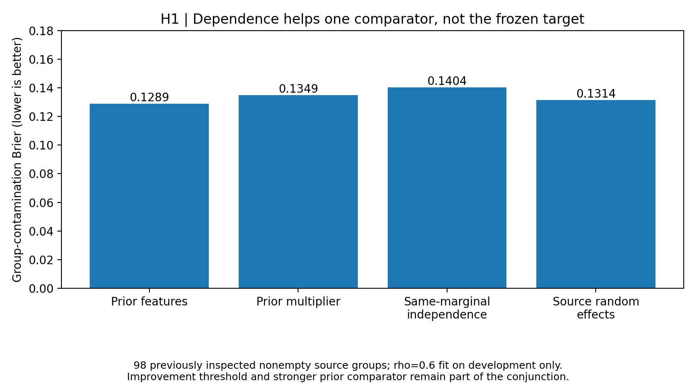
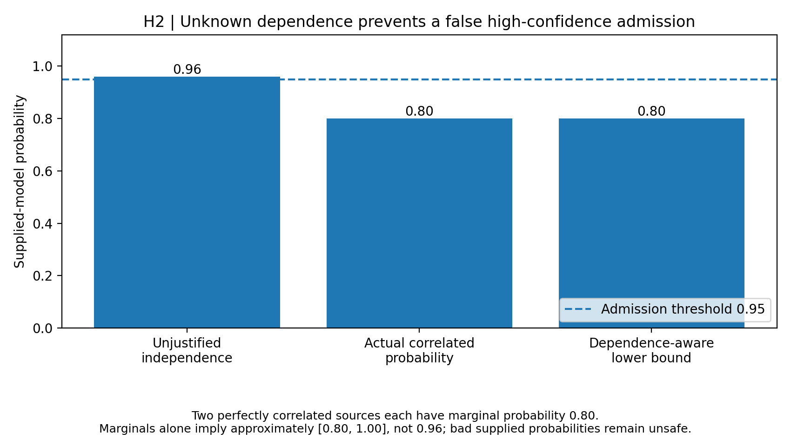
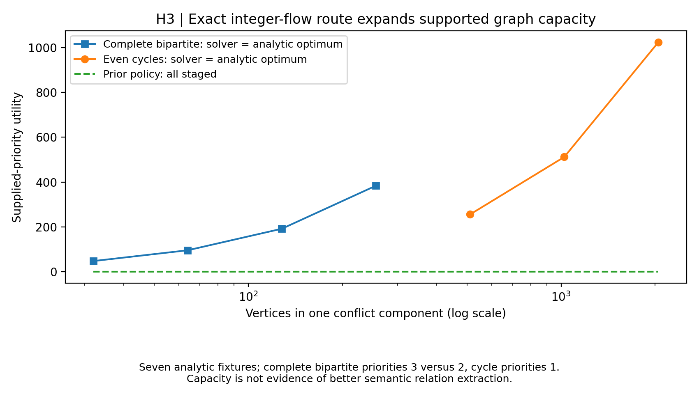
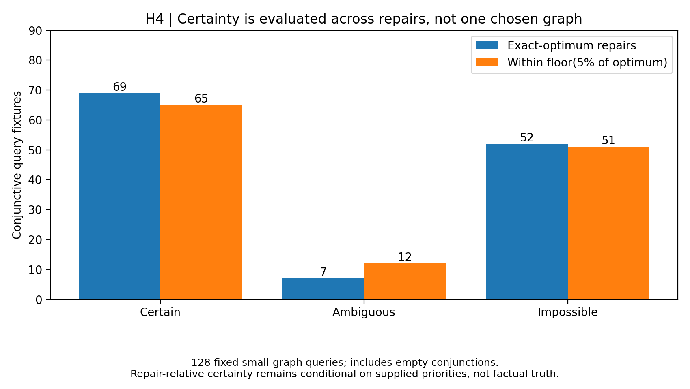
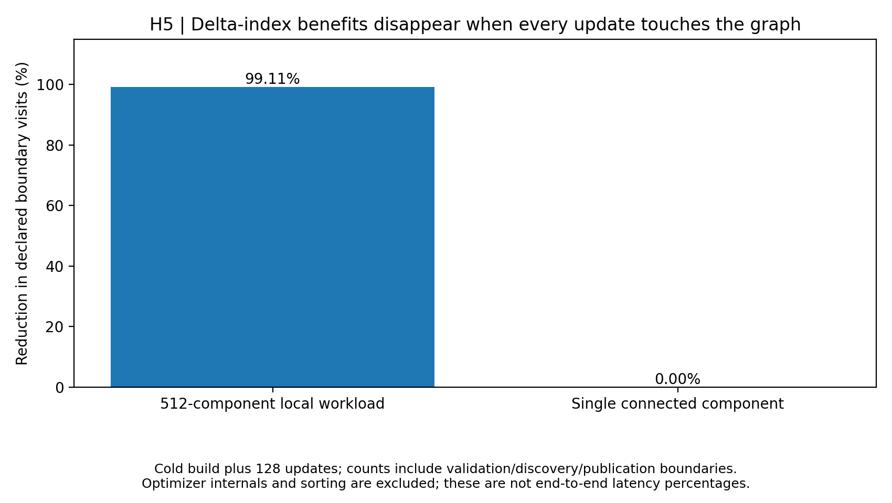

# Dependence-aware certificates for Jev graph synthesis

Timothy Wayne Gregg | AI-assisted author-review research extension | September 18, 2026

## Abstract

Five frozen exploratory tests extend the graph pipeline beyond independent-source assumptions and a single chosen repair. A development-fitted beta-binomial source model changes contamination Brier from 0.140410 to 0.131444, a 6.39% reduction; its primary target is not met. Dependence-aware probability bounds prevent 20/20 independence-induced false admissions in supplied correlated-source controls. Integer flow certificates recover all seven analytic bipartite optima, including 2,048-vertex cycles previously staged. Query classification agrees with finite enumeration, and delta-indexed updates match full recomputation across 640 random mutations. Declared boundary graph-element visits fall by 99.11% on the fixed local-update workload, but by 0.00% on its connected control. These are conditional algorithm and saved-response findings, not new Jev semantic-accuracy evidence or a comparison against KARMA.

## 1. Motivation, novelty boundary and frozen methodology

The preceding [reliability study](../reliability/RESULTS.md) exposed three limitations: its calibration multiplier worsened Brier; exact lineage probabilities remained conditional on independent primitives; and incremental maintenance still scanned the global snapshot. Its conflict optimizer also returned one optimum and staged components outside its cutset/cap limits. The five extensions here test these specific gaps without changing candidate extraction, accepted Jev edges or production policy.

At the frozen PR #17 baseline, the inspected inventory did not contain these five integrated experiments. At merge time, several parallel studies overlap with H2-H4; those methods are concurrent extensions or replications, not five distinct new mechanisms relative to current main. See the [merge-time overlap audit](MERGE_AUDIT.md). This is a **new-experiment claim scoped to the frozen baseline, not to the current inventory or worldwide priority**. Beta-binomial random effects, extremal-probability linear programs, weighted bipartite covers, consistent query answering across repairs and incremental maintenance all have antecedents. A targeted primary-source search and its references are recorded in the [protocol](PROTOCOL.md). The [concurrent-main reconciliation](RECONCILIATION.md) preserves PR #18 and distinguishes its related experiments. Established ingredients do not become novel algorithms merely through new names or integration.

Protocol commit `bc70b76621daca198b3b97eb4f698b17d4c40a0b` precedes this suite's implementation/execution; the inspected baseline is `a62a3257645d8e35cd4e45be53bfa9511d27724b`. Hypotheses were informed by already public results, so this is exploratory follow-up rather than independent preregistration. H1 reuses 73 development candidates in 40 groups and 263 previously inspected evaluation candidates in 149 disjoint groups. Saved calls are reconstructed and hashes checked before use. **Fresh service calls: 0.** H2-H5 use controlled fixtures rather than additional Jev observations.

| Hypothesis | Frozen primary requirement | Result | Evidence class |
|---|---|---|---|
| H1: Source random-effects forecasting | At least 10% lower Brier than same-marginal independence, absolute bias <=0.03, and no regression versus prior feature risk | Not met | Previously inspected saved-response forecasts |
| H2: Dependence-aware lineage bounds | Zero finite-oracle/bound/invariance failures; prevent all 20 correlated-source false admissions | Met | Supplied finite probability models |
| H3: Bipartite flow certificates | Zero finite-oracle/certificate failures, no small-case regression, all seven large analytic optima recovered | Met | Supplied conflict graphs and integer priorities |
| H4: Repair-invariant queries | Zero classification/witness failures; preserve all oracle-certain answers and reject the tie-control false certainty | Met | Priority-relative graph-repair semantics |
| H5: Delta-indexed graph updates | Zero mutation mismatches/invalid-state changes; at least 75% fewer declared boundary visits on the frozen local workload | Met | In-memory controlled graph mutations |

These outcomes must not be combined into a semantic success percentage. A failed conjunction remains failed even when one endpoint improves.

## 2. H1: Source-random-effects contamination forecasts

For each source, n counts base1 SUPPORTS/REFUTES decisions and k counts disagreements with the stored gold relation label. Empty accepted groups are excluded. The development-only marginal error estimate is (sum(k)+0.5)/(sum(n)+1). A grid of intraclass correlations {0,0.01,0.05,0.1,0.2,0.4,0.6,0.8} is selected by beta-binomial development log likelihood with a lower-correlation tie rule. At positive rho, alpha=mu(1/rho-1) and beta=(1-mu)(1/rho-1); contamination is 1-B(alpha,beta+n)/B(alpha,beta). The rho=0 comparator has the identical marginal estimate and uses 1-(1-mu)^n. Predictions consume only source exposure counts, not evaluation labels.

Development selects mu=0.121622 and rho=0.6. All 40 source-excluded development sensitivity fits are retained; held-out source IDs do not enter their training fits. Evaluation uses 98 nonempty source groups, of which 60 are singletons. Singletons cannot distinguish these dependence models at fixed marginal error rate.

| Forecast | Brier | Clipped log loss | Predicted contaminated | Observed contaminated | Bias |
|---|---:|---:|---:|---:|---:|
| Prior feature-risk model | 0.128923 | 0.467074 | 8.04% | 15.31% | -7.26% |
| Prior development-selected multiplier | 0.134900 | 0.441344 | 13.64% | 15.31% | -1.67% |
| Same-marginal independence | 0.140410 | 0.457499 | 17.38% | 15.31% | +2.07% |
| Source random effects | 0.131444 | 0.435042 | 14.07% | 15.31% | -1.24% |

The new-minus-same-marginal Brier difference is -0.008966; its descriptive paired 95% interval is [-0.021889, +0.001383], and its 99% interval is [-0.026211, +0.004667]. The frozen conjunction is **not met**. The forecast can improve relative to its matched marginal comparator while still failing the improvement threshold or regressing versus the richer prior feature model. No accepted edge is changed.

Positive correlation lowers the probability of at least one error at fixed marginal error probability and exposure, because errors cluster rather than spread across groups. It does not universally make an underpredicted contamination rate more accurate. The fitted exchangeable beta-binomial model is neither a distribution-shift guarantee nor a calibration certificate.



## 3. H2: Lineage bounds without assumed independence

A monotone DNF formula is evaluated over at most 1,024 Boolean worlds for at most ten atoms. Nonnegative world masses sum to one and satisfy supplied marginal and optional conjunction constraints. Two linear programs minimize and maximize the DNF truth indicator. They use SciPy HiGHS; solver failures, infeasibility and capacity excess return [0,1] with no admission certificate. These probabilities are supplied model inputs, not Jev scores reinterpreted as fact probabilities.

For a minimization objective c, equality matrix A, target b and returned dual y, c dot z >= b dot y + min(0,min(c-A-transpose y)) for every feasible simplex vector z. The implementation subtracts an additional 1e-9 times (1+sum(abs(y))) outward pad. It saves primal support, duals and residuals. This is a checked, outward-padded floating-point bound conditional on supplied constraints, **not formal interval-arithmetic verification or an unconditional truth guarantee**.

The 128 seeded arbitrary-joint fixtures have 0 containment, constraint-monotonicity, invariance or control failures. The 50 two-event OR/AND grid cases match their analytic Frechet bounds within 1e-8. Mean interval width is 0.326563 using marginals alone and 0.239902 with one valid conjunction constraint. The primary target is **met**.

| Two 0.8-marginal sources supporting an OR | Probability or interval | Admission at 0.95 |
|---|---:|---|
| Assume independence without justification | 0.96 | Yes; false under perfect correlation |
| Actual perfectly correlated sources | 0.80 | No |
| Marginals only, arbitrary dependence | Approximately [0.80,1.00] | No |
| Explicit joint probability 0.80 | Approximately [0.80,0.80] | No |
| Explicit joint probability 0.64 | Approximately [0.96,0.96] | Yes, conditional on this constraint |

Across 20 marginal settings, the method prevents 20 false admissions from an unjustified independence assumption. It also withholds 20 genuinely high-probability admissions when only marginals are provided, and recovers 20 when the correct joint constraint is supplied. That conservatism is a real information tradeoff, not free accuracy. Infeasible and 11-atom cases stage. The false-premise control supplies 0.99 for an actually 0.50-probability atom; the resulting conditional bound still admits it. Arithmetic cannot repair incorrect evidence metadata.



## 4. H3: Integer-flow certificates for bipartite conflicts

A bipartite conflict component is reduced to minimum weighted vertex cover: source-to-left and right-to-sink capacities are supplied priorities, and conflict arcs have capacity one greater than total priority. An integer max-flow/min-cut certificate gives a minimum cover; its complement is a maximum-weight independent set. The verifier reconstructs the original network, checks capacity bounds and conservation, proves flow equals cut capacity, checks the cover/independent-set relationship and verifies the reported utility. No hidden tie-breaking weight perturbation changes the objective.

The new route supports components up to 2,048 vertices and 50,000 edges. Non-bipartite components use the actual prior cutset solver with its original limits; unsupported cases stage rather than silently accepting a heuristic solution. These are explicit conflict graphs, not newly extracted relationships.

All 128 small bipartite cases match independent subset enumeration and their flow certificates. Another 128 small general graphs have no utility regression. Reordering or repeating edges preserves outputs. Total failures: 0. The primary target is **met**.

| Analytic topology | Vertices | Edges | Previous utility | New utility | Oracle utility |
|---|---:|---:|---:|---:|---:|
| complete bipartite | 32 | 256 | 0 | 48 | 48 |
| complete bipartite | 64 | 1024 | 0 | 96 | 96 |
| complete bipartite | 128 | 4096 | 0 | 192 | 192 |
| complete bipartite | 256 | 16384 | 0 | 384 | 384 |
| even cycle | 512 | 512 | 0 | 256 | 256 |
| even cycle | 1024 | 1024 | 0 | 512 | 512 |
| even cycle | 2048 | 2048 | 0 | 1024 | 1024 |

Complete-bipartite fixtures assign priority 3 on one balanced side and 2 on the other; cycles use unit priorities. Prior zero utility means staged, not an incorrect accepted graph. The 2,050-cycle and 50,176-edge complete-bipartite controls stage; a 17-cycle still uses the prior exact route, while the dense 17-clique remains unsupported. A false assertion of priority 9 still defeats a true conflicting assertion of priority 8. Certified optimality concerns supplied priorities, not semantic truth.



## 5. H4: Queries invariant across admissible graph repairs

Let U be maximum supplied priority. Admissible repairs are all independent sets with utility at least U-epsilon, using epsilon=0 and floor(0.05U). For a conjunction of up to eight required vertices, constrained inclusion tests whether some admissible repair contains the conjunction. Constrained exclusion of each required vertex tests whether any admissible repair falsifies it. Answers are certain, ambiguous or impossible, with an explicit counterexample for ambiguity. Staged optimization propagates unsupported status rather than false certainty.

Across 128 seeded general graphs and two tolerance settings, classifications and witnesses have 0 oracle failures. Every oracle-certain answer is retained and larger tolerance creates no new certain answers. Among exact-optimum random cases, 2 affirmative answers from one selected optimum are not invariant across all optima. The explicit equal-weight conflict control also returns an alternative repair that falsifies the chosen optimum's affirmative answer. Primary target: **met**.

| Repair tolerance | Certain conjunctions | Ambiguous conjunctions | Impossible conjunctions |
|---|---:|---:|---:|
| Exact maximum priority | 69 | 7 | 52 |
| Within floor(5% of optimum) | 65 | 12 | 51 |

Some sampled conjunctions are empty and hence tautological; these counts describe the fixture distribution, not a population query-success rate. Conflicting conjunctions are impossible. Zero-priority optional vertices can be ambiguous. The high-priority false assertion is still repair-certain under its supplied objective: repair certainty must not be presented as factual certainty.



## 6. H5: Delta-indexed maintenance without global snapshot rescans

The in-memory index validates an initial graph and maintains private adjacency, priorities, component membership and cached solutions. An explicit mutation API supports weight changes, vertex insertion/deletion and edge insertion/deletion. It copies, validates, discovers and solves only affected old components and their replacements before publication. Bridge insertion joins two scopes; bridge or vertex deletion discovers splits inside the affected old scope. Unaffected solutions are reused. Mutations return selection/staging deltas and aggregate utility rather than forcing a full graph materialization. Snapshot audit is a separate operation.

Independent full-snapshot mutation and optimization checks find 0 failures across 640 seeded mutations, deliberate bridge controls and locality/stress workloads. Each of the five mutation types appears 128 times in the randomized test. Invalid mutations produce 0 state changes; tests also inject a solver exception before publication. This is not a concurrent or durable database transaction protocol.

| Workload, including cold build | Delta-index boundary visits | Full-rescan boundary visits | Reduction |
|---|---:|---:|---:|
| 512 eight-vertex components; 128 local updates | 65,920 | 7,391,616 | 99.11% |
| One 64-vertex component; 128 updates | 123,096 | 123,096 | 0.00% |

The frozen primary target is **met**. The comparator uses the same optimizer but copies, validates, discovers and prepares every component on every update. The boundary metric counts declared passes for graph copying, validation, discovery, solver input, mutation validation and publication. It explicitly excludes sorting, optimizer-internal work, certificate-check work and the audit materialization. Therefore the percentage is **not** a measured reduction in all CPU operations, service latency or database I/O. It improves on the previous study's solver-vertex-only scope, but is still an instrumented boundary measure.

### Separate single-host timing measurements

Three repetitions alternate policy order. Timings include cold construction and 64 updates, but exclude snapshot comparison for both policies. Medians below are descriptive, not a primary endpoint or a portable speed guarantee. All individual measurements and environment details are retained in [timings.json](timings.json).

| Components | Vertices | Delta-index median seconds | Full-rescan median seconds | Ratio |
|---:|---:|---:|---:|---:|
| 16 | 128 | 0.009904 | 0.115459 | 11.66x |
| 64 | 512 | 0.015691 | 0.530766 | 33.83x |
| 256 | 2048 | 0.039344 | 2.307374 | 58.65x |
| 512 | 4096 | 0.070781 | 4.719908 | 66.68x |



## 7. Interpretation, uncertainty and falsifying controls

H1 uses 4,000 paired source-group bootstrap draws with seed 20260922 and fixed fitted policies. The 95% and 99% percentile intervals are descriptive, not simultaneous; they omit fitting uncertainty and cannot undo repeated use of the same evaluation corpus. Neither a favorable score nor a passed point threshold would establish out-of-distribution calibration. H2-H5 finite/analytic fixtures test implementation behavior under supplied assumptions rather than estimates of Jev accuracy.

The retained negative controls are essential: incorrect marginal probabilities defeat lineage certificates; false priorities defeat semantic interpretation of flow certificates and repair certainty; uncertain dependence withholds some valid admissions; unsupported topologies stage; and connected updates remove locality savings. The structural methods remain opt-in research prototypes. Candidate-generation recall, semantic relation qualifiers, source independence discovery and real database behavior are not solved by this suite.

The next independent semantic claim still requires a policy frozen before inspecting a new source-disjoint, independently adjudicated corpus, and matched evidence/resource budgets against an implemented external system such as KARMA. This suite does not claim that such a comparison ran.

## 8. Reproducibility and artifact integrity

```bash
python -m pip install -r graph_synthesis/certificates/requirements.txt
python -B -m graph_synthesis.certificates.run --timings
python -B -m unittest discover -s graph_synthesis/certificates/tests -v
python -B -m graph_synthesis.certificates.run --check
python -B -m graph_synthesis.certificates.report --figures --update-paper
python -B -m graph_synthesis.render_current_paper --output manuscript/paper-current.pdf
```

The [machine-readable results](results.json) preserve fit candidates, held-source exclusions, predictions, complete fixture inputs, joint-world probabilities, LP witnesses, graph certificates, mutation events, oracle outputs and source hashes. Timings are deliberately separate from deterministic replay. Five SVG/PNG figure pairs and a summary CSV are regenerated from recorded results; the extension manifest hashes its source and artifacts. Original raw evidence and the archived manuscript remain unchanged, and the complete current manuscript retains every preceding study.

## 9. Primary foundations

- [SciPy beta-binomial definition](https://docs.scipy.org/doc/scipy-1.17.0/reference/generated/scipy.stats.betabinom.html) and [HiGHS linear programming and dual marginals](https://docs.scipy.org/doc/scipy-1.17.0/reference/optimize.linprog-highs.html).
- [Optimal Union Probability Interval Is NP-Hard](https://arxiv.org/abs/2605.03556), situating finite-world extremal-probability programs and their complexity.
- [Distributed CONGEST Approximation of Weighted Vertex Covers and Matchings](https://arxiv.org/abs/2111.10577), an antecedent for weighted bipartite cover formulations.
- [Computational Complexity of Preferred Subset Repairs on Data-Graphs](https://arxiv.org/abs/2402.09265) and [Consistent Query Answers in the Presence of Universal Constraints](https://arxiv.org/abs/0809.1551).
- [A Feature-based Classification of Model Repair Approaches](https://arxiv.org/html/1504.03947v1) and the [TypeSafe typed-decision interface](https://docs.typesafe.ai/introduction).

These sources motivate established components; they do not validate this implementation or certify worldwide novelty.
