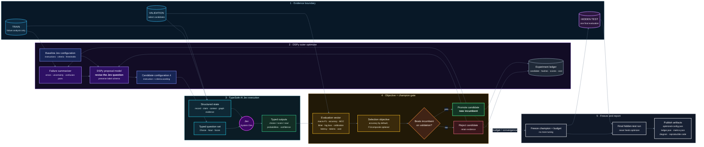

# DSPy × TypeSafe AI Jev — closed-loop prompt optimization

```mermaid
%%{init: {"theme":"base","themeVariables":{"background":"#07111F","primaryColor":"#111C2E","primaryTextColor":"#F8FAFC","primaryBorderColor":"#7C3AED","lineColor":"#64748B","secondaryColor":"#0F1B2D","tertiaryColor":"#12233A","fontFamily":"Inter, ui-sans-serif, system-ui, -apple-system, Segoe UI, sans-serif"},"flowchart":{"curve":"basis","htmlLabels":true,"nodeSpacing":34,"rankSpacing":52,"padding":16}}}%%
flowchart LR

  subgraph DATA["1 · Evidence boundary"]
    direction TB
    TRAIN[("TRAIN<br/><small>failure analysis only</small>")]
    VAL[("VALIDATION<br/><small>select candidates</small>")]
    TEST[("HIDDEN TEST<br/><small>one final evaluation</small>")]
  end

  subgraph DSPY["2 · DSPy outer optimizer"]
    direction TB
    BASE["Baseline Jev configuration<br/><small>instructions · criteria · thresholds</small>"]
    ANALYZE["Failure summarizer<br/><small>errors · uncertainty · confusion pairs</small>"]
    PROPOSE["DSPy proposal model<br/><b>revise the Jev question</b><br/><small>preserve label schema</small>"]
    CAND["Candidate configuration <i>k</i><br/><small>instruction + criteria wording</small>"]
    LEDGER[("Experiment ledger<br/><small>candidate · hashes · scores · cost</small>")]
  end

  subgraph JEV["3 · TypeSafe AI Jev execution"]
    direction TB
    STATE["Structured state<br/><small>record · claim · context · graph evidence</small>"]
    QUESTIONS["Typed question set<br/><small>Choice · Noul · Score</small>"]
    MODEL(("Jev<br/><small>System One</small>"))
    OUTPUT["Typed outputs<br/><small>choice / score / noul<br/>probabilities · confidence</small>"]
  end

  subgraph EVAL["4 · Objective + champion gate"]
    direction TB
    METRICS["Evaluation vector<br/><small>macro-F1 · accuracy · MCC<br/>Brier · log loss · calibration<br/>latency · tokens · cost</small>"]
    FITNESS["Selection objective<br/><small>accuracy by default; F1/composite optional</small>"]
    GATE{"Beats incumbent<br/>on validation?"}
    CHAMP["Promote candidate<br/><b>new incumbent</b>"]
    REJECT["Reject candidate<br/><small>retain evidence</small>"]
  end

  subgraph FINAL["5 · Freeze and report"]
    direction TB
    FREEZE["Freeze champion + budget<br/><small>no more tuning</small>"]
    FINALRUN["Final hidden-test run<br/><small>never feeds optimizer</small>"]
    ARTIFACTS["Publish artifacts<br/><small>optimized-config.json<br/>ledger.json · metrics.json<br/>diagram · reproducible code</small>"]
  end

  TRAIN --> ANALYZE
  BASE --> PROPOSE
  ANALYZE --> PROPOSE
  PROPOSE --> CAND
  CAND --> QUESTIONS
  TRAIN --> STATE
  VAL --> STATE
  STATE --> MODEL
  QUESTIONS --> MODEL
  MODEL --> OUTPUT
  OUTPUT --> METRICS
  VAL --> METRICS
  METRICS --> FITNESS
  FITNESS --> GATE
  GATE -- "yes" --> CHAMP
  GATE -- "no" --> REJECT
  CHAMP --> LEDGER
  REJECT --> LEDGER
  CHAMP --> ANALYZE
  REJECT --> PROPOSE
  CHAMP -. "budget / convergence" .-> FREEZE
  FREEZE --> TEST
  TEST --> FINALRUN
  FREEZE --> FINALRUN
  FINALRUN --> ARTIFACTS

  class TRAIN,VAL data;
  class TEST hidden;
  class BASE,CAND config;
  class ANALYZE,PROPOSE optimizer;
  class STATE,QUESTIONS input;
  class MODEL jev;
  class OUTPUT output;
  class METRICS,FITNESS metric;
  class GATE gate;
  class CHAMP good;
  class REJECT bad;
  class LEDGER ledger;
  class FREEZE,FINALRUN,ARTIFACTS final;

  classDef data fill:#0E2A3F,stroke:#38BDF8,stroke-width:2px,color:#E0F2FE;
  classDef hidden fill:#2B173D,stroke:#C084FC,stroke-width:2.5px,color:#FAF5FF;
  classDef config fill:#172554,stroke:#818CF8,stroke-width:2px,color:#EEF2FF;
  classDef optimizer fill:#2E1065,stroke:#A78BFA,stroke-width:2px,color:#F5F3FF;
  classDef input fill:#0F2835,stroke:#22D3EE,stroke-width:2px,color:#ECFEFF;
  classDef jev fill:#3B0764,stroke:#D946EF,stroke-width:3px,color:#FDF4FF;
  classDef output fill:#132E25,stroke:#34D399,stroke-width:2px,color:#ECFDF5;
  classDef metric fill:#3A2A0B,stroke:#FBBF24,stroke-width:2px,color:#FFFBEB;
  classDef gate fill:#402315,stroke:#FB923C,stroke-width:2.5px,color:#FFF7ED;
  classDef good fill:#123524,stroke:#4ADE80,stroke-width:2.5px,color:#F0FDF4;
  classDef bad fill:#3A161B,stroke:#FB7185,stroke-width:2px,color:#FFF1F2;
  classDef ledger fill:#1F2937,stroke:#94A3B8,stroke-width:2px,color:#F8FAFC;
  classDef final fill:#172033,stroke:#F8FAFC,stroke-width:2px,color:#FFFFFF;

  style DATA fill:#081827,stroke:#164E63,stroke-width:1px,color:#BAE6FD
  style DSPY fill:#120C25,stroke:#6D28D9,stroke-width:1px,color:#EDE9FE
  style JEV fill:#0B1C25,stroke:#0E7490,stroke-width:1px,color:#CFFAFE
  style EVAL fill:#211907,stroke:#A16207,stroke-width:1px,color:#FEF3C7
  style FINAL fill:#101827,stroke:#475569,stroke-width:1px,color:#E2E8F0
```
