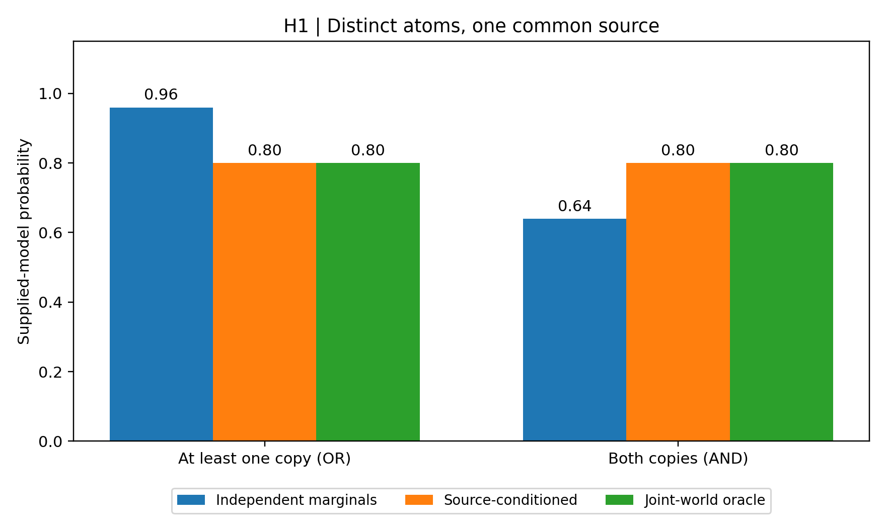
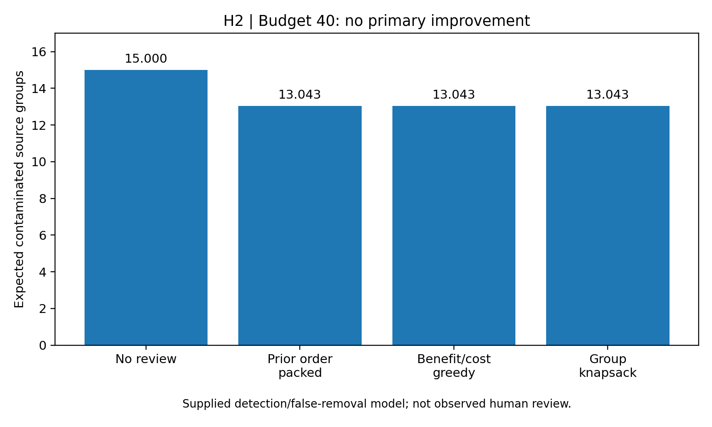
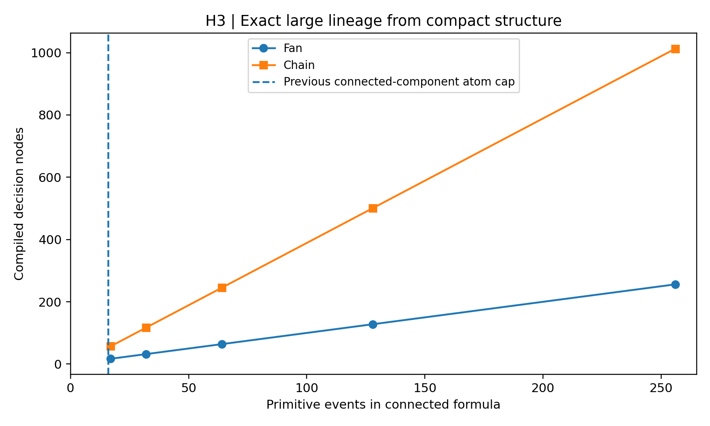
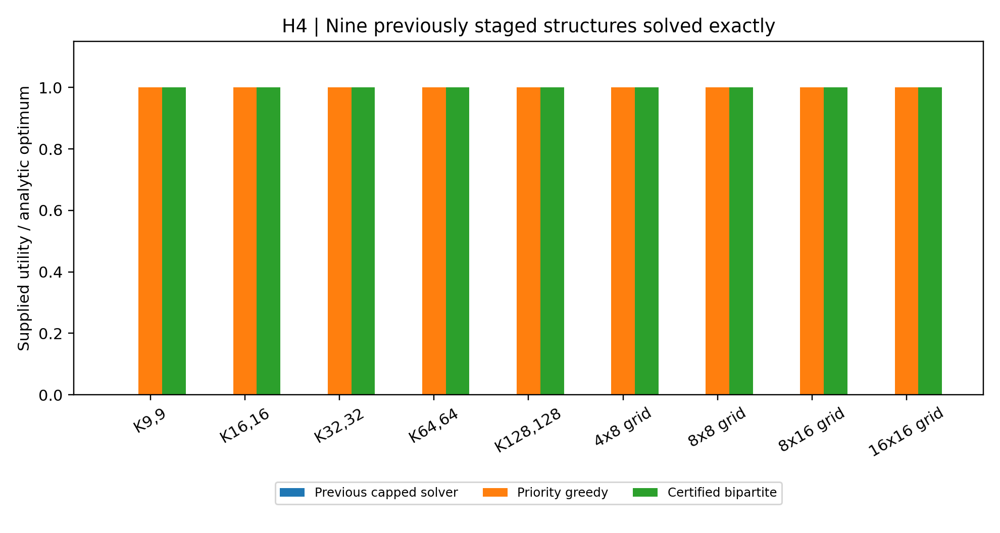
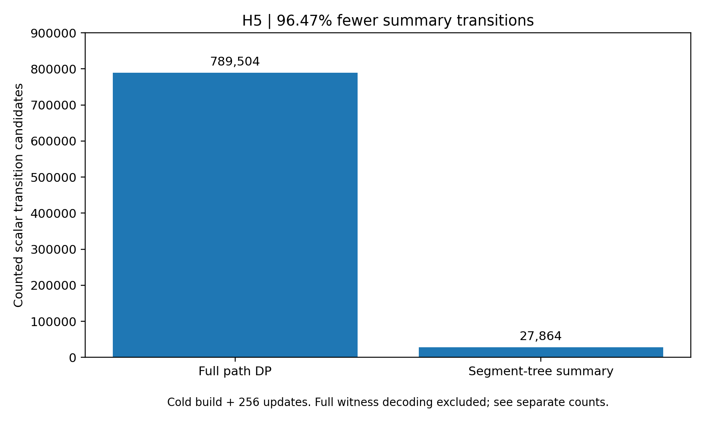

# Structural frontiers for evidence-preserving Jev graph synthesis

Timothy Wayne Gregg | AI-assisted author-review research extension | September 18, 2026

## Abstract

Five frozen extensions test whether explicit source dependence, heterogeneous review assumptions and structural recognition address limitations exposed by PR #17. Latent-source marginalization matches an independent joint-world oracle on 96 supplied-model fixtures and prevents 9 false threshold admissions made by the independent-marginal comparator. Cost- and noise-aware review allocation fails its frozen downstream target: at 40 proxy effort units it leaves 13.043478 expected contaminated source groups, identical to both comparison policies. Compile-once decision diagrams exactly evaluate ten connected lineage formulas with 17–256 primitives beyond the previous blanket component cap. Certified bipartite optimization attains nine analytic large-graph optima previously staged. A fixed-path segment tree reduces counted summary-maintenance transitions by 96.47% across a 1,024-vertex, 256-update workload, excluding separately reported linear witness decoding. These are bounded engineering results, not new Jev semantic-accuracy evidence or proof of worldwide algorithmic novelty.

## 1. Motivation, novelty scope and frozen design

The [preceding reliability study](../reliability/RESULTS.md) found that better average calibration bias need not improve Brier score; source identity errors invalidate independent-event probabilities; capped exact solvers leave some structured cases unresolved; review effectiveness depends on assumptions; and whole-component caching provides no solver saving on a connected graph. The five present mechanisms address these particular limitations rather than adding more correlated Jev calls. TypeSafe's typed outputs and probabilities do not themselves establish graph truth ([TypeSafe documentation](https://docs.typesafe.ai/introduction)).

The [protocol](PROTOCOL.md) was committed as `ef8fc308d0a50cd37a6cdd3b7546e050093349c8` before implementation and benchmark execution, against `a62a3257645d8e35cd4e45be53bfa9511d27724b`. Prior results were inspected and informed hypothesis selection. This is exploratory follow-up, not independent preregistration. H2 reuses 73 development candidates in 40 groups and 263 evaluation candidates in 149 groups. These are already published observations, not a new holdout. **Fresh service calls: 0.** Raw requests, response parsing, group separation and input hashes are checked before scoring. The other four hypotheses evaluate supplied models or graph structures, not newly extracted scientific facts.

| Hypothesis | Proposed extension | Frozen target | Evidence class |
|---|---|---|---|
| H1 | Latent-source-conditioned lineage | Met | Controlled algorithm |
| H2 | Cost/noise-aware group review | Not met | Replay + reviewer assumptions |
| H3 | Reusable state-bounded lineage diagrams | Met | Controlled algorithm |
| H4 | Certified bipartite conflict optimization | Met | Controlled algorithm |
| H5 | Connected-path incremental optimization | Met | Controlled algorithm |

“Met” refers only to the predeclared conjunction on its specified fixture population. These rows must not be pooled into a semantic-success percentage. The [novelty audit](NOVELTY.md) distinguishes repository-new implementations from established source modeling, knowledge compilation, flow optimization and dynamic programming. It does not assert that no person has ever tried an equivalent idea.

**Concurrent integration disclosure.** While this frozen extension was executing, main advanced to `a21314d17c33c639b75522ecce120586ef8dab35` with the [structural refinement](../structural/RESULTS.md) and [source-structural](../source_structural/RESULTS.md) studies. Both are preserved unchanged. The source-structural study also implements certified bipartite optimization: H4 here is therefore a parallel implementation and additional frozen test suite, not a mechanism unique to the reconciled main branch. Its frontier-width lineage evaluator overlaps H3's goal but differs from the reusable decision-diagram state budget tested here. Source-setup review differs from H2's heterogeneous per-edge effort/noise model; source-revision invalidation differs from H5's connected-path summary maintenance. Repository-new claims are limited to the protocol's original pinned baseline, not the later integration snapshot. No thresholds, fixtures or numerical results were retuned after examining the concurrent studies. Reused semantic captures must not be pooled as independent observations.

## 2. H1: Source-conditioned evidence probability

Distinct evidence atoms can still depend on a common unreliable source. Instead of treating their marginal probabilities as independent, the proposed model supplies a binary quality state for each source, a prior for that state, and two conditional probabilities for each assigned atom. Source states are assumed mutually independent; primitive events are independent only conditional on those states. For a monotone proof formula F, compute P(F) = sum_z P(z) P(F given z). Each conditional formula uses the existing bounded exact lineage evaluator. This is exact marginalization within the supplied model, not discovery of the correct dependence structure.

The 96 seeded fixtures contain 2–8 primitives and 1–3 sources. The independent oracle enumerates joint source-plus-primitive assignments, rather than calling the proposed marginalization/evaluation routine. There are **0 oracle discrepancies above 1e-12**, **0 failures in 288 order/duplicate checks**, and **0 proposed false admissions at 0.95**. Independent marginals make 9 false admissions on these random fixtures. Mean absolute probability error is 0.055531 for independent marginals and 1.31e-16 for the supplied dependence model.

| Shared-source query | Independent marginals | Conditioned model | Joint-world truth |
|---|---:|---:|---:|
| At least one of two copies (OR) | 0.96 | 0.80 | 0.80 |
| Both copies (AND) | 0.64 | 0.80 | 0.80 |

The OR control prevents an unjustified 0.95 admission; the AND control shows that dependence errors do not always inflate probability. The target is **met**. Inputs over eight sources or sixteen primitives are explicitly staged with [0,1], not assigned an exact probability. Conditional evaluator exhaustion retains conservative bounds.



**Assumption-breaking control:** two declared independent latent sources that actually share one cause still yield 0.96 when the actual probability is 0.80. The extension therefore moves the necessary independence assumption to the source layer; it does not remove it. Primitive reliabilities and source assignments are fixture inputs, not calibrated model scores or independently adjudicated provenance. Bayesian source-quality modeling already has substantial prior art, including [Zhao et al. (2012)](https://arxiv.org/abs/1203.0058); this experiment does not reproduce or outperform their truth-discovery system.

## 3. H2: Review allocation under effort and reviewer errors

The proposed allocator uses the prior study's development-only single-view risk estimator. Evaluation gold, compact-view predictions and observed review outcomes are unavailable to selection. The supplied per-edge effort is min(8, 1 + floor(recorded single-call input tokens / 1000)). This is a bounded proxy, not measured annotation time, cognitive difficulty, monetary cost or new service expenditure. At base detection s0, detection for cost c is s0 / (1 + 0.05(c−1)); a supplied false-removal probability applies to correct reviewed edges.

For selected review IDs A, the modeled source-group contamination is 1 − product_i[1 − p_i(1 − s_i I(i in A))]. The objective is total modeled group cleaning minus expected correct-edge removals with unit penalty. Enumerate subsets within each group of at most twelve candidates, then allocate across groups using integer-budget multiple-choice knapsack. Larger groups receive no optimized review; **0 primary groups exceed the cap**. No-review remains an available option. The baselines are the actual previous group-aware order packed into the same budget, and marginal-model-benefit-per-cost greedy. Equal budgets do not require identical spending.

The fixed acceptance population contains 150 single-view positive judgments: 132 correct and 18 wrong, spread across 15 contaminated groups before review. This is not the earlier study's separate matched-volume top-145 comparison. Primary scoring uses all 149 evaluation source groups, including groups with no accepted edges. The reviewer simulation removes an actually wrong edge with its supplied detection probability and removes a correct one with its supplied false-removal probability. No human reviewed these edges in this experiment.

The frozen primary scenario is budget 40, s0 = 0.75 and false-removal probability 0.01. The target requires at least 5% fewer expected contaminated groups than **both** comparators, while allowing at most 0.25 additional expected correct-edge removals versus either.

| Policy | Effort spent | Edges reviewed | Expected contaminated groups | Expected correct removed |
|---|---:|---:|---:|---:|
| no review | 0 | 0 | 15.000000 | 0.0000 |
| optimal | 40 | 10 | 13.043478 | 0.0600 |
| packed prior | 37 | 9 | 13.043478 | 0.0600 |
| ratio greedy | 40 | 10 | 13.043478 | 0.0600 |

The target is **not met**. All three review policies have the same primary expected contamination and correct-edge loss. The optimizer's modeled gain (3.078385) exceeds packed prior (3.060146) but ties ratio greedy (3.078385). Improved optimization of an imperfect model is not a demonstrated graph-quality gain. There are 0 objective discrepancies on 64 independent finite-enumeration checks; solver correctness does not rescue the empirical target.



All 36 combinations of budgets 20/40/80/160 and detection/false-removal scenarios are retained in results.json; selection is recalculated from features and supplied assumptions only. The 4,000 paired group-bootstrap draws at fixed primary selections give a 95% and 99% proposed-minus-comparator contamination-rate interval of [0,0] for both comparisons because their per-group expected outcomes are identical. **This degeneracy is not evidence of known population equivalence.** These descriptive intervals omit model-fitting and reviewer-model uncertainty, and published-data reuse prevents independent confirmation. A deliberately incorrect-risk control spends its only review on an actually correct edge and misses the wrong one. Prior research already demonstrates the relevance of real annotation costs ([Settles et al., 2008](https://burrsettles.com/pub/settles.nips08ws.pdf)); our token-based proxy is not a measurement of those costs.

## 4. H3: Compile once, bound by decision-diagram state count

The previous evaluator rejects connected lineage components above sixteen atoms even when their Boolean structure is simple. The proposed compiler canonicalizes a monotone disjunction of conjunctions, chooses frequency-descending/lexical atom order, memoizes residual formulas and merges identical decision nodes. A compiled reduced ordered binary decision diagram can then be evaluated with changing supplied probabilities without recompiling its structure. Children precede parents, so evaluation is a bottom-up weighted sum. Conditional expansion preserves the represented Boolean function; merging identical subfunctions preserves every probability assignment under independent primitive events.

The safety boundaries are 512 atoms, 4,096 input proofs and 32,768 visited residual states. Input-cap violations stage. State-budget exhaustion returns conservative previous lineage bounds with an explicit nonexact status, never a partially evaluated point estimate. Compilation remains potentially exponential; these caps are operational safeguards, not a polynomial-time theorem.

There are 0 probability discrepancies across 128 random formulas with five assignments each, ten analytic large fixtures, 64 updates on one reused 128-atom chain, and the state-cap control. All ten connected large fixtures are exact under the new compiler and nonexact under the actual previous evaluator. Duplicate/input-order checks have 0 failures.

| Formula | Primitives | Decision nodes | Prior lower bound | Exact probability |
|---|---:|---:|---:|---:|
| fan | 17 | 17 | 0.495 | 0.989984894 |
| fan | 32 | 32 | 0.495 | 0.990000000 |
| fan | 64 | 64 | 0.495 | 0.990000000 |
| fan | 128 | 128 | 0.495 | 0.990000000 |
| fan | 256 | 256 | 0.495 | 0.990000000 |
| chain | 17 | 57 | 0.250 | 0.968101501 |
| chain | 32 | 117 | 0.250 | 0.998672193 |
| chain | 64 | 245 | 0.250 | 0.999998494 |
| chain | 128 | 501 | 0.250 | 1.000000000 |
| chain | 256 | 1013 | 0.250 | 1.000000000 |

The shared-fan oracle is 0.99(1−0.5^(n−1)). The adjacent-pair chain oracle uses an independent two-state recurrence for the probability of no adjacent successes. The 128-atom reuse workload performs 1 compilation with 501 decision nodes, then 64 changed-probability evaluations totaling 32,064 decision-node visits. The target is **met**. Diagram size, compile-state visits and evaluation-node visits are separate quantities; none is a measured service-latency saving.



Knowledge compilation for probabilistic data is established ([Fink et al., 2012](https://arxiv.org/abs/1201.6569)); provenance maintenance and hybrid compilation approaches for uncertain knowledge graphs are also established ([Gaur et al., 2021](https://arxiv.org/abs/2108.07758)). The contribution here is the bounded reusable implementation and its tests against this repository's earlier cap, not invention of decision diagrams or superiority over those systems. H3 still assumes independent primitive inputs; it does not automatically incorporate H1's source model.

## 5. H4: Certified bipartite conflict optimization

The cycle-cutset solver in PR #17 can stage a bipartite graph with many cycles even though its supplied-priority maximum independent set has a tractable reduction. The extension first recognizes bipartite components with at most 512 vertices. For bipartition L/R, create source-to-L and R-to-sink capacities equal to nonnegative integer priorities and L-to-R conflict arcs of capacity total priority plus one. A minimum cut cannot profitably cross a conflict arc, since cutting every priority arc is cheaper. Its vertex-side choices therefore give a minimum-weight vertex cover; the complement is a maximum-weight independent set.

The returned certificate contains a capacity-feasible flow, flow conservation at every internal node, a source/sink separating cut of equal value, and the complementary selected witness. A separate verifier checks these conditions without invoking an optimizer. A feasible flow lower-bounds any cut; equality certifies cut optimality, and the cover reduction certifies the selected supplied-priority objective. Nonbipartite components retain the unmodified prior solver and its staging behavior. No additional budget constraint is imposed; adding such constraints changes the complexity ([Doron-Arad and Shachnai, 2023](https://arxiv.org/abs/2307.08592)).

There are 0 optimum discrepancies, 0 certificate errors and 0 prior-utility regressions across 128 random bipartite and 64 general small graphs plus nine analytic large fixtures. The large comparator values below come from the actual imported previous solver, not a renamed reimplementation. Zero previous utility means the unsupported component was staged, not that no positive-utility solution exists.

| Structure | Vertices | Prior utility | Greedy utility | Certified utility | Oracle |
|---|---:|---:|---:|---:|---:|
| complete bipartite | 18 | 0 | 18 | 18 | 18 |
| complete bipartite | 32 | 0 | 32 | 32 | 32 |
| complete bipartite | 64 | 0 | 64 | 64 | 64 |
| complete bipartite | 128 | 0 | 128 | 128 | 128 |
| complete bipartite | 256 | 0 | 256 | 256 | 256 |
| grid | 32 | 0 | 16 | 16 | 16 |
| grid | 64 | 0 | 32 | 32 | 32 |
| grid | 128 | 0 | 64 | 64 | 64 |
| grid | 256 | 0 | 128 | 128 | 128 |

The target is **met**. Complete bipartite fixtures have side weights one and two, giving optimum total weight on the heavier side. Rectangular unit grids have an independent checkerboard half; a perfect matching gives the corresponding upper bound. Certificate-tampering tests, zero weights, invalid endpoints, odd cycles and a dense 17-clique are retained. The odd clique still stages. Priority greedy also attains all nine large analytic optima; the extension adds an optimality certificate and recovery versus prior staging, not an observed large-fixture utility advantage over greedy.



The semantic negative control remains decisive: a false assertion with supplied priority 9 defeats a conflicting true assertion with priority 8. An exact optimizer can be exactly wrong about factual truth when its priorities are wrong. No graph-extraction, clinical-validity or KARMA-superiority claim follows.

## 6. H5: Connected-path summary maintenance

Whole-component invalidation cannot exploit a local weight update inside one connected graph. For the deliberately narrower case of a fixed connected path, the proposed data structure stores the skip/take dynamic-programming transition for each vertex in a max-plus segment tree. Two-state transitions compose associatively; a leaf update requires recomputing only its ancestors. The root gives optimal utility without emitting the entire selected graph. Topology is validated at construction. Invalid or unknown-vertex weight updates are rejected before mutation; changing topology requires rebuilding. Stars and cycles are rejected rather than silently treated as paths.

Across 64 random paths with sixteen updates each and the 1,024-vertex path with 256 updates, there are **0 utility or independent-witness discrepancies** against independent full linear dynamic programming. The primary workload includes cold construction and every update.

| Work quantity | Count | Interpretation |
|---|---:|---|
| Full recomputation transition candidates | 789,504 | Three scalar candidates per vertex per build/update |
| Segment-tree transition candidates | 27,864 | Eight per internal 2-by-2 composition, including cold build |
| Segment summary-work reduction | 96.47% | Only the two transition-candidate counts above |
| Cold topology validation visits | 3,070 | Vertex plus adjacency visits, separately recorded |
| Full witness-decoding node visits | 526,079 | Every output decoded for validation; remains linear |

The frozen 90% counted summary-work reduction target is **met**. The 27,864 versus 789,504 transition comparison is not a total runtime or database-I/O measurement. Witness decoding adds 526,079 tree-node visits under a different operation metric and is explicitly not included in that percentage. A consumer needing the complete selected graph after every update still pays linear output/decoding work. Python overhead, memory traffic, initial sorting, dictionary operations and persistence are not captured by scalar transition counts.



## 7. Interpretation and next falsification boundary

The results favor identifying the tractable structure of a supplied problem over imposing blanket size restrictions: declared dependence changes which probabilities are valid; compact formula structure permits reusable exact evaluation; bipartiteness permits certified optimization despite many cycles; and a fixed path permits local summary updates despite being one connected component. These conclusions are conditional on correct metadata and supported topology. They do not establish that those structures dominate real Jev-generated graphs.

The review result is a useful negative finding. A more exact allocator can improve a modeled objective yet fail to improve the frozen downstream source-contamination measure. This counsels against promoting the allocator on optimization quality alone. Prospective human-cost/detection measurements, source-disjoint independently adjudicated documents, policies frozen before those labels are seen, and matched evidence/resource budgets against external graph-synthesis systems remain necessary for semantic or deployment claims. H1 and H3 reliability inputs must be estimated and audited separately; raw model confidence cannot simply be substituted.

The methods remain opt-in research utilities. No default compiler policy or production graph is changed. Failure controls and all prior studies remain in the complete manuscript. Each target is falsifiable on its specified population, but a passed finite benchmark is not a proof of correctness for all inputs or real-world superiority.

## 8. Reproducibility and audit

```bash
python -B -m graph_synthesis.frontier.run
python -B -m unittest discover -s graph_synthesis/frontier/tests -v
python -B -m graph_synthesis.frontier.run --check
python -B -m graph_synthesis.frontier.report --figures --update-paper
python -B -m graph_synthesis.render_current_paper --output manuscript/paper-current.pdf
python -B -m graph_synthesis.frontier.verify
```

The machine-readable results retain source and code hashes, source-group counts, all random fixtures or complete generating specifications, review IDs and scenarios, independent-oracle outputs, flow/cut witnesses, update sequences and decoded-witness hashes. The five figures are generated directly from those results as SVG and PNG pairs; summary.csv preserves target classifications without pooling them. The [implementation log](IMPLEMENTATION.md) records validation corrections without changing the protocol or endpoints. Original evidence integrity is checked against the immutable inventory. Source, result and figure hashes are bound in the extension manifest; the complete current PDF has a separate source/renderer/PDF hash record.
