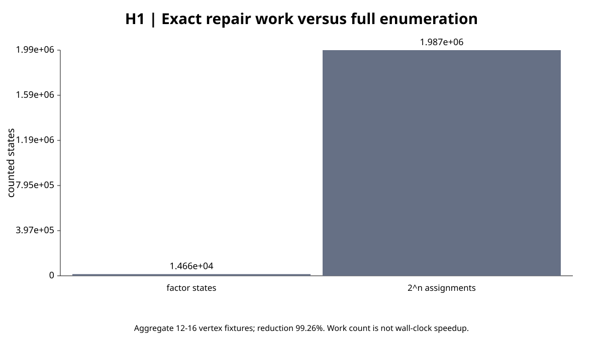
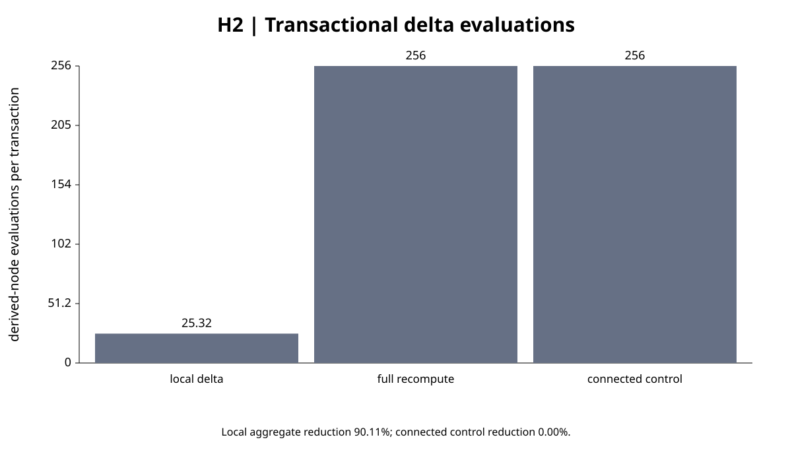
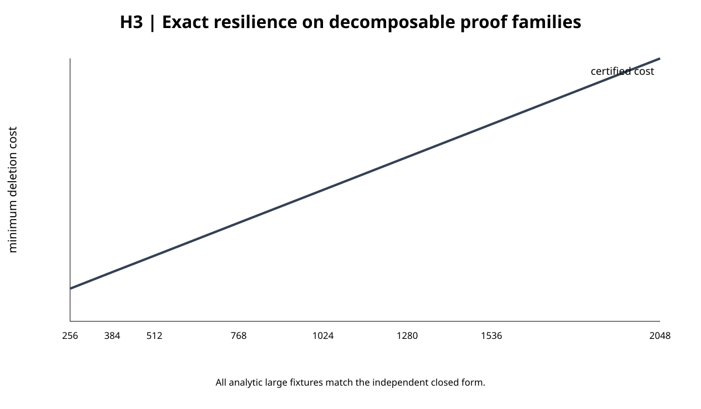
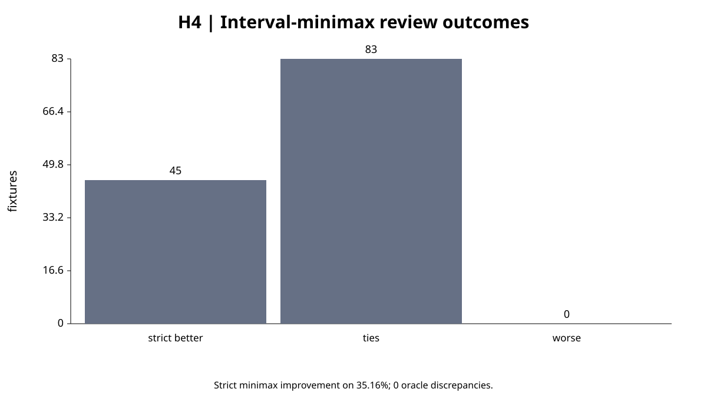
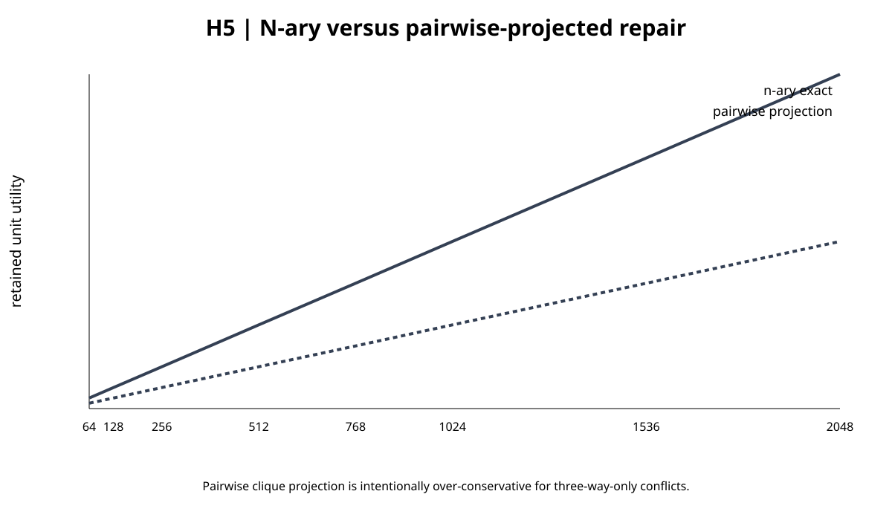

# Post-certificate structural extensions for Jev graph synthesis

Timothy Wayne Gregg | AI-assisted author-review research extension | September 18, 2026

## Abstract

Five precommitted controlled extensions were executed after the dependence-aware certificate study. All five frozen **algorithmic** targets were met: bounded induced-width max-sum repair matched exhaustive oracles and solved connected non-bipartite triangle chains through 1,025 vertices; atomic batch delta maintenance matched full recomputation across 640 accepted transactions while reducing counted local derived-node evaluations by 90.11%; exact query resilience matched 160 exhaustive small oracles and eight large analytic decompositions; interval-minimax review never worsened the frozen worst-case objective and strictly improved 45/128 fixtures (35.16%); and n-ary forbidden-set repair matched all small oracles and retained strictly more supplied utility than a pairwise clique projection on every large three-way-conflict chain. These are structural and decision-theoretic findings. They are not new Jev semantic-accuracy observations, deployment guarantees, or evidence of superiority to an external graph-synthesis system.

## 1. Frozen protocol and evidence boundary

The protocol was committed as `8187cc4e4b98e40f3146ce787b71f262b62b3abd` against baseline `9d2e4a60a6c79e616ab1d352cd5da9fe414e6c98` before implementation and execution. Seed `20260923` is an arbitrary reproducibility seed. **Fresh Jev calls: 0. New scientific documents: 0.** Existing negative semantic/routing/calibration results motivated this round, so this is exploratory follow-up rather than independent preregistration.

The package-level additions are not worldwide novelty claims. Treewidth-aware dynamic programming, incremental view maintenance, query resilience/deletion propagation, minimax decision rules under imprecise probabilities, and hypergraph/constraint optimization all have prior art. The contribution here is the frozen integration and falsification suite for this repository.

| Hypothesis | Frozen target | Outcome |
|---|---|---|
| H1: induced-width exact conflict optimization | zero small/oracle/permutation failures; solve 8 large width-2 chains; stage all over-width controls; >=90% fewer counted states | **Met** |
| H2: transactional batch delta maintenance | zero snapshot or atomicity failures; >=80% fewer local derived evaluations | **Met** |
| H3: exact query-resilience certificates | zero small oracle/witness failures; solve 8 analytic large fixtures; stage 6 over-cap controls | **Met** |
| H4: interval-minimax query review | zero oracle discrepancies; never worse than midpoint worst case; strict gain on >=20% | **Met** |
| H5: n-ary conflict constraints | zero small oracle/permutation failures; solve 8 large chains; strict utility gain vs pairwise projection; stage controls | **Met** |

“Met” refers only to the predeclared controlled fixture conjunction. These rows must not be pooled into a semantic-success percentage.

## 2. H1 - induced-width exact conflict optimization

A max-sum variable-elimination solver uses a deterministic min-fill order and stages components whose induced width exceeds four or whose materialized state budget exceeds the frozen cap. On 160 seeded 8-16 vertex bounded-width graphs, the solver matches exhaustive maximum-weight compatible-subset objectives with **0 failures** and **0 input-order permutation failures**. Width distribution is {'1': 33, '2': 45, '3': 53, '4': 29}.

For 12-16 vertex fixtures, counted factor states are **14,660** versus **1,986,560** full assignments, a 99.26% reduction in this work metric. All eight connected triangle-chain controls from 33 to 1,025 vertices are solved exactly at induced width two. K6-K10 controls stage at widths 5-9. State-count reduction is not a measured CPU or service-latency speedup.



## 3. H2 - transactional batch delta maintenance

Each transaction validates its revision and changes, computes a reverse-dependency closure, evaluates a copy-on-write overlay in topological order, and commits only after every affected derived node succeeds. Across **640** accepted 1-4 primitive transactions on 128 modular DAGs there are **0 snapshot mismatches** against independent full recomputation. The suite also records 64/64 injected-evaluation failures, 64/64 stale revisions and 64/64 malformed updates with no partial state/revision mutation.

Local work falls from 163,840 full derived-node evaluations to 16,205, a 90.11% reduction. Every connected control evaluates all 256 derived nodes, yielding 0.00% saving and making the locality boundary explicit. This is in-memory atomic batch behavior, not crash durability or concurrent database isolation.



## 4. H3 - exact query-resilience certificates

For monotone DNF lineage, the method computes a minimum-cost evidence deletion set that hits every active proof clause using incidence-component decomposition and bounded branch-and-bound. All **160** small fixtures match exhaustive deletion-subset oracles with valid witnesses. Eight analytic decomposable families from 256 to 2,048 proof components (up to 4,096 atoms) match their closed-form optimum; six connected 19-24 atom controls stage under the frozen component cap.

The output is a robustness margin relative to the supplied proof lineage and removal costs. It does not say that those proofs are factually correct or that their costs are calibrated to real review effort.



## 5. H4 - interval-minimax query review

Point-risk review can be brittle when primitive probabilities are uncertain. The proposed selector chooses two reviews minimizing worst-case expected residual Bernoulli variance across all endpoint combinations of supplied marginal probability intervals. Production query probability uses memoized Shannon recursion; the independent checker enumerates Boolean worlds directly.

Across 128 non-degenerate fixtures there are **0 oracle discrepancies** and **0 cases worse than the midpoint selector** under the same worst-case objective. The minimax selector is strictly better on **45 fixtures (35.16%)**, including 13 seeded random fixtures and all 32 engineered fragile-midpoint controls. All 16 point-interval controls reduce to the point solution.

This remains conditional on independent primitives; interval robustness is not a dependence certificate or a semantic calibration guarantee.



## 6. H5 - n-ary conflict constraints

Pairwise conflict edges cannot faithfully represent a rule such as “not all three assertions may coexist.” The factor solver is generalized to forbidden hyperedges: a factor rejects only the all-selected assignment for that scope. Pairwise conflict is the arity-two special case.

All **160** weighted small hypergraphs match exhaustive subset optimization with **0 failures** and **0 permutation failures**. Eight three-consecutive-forbidden chains from 64 through 2,048 vertices match the analytic optimum `n - floor(n/3)`. Pairwise clique projection is deliberately over-conservative: at n=2,048 it retains 683 unit utility versus 1366 for the n-ary model. All arity-6 through arity-10 over-width controls stage.



## 7. Interpretation

This round strengthens a repeated pattern in the package: explicit structure can create large exactness/work-count gains under supplied assumptions, while those gains do not substitute for semantic validation. H1 and H5 broaden tractable repair structure; H2 makes local maintenance atomic across batches; H3 adds a quantitative fragility certificate; H4 replaces a point-risk review objective with a worst-case interval objective. None establishes that Jev extracted the right entities, relations, qualifiers, probabilities, priorities, costs or constraints.

A decisive next semantic study still requires a new source-disjoint corpus, frozen policy before evaluation, independent adjudication, prospective service cost/latency and matched external baselines. No production graph policy changes in this extension.

## 8. Reproducibility

```bash
python -B -m unittest discover -s graph_synthesis/post_certificate/tests -v
python -B -m graph_synthesis.post_certificate.run --check
python -B -m graph_synthesis.post_certificate.report --check
```

`results.json` contains the frozen benchmark outcomes, controls and work counters; `summary.csv` provides a compact result table; the five SVG figures are deterministic renderings of those results. The frozen protocol remains unchanged.
