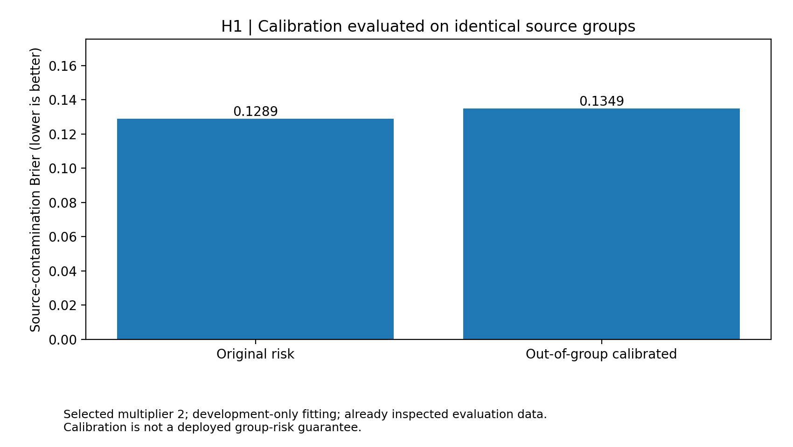
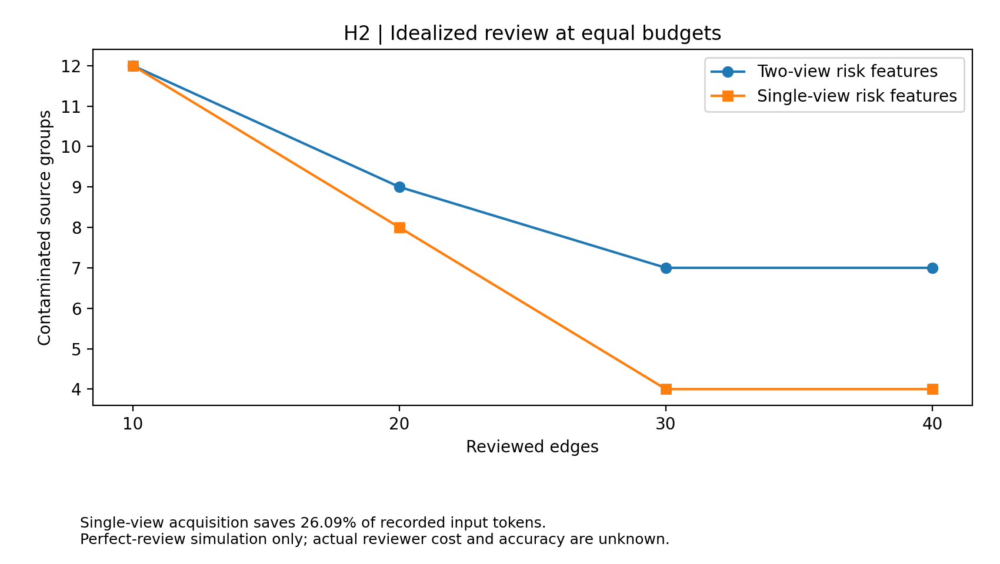
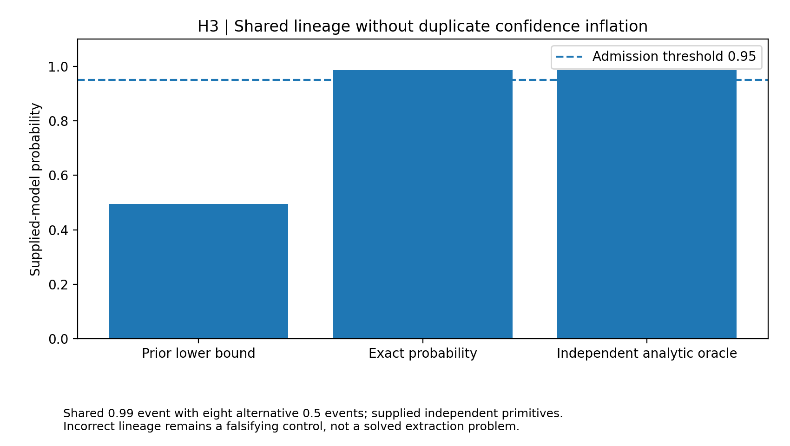
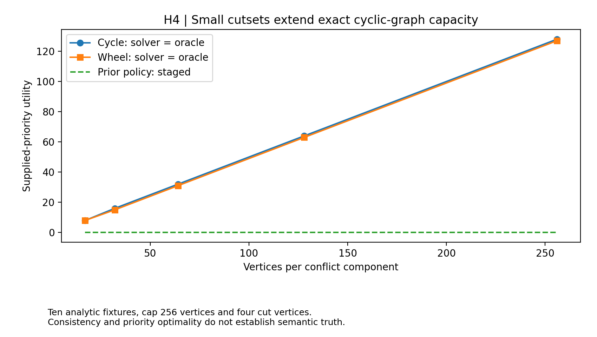
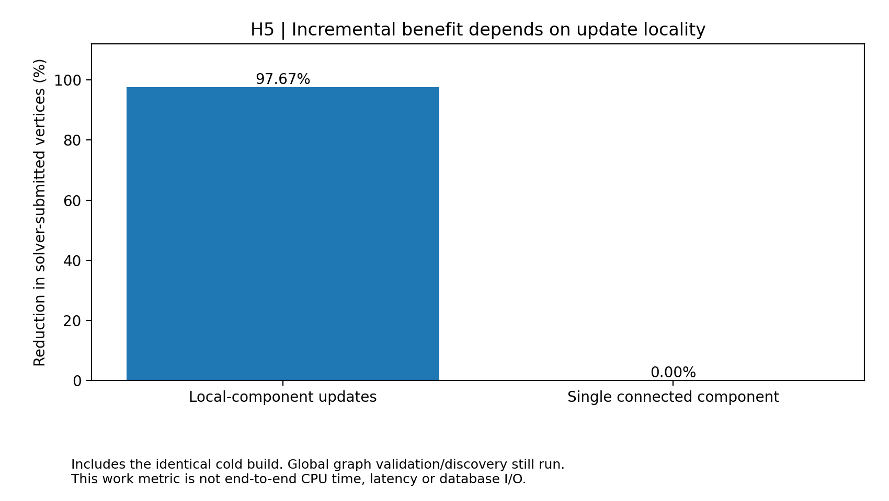

# Reliability, evidence lineage and incremental structure in Jev graph synthesis

Timothy Wayne Gregg | AI-assisted author-review research extension | September 18, 2026

## Abstract

Five frozen follow-up tests separate predictive-risk calibration, review-feature economy and deterministic graph maintenance. Out-of-group calibration selects a multiplier of 2: group Brier changes from 0.128923 to 0.134900, and the frozen calibration target is not met. Single-view review features save 26.09% of recorded acquisition input tokens; at 20 idealized reviews they leave 8 contaminated groups versus 9 for two-view features. Exact small-lineage evaluation, cycle-cutset conflict optimization and incremental component maintenance are evaluated against independent finite or analytic oracles. Their controlled targets are met, met and met, respectively. These results do not establish new Jev semantic accuracy, source independence, human-review effectiveness or superiority to an external graph-synthesis system.

## 1. Motivation and protocol

The [adaptive study](../adaptive/RESULTS.md) and [risk-control study](../risk_control/RESULTS.md) identified optimistic source-contamination estimates, costly secondary review features and structural limits on conflict optimization. The [earlier lineage protocol](../followup/PROTOCOL.md) motivated tightening valid but conservative shared-evidence bounds. These are engineering extensions of established calibration, decomposition and dynamic-programming ideas, not algorithmic novelty claims. TypeSafe exposes typed judgments and probability outputs; structural consistency remains a separate property from semantic correctness ([documentation](https://docs.typesafe.ai/introduction)). Calibration assessment itself requires care about the predicted event and evaluation population ([Vaicenavicius et al.](https://arxiv.org/abs/1902.06977)).

The [protocol](PROTOCOL.md) was committed as `19fdb341f8f3d281eeffbd9984f9d8287a468a6c` before execution, against `338981392c77f4771cdbb58a9f8c90fd723da64a`. Prior test results were already public and informed hypothesis selection. This is exploratory follow-up, not independent preregistration. H1/H2 reuse 73 development candidates in 40 groups and 263 evaluation candidates in 149 groups. These are not fresh holdouts. Raw-response reconstruction, artifact hashes and group separation are checked before analysis. **Fresh service calls: 0.** No default compiler or production graph policy changes.

| Hypothesis | Frozen primary requirement | Outcome | Evidence class |
|---|---|---|---|
| H1: Out-of-group risk calibration | 10% lower Brier and absolute group calibration bias <=0.03 | Not met | Saved-response group scoring |
| H2: Single-view review prioritization | No review-quality loss at budget 20 and >=25% cheaper features | Met | Observed labels with simulated review |
| H3: Exact bounded lineage | Exact finite-oracle agreement, invariance, no false admission, one recovered admission | Met | Supplied independent primitive-event model |
| H4: Cycle-cutset optimization | No oracle errors or small-case regression; ten large cycles/wheels exact | Met | Supplied abstract conflict graphs |
| H5: Incremental conflict maintenance | No recomputation mismatch; >=75% fewer solver-vertex visits | Met | In-memory controlled graph mutations |

A target pass is an engineering result on its stated population. The five evidence classes must not be pooled into a semantic success percentage. Negative results and falsifying controls are retained.

## 2. H1: Out-of-group source-risk calibration

The previous risk model estimates edge-error rates from base1 label, score >=0.90 and disagreement with the compact view, with two global-prior pseudo-observations. Its source contamination estimate is one minus the product of estimated edge-correctness probabilities. That product is a modeling choice, not a certificate of independent errors. For each development source group, we fit on all other groups and predict the held-out group. Empty accepted groups are excluded from this primary scoring population. We select k from {0.25,0.5,0.75,1,1.5,2,3,4} by held-out-group Brier score for q_new = 1-(1-q_old)^k, with frozen tie rules. The final edge-risk fit uses all development groups; test gold is used only for evaluation.

| Model | Nonempty test groups | Brier | Clipped log loss | Predicted contamination | Observed contamination | Bias |
|---|---:|---:|---:|---:|---:|---:|
| Original independent-risk model | 98 | 0.128923 | 0.467074 | 8.04% | 15.31% | -7.26% |
| Out-of-group calibrated | 98 | 0.134900 | 0.441344 | 13.64% | 15.31% | -1.67% |

The selected multiplier is 2; 23 nonempty held-out development groups contribute to selection. Proposed-minus-baseline Brier has descriptive 95% interval [-0.0109, +0.0241] and 99% interval [-0.0168, +0.0310]. The primary conjunction is **not met**. Better average proper score would not establish safety under new source distributions; a missed bias threshold remains a failure even if Brier improves.



## 3. H2: Feature-parsimonious review prioritization

The proposed risk estimator removes compact-disagreement information and retains only base1 label and the fixed score indicator. Its execution receives no compact view and no gold labels. Both policies use the existing group-aware greedy review order and identical edge-review budgets. The primary reviewer removes every wrong reviewed edge, retains every correct edge and cannot add omitted edges. This deliberately idealized intervention isolates the ranking and feature-cost question; it is not an observed human experiment.

| Budget | Two-view contaminated groups | Single-view contaminated groups | Two-view correct retained | Single-view correct retained |
|---:|---:|---:|---:|---:|
| 10 | 12 | 12 | 132 | 132 |
| 20 | 9 | 8 | 132 | 132 |
| 30 | 7 | 4 | 132 | 132 |
| 40 | 7 | 4 | 132 | 132 |

Feature acquisition costs 1,274,247 recorded input tokens for two views versus 941,809 for one view, a 26.09% reduction. All candidate decisions, including failed requests, are charged. Review cost itself is unknown and is not added as invented tokens or dollars. At budget 20, single-minus-two-view contaminated-group-rate difference has descriptive 95% interval [-2.6846, +1.3423] pp and 99% interval [-4.0268, +2.0134] pp. The primary conjunction is **met**. Pointwise preservation of a simulated outcome does not prove clinical, human-review or semantic noninferiority.

The saved results also report fixed-selection sensitivity at detection rates 50%, 75% and 100%, crossed with false-removal rates 0%, 1% and 5%. Those expectations assume independent reviewer detection across reviewed wrong edges. They are scenario analyses, not additional observations.



## 4. H3: Exact bounded shared-lineage probabilities

A proof is a conjunction of supplied independent primitive Bernoulli events, and a fact is supported by the disjunction of its proofs. Duplicates and subsumed proofs are canonicalized; disjoint primitive components can be combined under the supplied independence assumption. Each component of at most 16 atoms is evaluated by memoized Shannon expansion, conditioning on a primitive being true or false. The state budget is 32,768. Exceeding either limit returns conservative component max-proof/sum-proof bounds, never a partially evaluated probability presented as exact. The comparator is the previous duplicate-only shared-component bound.

Across 128 seeded random fixtures, independent exhaustive event enumeration finds 0 disagreements beyond 1e-12. There are 0 failures in 512 order/duplicate checks and 0 false lower-bound admissions at threshold 0.95. Mean interval width falls from 0.094196 to 0.000000 on the bounded random fixtures. The primary controlled target is **met**.

| Controlled example | Conservative lower bound | Exact probability / interval | Interpretation |
|---|---:|---:|---|
| Shared event 0.99 and eight alternative 0.5 events | 0.495000 | 0.986133 | Recovers a justified >=0.95 admission |
| Seventeen-atom shared fan | 0.495000 | [0.495000, 1.000000] | Over cap; no exact claim |
| Forty atoms in twenty disjoint pairs | 0.250000 per proof | 0.996829 | Small components match analytic probability |

**Falsifying assumption control:** one actual 0.8-probability source, incorrectly represented as two independent primitives, yields 0.96 instead of 0.8. Exact arithmetic cannot repair false lineage. Primitive reliabilities here are supplied fixture values, not calibrated Jev truth probabilities or independently verified document sources. State-count reductions are algorithmic diagnostics, not measured service latency.



## 5. H4: Cycle-cutset conflict optimization

The solver accepts an explicit undirected conflict graph and nonnegative integer priorities. Connected components are capped at 256 vertices. Leaf peeling identifies the cycle core; deterministic highest-core-degree removal seeks at most four cut vertices. Enumerating compatible cutset choices leaves a forest solvable by include/exclude dynamic programming. Components not meeting the cutset cap retain exact subset enumeration at size <=16, otherwise they stage. This preserves a bounded unsupported path rather than silently running unrestricted exponential optimization. Graph extraction and semantic priority estimation are not performed.

On 128 random small graphs, independent subset enumeration finds 0 optimum/consistency failures and no utility regression versus the forest-plus-small-enumeration policy. There are 0 failures in 512 input-order checks. All 10 large fixtures are checked against analytic optima; 0 fail. The primary target is **met**.

| Topology | Vertices | Previous policy utility | Priority-greedy utility | Cutset utility | Oracle |
|---|---:|---:|---:|---:|---:|
| cycle | 17 | 0 | 8 | 8 | 8 |
| cycle | 32 | 0 | 16 | 16 | 16 |
| cycle | 64 | 0 | 32 | 32 | 32 |
| cycle | 128 | 0 | 64 | 64 | 64 |
| cycle | 256 | 0 | 128 | 128 | 128 |
| wheel | 17 | 0 | 5 | 8 | 8 |
| wheel | 32 | 0 | 5 | 15 | 15 |
| wheel | 64 | 0 | 5 | 31 | 31 |
| wheel | 128 | 0 | 5 | 63 | 63 |
| wheel | 256 | 0 | 5 | 127 | 127 |

The dense 17-clique control stages 17 vertices. The semantic negative control assigns a false assertion priority 9 and a conflicting true assertion priority 8: the exact optimizer selects `false`. Thus optimal supplied utility and structural consistency do not establish factual truth. The previous-policy comparator is a faithful reimplementation of the forest/<=16-enumeration staging rule, not an external solver benchmark.



## 6. H5: Dependency-local incremental maintenance

The in-memory prototype caches solved component states. Each update validates the entire graph and discovers its new components. It reuses a cached solution only when component membership, every priority and every adjacency set are unchanged. Consequently bridge insertion, bridge deletion, vertex removal and changed weights invalidate affected solutions; unchanged components remain reusable. Invalid updates are rejected before stored state is altered. This is not a durable database transaction protocol.

Across 640 seeded mutations, deliberate bridge controls and the locality/stress workloads, there are 0 selected/staged/utility mismatches against full H4 recomputation. The fixed local workload contains 64 components of 8 vertices and 128 local weight updates. Including an identical cold build, solver-submitted vertex visits fall from 66,048 to 1,536, a 97.67% reduction. The primary target is **met**.

The connected-graph stress control saves 0.00%: every update dirties the only component. Critically, global snapshot validation and component discovery remain outside the solver-vertex metric and still run for every update. No equal percentage reduction in total CPU time, end-to-end complexity, database I/O or service latency is claimed.



## 7. Uncertainty, limitations and research implications

H1/H2 intervals use 4,000 paired source-group bootstrap draws, seed 20260921. Development fits, selected multiplier and review ID sets remain fixed. H1 resamples identical nonempty accepted groups; H2 resamples all evaluation source groups. The 95% and 99% percentile intervals are descriptive, non-simultaneous and omit fitting uncertainty. Published evaluation-set reuse prevents independent confirmation. H3-H5 counts refer to controlled algorithm cases, not additional Jev observations.

The structural extensions can be considered opt-in infrastructure candidates under their explicit caps and supplied inputs. Their apparent improvements do not cure candidate-generation failures, missing relation qualifiers, correlated model errors or incorrect provenance. The decisive next semantic test still requires a policy frozen before observing a new source-disjoint, independently adjudicated corpus, plus matched evidence and resource budgets for external systems such as KARMA. Real reviewer studies and prospective service-cost/latency measurements remain unexecuted.

## 8. Reproducibility

```bash
python -B -m graph_synthesis.reliability.run
python -B -m unittest discover -s graph_synthesis/reliability/tests -v
python -B -m graph_synthesis.reliability.run --check
python -B -m graph_synthesis.reliability.report --figures --update-paper
python -B -m graph_synthesis.render_current_paper --output manuscript/paper-current.pdf
```

The machine-readable results preserve development fold exclusions, all calibration candidates, group predictions, review IDs, sensitivity assumptions, random fixtures, mutation events, oracle outputs and source hashes. Five SVG/PNG figure pairs and summary.csv are regenerated from results.json. The extension manifest binds source, results, figures and validation records. Original raw calls and the archived original manuscript are untouched. The complete current manuscript retains all preceding studies and their limitations.
