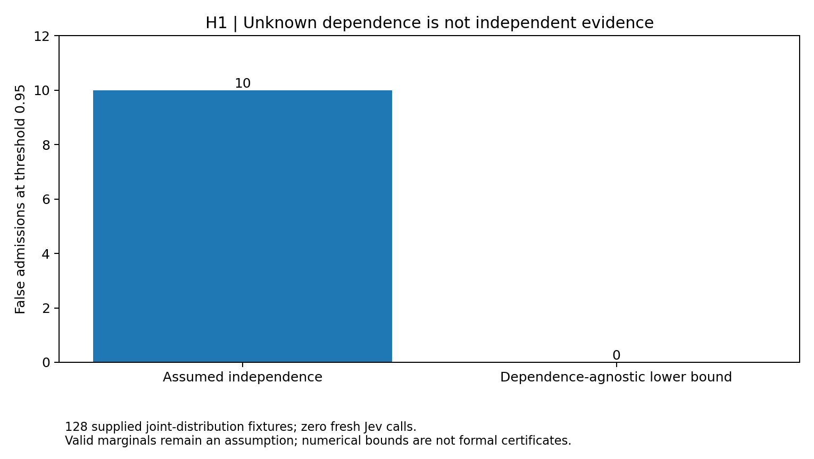
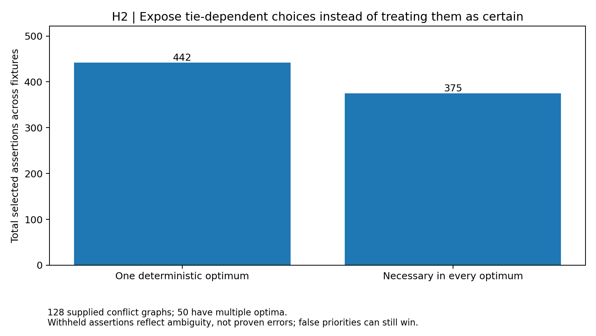
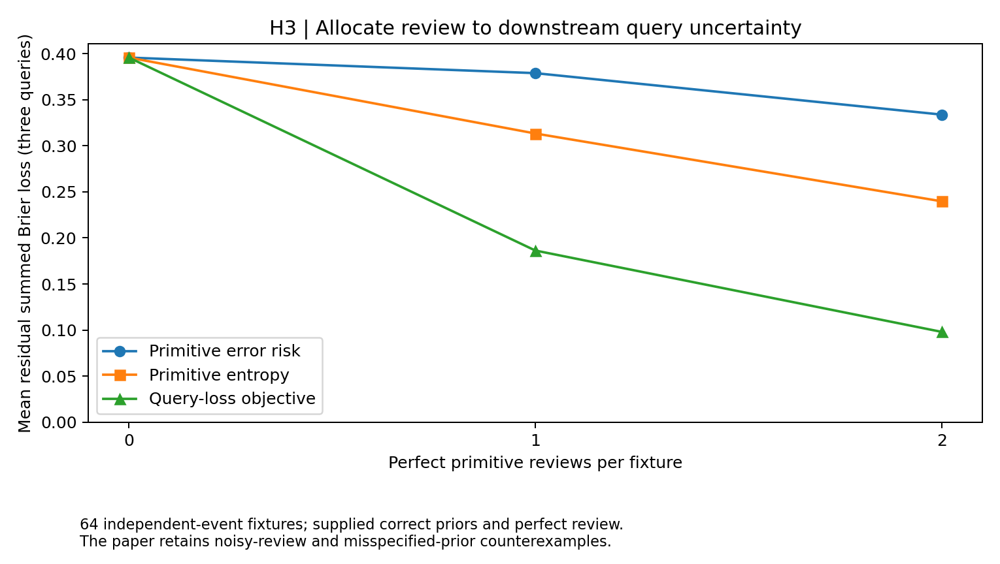
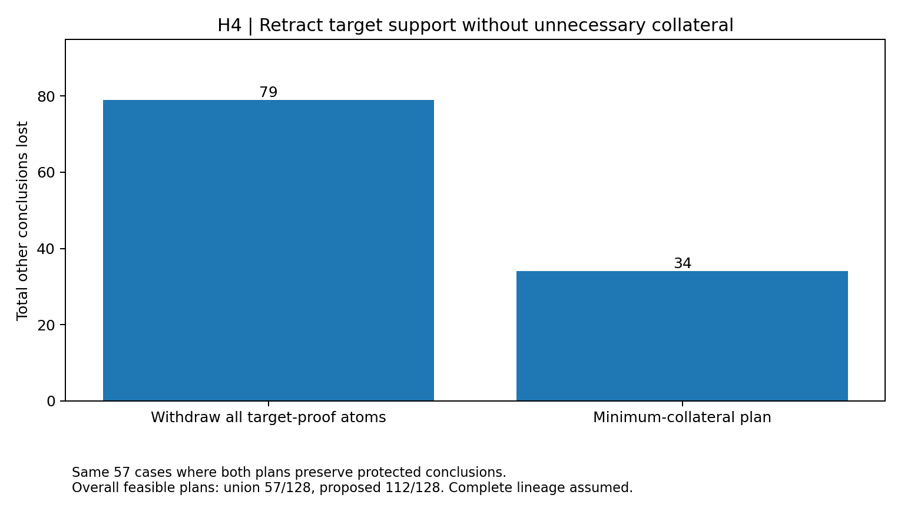
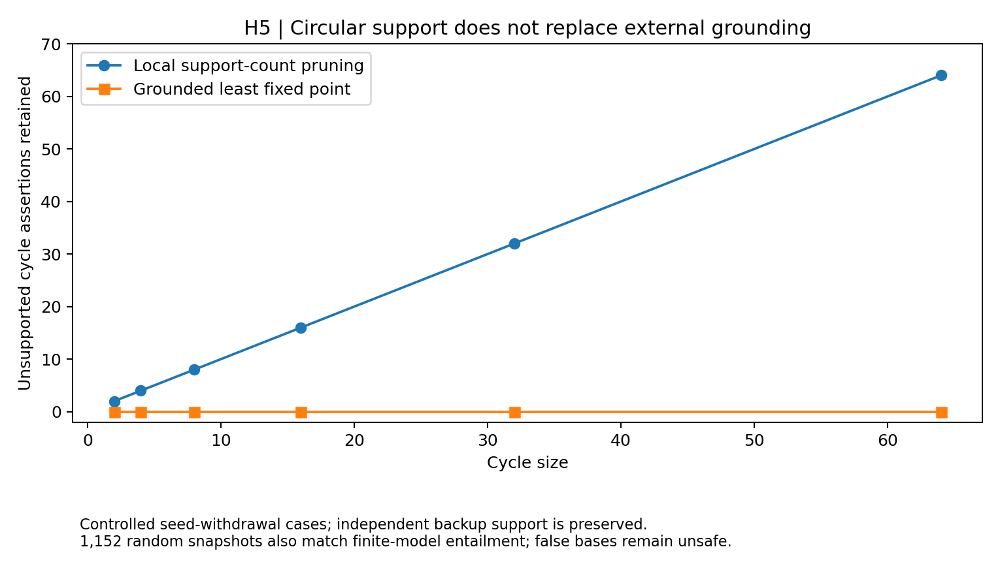

# Uncertainty, repair ambiguity and grounded evidence in Jev graph synthesis

Timothy Wayne Gregg | AI-assisted author-review research extension | September 18, 2026

## Abstract

Five controlled experiments address assumptions exposed by the preceding reliability study. Dependence-agnostic lineage yields 0 lower-bound false admissions versus 10 under an independence model on 128 supplied joint-distribution fixtures. Skeptical repair keeps 375 necessary assertions rather than 442 assertions from deterministic single optima; this is an explicit ambiguity/coverage tradeoff. Query-loss-directed review lowers aggregate residual query Brier loss by 70.64% versus primitive-risk ranking at two ideal reviews. Minimum-collateral retraction lowers collateral by 56.96% on 57 matched feasible fixtures. Grounded materialization matches finite-model entailment across 1,152 snapshots and removes cyclic phantom support. All results are conditional engineering outcomes, not new Jev accuracy measurements. Wrong marginals, false priorities, misspecified review priors, incomplete provenance and false base assertions remain falsifying controls.

## 1. Research question, prior evidence and novelty boundary

The [preceding reliability study](../reliability/RESULTS.md) demonstrated that exact lineage arithmetic cannot repair false independence, priority-optimal graph repair can choose a false assertion, and incremental correctness depends on explicit dependencies. Its review experiments measured source contamination rather than loss in downstream queries. These observations motivate the present five hypotheses. We do not rerun calibration, voting, routing or the previous cycle-cutset benchmark under new names.

The [protocol](PROTOCOL.md) was committed as `383bab6f559c7f14525ddcef2275f3a816c9caa3` before execution, against baseline `a62a3257645d8e35cd4e45be53bfa9511d27724b`. The seed 20260922 is an arbitrary integer, not a collection date. Existing results informed the hypotheses; this is exploratory follow-up, not independent preregistration. **Fresh Jev calls: 0. New scientific documents: 0.** No default compiler or production graph policy changes. Every benchmark here uses supplied algorithmic fixtures or decision-theoretic models, not extraction from new papers or observed human review.

These specific integrations were not found in the reviewed package protocols. A bounded search cannot establish that an idea has never been attempted anywhere. Possible-world probabilistic reasoning is established prior art ([Grosof](https://arxiv.org/abs/1304.3418), [Bacchus](https://arxiv.org/abs/1304.2341)); so are [repair-based query answering](https://doi.org/10.1016/j.tcs.2022.09.005), [query causality](https://arxiv.org/abs/0912.5340), [minimal-deletion resilience](https://arxiv.org/abs/1507.00674), [value of information](https://pmc.ncbi.nlm.nih.gov/articles/PMC7612603/) and [Horn-rule semantics](https://www.w3.org/TR/rif-core/). The contribution is a new package-level implementation and falsification suite, not invention of those methods. No head-to-head comparison with [KARMA](https://arxiv.org/abs/2502.06472) is performed.

### Concurrent-study overlap: post-execution audit

After this suite was executed, a cross-branch audit examined the [PR #20 certificate-study protocol at commit 8fd9bba](https://github.com/CompleteDotTech/paper-package/blob/8fd9bba028473f581e489ad5a902878245e53759/graph_synthesis/certificates/PROTOCOL.md). That study also starts from baseline `a62a3257645d8e35cd4e45be53bfa9511d27724b`. Its H2 substantially overlaps this study's H1: both bound DNF-lineage probabilities over possible-world distributions without assuming independent primitives. Its H4 overlaps this study's H2: both use constrained re-optimization to distinguish repair-invariant conclusions from arbitrary optimal tie choices.

There are implementation and test-scope differences. This study's lineage prototype caps at eight used atoms, provides dependence-free analytic fallback and checks rational small-case extrema; the certificate prototype permits ten atoms and optional conjunction-probability constraints. This study returns an all-assertion optimal-repair backbone, whereas the certificate study tests conjunctive queries and an additional five-percent utility tolerance. Those differences do not justify claiming two new foundational mechanisms.

The subsequently merged [PR #24 assumption-aware protocol at commit 6530321](https://github.com/CompleteDotTech/paper-package/blob/6530321dd0060c9c7f13bb69d6f1c88346a8e1e2/graph_synthesis/assumption_aware/PROTOCOL.md) adds further overlap: its H1/H2 share this study's dependence-bound and repair-invariance mechanisms, and its H5 also recomputes externally grounded least-fixed-point closure after withdrawals. This study's H5 uses finite-model intersection as its independent oracle and measures correctness/phantom retention rather than a primary work-reduction target. Those are useful validation differences, not a new grounding algorithm. Its H3 and this study's H3 both motivate query-aware review, but use different objectives and evidence: source-exposure weighting of saved predictions versus exact expected query Brier loss on controlled event models. Their outcome percentages and pass/fail criteria are not interchangeable.

**Do not describe this suite as five independently novel or never-before-attempted algorithms.** At least three of its five core mechanisms substantially overlap these concurrent studies. Its contribution is five executed, evidence-bounded implementations and falsification experiments. The original bounded inventory statement refers only to the reviewed baseline, not every concurrent branch or worldwide literature. The overlapping fixture counts must not be pooled as independent semantic validation or independent external replication. This study's exact query-loss objective and protected minimum-collateral retraction address different primary objectives from the reviewed concurrent experiments, but worldwide novelty is not established for them either. All prior study sections and their negative outcomes are preserved. No hypothesis, generator, threshold or numerical outcome was changed in response to this audit.

| Hypothesis | Frozen primary target | Outcome | Evidence population |
|---|---|---|---|
| H1: Dependence-agnostic lineage | No containment/oracle/false-admission errors; prevent shared-source control and retain valid singleton | Met | 128 joint fixtures + 16 rational oracles |
| H2: Skeptical repair backbone | Exact all-optima agreement; preserve unique optimum; stage arbitrary tie members | Met | 128 conflict graphs + 512 order checks |
| H3: Query-loss-directed review | Zero oracle regret and at least 20% lower query loss at budget two | Met | 64 independent-event/query fixtures |
| H4: Minimum-collateral retraction | Exact feasible objective, no protected loss, at least 25% less matched collateral | Met | 128 proof-lineage fixtures |
| H5: Grounded recursive evidence | Exact finite-model entailment, eliminate unsupported cycles, preserve grounded backup | Met | 96 rule programs / 1,152 snapshots |

Meeting an engineering target is not evidence that five new semantic improvements have been discovered. Generator-specific effects and assumption-breaking controls must be read together.

## 2. H1: Dependence-agnostic lineage admission

A conclusion has a monotone disjunctive-normal-form proof: any listed conjunction of primitive events is sufficient. The former exact-lineage method multiplied independent primitive probabilities. Here the one-atom marginals are supplied, but dependence is left unspecified. With one nonnegative mass per Boolean world, impose total mass one and each marginal as an equality. Minimize and maximize the conclusion indicator over this feasible polytope. The resulting interval asks what is justified across all joint distributions compatible with those premises.

The numerical prototype uses [SciPy linear programming](https://docs.scipy.org/doc/scipy/reference/generated/scipy.optimize.linprog.html), at most eight used atoms, primal feasibility checks, repaired dual objective bounds and a 1e-8 outward allowance. These are numerical bounds, not formal real-arithmetic certificates. Failed or over-cap solves return dependence-free Frechet conjunction and union bounds. Duplicate and subsumed proofs are removed. No raw Jev score is promoted to a calibrated source reliability.

Across 128 seeded joint-distribution fixtures there are 0 containment errors, 0 duplicate/order errors and 0 false lower-bound admissions at threshold 0.95. Exact independent-world evaluation instead gives 10 false admissions. On 16 two/three-atom cases, a separate rational vertex-enumeration oracle finds 0 discrepancies beyond 1e-8. Mean interval width is 0.190534 for the analytic fallback and 0.166133 for the LP bounds. Primary target: **met**.

| Control | Result | Interpretation |
|---|---|---|
| Two 0.8-marginal events are actually identical | Independence gives 0.96; robust interval [0.8, 1.0]; actual 0.8 | Stage, rather than admit at 0.95 |
| Accurate singleton marginal 0.99 | Lower bound 0.99 | A justified high-probability admission is retained |
| Nine used atoms | Analytic fallback | No over-cap exactness claim |
| Supplied singleton 0.99, actual 0.5 | Lower bound still 0.99 | Wrong marginals invalidate the premises |

This is improved resistance to an unjustified independence assumption, not a guarantee against inaccurate priors, incomplete proofs or unknown extraction errors. A wide interval is intentionally retained when dependence is unidentified.



## 3. H2: Skeptical optimal-repair backbone

A one-best conflict optimizer selects one maximum-priority independent set, resolving ties by identifier. A tie-break is not evidence for one assertion over another. The proposed policy partitions assertions into necessary (in every optimum), possible (in at least one optimum) and excluded (in none). Only necessary assertions are unambiguously admissible under that objective. Constrained re-optimization produces an including and excluding witness for each ambiguous assertion.

The solver is bounded to connected components of at most 16 vertices. Larger components stage explicitly and the returned full-graph utility is unknown, while solved-component results remain labeled as partial. This improves ambiguity representation, not scalability relative to the previous 256-vertex cutset solver. Priorities and conflicts are supplied; neither is inferred from semantic truth.

On 128 seeded graphs, independent exhaustive subset enumeration finds 0 utility/membership/witness errors and 0 unique-optimum losses. There are 0 failures over 512 order checks. Multiple optimal repairs occur in 50 cases. Deterministic single repairs select 442 assertions in total; the skeptical backbone retains 375, withholding 67 tie-dependent selections. Primary target: **met**.

An equal-priority conflicting pair is ambiguous while an isolated positive-priority assertion remains necessary. A 32-cycle is unsupported at the new cap. Critically, the unique false-priority control (false=9, true=8) still makes the false assertion necessary. Skepticism about optimization ties does not validate priorities or facts; coverage and supplied-priority utility can decrease.



## 4. H3: Query-loss-directed evidence review

Reviewing the most likely wrong primitive need not improve the answers that matter. Given supplied independent-event probabilities and three Boolean queries, choose a nonadaptive set of one or two primitive reviews minimizing expected residual query Brier loss. Perfect review reveals each selected event truthfully. The objective is the sum of expected conditional Bernoulli variances, equivalently expected squared error of the posterior query probabilities. Enumerate all review subsets within an eight-atom cap. No realized truth label enters selection.

Compare against lowest primitive truth probability (highest error risk for an asserted primitive), highest primitive entropy, and no review. A separate world/observation squared-error computation checks every subset and optimum. The primary effect is against risk ranking; entropy is an additional, more uncertainty-aligned comparator, not silently omitted.

| Reviews per fixture | Risk ranking | Entropy ranking | Query-directed | Query-directed with unmodeled 10% review noise |
|---:|---:|---:|---:|---:|
| 1 | 0.378866 | 0.313358 | 0.186337 | 0.300979 |
| 2 | 0.333855 | 0.239755 | 0.098034 | 0.289846 |

Values are mean residual *summed* Brier loss for three queries per fixture, not classification error rates. Across 64 fixtures, budget-two total loss falls from 21.366751 to 6.274170, a 70.64% reduction. Oracle failures: 0. Primary target: **met**. The paired mean difference has a descriptive 95% fixture-bootstrap interval [-0.270651, -0.202129] (2,000 draws). This interval describes the artificial generator only, not scientific-paper performance or human reviewers.

**Assumption-breaking result:** the misspecified-prior control makes the chosen review's actual loss 0.4525, worse than risk ranking's 0.1800. The noisy-review rows keep the selector/posterior fixed while reviews undergo independent 10% bit flips; the model does not know this noise. Thus perfect-review gains are not robust guarantees. Costs are review counts only. No reviewer time, money, Jev-token cost or live service latency is inferred.



## 5. H4: Minimum-collateral assertion retraction plans

After external adjudication designates a conclusion for withdrawal, which candidate commitments should be staged? A plan must hit every supplied sufficient proof of the target while leaving at least one proof for each protected conclusion. Branching on an unhit target proof explores candidate withdrawals. Lexicographically minimize other lost conclusions, withdrawal cost, withdrawal count and sorted identifiers. Positive costs and monotone proof semantics justify pruning dominated partial plans. The cap is 14 atoms; unsupported or infeasible plans return no mutation.

This is an opt-in plan over candidate commitments, not deletion of source documents or a claim that the selected commitments are false. Compare with withdrawing the union of every target-proof atom and a cost-first greedy hitting set. The independent oracle enumerates every possible withdrawal subset.

| Method | Feasible plans / 128 | Collateral on the same matched 57 cases |
|---|---:|---:|
| Union withdrawal | 57 | 79 |
| Cost-first greedy | 96 | Not the frozen primary comparator |
| Minimum-collateral | 112 | 34 |

There are 0 oracle/objective errors, 0 protected/feasibility violations and 0 order errors. On the 57 cases where both proposed and union plans are feasible, total collateral falls from 79 to 34, or 56.96%. Primary target: **met**. The proposed method finds 112 feasible cases; the remaining 16 are infeasible under the supplied protection constraints, matching exhaustive enumeration. Coverage is reported separately so abstention cannot masquerade as quality.

The impossible-protection control stages rather than sacrificing the protected fact. The omitted-proof control leaves the target supported by an undisclosed alternative after a seemingly valid retraction. Incorrect external target adjudication can withdraw true commitments. These failures are not fixed by combinatorial optimality; complete lineage and correct intervention goals are essential.



## 6. H5: Grounded recursive evidence materialization

Local support counts can leave a cycle apparently supported after its only external evidence disappears: A supports B and B supports A. For finite ground positive Horn rules, restart a worklist from current base assertions, decrement per-rule body counters as grounded atoms arrive, and fire a head only after every body atom is grounded. The process computes the least fixed point. It does not treat previously derived assertions as current bases. A separately implemented oracle intersects all finite interpretations satisfying the supplied bases and rules.

Across 96 seeded programs and 1,152 base snapshots, there are 0 finite-model disagreements and 0 duplicate/order disagreements. The local-support comparator leaves 943 phantom assertion occurrences over these snapshots; these are repeated assertion/snapshot occurrences, not unique facts or observed model hallucinations. Comparator updates begin from the preceding correct state, isolating each withdrawal failure rather than accumulating prior mistakes. Primary target: **met**.

| Cycle size | Phantom assertions after sole seed withdrawal: local support | Grounded materialization | Grounded with independent backup |
|---:|---:|---:|---:|
| 2 | 2 | 0 | 2 |
| 4 | 4 | 0 | 4 |
| 8 | 8 | 0 | 8 |
| 16 | 16 | 0 | 16 |
| 32 | 32 | 0 | 32 |
| 64 | 64 | 0 | 64 |

The backup column excludes the external backup atom itself. Every unsupported cycle is removed and every independently re-anchored cycle survives. Unseeded self-support also produces no fact. However, a false base assertion still grounds its rule consequences: entailment is conditional on the supplied bases and rules, not verification of real-world truth. Body-visit counts measure this in-memory materialization work, not database I/O, end-to-end update speed or Jev latency. This work recomputes grounding; it does not claim an incremental complexity improvement.



## 7. Interpretation, limitations and next falsification boundary

The results support five bounded engineering capabilities: represent unidentified dependence honestly; distinguish necessary from arbitrary optimal selections; aim ideal reviews at downstream queries; minimize intervention collateral under explicit protection; and reject cyclic self-support without an external base. They do not establish new relation-extraction accuracy, calibrated real-world primitive reliabilities, automatic conflict discovery, trustworthy adjudication or better performance than KARMA. Exact small-instance objectives and known query priors favor these exhaustive prototypes, whose cost and coverage limits are explicit.

All five primary criteria are conjunctions frozen before execution and are evaluated without changing their thresholds. They are not five independent scientific discoveries or a pooled success rate. H1/H2/H4/H5 use finite-oracle tests rather than statistical population tests. H3 uses one descriptive, unadjusted generator-level bootstrap interval; it is not a prospective semantic confidence interval. Negative controls remain alongside favorable primary results.

A future semantic test must freeze policy and resource budgets before new source-disjoint, independently adjudicated graph data are observed. It must measure both correct retained edges and wrong edges, downstream query loss, intervention harm, actual reviewer errors, incomplete provenance, marginal misspecification and cap-driven staging. That study has not been performed here.

## 8. Reproducibility and artifact integrity

```bash
python -m pip install -r graph_synthesis/uncertainty/requirements.txt
python -B -m graph_synthesis.uncertainty.run
python -B -m unittest discover -s graph_synthesis/uncertainty/tests -v
python -B -m graph_synthesis.uncertainty.run --check
python -m pip install -r graph_synthesis/requirements-figures.txt
python -B -m graph_synthesis.uncertainty.report --figures --update-paper
python -B -m graph_synthesis.render_current_paper --output manuscript/paper-current.pdf
```

The [machine-readable results](results.json) preserve fixture inputs, oracle values, all review-subset scores, repair witnesses, retraction feasibility, snapshot outcomes, controls and source/protocol hashes. The [execution notes](EXECUTION_NOTES.md) distinguish implementation/test corrections from endpoint changes. The extension manifest binds code, protocol, results, tests, logs, report, CSV and five SVG/PNG pairs. The mutable complete manuscript is bound by its separate build manifest. Earlier study blocks and archived raw evidence are preserved; no original manuscript is overwritten.
