<!-- ADAPTIVE_RESEARCH_START -->

# Adaptive verification and joint conflict resolution for Jev graph synthesis

Timothy Wayne Gregg | AI-assisted author-review research extension | September 18, 2026

## Abstract

Following the multicall study, we execute five falsifiable improvements rather than assume that additional model calls improve graph quality. Compact disagreement routing saves 34.38% of recorded input tokens, preserves the single baseline's wrong-edge count, and recovers one additional correct edge, but misses its frozen 40% saving target. Dependency-safe fallback eliminates operational failures while admitting more incorrect relationships. Development-learned redundancy capping does not establish a matched-volume advantage. Group-aware review reduces source-group contamination under an explicitly simulated reviewer, and joint conflict optimization improves supplied priority utility in bounded controlled graphs. None of these results establishes independent semantic generalization, safe autonomous writes or superiority to KARMA.

## Research question and provenance

The protocol was committed in `8c404bc997dad7a2b01b453429f566e47dfd3b2f` before executing this extension, against baseline `a1555ade897a570be811039f4760ef17e55b793a`. Prior multicall test results were already inspected to formulate the hypotheses. This is an exploratory follow-on, not independent preregistration. H1-H3 replay authentic saved responses; H4 simulates review on observed source groups; H5 executes algorithms against an independent finite oracle. **Fresh service calls in this extension: 0.** The prior 3,024 calls are not counted as new inference.

The original split remains 73 development candidates in 40 source groups and 263 test candidates in 149 groups. H3 clusters and H4 risk estimates use development labels only. Every decision policy receives gold-free inputs. Hash checks, raw response reconstruction, group isolation and the original offline replay run before the new analysis. These published test items are not a new holdout.

The motivating evidence is the [multicall report](../experiments/jev-multicall-20260918/REPORT.md) and [previous follow-up](../graph_synthesis/followup/RESULTS.md). The [frozen protocol](../graph_synthesis/adaptive/PROTOCOL.md) specifies all five conjunctions below. Typed output validity, semantic correctness and graph-level consistency remain separate properties. See the [TypeSafe documentation](https://docs.typesafe.ai/introduction) and [KARMA paper](https://arxiv.org/abs/2502.06472) for the respective bounded-decision and broader enrichment contexts; neither is a newly executed external baseline.

## Frozen operational targets

| Hypothesis | Target | Outcome and evidence boundary |
|---|---|---|
| H1: Compact disagreement routing | 40% token saving; 98% correct-edge retention; no extra wrong edges | Not met; Saved-response counterfactual |
| H2: Dependency-safe fallback | 75% fewer operational failures; 98% retention; no extra wrong edges | Not met; Saved-response counterfactual |
| H3: Redundancy-capped voting | 20% fewer matched-volume errors than flat voting; 95% retention | Not met; Development-fit response replay |
| H4: Group-aware review | Fewer contaminated groups than individual-risk review at budget 20; no lower retention | Met; Simulated ideal reviewer only |
| H5: Joint conflict optimization | Zero oracle errors; never below greedy utility; strict gain on at least 10% of random fixtures | Met; Finite controlled graph oracle only |

A target pass is a point-estimate engineering result, not a statistically established general improvement. Do not pool these different evidence types into a success rate.

## H1: Compact disagreement-triggered escalation

The compact contrastive prompt and the short evidence-only blind1 reviewer are evaluated first. Agreement keeps the compact answer; disagreement or invalid output invokes the rich base1 answer. The two views still share Jev and source evidence. The ablation replaces disagreement with the fixed 0.90 compact-confidence threshold. Every required preliminary, fallback and failed call is charged.

| Policy | Correct / wrong edges | Precision | Recall | Required calls | Input tokens |
|---|---:|---:|---:|---:|---:|
| Single rich prompt | 132 / 18 | 88.00% | 86.27% | 263 | 941,809 |
| Compact prompt | 129 / 17 | 88.36% | 84.31% | 263 | 332,438 |
| Compact confidence route | 132 / 18 | 88.00% | 86.27% | 340 | 608,117 |
| Compact disagreement route | 133 / 18 | 88.08% | 86.93% | 544 | 617,985 |

Disagreement routing retains 100.76% of baseline correct edges and saves 34.38% of tokens. Its quality point targets are met but the 40% cost target is not. It also requires more physical calls than the single baseline, so token savings cannot be presented as measured latency savings. The confidence ablation is slightly cheaper; disagreement gains one correct edge in this capture, not an established general advantage.


## H2: Dependency-safe fallback for invalid typed checks

An invalid base1 call falls back to the independent standalone compact request. With a valid base1 answer, invalid check vectors preserve base1 and do not authorize adjudication. Valid prerequisites permit adjudication; an invalid adjudicator falls back to base1. “Standalone” means not conditioned on the invalid checks, not statistically independent. The policy neither normalizes invalid vectors nor invents unobserved responses.

| Policy | Correct / wrong edges | Operational errors | Input tokens |
|---|---:|---:|---:|
| Single rich prompt | 132 / 18 | 1 | 941,809 |
| Original targeted | 126 / 19 | 21 | 1,709,341 |
| Dependency-safe fallback | 137 / 21 | 0 | 1,680,906 |

Operational failures fall from 21 to 0. However, the recovered coverage raises incorrect edges to 21 versus 18 for the single baseline. The frozen safety conjunction is therefore not met. A valid typed answer is not necessarily a correct graph edge; failure recovery must be evaluated alongside semantic harm.


## H3: Redundancy-capped voting

Development error overlap clusters the seven views, using a fixed 0.80 same-wrong-label intersection/union threshold. Each cluster casts at most one vote. Positive acceptance requires a strict majority and at least two supporting clusters. At least one valid view is required in every cluster; otherwise the policy remains an operational error. These are empirical error-redundancy clusters, not independent sources or calibrated evidence units.

Learned clusters: `base1, base2, base3, structured`; `blind1`; `blind2`; `contrastive`.

At the natural operating point, capped voting yields 131 correct edges, 18 wrong edges, 7 abstentions and 2 errors. At a fixed 148 accepted edges:

| Policy | Correct / wrong | Precision | Input tokens for all candidate decisions |
|---|---:|---:|---:|
| Single rich prompt | 131 / 17 | 88.51% | 941,809 |
| Flat seven-view vote | 129 / 19 | 87.16% | 4,577,294 |
| Redundancy-capped vote | 130 / 18 | 87.84% | 4,577,294 |

The capped-versus-flat matched precision difference has a descriptive 95% interval of [-0.12, +2.10] pp and 99% interval of [-0.25, +2.84] pp. Both include zero. The 20% error-reduction target is not met; the single baseline also has fewer matched-volume mistakes. All seven calls are charged. Error diversity alone is insufficient evidence of useful or economical corroboration.


## H4: Group-aware review allocation

Development-only shrinkage estimates edge error risk from label, the 0.90 score indicator, and disagreement with the compact view. Individual review sorts by that risk. Group-aware review greedily maximizes the estimated reduction in source-group contamination: an edge risk times the product of the remaining edges' estimated correctness. This independence-shaped product is only a ranking heuristic; it is not a risk certificate under correlated errors. Selection sees no test labels.

The primary simulated reviewer removes wrong accepted edges, retains correct accepted edges and adds no missing edge. A source group is contaminated when any remaining accepted edge has the wrong label. These groups are source-dependence units, not measured database topology.

| Review budget | Individual: wrong edges / contaminated groups | Group-aware: wrong edges / contaminated groups | Correct edges retained (both) |
|---|---:|---:|---:|
| 10 | 14 / 12 | 14 / 12 | 132 |
| 20 | 13 / 11 | 11 / 9 | 132 |
| 30 | 11 / 9 | 9 / 7 | 132 |
| 40 | 9 / 7 | 9 / 7 | 132 |

At budget 20, the ideal-review point target is met. The advantage is budget-dependent: the policies tie at budgets 10 and 40. Human-review accuracy and cost were not measured. Both rankings use the same observed features; obtaining those features entails single-plus-compact decisions for every candidate, not free additional evidence.

The recorded feature-acquisition total is 1,274,247 input tokens, before any actual review cost. Under a 5% false-removal rate, the following analytic sensitivity analysis applies at budget 20:

| Wrong-edge detection sensitivity | Individual: expected contaminated groups / correct edges | Group-aware: expected contaminated groups / correct edges |
|---|---:|---:|
| 50% | 13.25 / 131.25 | 12.25 / 131.35 |
| 75% | 12.19 / 131.25 | 10.69 / 131.35 |
| 100% | 11.00 / 131.25 | 9.00 / 131.35 |

These expectations assume independent reviewer detection across reviewed wrong edges and the specified false-removal rate; they are not additional observed trials. Full sensitivity combinations and selected IDs are in results.json.


## H5: Joint optimization of conflict components

The previous interval/scope guard detects incompatible assertions but does not choose a consistent batch. The new opt-in optimizer builds a conflict graph, separates connected components, and enumerates all subsets within components of at most 16 assertions. It chooses the maximum supplied priority sum among compatible assertions, with deterministic ID tie-breaking. Unsupported assertions and larger components are staged. This exponential method is deliberately bounded, not a database-scale algorithm.

On 128 seeded eight-assertion fixtures, it matches an independent integer-time active-fact oracle with 0 oracle/consistency failures. There are 0 failures across 1,024 input-order checks. Joint utility strictly exceeds priority-first greedy on 33/128 fixtures (25.78%); it is never lower.

| Method | Aggregate supplied priority utility |
|---|---:|
| Input-order greedy | 3,106 |
| Priority-first greedy | 3,530 |
| Joint bounded optimizer | 3,656 |

An explicit counterexample gives greedy utility 5 versus joint utility 6: one wide interval can block two compatible narrower assertions with greater combined priority. The 17-assertion over-limit control stages all 17 and writes none.

**Falsifying semantic control:** two conflicting assertions have supplied weights 9 and 8, but the higher-weight assertion is labeled false by the controlled truth assignment. The optimizer selects the false assertion. Constraint consistency and maximum supplied utility therefore do not establish semantic truth. Priorities are not Jev-calibrated truth probabilities, and mis-specified priorities can favor the wrong graph.


## Uncertainty, failure criteria and interpretation

H1-H3 use 4,000 paired source-group bootstrap draws with seed 20260919. Policies, development fits and matched-volume ID sets remain fixed during resampling. The 95% and wider 99% percentile intervals are descriptive and exploratory; they are not simultaneous confidence intervals for all endpoints, do not include fitting uncertainty, and do not erase previous test exposure. Different accepted-set denominators can vary during a group bootstrap. Operational errors and abstentions remain in the full classification denominator, and wrong polarity is both an incorrect accepted edge and a missed gold edge.

| Prespecified comparison | 95% interval | 99% interval |
|---|---:|---:|
| H1: recall difference vs single | [+0.00, +2.16] pp | [+0.00, +2.90] pp |
| H2: wrong-edge rate difference vs single | [-0.39, +2.87] pp | [-0.86, +3.44] pp |
| H3: matched precision difference vs flat vote | [-0.12, +2.10] pp | [-0.25, +2.84] pp |

The evidence favors treating token efficiency, operational resilience, semantic accuracy and graph maintenance as separate optimization goals. Compact routing remains an efficiency candidate; fallback needs explicit error-risk constraints; repeated or correlated votes are not independent corroboration. Group-level review and bounded joint optimization warrant broader tests, but their controlled gains must not be promoted to independent Jev-accuracy claims. No default policy is changed.

## Reproducibility and next falsification gates

```bash
python -B -m unittest discover -s graph_synthesis/adaptive/tests -v
python -B -m graph_synthesis.adaptive.run --check
python -B -m graph_synthesis.adaptive.report --figures --update-paper
python -B -m graph_synthesis.render_current_paper --output manuscript/paper-current.pdf
```

results.json contains all five outcomes, source hashes, group intervals, clusters, review selections, sensitivity settings and controlled graph fixtures. predictions.json preserves every new policy outcome and required-call attribution for all development and test cases. summary.csv and five SVG/PNG figures are generated from those records. The artifact manifest binds source, outputs and validation logs. Original evidence and the archived original manuscript remain unchanged.

Independent source-disjoint semantic validation, prospective routed-service latency, real reviewer studies, correct qualifier/lineage extraction and matched-resource external baselines remain unexecuted. Candidate generation and open-ended relation discovery are outside this extension. The next decisive experiment should freeze a policy on these development results and test it on previously unseen source groups or a new corpus, without selecting the policy after seeing that evaluation.

<!-- ADAPTIVE_RESEARCH_END -->

<!-- RISK_CONTROL_RESEARCH_START -->

# Risk control, targeted verification and structural tractability in Jev graph synthesis

Timothy Wayne Gregg | AI-assisted author-review research extension | September 18, 2026

## Abstract

Five refinements of the expanded Jev experiments are evaluated against frozen operational targets. A development-learned routing policy falls back to the rich prompt, achieving no token saving. A source-group risk gate reduces wrong accepted edges from 18 to 11, but retains only 77.27% of the baseline correct edges. Direct qualifier verification produces no valid semantic veto and performs worse descriptively at matched accepted volume. Exact review allocation satisfies its controlled optimization tests but does not improve the observed-label reviewer simulation. A forest-aware conflict solver meets all controlled targets and processes the tested acyclic components of up to 256 assertions that the previous 16-assertion-limited optimizer stages. These findings separate risk reduction, coverage loss, objective optimization and structural consistency from semantic truth. No fresh Jev calls, independent semantic-validation result or production-policy change is claimed.

## 1. Motivation, scope and provenance

The [preceding adaptive extension](../graph_synthesis/adaptive/RESULTS.md) showed that additional verification can reduce operational errors without reducing wrong graph edges. It also exposed the cost of acquiring redundant views and the limited component size of exact conflict enumeration. We therefore test compact-only learned routing, source-group risk-constrained recovery, direct use of qualifier checks without adjudication, budget-optimal review with imperfect detection, and exploitation of acyclic conflict structure. These are new experiments and integrations in this package, not claims of newly invented statistical or optimization mathematics.

The [protocol](../graph_synthesis/risk_control/PROTOCOL.md) was committed as `12b74f2772ba50f4b40e76b39a4ac0bf980802e4` before execution, against baseline `88f271a92e901039877f906894e65ee55bc6962e`. Earlier public results and the test set had already informed hypothesis selection. The extension is exploratory, not independent preregistration. The captured multicall study supplies 73 development candidates in 40 source groups and 263 evaluation candidates in 149 source groups. Fitting uses development labels only; execution functions accept no gold labels. Source-group overlap, source hashes and raw-response reconstruction are checked before analysis. The evaluation cases are not a fresh holdout.

**Fresh service calls in this extension: 0.** H1-H3 execute counterfactual policies over authentic saved requests and responses. H4 combines observed source groups with explicitly assumed reviewer behavior; H5 uses controlled graphs and independent finite or analytic oracles. The earlier 3,024 physical calls are not recounted as new inference. Recorded token totals charge every call that the hypothetical policy would require, including failed and preliminary calls. They do not measure prospective service latency, new invoices or human-review cost.

A correct accepted edge has a positive label (SUPPORTS or REFUTES) equal to the gold label. A wrong polarity is both a wrong accepted edge and a missed gold edge. NOT_ENOUGH_INFO is not a written edge. Operational errors and abstentions remain distinct and remain in full classification denominators. A contaminated source group contains at least one wrong accepted edge; source groups are dependence units, not measured database-connected components.

## 2. Frozen falsification criteria

| Hypothesis | Required primary conjunction | Outcome |
|---|---|---|
| H1: Compact-only value routing | At least 40% token saving; at least 98% correct-edge retention; no extra wrong edges | Not met |
| H2: Source-group risk gate | Nonempty qualifying risk gate; at least 90% correct-edge retention; all-group contamination at most 15% | Not met |
| H3: Support-only qualifier veto | At least 20% fewer matched-volume wrong edges; at least 95% correct-edge retention; tokens at most 1.5 times single | Not met |
| H4: Budget-optimal review | At budget 20, strictly fewer expected contaminated observed groups than sensitivity-aware greedy; no lower correct-edge retention | Not met |
| H5: Forest-aware conflict solver | Zero supported-oracle failures; no small-component utility regression; all ten large forest fixtures optimal without staging | Met, controlled algorithms only |

The criteria are conjunctions: satisfying one clause does not make a hypothesis pass. An engineering target pass is not a general statistical discovery. The evidence types must not be pooled into a semantic success percentage.

## 3. H1: Compact-only expected-value routing

To avoid the second preliminary call used by disagreement routing, the policy learns whether a rich call is worth obtaining from compact label and the fixed score-at-least-0.90 indicator alone. Development utility is +1 for a correct positive edge, -5 for a wrong positive edge and zero for a nonedge. Each bin estimates rich-minus-compact utility with two global-prior pseudo-observations. Seven frozen token-cost penalties are considered. Invalid compact calls always escalate; unseen bins also escalate. The cheapest development-feasible action table must retain at least 98% of rich-prompt correct edges and introduce no extra wrong edges. Direct-rich is an explicit fallback that does not pay compact overhead.

All seven learned candidates produce 31 correct and three wrong development edges, versus 32 correct and four wrong for direct-rich. Their 31/32 = 96.875% retention fails the 98% constraint despite better supplied utility and lower cost. The selected policy is consequently direct-rich. The choice was not changed after inspecting test outcomes.

| Policy | Correct / wrong edges | Required calls | Recorded input tokens |
|---|---:|---:|---:|
| Single rich prompt | 132 / 18 | 263 | 941,809 |
| Compact prompt | 129 / 17 | 263 | 332,438 |
| Compact confidence route | 132 / 18 | 340 | 608,117 |
| Compact disagreement route | 133 / 18 | 544 | 617,985 |
| Learned value route | 132 / 18 | 263 | 941,809 |

H1 retains 100.00% of the baseline correct edges and saves 0.00% of tokens. Its primary target is not met. The raw compact prompt's earlier efficiency result is not a newly validated routed-policy result. The guard exposes a real tradeoff: the available development evidence does not identify a compact-only action table satisfying the frozen recall constraint. All paired differences versus single-rich are exactly zero because the selected policies coincide.


## 4. H2: Source-group risk-constrained recovery

The previous dependency-safe fallback is gated at five fixed positive-score thresholds: 0, 0.90, 0.95, 0.99 and 1. For each development source group, loss is one if any accepted edge is wrong and zero otherwise, including groups with no accepted edge. For k contaminated groups out of n, a one-sided exact binomial upper bound is obtained by solving P(Binomial(n, U) <= k) = 0.01. This is alpha = 0.05/5 for five candidates. A candidate qualifies if its upper bound is at most 0.15 and its accepted set is nonempty. The qualifying candidate with greatest development accepted volume is selected, with lower-threshold tie-breaking. No qualifying candidate would cause explicit stage-all, which cannot satisfy the nonempty target.

This diagnostic is motivated by [Learn then Test](https://arxiv.org/abs/2110.01052) and [risk-controlling prediction sets](https://arxiv.org/abs/2101.02703). Binomial sampling assumptions, representative independent calibration groups and untouched policy-selection evidence are not established by repeated analysis of this research set. The arithmetic bound is therefore not presented as a prospective deployment certificate. In particular, a bound on all-group contamination is not a bound on edge error or on contamination conditional on a nonempty graph.

| Cutoff | Accepted (dev) | Wrong groups / 40 | Upper bound | Pass |
|---:|---:|---:|---:|---|
| 0.00 | 39 | 4 / 40 | 26.36% | No |
| 0.90 | 23 | 0 / 40 | 10.87% | Yes |
| 0.95 | 21 | 0 / 40 | 10.87% | Yes |
| 0.99 | 18 | 0 / 40 | 10.87% | Yes |
| 1.00 | 13 | 0 / 40 | 10.87% | Yes |

The selected threshold is 0.90. Its development count is zero contaminated groups out of 40, giving U = 1 - 0.01^(1/40) = 10.87%. This is not zero risk.

| Policy | Correct / wrong edges | Precision | Correct retention vs single | Input tokens |
|---|---:|---:|---:|---:|
| Single rich prompt | 132 / 18 | 88.00% | 100.00% | 941,809 |
| Dependency-safe fallback | 137 / 21 | 86.71% | 103.79% | 1,680,906 |
| Group-risk gate | 102 / 11 | 90.27% | 77.27% | 1,680,906 |

The test gate yields 9 contaminated groups out of 149 (6.04%) overall, but 9 out of 79 (11.39%) among groups with accepted edges. It stages 45 candidates and retains only 77.27% of single-rich correct edges, below the 90% target. It also retains the fallback's full recorded acquisition cost. Lower contamination is partly bought through reduced coverage; it does not establish a superior all-purpose graph compiler.


## 5. H3: Direct, SUPPORTS-only qualifier veto

Only a base1 SUPPORTS answer obtains the six existing qualifier checks. A valid MISMATCH probability of at least 0.90 in any dimension stages that edge. Other base labels remain unchanged: a mismatch can be legitimate evidence for REFUTES. An invalid check vector remains an operational error; it is never normalized. The adjudicator is never requested. The invalid-only ablation runs the same checks but never vetoes a valid answer. This distinguishes semantic filtering from accidental rejection caused by invalid responses.

| Policy | Correct / wrong edges | Operational errors | Calls | Input tokens |
|---|---:|---:|---:|---:|
| Single rich prompt | 132 / 18 | 1 | 263 | 941,809 |
| Original targeted | 126 / 19 | 21 | 789 | 1,709,341 |
| Invalid-only check gate | 121 / 17 | 13 | 366 | 1,091,084 |
| Direct qualifier veto | 121 / 17 | 13 | 366 | 1,091,084 |

There are 0 valid semantic vetoes and 12 invalid SUPPORTS check calls. The veto policy is identical to the invalid-only ablation on this capture. Its natural-point reduction in wrong accepted edges must therefore not be attributed to successful qualifier reasoning.

At the fixed matched volume of 138 accepted edges:

| Policy | Correct / wrong | Precision |
|---|---:|---:|
| Single rich prompt | 124 / 14 | 89.86% |
| Direct qualifier veto | 121 / 17 | 87.68% |

The qualifier policy retains 91.67% of single-rich correct edges, below 95%, while using 1.158 times its tokens. Matched-volume errors increase rather than decrease. The matched precision difference has descriptive 95% interval [-5.87, +0.07] pp and 99% interval [-6.98, +0.34] pp; both include zero. Its natural recall difference has 95% interval [-11.69, -3.40] pp. The frozen primary conjunction fails. This does not falsify all qualifier checking; it rejects the specified high-confidence veto using these saved checks.


## 6. H4: Budget-optimal review with imperfect detection

The development-only risk model from the previous extension supplies edge risks p. With assumed reviewer sensitivity s = 0.75, a reviewed edge contributes clean probability 1-p+sp rather than 1-p. Group contamination is one minus the product of these factors. A group option for k reviews chooses its k highest estimated risks; dynamic programming allocates an exact global budget across those options. The comparator is sensitivity-aware greedy review using the same objective. A second comparator preserves the prior ideal-review greedy order. The false-removal probability of a correct reviewed edge is assumed to be 0.05 and is evaluated separately; it is not included in the allocation objective.

Independent subset enumeration on 64 eight-edge fixtures finds 0 optimization failures. In the explicit complementarity counterexample, the optimum reviews both high-risk edges in one group, with modeled loss 0.599375, versus 0.972500 for greedy. At the tested real-data budgets, the optimum never has worse modeled loss, with a small strict gain at budget 40. These controlled facts satisfy the algorithmic secondary target, not the empirical primary target.

| Review budget | Greedy: expected contaminated groups | Optimal: expected contaminated groups | Expected correct edges (both) |
|---:|---:|---:|---:|
| 10 | 12.7500 | 12.7500 | 131.70 |
| 20 | 10.6875 | 10.6875 | 131.35 |
| 30 | 9.1875 | 9.1875 | 130.95 |
| 40 | 9.1875 | 9.1875 | 130.45 |

At the primary budget 20, both select the same 20 edges and leave 10.6875 expected contaminated observed groups and 131.35 expected correct edges. The required strict improvement is absent. More importantly, the fitted independent-risk model predicts only 4.0491 contaminated groups for that selection. Its discrepancy from the observed-label simulation is evidence against treating the estimated objective as a calibrated description of these test outcomes.

Risk-feature acquisition costs 1,274,247 recorded input tokens for single-plus-compact decisions, before any reviewer cost. results.json includes fixed-selection sensitivities s in {0.5, 0.75, 1} and false-removal rates in {0, 0.01, 0.05}. These are analytic expectations under assumed independent reviewer detection, not measured human-review trials. No accuracy or cost claim about actual reviewers follows.


## 7. H5: Forest-aware conflict optimization

The previous exact optimizer stages conflict components larger than 16 assertions. The new opt-in solver detects acyclic components and uses include/exclude tree dynamic programming to maximize the sum of nonnegative integer priorities. Cyclic components of at most 16 retain exact subset enumeration; larger cyclic components and any component exceeding 256 assertions are staged. Unsupported scopes, qualifiers or priorities are staged explicitly. Ties are deterministic within components. Building the conflict graph remains quadratic in input size; no unbounded database-scale or measured-latency claim is made.

The solver has 0 optimum/consistency failures on 64 weighted eight-assertion fixtures, 0 on 64 corresponding unweighted fixtures, and 0 failures across 512 input-order checks. Independent integer-time active-fact enumeration supplies the small-graph oracle. Analytic star and path optima validate larger components. This supplements, rather than replaces, the previous bounded oracle evidence.

| Structure | Assertions | Prior optimizer utility | Priority-greedy utility | Forest-aware / oracle utility |
|---|---:|---:|---:|---:|
| Star | 17 | 0 | 15 | 16 / 16 |
| Star | 32 | 0 | 15 | 31 / 31 |
| Star | 64 | 0 | 15 | 63 / 63 |
| Star | 128 | 0 | 15 | 127 / 127 |
| Star | 256 | 0 | 15 | 255 / 255 |
| Path | 17 | 0 | 60 | 60 / 60 |
| Path | 32 | 0 | 114 | 114 / 114 |
| Path | 64 | 0 | 221 | 221 / 221 |
| Path | 128 | 0 | 447 | 447 / 447 |
| Path | 256 | 0 | 882 | 882 / 882 |

All ten large fixtures are optimal and consistent without staging. The previous optimizer stages every assertion in each of those over-limit components. The 17-node odd-cycle control stages 17 vertices; the 257-assertion over-limit forest stages 257 assertions. The odd cycle tests the generic conflict-graph backend; it is not a claim about extraction of that topology from scientific documents.

The semantic negative control remains decisive: of two conflicting assertions with supplied priorities 9 and 8, the higher-priority assertion is assigned false by the controlled truth label. The optimizer still selects it. Exact constraint satisfaction and maximum supplied utility cannot establish factual truth or turn Jev confidence into a calibrated reliability weight. The primary controlled target is met, but no default production graph policy changes.


## 8. Uncertainty and inference boundaries

H1 and H3 use 4,000 paired source-group bootstrap draws, seed 20260920. The fitted policies and matched accepted-ID sets remain fixed. The 95% and 99% percentile intervals are descriptive, are not simultaneous confidence intervals, exclude fitting uncertainty, and do not undo previous test exposure. All policies in a comparison use the same resampled groups. An operational target miss is retained even if one endpoint looks favorable.

| Comparison / endpoint | Descriptive 95% interval | Descriptive 99% interval |
|---|---:|---:|
| H1: recall minus single | [+0.00, +0.00] pp | [+0.00, +0.00] pp |
| H3: recall minus single | [-11.69, -3.40] pp | [-13.19, -2.47] pp |
| H3: wrong-edge rate minus single | [-1.23, +0.00] pp | [-1.65, +0.00] pp |
| H3: matched precision minus single | [-5.87, +0.07] pp | [-6.98, +0.34] pp |

H2 has a separate development calibration calculation, not a bootstrap deployment guarantee. H4 expectations depend on an unvalidated risk model and assumed reviewer behavior. H5 tests software and combinatorial optimization with supplied inputs and priorities, not model extraction of correct qualifiers or lineage. All five hypotheses were informed by prior results on related or identical data. The reported null and unfavorable results limit the conclusions.

## 9. Implications and the next decisive experiment

The main new positive finding is structural tractability: acyclic conflict sets need not inherit an exponential-enumeration size limit. The main semantic lesson is that restrictive verification can appear safer by suppressing useful output. Development constraints can reject economical routes; lower group contamination can hide coverage loss; invalid check failures can mimic semantic filtering; and exact review optimization can optimize a poorly calibrated objective. These are distinct failure modes and require distinct measurement.

The next semantic test should freeze an end-to-end candidate-generation, qualifier-extraction and acceptance policy, then evaluate new source-disjoint documents with human-adjudicated edge truth and prospective token, latency and review-cost measurements. External systems such as KARMA require matched input evidence and resource budgets before any superiority comparison. This extension neither runs such a baseline nor demonstrates autonomous graph-synthesis readiness. The current evidence supports opt-in engineering experiments, not a claim that all five improvements work.

## 10. Reproducibility and claim traceability

```bash
python -B -m unittest discover -s graph_synthesis/risk_control/tests -v
python -B -m graph_synthesis.risk_control.run --check
python -B -m graph_synthesis.risk_control.report --figures --update-paper
python -B -m graph_synthesis.render_current_paper --output manuscript/paper-current.pdf
```

[results.json](../graph_synthesis/risk_control/results.json) records all targets, fits, intervals, selected IDs, controlled fixtures and source hashes. [predictions.json](../graph_synthesis/risk_control/predictions.json) retains every development/test policy decision and physical-call attribution. [summary.csv](../graph_synthesis/risk_control/summary.csv), five SVG/PNG figures and this text are generated from that evidence. [CLAIM_EVIDENCE.md](../graph_synthesis/risk_control/CLAIM_EVIDENCE.md) locates each claim. The artifact manifest binds new source, outputs and validation logs; the archived original evidence and preceding experiment packages remain unchanged. The current full paper is an additive author-review draft, not a claim of independent peer review.

<!-- RISK_CONTROL_RESEARCH_END -->

<!-- RELIABILITY_RESEARCH_START -->

# Reliability, evidence lineage and incremental structure in Jev graph synthesis

Timothy Wayne Gregg | AI-assisted author-review research extension | September 18, 2026

## Abstract

Five frozen follow-up tests separate predictive-risk calibration, review-feature economy and deterministic graph maintenance. Out-of-group calibration selects a multiplier of 2: group Brier changes from 0.128923 to 0.134900, and the frozen calibration target is not met. Single-view review features save 26.09% of recorded acquisition input tokens; at 20 idealized reviews they leave 8 contaminated groups versus 9 for two-view features. Exact small-lineage evaluation, cycle-cutset conflict optimization and incremental component maintenance are evaluated against independent finite or analytic oracles. Their controlled targets are met, met and met, respectively. These results do not establish new Jev semantic accuracy, source independence, human-review effectiveness or superiority to an external graph-synthesis system.

## 1. Motivation and protocol

The [adaptive study](../graph_synthesis/adaptive/RESULTS.md) and [risk-control study](../graph_synthesis/risk_control/RESULTS.md) identified optimistic source-contamination estimates, costly secondary review features and structural limits on conflict optimization. The [earlier lineage protocol](../graph_synthesis/followup/PROTOCOL.md) motivated tightening valid but conservative shared-evidence bounds. These are engineering extensions of established calibration, decomposition and dynamic-programming ideas, not algorithmic novelty claims. TypeSafe exposes typed judgments and probability outputs; structural consistency remains a separate property from semantic correctness ([documentation](https://docs.typesafe.ai/introduction)). Calibration assessment itself requires care about the predicted event and evaluation population ([Vaicenavicius et al.](https://arxiv.org/abs/1902.06977)).

The [protocol](../graph_synthesis/reliability/PROTOCOL.md) was committed as `19fdb341f8f3d281eeffbd9984f9d8287a468a6c` before execution, against `338981392c77f4771cdbb58a9f8c90fd723da64a`. Prior test results were already public and informed hypothesis selection. This is exploratory follow-up, not independent preregistration. H1/H2 reuse 73 development candidates in 40 groups and 263 evaluation candidates in 149 groups. These are not fresh holdouts. Raw-response reconstruction, artifact hashes and group separation are checked before analysis. **Fresh service calls: 0.** No default compiler or production graph policy changes.

| Hypothesis | Frozen primary requirement | Outcome | Evidence class |
|---|---|---|---|
| H1: Out-of-group risk calibration | 10% lower Brier and absolute group calibration bias <=0.03 | Not met | Saved-response group scoring |
| H2: Single-view review prioritization | No review-quality loss at budget 20 and >=25% cheaper features | Met | Observed labels with simulated review |
| H3: Exact bounded lineage | Exact finite-oracle agreement, invariance, no false admission, one recovered admission | Met | Supplied independent primitive-event model |
| H4: Cycle-cutset optimization | No oracle errors or small-case regression; ten large cycles/wheels exact | Met | Supplied abstract conflict graphs |
| H5: Incremental conflict maintenance | No recomputation mismatch; >=75% fewer solver-vertex visits | Met | In-memory controlled graph mutations |

A target pass is an engineering result on its stated population. The five evidence classes must not be pooled into a semantic success percentage. Negative results and falsifying controls are retained.

## 2. H1: Out-of-group source-risk calibration

The previous risk model estimates edge-error rates from base1 label, score >=0.90 and disagreement with the compact view, with two global-prior pseudo-observations. Its source contamination estimate is one minus the product of estimated edge-correctness probabilities. That product is a modeling choice, not a certificate of independent errors. For each development source group, we fit on all other groups and predict the held-out group. Empty accepted groups are excluded from this primary scoring population. We select k from {0.25,0.5,0.75,1,1.5,2,3,4} by held-out-group Brier score for q_new = 1-(1-q_old)^k, with frozen tie rules. The final edge-risk fit uses all development groups; test gold is used only for evaluation.

| Model | Nonempty test groups | Brier | Clipped log loss | Predicted contamination | Observed contamination | Bias |
|---|---:|---:|---:|---:|---:|---:|
| Original independent-risk model | 98 | 0.128923 | 0.467074 | 8.04% | 15.31% | -7.26% |
| Out-of-group calibrated | 98 | 0.134900 | 0.441344 | 13.64% | 15.31% | -1.67% |

The selected multiplier is 2; 23 nonempty held-out development groups contribute to selection. Proposed-minus-baseline Brier has descriptive 95% interval [-0.0109, +0.0241] and 99% interval [-0.0168, +0.0310]. The primary conjunction is **not met**. Better average proper score would not establish safety under new source distributions; a missed bias threshold remains a failure even if Brier improves.


## 3. H2: Feature-parsimonious review prioritization

The proposed risk estimator removes compact-disagreement information and retains only base1 label and the fixed score indicator. Its execution receives no compact view and no gold labels. Both policies use the existing group-aware greedy review order and identical edge-review budgets. The primary reviewer removes every wrong reviewed edge, retains every correct edge and cannot add omitted edges. This deliberately idealized intervention isolates the ranking and feature-cost question; it is not an observed human experiment.

| Budget | Two-view contaminated groups | Single-view contaminated groups | Two-view correct retained | Single-view correct retained |
|---:|---:|---:|---:|---:|
| 10 | 12 | 12 | 132 | 132 |
| 20 | 9 | 8 | 132 | 132 |
| 30 | 7 | 4 | 132 | 132 |
| 40 | 7 | 4 | 132 | 132 |

Feature acquisition costs 1,274,247 recorded input tokens for two views versus 941,809 for one view, a 26.09% reduction. All candidate decisions, including failed requests, are charged. Review cost itself is unknown and is not added as invented tokens or dollars. At budget 20, single-minus-two-view contaminated-group-rate difference has descriptive 95% interval [-2.6846, +1.3423] pp and 99% interval [-4.0268, +2.0134] pp. The primary conjunction is **met**. Pointwise preservation of a simulated outcome does not prove clinical, human-review or semantic noninferiority.

The saved results also report fixed-selection sensitivity at detection rates 50%, 75% and 100%, crossed with false-removal rates 0%, 1% and 5%. Those expectations assume independent reviewer detection across reviewed wrong edges. They are scenario analyses, not additional observations.


## 4. H3: Exact bounded shared-lineage probabilities

A proof is a conjunction of supplied independent primitive Bernoulli events, and a fact is supported by the disjunction of its proofs. Duplicates and subsumed proofs are canonicalized; disjoint primitive components can be combined under the supplied independence assumption. Each component of at most 16 atoms is evaluated by memoized Shannon expansion, conditioning on a primitive being true or false. The state budget is 32,768. Exceeding either limit returns conservative component max-proof/sum-proof bounds, never a partially evaluated probability presented as exact. The comparator is the previous duplicate-only shared-component bound.

Across 128 seeded random fixtures, independent exhaustive event enumeration finds 0 disagreements beyond 1e-12. There are 0 failures in 512 order/duplicate checks and 0 false lower-bound admissions at threshold 0.95. Mean interval width falls from 0.094196 to 0.000000 on the bounded random fixtures. The primary controlled target is **met**.

| Controlled example | Conservative lower bound | Exact probability / interval | Interpretation |
|---|---:|---:|---|
| Shared event 0.99 and eight alternative 0.5 events | 0.495000 | 0.986133 | Recovers a justified >=0.95 admission |
| Seventeen-atom shared fan | 0.495000 | [0.495000, 1.000000] | Over cap; no exact claim |
| Forty atoms in twenty disjoint pairs | 0.250000 per proof | 0.996829 | Small components match analytic probability |

**Falsifying assumption control:** one actual 0.8-probability source, incorrectly represented as two independent primitives, yields 0.96 instead of 0.8. Exact arithmetic cannot repair false lineage. Primitive reliabilities here are supplied fixture values, not calibrated Jev truth probabilities or independently verified document sources. State-count reductions are algorithmic diagnostics, not measured service latency.


## 5. H4: Cycle-cutset conflict optimization

The solver accepts an explicit undirected conflict graph and nonnegative integer priorities. Connected components are capped at 256 vertices. Leaf peeling identifies the cycle core; deterministic highest-core-degree removal seeks at most four cut vertices. Enumerating compatible cutset choices leaves a forest solvable by include/exclude dynamic programming. Components not meeting the cutset cap retain exact subset enumeration at size <=16, otherwise they stage. This preserves a bounded unsupported path rather than silently running unrestricted exponential optimization. Graph extraction and semantic priority estimation are not performed.

On 128 random small graphs, independent subset enumeration finds 0 optimum/consistency failures and no utility regression versus the forest-plus-small-enumeration policy. There are 0 failures in 512 input-order checks. All 10 large fixtures are checked against analytic optima; 0 fail. The primary target is **met**.

| Topology | Vertices | Previous policy utility | Priority-greedy utility | Cutset utility | Oracle |
|---|---:|---:|---:|---:|---:|
| cycle | 17 | 0 | 8 | 8 | 8 |
| cycle | 32 | 0 | 16 | 16 | 16 |
| cycle | 64 | 0 | 32 | 32 | 32 |
| cycle | 128 | 0 | 64 | 64 | 64 |
| cycle | 256 | 0 | 128 | 128 | 128 |
| wheel | 17 | 0 | 5 | 8 | 8 |
| wheel | 32 | 0 | 5 | 15 | 15 |
| wheel | 64 | 0 | 5 | 31 | 31 |
| wheel | 128 | 0 | 5 | 63 | 63 |
| wheel | 256 | 0 | 5 | 127 | 127 |

The dense 17-clique control stages 17 vertices. The semantic negative control assigns a false assertion priority 9 and a conflicting true assertion priority 8: the exact optimizer selects `false`. Thus optimal supplied utility and structural consistency do not establish factual truth. The previous-policy comparator is a faithful reimplementation of the forest/<=16-enumeration staging rule, not an external solver benchmark.


## 6. H5: Dependency-local incremental maintenance

The in-memory prototype caches solved component states. Each update validates the entire graph and discovers its new components. It reuses a cached solution only when component membership, every priority and every adjacency set are unchanged. Consequently bridge insertion, bridge deletion, vertex removal and changed weights invalidate affected solutions; unchanged components remain reusable. Invalid updates are rejected before stored state is altered. This is not a durable database transaction protocol.

Across 640 seeded mutations, deliberate bridge controls and the locality/stress workloads, there are 0 selected/staged/utility mismatches against full H4 recomputation. The fixed local workload contains 64 components of 8 vertices and 128 local weight updates. Including an identical cold build, solver-submitted vertex visits fall from 66,048 to 1,536, a 97.67% reduction. The primary target is **met**.

The connected-graph stress control saves 0.00%: every update dirties the only component. Critically, global snapshot validation and component discovery remain outside the solver-vertex metric and still run for every update. No equal percentage reduction in total CPU time, end-to-end complexity, database I/O or service latency is claimed.


## 7. Uncertainty, limitations and research implications

H1/H2 intervals use 4,000 paired source-group bootstrap draws, seed 20260921. Development fits, selected multiplier and review ID sets remain fixed. H1 resamples identical nonempty accepted groups; H2 resamples all evaluation source groups. The 95% and 99% percentile intervals are descriptive, non-simultaneous and omit fitting uncertainty. Published evaluation-set reuse prevents independent confirmation. H3-H5 counts refer to controlled algorithm cases, not additional Jev observations.

The structural extensions can be considered opt-in infrastructure candidates under their explicit caps and supplied inputs. Their apparent improvements do not cure candidate-generation failures, missing relation qualifiers, correlated model errors or incorrect provenance. The decisive next semantic test still requires a policy frozen before observing a new source-disjoint, independently adjudicated corpus, plus matched evidence and resource budgets for external systems such as KARMA. Real reviewer studies and prospective service-cost/latency measurements remain unexecuted.

## 8. Reproducibility

```bash
python -B -m graph_synthesis.reliability.run
python -B -m unittest discover -s graph_synthesis/reliability/tests -v
python -B -m graph_synthesis.reliability.run --check
python -B -m graph_synthesis.reliability.report --figures --update-paper
python -B -m graph_synthesis.render_current_paper --output manuscript/paper-current.pdf
```

The machine-readable results preserve development fold exclusions, all calibration candidates, group predictions, review IDs, sensitivity assumptions, random fixtures, mutation events, oracle outputs and source hashes. Five SVG/PNG figure pairs and summary.csv are regenerated from results.json. The extension manifest binds source, results, figures and validation records. Original raw calls and the archived original manuscript are untouched. The complete current manuscript retains all preceding studies and their limitations.

<!-- RELIABILITY_RESEARCH_END -->

<!-- STRUCTURAL_RESEARCH_START -->

# Reliability ranking, source diversity and bounded exact inference for Jev graph synthesis

Timothy Wayne Gregg | AI-assisted author-review research extension | September 18, 2026

## Abstract

Five refinements follow the latest risk-controlled experiments. Source-balanced reliability ranking reduces wrong accepted edges from 17 to 15 at an equal volume of 145 edges, but the 11.76% reduction misses the frozen 20% target. Source diversification covers more source groups but retains fewer correct edges and contaminates more groups. Dependence-robust review allocation meets its mathematical objective yet worsens the observed-label reviewer simulation at the primary budget. Bounded exact lineage inference recovers 16 controlled high-probability admissions lost by conservative bounds, without an oracle error. Feedback-cutset conditioning extends exact conflict optimization to the tested cyclic components of up to 256 assertions. These last two successes concern supplied probability and priority models, not improved scientific extraction or factual truth. No fresh Jev calls, independent semantic validation or production-policy change is claimed.

## 1. Research motivation and evidence boundary

The [preceding risk-control study](../graph_synthesis/risk_control/RESULTS.md) exposed a useful distinction: reliable execution, estimated risk, structural consistency and factual correctness are different properties. Its economical routing guard rejected every learned candidate, source-risk gating lost substantial correct-edge coverage, qualifier checks supplied no valid veto, and review risk estimates were optimistic. The controlled forest solver succeeded but staged large cyclic components. The [earlier follow-up](../graph_synthesis/followup/RESULTS.md) supplied conservative probability bounds for shared proof lineage. These findings motivate different acceptance rankings and exact downstream inference instead of another correlated vote.

The [protocol](../graph_synthesis/structural/PROTOCOL.md) was committed as `466c3dadffee223d67eb06e2ad1032155fc84430` before these new policies were executed, against baseline `338981392c77f4771cdbb58a9f8c90fd723da64a`. Earlier aggregate results and test cases had already been inspected. This is a frozen exploratory follow-up, not an independent preregistration. H1-H3 reuse authentic captured requests and responses: 73 development candidates in 40 source groups and 263 evaluation candidates in 149 groups. Fitting uses development labels only; selection interfaces receive no gold labels. Raw-response reconstruction, hashes and source-group separation pass before analysis.

**Fresh service calls: 0.** The historical 3,024 calls are not counted again. H1-H2 are counterfactual selection over the single-rich capture. H3 is an analytic simulation using assumed reviewer sensitivity and false-removal rates. H4-H5 compare controlled algorithms with independent finite or analytic oracles. No benchmark here evaluates candidate discovery, source extraction, a live human reviewer, an external system such as KARMA, or unattended database writes.

An accepted edge is a valid SUPPORTS or REFUTES prediction. It is correct only when its polarity equals the gold label. A wrong polarity is both a wrong accepted edge and a missed gold edge. NOT_ENOUGH_INFO and operational errors are not accepted edges. Source groups are dependence units derived from source identifiers, not measured graph-connected components. A represented group contains an accepted edge; a contaminated group contains at least one wrong accepted edge.

## 2. Frozen primary criteria

| Hypothesis | Required conjunction | Executed outcome |
|---|---|---|
| H1: Reliability ranking | At K=145: at least 20% fewer wrong edges, at least 95% natural correct-edge retention, no fewer source groups | Not met |
| H2: Source-diverse acceptance | At K=100: at least 10% more source groups, at least 98% correct-edge retention, no extra contaminated groups | Not met |
| H3: Dependence-robust review | At budget 20: strictly fewer expected contaminated observed groups, no fewer expected correct edges, no worse union-bound objective | Not met |
| H4: Exact shared lineage | All finite/analytic oracles and invariance checks pass; recover at least one valid 0.95 admission without false admissions | Met, controlled algorithms only |
| H5: Feedback-cutset conflicts | All finite/analytic oracles and order checks pass; no prior utility regression; all 16 large cycles exact and unstaged | Met, controlled algorithms only |

Each target is a conjunction, not an invitation to substitute a favorable secondary metric. Target indicators are engineering criteria, not statistical discoveries. The two evidence types must not be pooled into a semantic success percentage.

## 3. H1: Source-balanced empirical reliability ranking

The policy changes acceptance order rather than requesting another answer. Six bins combine predicted polarity with score intervals [0,0.90), [0.90,0.99) and [0.99,1]. Every development source group with positive predictions contributes total edge weight one. A Beta(1,1)-smoothed global correctness mean supplies four pseudo-observations per bin. Unseen bins use the global mean. Selection orders estimated bin reliability, raw score and finally ID. The unweighted-fit ablation uses the same bins and smoothing without source balancing. No evaluation outcome chooses a parameter.

This exploits label-conditional reliability differences without assuming that raw confidence is calibrated. The fitted global mean is 0.90; bin estimates range from about 0.683 to 0.968. These small-sample estimates are ranking features, not deployment-certified probabilities. Calibration and decision ranking are distinct: a score transformation can alter acceptance order without improving all proper scoring rules. See [Guo et al., On Calibration of Modern Neural Networks](https://proceedings.mlr.press/v70/guo17a.html) for the general calibration distinction, not evidence validating this specific ranking.

| Accepted budget | Policy | Correct / wrong edges | Represented / contaminated groups |
|---:|---|---:|---:|
| 100 | raw | 92 / 8 | 69 / 6 |
| 100 | balanced | 89 / 11 | 74 / 11 |
| 100 | unweighted | 93 / 7 | 74 / 7 |
| 125 | raw | 114 / 11 | 83 / 9 |
| 125 | balanced | 111 / 14 | 84 / 12 |
| 125 | unweighted | 111 / 14 | 84 / 12 |
| 145 | raw | 128 / 17 | 95 / 15 |
| 145 | balanced | 130 / 15 | 95 / 13 |
| 145 | unweighted | 130 / 15 | 95 / 13 |

At the primary budget, the balanced and unweighted variants both retain 130 correct edges, versus 128 for confidence ranking. Balanced retention is 98.48% of the natural single-rich baseline's 132 correct edges. Represented groups remain 95. However, reducing 17 mistakes to 15 is only 11.76%, below 20%, so H1 fails. At K=100 the balanced fit is worse than both raw confidence and the unweighted ablation. Source balancing therefore cannot be credited with a general improvement.

The fixed-selection balanced-minus-raw precision difference at K=145 has descriptive 95% interval [+0.00, +3.48] percentage points and 99% interval [-0.09, +4.32] points. The former touches zero and the latter crosses it. These intervals do not establish a resolved independent accuracy effect. All variants require the same 263 captured single-rich calls and 941,809 recorded input tokens; this is not a token-saving method.

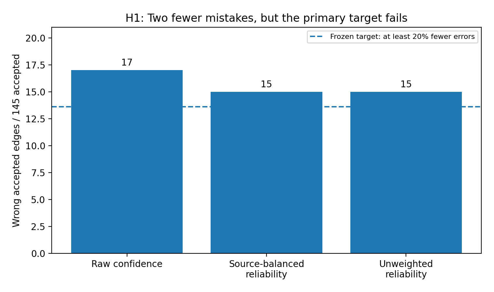

## 4. H2: Diminishing-return source diversification

The separate diversity policy repeatedly selects the positive prediction maximizing raw_score / (1 + already_selected_in_source), with raw-score and ID tie-breaking. It does not train on labels or change predictions. The premise is that spreading a limited acceptance budget across sources might improve useful coverage without sacrificing correctness.

| Accepted budget | Confidence: correct / wrong; groups / contaminated | Diverse: correct / wrong; groups / contaminated |
|---:|---:|---:|
| 100 | 92 / 8; 69 / 6 | 85 / 15; 98 / 15 |
| 125 | 114 / 11; 83 / 9 | 108 / 17; 98 / 15 |
| 145 | 128 / 17; 95 / 15 | 127 / 18; 98 / 15 |

At K=100, coverage rises from 69 to 98 represented groups (42.03%), but correct edges fall from 92 to 85. Retention is only 92.39%, below 98%. Contaminated groups increase from 6 to 15. H2 fails despite the favorable coverage count. At larger budgets the correctness penalty narrows, but no diagnostic budget replaces the primary test.

The mechanism is visible in the policy: a high-confidence second edge in one source can be displaced by a less reliable first edge in another. Coverage is a design preference, not a free accuracy gain. Source-group coverage is not graph-node recall, relationship diversity or recovered scientific knowledge. The ranking still consumes the same full single-rich acquisition budget.

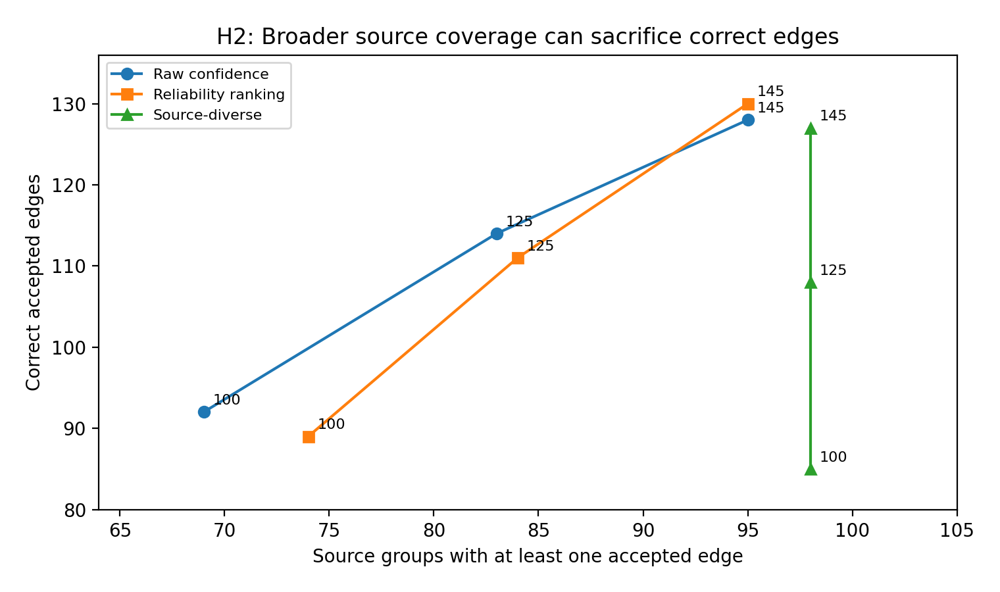

## 5. H3: Review allocation robust to dependence, conditional on valid marginals

For residual edge-error marginals q_i, the probability of any error in a group lies between max(q_i) and min(1, sum(q_i)). The prior independent estimate 1 - product(1-q_i) lies between those bounds. A review multiplies its edge marginal by 1-s, where assumed sensitivity s=0.75. Group-budget dynamic programming minimizes the sum of the upper envelopes. For a fixed review count within a group, reviewing its highest-risk edges minimizes the residual sum; enumerating all group counts then yields the exact global allocation for this supplied objective. This establishes optimality of the modeled allocation, not correctness of the supplied risks.

The development-only risk features and acquisition charges are unchanged from the previous independent-risk optimizer. False removal of a correct reviewed edge is assumed to be 0.05 and measured in the outcome simulation, not included in the allocation objective. Exact subset enumeration on 64 eight-edge fixtures finds zero objective failures. Enumeration of 64 four-edge joint distributions, including dependent errors, finds zero containment failures. These checks validate arithmetic under supplied marginals. A miscalibration control supplies four marginals of 0.01 although the actual union event has probability one: the computed upper envelope 0.04 is then invalid for truth. Removing an independence assumption cannot repair inaccurate marginal estimates.

| Reviews | Independent allocation: expected contaminated / correct | Robust allocation: expected contaminated / correct | Fitted upper envelope (both) |
|---:|---:|---:|---:|
| 10 | 12.7500 / 131.70 | 12.7500 / 131.70 | 4.5364 |
| 20 | 10.6875 / 131.35 | 12.1875 / 131.25 | 4.0978 |
| 30 | 9.1875 / 130.95 | 10.6875 / 130.85 | 3.8786 |
| 40 | 9.1875 / 130.45 | 9.1875 / 130.45 | 3.6593 |

At the primary budget 20, the robust allocation leaves 12.1875 expected contaminated groups, versus 10.6875, and retains 131.25 rather than 131.35 expected correct edges. H3 fails. Both allocations tie the fitted upper-envelope objective, so a different optimum can still be worse under the observed-label simulation. The fitted upper envelope near 4.10 is far below either simulation outcome; it is not a calibrated empirical upper confidence bound.

Risk-feature acquisition requires 1,274,247 recorded input tokens before reviewer cost. The stored sensitivity analysis crosses s in {0.5,0.75,1} with false-removal rates {0,0.01,0.05}, keeping selected IDs fixed. These are expectations under assumed independent reviewer detections, not measured human trials or guarantees about correlated reviewer mistakes.

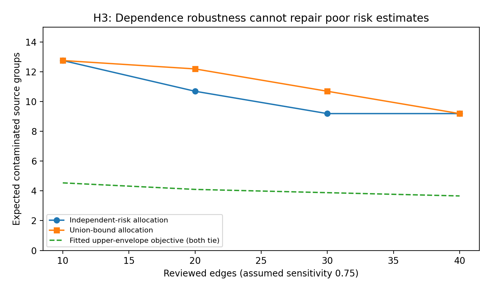

## 6. H4: Bounded exact inference over shared proof lineage

A sufficient proof is a conjunction of explicitly supplied primitive Bernoulli events. The accepted assertion is the disjunction of its sufficient proofs. The previous component bounds deduplicate and account conservatively for shared atoms, but can be too loose for admission. The refinement canonicalizes proof clauses, absorbs supersets, and applies Shannon decomposition: P(F) = p_a P(F | a=true) + (1-p_a) P(F | a=false). The most frequent atom is conditioned first, with lexical tie-breaking; canonical residual formulas are memoized. Shared proofs are never treated as independent witnesses.

The exactness follows by the law of total probability and independence of the supplied primitive atoms, not independence of clauses. This is an application of established Boolean/probabilistic inference rather than a newly invented theorem. [Darwiche and Marquis, A Knowledge Compilation Map](https://arxiv.org/abs/1106.1819) situates representation/tractability tradeoffs; [Fink, Han and Olteanu, Aggregation in Probabilistic Databases via Knowledge Compilation](https://arxiv.org/abs/1201.6569) provides related probabilistic-database context. Neither reference validates Jev scores as source reliabilities.

All 128 seeded eight-atom fixtures match full possible-world enumeration within 1e-10. All 512 duplicate/order checks pass. Eight larger shared-hub fixtures also match the analytic probability 0.99 * (1 - 0.5^(n-1)). Their atoms are the independent hub and leaves; proofs share the hub. The old lower bound stays 0.495 while exact probabilities exceed the 0.95 admission threshold.

| Primitive atoms | Old lower bound | Exact / analytic probability | Memoized states |
|---:|---:|---:|---:|
| 8 | 0.495000 | 0.982265625 | 10 |
| 16 | 0.495000 | 0.989969788 | 18 |
| 32 | 0.495000 | 0.990000000 | 34 |
| 64 | 0.495000 | 0.990000000 | 66 |
| 96 | 0.495000 | 0.990000000 | 98 |
| 128 | 0.495000 | 0.990000000 | 130 |
| 192 | 0.495000 | 0.990000000 | 194 |
| 256 | 0.495000 | 0.990000000 | 258 |

Across the 128 finite fixtures and eight analytic fixtures, exact inference recovers 16 oracle-valid admissions that the old lower bound would withhold, with 0 false admissions. H4 meets its controlled target. The endpoint counts fixtures, not newly discovered scientific graph edges. Values rounded to 0.99 in the table retain normal floating-point limitations; no symbolic exact-arithmetic claim is made.

The implementation caps supplied atoms at 256, input proofs at 512 and memoized residual states at 4,096. On input/state exhaustion it returns the prior valid bounds with nonexact status and no point probability. The one-state control returns [0.25,0.50], containing the exact probability 0.375. This finite cap is a safety boundary, not a polynomial-time guarantee for arbitrary Boolean formulas. A corrupted-lineage control declares two aliases of the same 0.9 event independent and obtains 0.99 instead of 0.9. Incorrect primitive identity or uncalibrated reliability can therefore invalidate apparently precise answers. Raw Jev confidence is not promoted to primitive reliability.

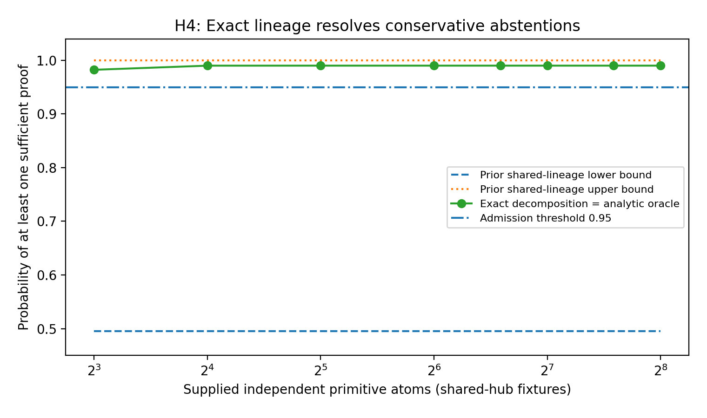

## 7. H5: Feedback-cutset conditioning for cyclic conflicts

The prior solver handled forest components by exact dynamic programming, cyclic components of at most 16 vertices by enumeration, and staged larger cycles. The refinement finds a bounded feedback set by repeatedly removing a deterministic maximum-degree vertex from the current cycle-containing 2-core. If at most four removals leave a forest, every independent assignment of the cutset is enumerated. For each assignment, selected cutset vertices exclude their neighbors and the residual forest is solved exactly. Maximizing across these assignments is exact for the supplied weighted independent-set problem because every feasible solution has one enumerated cutset assignment.

Cutset discovery is a heuristic: failing its four-removal cap does not prove that the graph lacks a smaller feedback vertex set. Such failures retain the prior solver behavior, including exact small-component fallback and explicit staging. Components over 256 vertices remain staged. No asymptotic improvement is claimed for conflict construction, and the generic graph backend does not establish that these cyclic topologies arise in a particular scientific corpus.

All 128 seeded ten-vertex graphs agree with exhaustive subset enumeration, have consistent selected sets, and never regress below prior utility. All 256 input-order checks pass. Sixteen large uniform/weighted cycles agree with an independently implemented two-path recurrence; the prior solver stages every one of them.

| Cycle vertices | Uniform: new / oracle | Weighted: new / oracle | Prior utility (both) |
|---:|---:|---:|---:|
| 17 | 8 / 8 | 60 / 60 | 0 |
| 24 | 12 / 12 | 84 / 84 | 0 |
| 32 | 16 / 16 | 114 / 114 | 0 |
| 48 | 24 / 24 | 171 / 171 | 0 |
| 64 | 32 / 32 | 221 / 221 | 0 |
| 96 | 48 / 48 | 333 / 333 | 0 |
| 128 | 64 / 64 | 447 / 447 | 0 |
| 256 | 128 / 128 | 882 / 882 | 0 |

H5 meets its controlled target. The 17-clique cap control stages all 17 vertices, and the 257-cycle control stages all 257. A semantic control offers two conflicting assertions with priorities nine and eight and marks the higher-priority assertion false. The exact solver still chooses the false assertion. Optimal priority retention and consistency are not factual validation. This extension changes research-only solvers, not the default graph compiler.

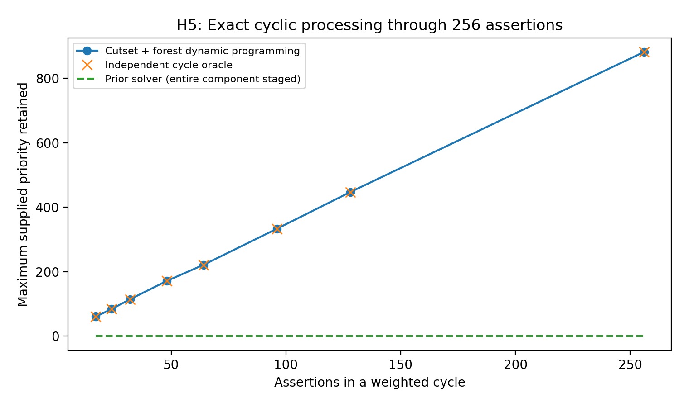

## 8. Uncertainty, limitations and next discriminating evidence

H1-H2 use 4,000 paired source-group bootstrap draws, seed 20260921. Fitted rankings and accepted IDs are fixed in each resample. Reported 95% and 99% percentile intervals are descriptive, not simultaneous; they omit fitting uncertainty and cannot undo prior test exposure. No result is an independent confirmatory p-value. Repeated model responses are not new independent labels, and source groups do not remove every possible dependency or public-corpus training overlap.

The strongest semantic lead is a small equal-volume ranking improvement, not a validated deployment policy. The strongest controlled improvements exploit structure already supplied to the algorithm. They require independently credible primitive reliabilities, correct provenance and well-specified conflict priorities. Larger candidate sets, diverse real graph topologies, externally adjudicated edge truth and fresh source-disjoint evaluations remain necessary before translating those gains into claims about Jev-assisted graph synthesis. A matched-evidence comparison with [KARMA](https://arxiv.org/abs/2502.06472) has not been run here.

A discriminating next semantic experiment should freeze the ranking before obtaining new independently adjudicated source groups, compare it with raw-confidence ranking at matched accepted volume and acquisition cost, and report source coverage alongside correct and wrong edges. A next systems experiment should preserve a real extracted provenance/conflict graph, blind its truth labels during policy selection, and measure cap/staging frequency and wall-clock cost. Those are future evidence requirements, not unexecuted results represented as complete.

### Concurrent study and overlap

PR #17 merged while this extension was executing. Both studies began from PR #16 and froze protocols independently before their own runs. Its small-lineage Shannon evaluator and four-vertex cycle-cutset solver overlap with H4/H5 here; those mechanisms are not claimed as new relative to PR #17. H4 here additionally tests exact shared-hub formulas through 256 atoms, whereas that implementation caps each exact component at 16 atoms. H5 supplies a separate implementation and a different sixteen-cycle fixture grid, not a new optimization mechanism. The two studies reuse the same semantic capture and their sample counts or outcomes must not be pooled as independent evidence. Both reports and all original artifacts are preserved in the integrated manuscript.

## 9. Reproduction and claim audit

Run `python -B -m graph_synthesis.structural.run --check` to reconstruct inputs and reproduce all five outcomes without service access. Run `python -B -m unittest discover -s graph_synthesis/structural/tests -v` for implementation regressions. Run `python -B -m graph_synthesis.structural.report --figures --update-paper` to regenerate this report, five PNG/SVG figures and the additive current-paper section. The shared renderer then builds the full HTML/PDF, and its build record binds manuscript, renderer and PDF SHA-256 hashes.

`results.json` retains fitted parameters, selected IDs, all finite fixtures, oracle outputs, control failures, descriptive intervals and reviewer sensitivities. `summary.csv` records all equal-volume policy comparisons. `artifact-manifest.json` binds extension files without rewriting archived evidence. [CLAIM_EVIDENCE.md](../graph_synthesis/structural/CLAIM_EVIDENCE.md) maps each conclusion to its evidence and forbidden extrapolation. Environment files distinguish local execution from CI. The original 161-file study and earlier extension outputs remain intact. The full manuscript remains an author-review draft.

<!-- STRUCTURAL_RESEARCH_END -->

<!-- SOURCE_STRUCTURAL_RESEARCH_START -->

# Source risk, review budgets and structural certificates for Jev graph synthesis

Timothy Wayne Gregg | AI-assisted author-review research extension | September 18, 2026

## Abstract

Five follow-up hypotheses test whether the limitations exposed by PR #17 can be reduced. Direct source-event shrinkage increases evaluation Brier from 0.128923 to 0.138249; the calibration target is not met. Setup-cost-aware review leaves 12.1875 expected contaminated groups versus 11.4375 for greedy review at the same hypothetical budget; its target is not met. Frontier lineage evaluation, certified bipartite conflict optimization and revision-checked source invalidation meet their controlled algorithmic targets. The cache reduces fact reevaluations by 98.83% on local updates, but by 0.00% when a shared source affects every fact. These are replay, simulation and algorithm results, not new Jev calls, human-review measurements or independent semantic validation.

## 1. Research questions and frozen evaluation

The [preceding reliability study](../graph_synthesis/reliability/RESULTS.md) found that a group-risk multiplier improved mean bias but worsened Brier, and that single-view review features could save acquisition tokens. Its structural experiments also exposed a 16-atom lineage boundary, a four-vertex conflict-cutset boundary, and update-locality limits. This extension changes the risk model, explicitly prices review setup, and broadens the tractable structural cases. It applies established shrinkage, dynamic programming, max-flow/min-cut and dependency indexing rather than claiming a new mathematical algorithm.

The [protocol](../graph_synthesis/source_structural/PROTOCOL.md) was committed before execution as `b92009c6c36d87d9f3cbf0c92c2dad9f9615d726`, against baseline `a62a3257645d8e35cd4e45be53bfa9511d27724b`. Previous evaluation outcomes informed the hypotheses: this is an exploratory, pre-execution commitment, not an independent preregistration. H1/H2 reuse 73 development candidates in 40 connected source groups and 263 evaluation candidates in 149 groups. The original claim/document/duplicate-abstract grouping is preserved. A source group is not necessarily one document. In H2, setup is therefore charged per connected group, not per physical document opened. These hypothetical units cannot establish actual reviewer costs.

Raw responses and input hashes are verified before reconstruction. Development and evaluation groups are disjoint; policy inference receives no evaluation gold. **Fresh service calls: 0.** Earlier public test-set inspection still prevents independent confirmation. No production graph policy is changed.

Concurrent integration: [PR #18](https://github.com/CompleteDotTech/paper-package/pull/18) merged during this extension. Its [structural refinement study](../graph_synthesis/structural/RESULTS.md), frozen protocol and executed evidence are preserved unchanged. Its source-balanced ranking, source-diverse acceptance, dependence-robust review, shared-hub lineage and feedback-cutset tests are separate from the direct source-event, setup-budget, frontier, bipartite-flow and source-cache hypotheses here. Both studies reuse the same semantic capture and must not be pooled as independent observations. No hypothesis, threshold or numerical result here was retuned after viewing PR #18.

| Hypothesis | Frozen primary criterion | Outcome | Evidence class |
|---|---|---|---|
| H1: Direct source-event shrinkage | 10% lower Brier than both prior models; absolute bias <=0.03 | Not met | Archived prediction scoring |
| H2: Setup-cost-aware review | At least 0.5 fewer expected contaminated groups; <=0.1 extra correct removals; budget respected | Not met | Label-evaluated review simulation |
| H3: Frontier-bounded lineage | No finite-oracle or invariance errors; ten large analytic cases exact; one interval tightened | Met | Supplied independent-event model |
| H4: Certified bipartite conflict solving | No small-case regression; ten certified large optima; at least four utility gains | Met | Supplied conflict graphs and priorities |
| H5: Revision-checked evidence cache | No stale values or atomicity failures; at least 90% fewer local fact reevaluations | Met | Sequential in-memory mutations |

Passing three algorithmic targets does not amount to a three-out-of-five semantic success rate. The two unsuccessful predictive/review hypotheses and all assumption-breaking controls remain part of the results.

## 2. H1: Direct source-event shrinkage

The response variable is whether a connected group contains any incorrect base1-accepted SUPPORTS or REFUTES edge. Empty accepted groups are excluded. The proposed estimator uses two binary features: at least two accepted edges, and any accepted score below 0.90 (a missing score is treated conservatively as low). For cell c, the estimate is (errors_c + alpha * prior)/(n_c + alpha), with a Beta(1,1)-smoothed global group-error prior. Alpha is chosen from {1,4,16} by leave-one-development-group-out Brier; exact ties favor stronger shrinkage. This targets the group event directly instead of multiplying estimated edge-correctness probabilities.

| Model | Brier | Log loss | Predicted risk | Observed risk | Bias |
|---|---:|---:|---:|---:|---:|
| Prior product | 0.128923 | 0.467074 | 8.04% | 15.31% | -7.26% |
| Prior scaled product | 0.134900 | 0.441344 | 13.64% | 15.31% | -1.67% |
| Direct source event | 0.138249 | 0.484622 | 8.49% | 15.31% | -6.81% |

There are 23 nonempty development groups and 98 nonempty evaluation groups. The chosen alpha is 4; the preceding development-selected multiplier is 2. Direct-minus-product Brier has descriptive 95% interval [-0.0140, +0.0363] and 99% interval [-0.0199, +0.0447]. Against the scaled product, the intervals are [-0.0326, +0.0432] and [-0.0429, +0.0574]. Neither a lower Brier nor the required bias is achieved: **not met**.

The small number of contaminated development groups makes cell estimation difficult. Directly predicting the desired event is a plausible modeling choice, but it is not a guarantee of better calibration. This experiment does not justify deploying the new estimator.

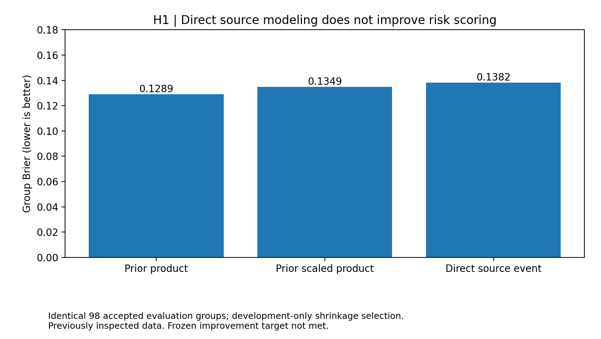

## 3. H2: Review allocation with group setup costs

Both policies use the preceding single-view edge-risk fit. The comparator follows its group-aware greedy edge order and admits each edge only if the remaining budget covers the edge plus any newly required group setup. The proposed multiple-choice knapsack offers each group either no review or its top-k risk-ranked edges. It maximizes the increase in predicted group-clean probability under independent edge errors and independent reviewer detection. Gold labels enter only the subsequent outcome calculation. The optimizer is exact over these prefix options, not over every possible human review action.

The primary budget is 40 units: opening a connected group costs 2 and reviewing one edge costs 1. Detection is 0.75 and false removal of a correct reviewed edge is 0.01. These parameters are supplied assumptions, not observed reviewer behavior. Expected contamination counts a group if at least one incorrect accepted edge remains; a reviewer cannot add an omitted correct edge.

| Policy | Spent | Reviewed | Wrong reviewed | Expected contaminated groups | Expected correct removals |
|---|---:|---:|---:|---:|---:|
| Group-greedy | 40 | 14 | 6 | 11.4375 | 0.08 |
| Source-batched knapsack | 40 | 18 | 5 | 12.1875 | 0.13 |

The proposed policy reviews more edges but leaves 0.75 more expected contaminated groups, not at least 0.5 fewer. Its primary target is **not met**. The proposed-minus-greedy expected contamination-rate difference has descriptive 95% interval [+0.0000, +1.5101] pp and 99% interval [+0.0000, +2.0134] pp across all 149 evaluation groups.

There are 0 failures in 64 independently enumerated small knapsack tests and 0 budget violations in 108 fixed sensitivity scenarios. The full grid crosses budgets {20,40,80}, setup costs {0,1,2,5}, detection {0.5,0.75,1} and false removal {0,0.01,0.05}. A perfectly correlated within-group detection control gives 12.00 versus 11.25 expected contaminated groups at the primary setting. It also fails to reverse the unfavorable ordering.

Both policies use the same 941,809 recorded single-view input tokens, charged separately from hypothetical review units. Correct optimization of a misspecified risk objective need not improve label-evaluated outcomes. No human-time, dollar-cost, reviewer-quality or semantic noninferiority claim follows.

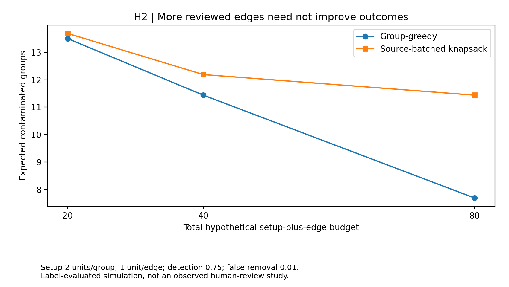

## 4. H3: Frontier-bounded exact lineage

A fact is a disjunction of proof conjunctions over supplied independent Bernoulli primitives. After removing duplicate and subsumed proofs, the proposed iterative dynamic program processes sorted primitive IDs. It remembers only processed atoms used in unfinished proofs. Once a proof succeeds, its probability mass is absorbed into the success total, preventing double-counting of shared evidence. Constants, impossible primitives and certain primitives are explicit cases. This is a bounded-width inference strategy, not an assertion that document sources are independent.

The new path caps used atoms at 256, canonical proofs at 1,024, frontier width at 12 and state transitions at 65,536. Exceeding a cap delegates to the previous small-component exact/bounded routine. Partially evaluated mass is never reported as an exact answer. These caps bound the new frontier evaluation, not all validation, canonicalization or fallback work.

Independent assignment enumeration finds 0 errors beyond 1e-12 on 192 random fixtures with 2-10 atoms. There are 0 failures in 768 order/duplicate checks and 0 false lower-bound admissions at threshold 0.95. All 10 large path/cycle cases match an independent no-adjacent-success recurrence; 10 tighten the previous interval. The primary controlled target is **met**.

| Lineage | Atoms | Prior interval | Exact probability | Frontier width | Transitions |
|---|---:|---|---:|---:|---:|
| path | 17 | [0.0100, 0.1600] | 0.137675 | 1 | 66 |
| path | 32 | [0.0100, 0.3100] | 0.248938 | 1 | 126 |
| path | 64 | [0.0100, 0.6300] | 0.440647 | 1 | 254 |
| path | 128 | [0.0100, 1.0000] | 0.689753 | 1 | 510 |
| path | 256 | [0.0100, 1.0000] | 0.904556 | 1 | 1022 |
| cycle | 17 | [0.0100, 0.1700] | 0.144922 | 2 | 124 |
| cycle | 32 | [0.0100, 0.3200] | 0.255250 | 2 | 244 |
| cycle | 64 | [0.0100, 0.6400] | 0.445348 | 2 | 500 |
| cycle | 128 | [0.0100, 1.0000] | 0.692361 | 2 | 1012 |
| cycle | 256 | [0.0100, 1.0000] | 0.905358 | 2 | 2036 |

Each large fixture uses primitive probability 0.1 and adjacent-pair proofs. Dense 17-atom lineage triggers the width fallback; a 257-atom input and a deliberately tiny state budget exercise other guards. The shared-source control still yields 0.96 instead of the actual 0.8 when one source is incorrectly encoded as two independent primitives. Better exact inference cannot repair false provenance, and the supplied probabilities are not calibrated Jev truth probabilities.

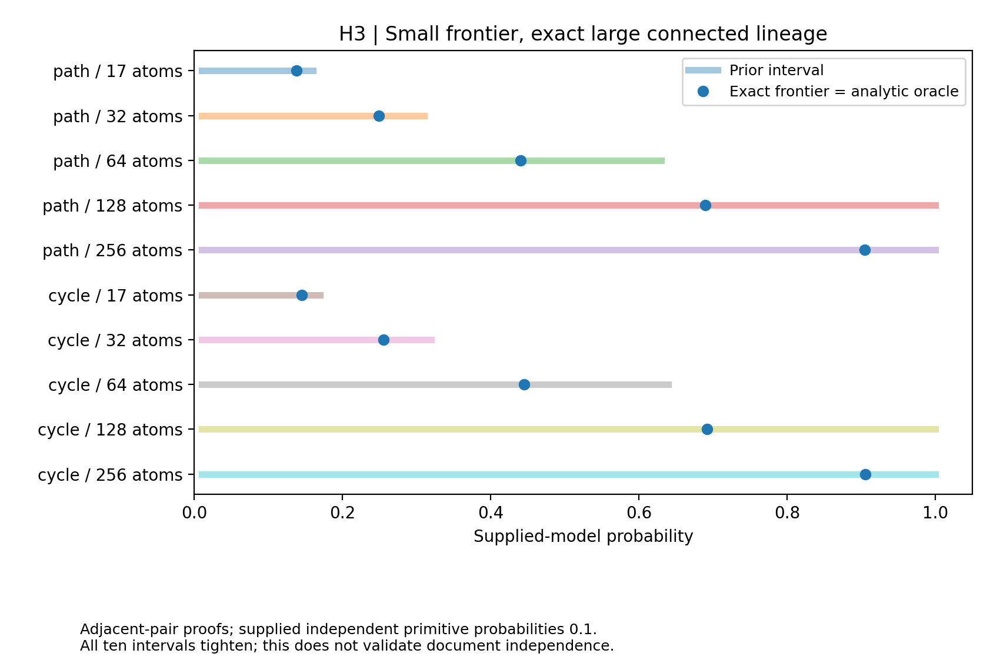

## 5. H4: Certified bipartite conflict optimization

The input is an explicit undirected conflict graph with nonnegative integer priorities. On a bipartite component, maximum-weight independent set is reduced to minimum-weight vertex cover and solved by an integer max-flow/min-cut routine. The result includes a feasible flow and a vertex cover of equal weight. A separate verifier checks endpoints, capacities, conservation, cover feasibility, selection consistency and objective equality. This certificate proves the supplied combinatorial objective, not the truth of selected assertions.

Components remain capped at 256 vertices. Nonbipartite components delegate to the preceding cycle-cutset policy. A 2,000,000 residual-edge-inspection budget bounds the new flow solver; exhaustion delegates rather than certifying an unfinished answer. No external graph-system benchmark or extracted real-world conflict graph is substituted for these controlled cases.

There are 0 finite-oracle/consistency/regression failures among 192 random small graphs and 0 failures in 768 input-order checks. All 10 large cases attain independently known optima with valid certificates; 10 improve supplied utility over the prior staging policy. The primary controlled target is **met**.

| Conflict family | Vertices | Prior utility | Certified utility | Analytic optimum |
|---|---:|---:|---:|---:|
| grid | 25 | 0 | 13 | 13 |
| grid | 36 | 0 | 18 | 18 |
| grid | 64 | 0 | 32 | 32 |
| grid | 144 | 0 | 72 | 72 |
| grid | 256 | 0 | 128 | 128 |
| complete_bipartite | 18 | 0 | 45 | 45 |
| complete_bipartite | 32 | 0 | 80 | 80 |
| complete_bipartite | 64 | 0 | 160 | 160 |
| complete_bipartite | 128 | 0 | 320 | 320 |
| complete_bipartite | 256 | 0 | 640 | 640 |

Square grids use unit priorities and have optimum ceil(vertices/2). Complete balanced bipartite fixtures use priority 5 on one side and 3 on the other, with optimum five times the side size. These are specifically tractable families that exceeded the preceding four-cutset allowance, not representative samples of arbitrary graph-synthesis conflicts. Dense nonbipartite 17-clique staging, zero priorities, invalid inputs, work-budget exhaustion and damaged flow certificates are retained as controls. A false assertion of priority 9 still defeats a conflicting true assertion of priority 8; structural optimality is not factual accuracy.

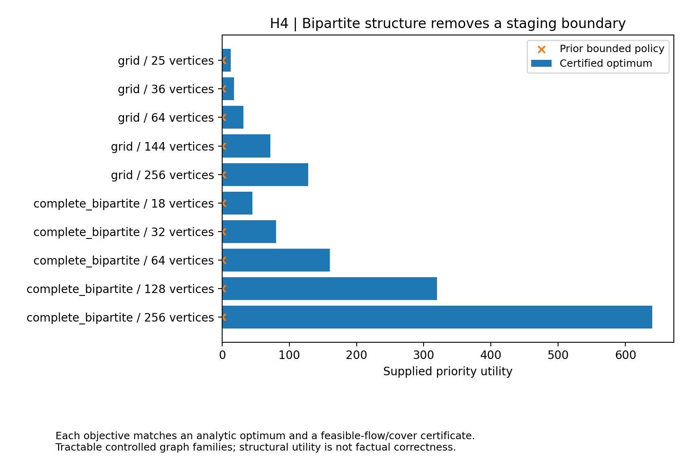

## 6. H5: Revision-checked evidence invalidation

The prototype indexes each primitive to the facts whose canonical proofs depend on it. Probability changes reevaluate only those facts; proof replacement, insertion and deletion maintain the reverse index. Revocation is an explicit probability-zero update. Optimistic revision checks, input validation and all potentially failing evaluations run before state mutation. Stale revisions, invalid changes and injected evaluation failures are rejected without changing the prior snapshot. This is sequential in-memory behavior, not concurrent database isolation, crash recovery or durability.

Across 640 seeded source/proof/fact mutations, explicit retraction and restoration controls, and both work-count workloads, there are 0 cache/full-recomputation mismatches. All 7 atomic rejection controls pass. The primary controlled target is **met**.

| Workload | Facts | Updates | Full evaluations | Incremental evaluations | Reduction | Index touches |
|---|---:|---:|---:|---:|---:|---:|
| Local source updates | 128 | 256 | 32,896 | 384 | 98.83% | 896 |
| Global shared source | 128 | 16 | 2,176 | 2,176 | 0.00% | 2,448 |

Both counts include the cold build. Each local fact has two proofs over three private primitives; the global control makes every fact depend on one shared source. Dependency-index touches count index construction/maintenance separately. These metrics omit general interpreter, allocation, validation and snapshot-comparison work; no matching percentage reduction in total CPU time, database I/O or service latency is claimed. A fact reevaluation can itself have variable lineage complexity.

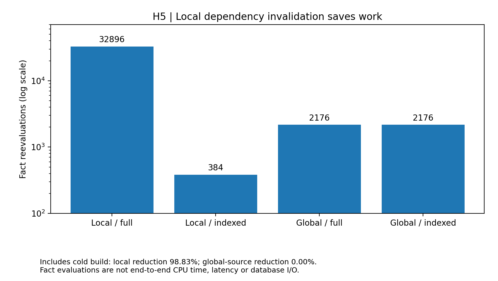

## 7. Interpretation and limits

H1/H2 use 4,000 paired source-group bootstrap draws, seed 20260922, with fixed fitted models, chosen hyperparameters and review selections. The 95% and 99% percentile intervals are descriptive, non-simultaneous and omit fitting uncertainty. H1 uses the 98 identical nonempty accepted evaluation groups; H2 uses all 149 groups. Earlier reuse of these evaluation labels means the intervals are not prospective validation of hypotheses selected from previous results.

The central finding is a separation: broader exact structural inference and safe local invalidation are achievable under supplied assumptions, while better source-risk estimates and useful cost-aware review are not established by these data. The structural methods remain opt-in research infrastructure. They do not remedy missing candidate edges, wrong relation qualifiers, correlated Jev errors, false provenance or untrustworthy priorities. A future semantic study should freeze policy before seeing an independently adjudicated, source-disjoint corpus, use matched information/resource budgets, and measure actual reviewer behavior and end-to-end latency. No advantage over KARMA or another external system is established here.

## 8. Reproduction and attribution

```bash
python -B -m graph_synthesis.source_structural.run
python -B -m unittest discover -s graph_synthesis/source_structural/tests -v
python -B -m graph_synthesis.source_structural.run --check
python -B -m graph_synthesis.source_structural.report --figures --update-paper
python -B -m graph_synthesis.render_current_paper --output manuscript/paper-current.pdf
```

The [machine-readable results](../graph_synthesis/source_structural/results.json) contain folds, fitted cell counts, individual group probabilities, review selections, all sensitivity settings, finite/analytic oracles, flow certificates, mutation traces and source hashes. The [summary table](../graph_synthesis/source_structural/summary.csv), five SVG/PNG figure pairs and this report are generated from those results. The extension manifest binds code, evidence, figures and captured validation logs; the current paper has a separate build manifest. The original frozen study and all previous executed sections are preserved.

Primary-source context: [TypeSafe documentation](https://docs.typesafe.ai/introduction) describes typed decisions and probability outputs; [Amarilli et al., Connecting Knowledge Compilation Classes and Width Parameters](https://arxiv.org/abs/1811.02944) provides bounded-width knowledge-compilation context; the [NetworkX minimum-cut documentation](https://networkx.org/documentation/stable/reference/algorithms/generated/networkx.algorithms.flow.minimum_cut.html) states the max-flow/min-cut relation. These sources motivate established techniques, not the numerical results reported here. Our finite and analytic checks are included in the repository; no claim of mathematical novelty is made.

<!-- SOURCE_STRUCTURAL_RESEARCH_END -->

<!-- ASSUMPTION_AWARE_RESEARCH_START -->

# Assumption-aware graph synthesis: five falsifiable follow-up experiments

Timothy Wayne Gregg | AI-assisted author-review research extension | September 18, 2026

## Abstract

The expanded Jev research distinguishes better typed decisions from stronger graph infrastructure. This follow-up tests five responses to unresolved limitations in PR #17: dependence-robust probability envelopes, answers invariant across optimal repairs, query-exposure-weighted review, connected-tree delta updates, and grounded cyclic provenance. Marginal-only probability envelopes reduce mean uncertainty width by 4.96%, missing the frozen 10% target. Query-weighted review also fails: at 20 idealized reviews, weighted residual contamination rises from 50 to 63, while contaminated source groups rise from 8 to 11. The three other controlled targets are met. Connected balanced-tree DP visits fall by 97.63%; agenda-indexed grounding reduces counted dependency inspections by 94.28%. These are bounded supplied-input engineering results, not new semantic accuracy, independent validation, external-system superiority, or production readiness. **Fresh Jev calls: 0.**

## 1. Motivation, scope and novelty boundary

The [preceding reliability study](../graph_synthesis/reliability/RESULTS.md) tightened lineage under assumed independence, but its deliberately false independence input still inflated 0.8 to 0.96. Its exact conflict optimizer could select a false high-priority assertion. Its component cache saved no solver work on the connected stress graph. Its single-view review economy did not establish effectiveness on an observed query workload. These limitations motivate changing the admissible assumptions and query semantics rather than simply asking the same model more times.

The [frozen protocol](../graph_synthesis/assumption_aware/PROTOCOL.md) was committed as `82ee57229570bb9f7299e0418a5f9b959c25d59f` against baseline `a62a3257645d8e35cd4e45be53bfa9511d27724b` before implementation and execution. Prior findings informed hypothesis choice. This is exploratory follow-up, not independent preregistration. H3 reuses 73 development cases in 40 groups and 263 evaluation cases in 149 groups; no new holdout is claimed. Raw-response reconstruction, unique identities, source-group separation and input hashes are checked before scoring. The policy receives no evaluation gold. Algorithm fixtures in H1/H2/H4/H5 are generated from the committed seeds, and all successful, unsuccessful and assumption-breaking cases remain in [results.json](../graph_synthesis/assumption_aware/results.json).

These five combinations were not found as executed suites in the audited baseline implementation. They are **not claims that the underlying ideas have never been attempted anywhere**. Probability envelopes already use linear programming in probabilistic satisfiability ([Hansen and Perron](https://doi.org/10.1016/j.ijar.2007.03.001)); all-repair semantics are established ([Staworko et al.](https://arxiv.org/abs/0908.0464)); utility-oriented KG auditing has prior empirical work ([Marchesin et al.](https://doi.org/10.1609/hcomp.v12i1.31605)); tree dynamic programming is established ([Gupta et al.](https://arxiv.org/abs/2305.03693)); and recursive materialisation maintenance is established ([Hu et al.](https://doi.org/10.1609/aaai.v32i1.11554)). The [novelty audit](../graph_synthesis/assumption_aware/NOVELTY.md) states the narrower integration differences and search limitations. No external implementation is benchmarked here.

| ID | Proposed improvement | Frozen target | Evidence class |
|---|---|---|---|
| H1 | Dependence-robust lineage envelopes | not met | Controlled supplied-input algorithm |
| H2 | Ambiguity-preserving repair answers | met | Controlled supplied-input algorithm |
| H3 | Query-exposure-weighted review | not met | Captured decisions + synthetic exposure + simulated review |
| H4 | Connected-tree delta messages | met | Controlled supplied-input algorithm |
| H5 | Grounded cyclic provenance | met | Controlled supplied-input algorithm |

A target pass establishes only its stated conjunction on its stated population. The pass count is not a semantic success rate. Failed targets are not rescued by changing thresholds or promoting a favorable sensitivity panel.

## 2. H1: Dependence-robust lineage envelopes

**Theory.** Let each world assign truth values to primitive source events. A nonnegative world-mass vector must normalize to one and match supplied marginals; optional pairwise intersections add constraints. For a fact supported by a disjunction of conjunctive proofs, minimize and maximize the sum of masses in satisfying worlds. Every supplied-compatible joint distribution lies between these extrema. Unlike an independent-events point estimate, the feasible family permits perfect source dependence. Primitive probabilities and any intersections are supplied assumptions, not measured Jev truth probabilities.

The comparator canonicalizes duplicate and subsumed proofs, applies marginal Frechet conjunction bounds and then union bounds. The bounded LP uses at most eight atoms (256 worlds), capped iterations, primal feasibility checks, dual-inequality residual correction and outward numerical allowance. Endpoint witnesses are saved and independently checked against constraints. Above the atom cap it returns conservative marginal bounds and explicit non-optimized status. Infeasible constraints, failed solves or failed verification stage with [0,1]. Floating-point residual checks are **not formal exact-arithmetic certificates**. Broader probability-envelope optimization is not generally cheap; [Kaski et al.](https://arxiv.org/abs/2605.03556) discuss the hardness of optimal union intervals.

**Frozen test.** Seed 20260922 generates 128 arbitrary joint distributions over two to six atoms and one to eight proofs. The joint masses are generated separately from both bounding algorithms. Require zero truth-containment errors beyond 1e-7, zero false lower-bound admissions at 0.95, zero order/duplicate errors, and at least 10% lower mean width than the Frechet baseline. The pairwise-constrained panel is a sensitivity analysis, not the primary target.

| Envelope | Mean width | Role |
|---|---:|---|
| Canonical Frechet | 0.359405 | Primary comparator |
| Marginal-only LP | 0.341587 | Primary proposal |
| Pairwise-constrained LP | 0.088167 | Additional-information sensitivity |

Across 256 containment checks there are 0 failures, 0 false admissions and 0 saved-witness feasibility failures. There are 0 errors in 512 invariance checks. The primary width reduction is 4.96%, so the target is **not met** despite those correctness checks passing.

**Falsification controls.** Two names for one actual 0.8-probability source produce 0.96 under independent OR aggregation. The marginal envelope is [0.8,1] and does not admit at 0.95. Correct shared identity yields 0.8. Supplying mutually exclusive 0.5 events yields an OR probability approximately one; incoherent intersections stage rather than returning a confident value. Empty, tautological, zero/one and over-cap inputs are retained. Unknown dependence is representable, but false marginals or missing primitive events still defeat semantic validity.

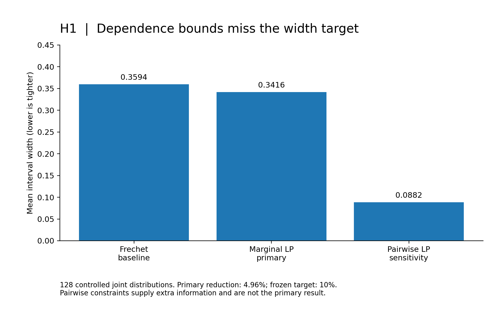

## 3. H2: Ambiguity-preserving answers over optimal repairs

**Theory.** A deterministic tie-break gives one repair, not a fact valid in every repair. Let V be maximum supplied priority. An assertion selected in one optimum is forced precisely when forbidding it lowers V. An OR query is entailed by every optimum precisely when forbidding every queried assertion lowers V. An AND query requires each member to be forced. This tests entailment relative to a supplied optimization model, not truth of the assertions. A false query result means 'not entailed by all optima', not 'false in all worlds'.

The method reuses PR #17's bounded optimizer as a value oracle, with at most 1,024 vertices across components and 1,024 oracle calls. Its existing component/cutset caps remain in force. Any unresolved relevant solve yields unknown or partial status, never an unsupported certificate. Zero priorities, empty queries, repeated edges and deterministic order are handled explicitly.

**Frozen test.** On 128 random graphs with four to ten vertices, seed 20260923, integer priorities zero through five and edge probability 0.3, an independent combinations enumerator retains every maximum-priority consistent subset. It checks optimum utility, forced assertions and OR/AND answers. Require no mismatches, full retention on unique optima, and on 32 equal-priority conflicting pairs require every pair disjunction but no individual assertion.

The test records 0 oracle disagreements and 0 order failures. All 66 unique-optimum cases retain their selected assertions. Across random fixtures, a single repair contains 444 assertions; 388 are forced, retaining 87.39%. This lower assertion coverage is an intentional refusal to invent certainty, not a recall improvement. The random fixtures require 1,084 solver calls in total. The target is **met**.

The 32-pair control has 2^32 optima. The method certifies all 32 disjunctions without enumerating those optima and certifies no individual member. The 17-clique control stages. A false assertion with priority nine against a true assertion with priority eight remains forced: repair invariance cannot repair a misleading priority function. No better Jev edge accuracy follows.

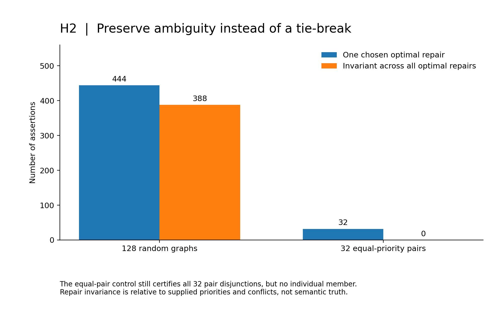

## 4. H3: Query-exposure-weighted review

**Theory.** The preceding single-view risk estimator offers a cheap review signal, but review utility could depend on downstream exposure. The proposal multiplies each expected source-contamination reduction by a fixed exposure weight. The product-based contamination model and tie-by-ID rule otherwise match the PR #17 single-view group-aware comparator. This adds a workload model, not model calls or evidence.

Exposures are deliberately synthetic: one plus the SHA-256 integer of `query-exposure-v1:` concatenated with the source-group ID, modulo ten. They are fixed without evaluation gold. Uniform and reversed weights are sensitivity panels. They are not observed queries, independently sampled deployments or new datasets. All policies use the same development-only risk fit, accepted pool and 941,809 recorded input tokens. The primary reviewer perfectly removes a reviewed wrong edge and never removes a correct edge; detection rates 0.5, 0.75 and 1 are scenario analyses, not human observations.

**Frozen test.** At 20 edge reviews require at least 10% lower weighted residual contaminated-source exposure with no increase in unweighted contaminated groups. An exposure unit is one synthetic weight attached to a contaminated source group. Outcomes at four budgets are shown below; correct retained edges remain 132 at the primary budget for both methods.

| Review budget | Baseline exposure | Proposed exposure | Baseline contaminated groups | Proposed contaminated groups |
|---:|---:|---:|---:|---:|
| 10 | 73 | 73 | 12 | 12 |
| 20 | 50 | 63 | 8 | 11 |
| 30 | 24 | 54 | 4 | 10 |
| 40 | 24 | 37 | 4 | 8 |

At budget 20, the weighted outcome changes from 50 to 63, a relative reduction of -26.00%; the negative reduction means deterioration. Contaminated groups change from 8 to 11. The target is **not met**. Uniform exposure reproduces the baseline order: True. The hypothesis's apparent objective alignment is insufficient when estimated risks, group interactions and imposed exposure weights do not rank realized errors well.

The paired source-group bootstrap uses 4,000 draws with seed 20260924, fixed fit and review sets, and recomputed exposure denominators in each draw. Proposed-minus-baseline weighted contamination rate has a 95% interval [-2.0768, +4.9289] percentage points and a 99% interval [-3.1182, +6.3003] percentage points. These descriptive, non-simultaneous intervals omit fitting and workload uncertainty, and include zero. No statistically resolved harm or benefit on a new population is asserted. The frozen point-target failure remains a failure.

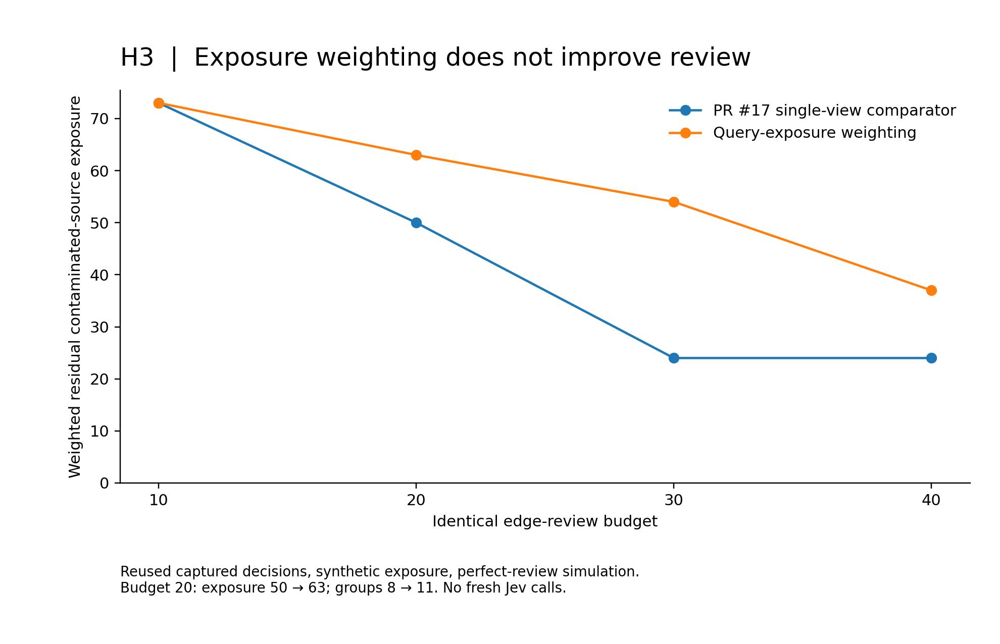

## 5. H4: Delta messages inside a connected tree

**Theory.** Component-level caching discards all work when any weight changes inside a connected component. On a fixed rooted tree, an include value is its vertex priority plus children's exclude values; an exclude value sums the larger child value. Cache these aggregates. A changed weight can affect only its ancestor path. Propagate child-value deltas, stopping when a message is unchanged. Validation and initial rooting occur once; structural edits are explicitly unsupported and rejected without mutation.

**Frozen test.** The primary connected binary tree has 255 vertices and 256 seeded weight updates, seed 20260925. Cold-build work is included for both methods. Compare utility to independent full-tree DP after every update, and check a reconstructed selected set for consistency and summed utility. Additionally, 128 small random trees with eight updates each are checked against exhaustive subset enumeration. Require zero disagreements and at least 75% fewer DP vertex visits on the balanced workload.

| Topology | Full DP visits | Delta DP visits | DP reduction | Reconstruction visits per policy |
|---|---:|---:|---:|---:|
| Balanced, primary | 65,535 | 1,556 | 97.63% | 65,535 |
| Path, control | 65,535 | 17,474 | 73.34% | 65,535 |

There are 0 small-tree failures across 1,024 updates, and 0 failures on the two large workloads. The primary target is **met**. Invalid weight/structural updates preserve state; repeated identical weights visit zero DP nodes.

**Cost boundary.** Reconstruction traverses the whole tree on demand. The cold reference computes the optimum value; the accounting charges it the same full-tree reconstruction traversal measured for the delta implementation. Counting both DP visits and these eager reconstruction visits reduces the balanced improvement to 48.81% and the path improvement to 36.67%. These sums are transparent operation accounting, not uniform CPU-cost models or measured latency. Tall paths, changing topology and consumers demanding a complete repair after every update limit the gain. No corresponding reduction in service cost, database I/O or arbitrary-graph maintenance is established.

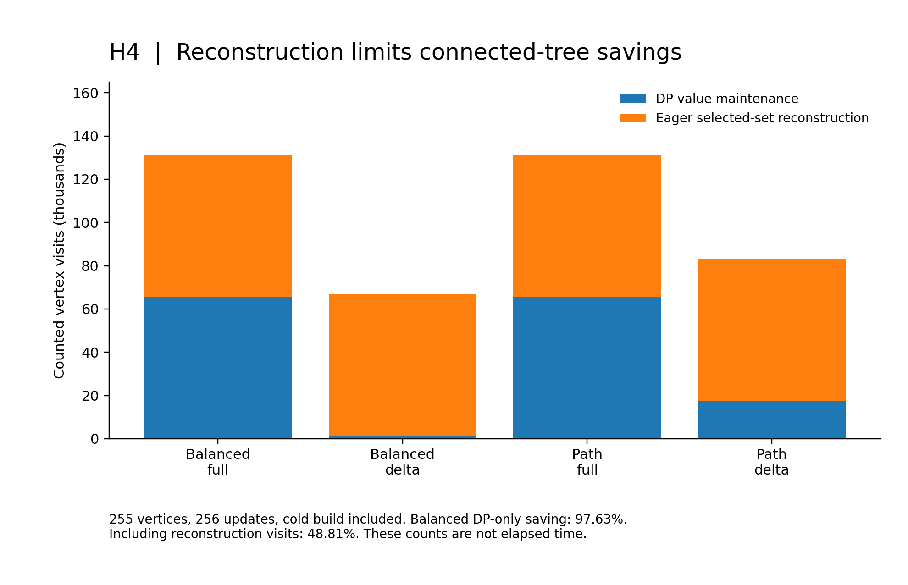

## 6. H5: Grounded cyclic provenance after retraction

**Theory.** Old derived facts must not become their own external justification. Start a positive Horn closure only from supplied external facts and empty-body axioms. Index each body occurrence by its prerequisite fact, initialize remaining-body counters, and activate a rule once all body members are grounded. Each newly grounded fact enters an agenda once. After a source change, recompute closure from current external facts, not from the previous derived closure.

This differs from the repository's earlier cascading prerequisite invalidation by preserving alternative positive supports while preventing unsupported cycles from surviving. It is nevertheless an implementation of established least-fixed-point grounding, not a new Datalog deletion algorithm. The strong comparator is a cold, repeated full-scan closure. A deliberately unsafe warm-start comparator is used only to expose circular self-support, not as the sole correctness or efficiency baseline. The prototype is in-memory, with caps of 4,096 facts, 8,192 distinct rules and 65,536 body occurrences.

**Frozen test.** Seed 20260926 generates 128 rule systems with four to twelve facts and eight source toggles each. Every closure is checked against independent cold scanning. The primary work test has 64 eight-rule chains in adversarial order and 128 source toggles, including cold setup. Require zero closure mismatches, no unsupported survivors in withdrawn-cycle controls, and at least 75% fewer dependency inspections.

| Workload | Full-scan inspections | Indexed inspections including index build | Reduction | Separate rule-counter initializations |
|---|---:|---:|---:|---:|
| Sparse chains, primary | 590,336 | 33,792 | 94.28% | 66,048 |
| Dense dependency control | 6,240 | 2,400 | 61.54% | 4,080 |

The random systems have 0 closure mismatches in 1,024 updates. The work panels also have 0 mismatches. Removing the only external seed clears a two-fact cycle; providing an independent alternate seed preserves its consequences. Pure unseeded cycles derive nothing. Empty-body axioms, self-loops and duplicate rules have explicit regression tests. Unknown external facts are rejected atomically. The target is **met**.

The indexed engine still initializes every rule counter after each update. It is a faster bounded cold recomputation under the stated work metric, **not** dependency-local incremental deletion, distributed transaction support or a measured DRed comparison. False external facts still ground false consequences. Correct grounding means derivable from supplied facts and rules, not verified real-world truth.

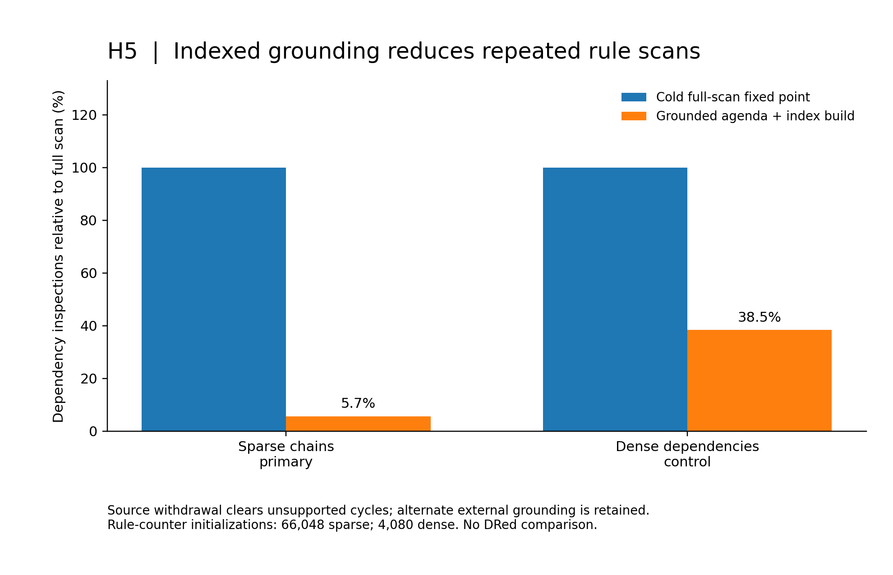

## 7. Research implications and limitations

The most defensible new knowledge is about failure boundaries. Marginal-only dependence reasoning can prevent unjustified point confidence, but did not deliver the frozen width improvement. Adding workload importance to a weakly calibrated review signal made the primary observed replay outcome worse. Neither failed proposal is promoted to a default policy. Repair-invariant answers distinguish ambiguity from arbitrary tie-breaking, but still inherit misleading priorities. Connected-tree messages remove avoidable recomputation for value-only consumers under fixed topology. Grounded positive closure makes cyclic support behavior explicit while preserving genuine alternatives.

The successful tests are controlled algorithmic checks, not scientific proof of correctness on every input. Bounded exhaustive/analytic oracles and malformed-input regression tests provide stronger evidence than agreement between two copies of the same algorithm. Supplied priorities, marginals, constraints, rule heads/bodies and external facts are not automatically discovered or verified. H3 adds synthetic exposure and idealized review to already inspected data. No new paper corpus, independently adjudicated semantic labels, live workload trace, measured reviewer outcome, external baseline implementation or prospective Jev latency panel was collected. No confidence interval from H3 should be assigned to H1/H2/H4/H5 operation counts.

An independent semantic experiment would need the entire policy frozen before a new source-disjoint corpus, verified provenance/qualifiers, actual query utility, calibrated primitive events, and matched evidence/resource budgets against systems such as KARMA. Those experiments remain unexecuted here. The present changes add research modules and evidence only; the default graph compiler and archived original study remain unchanged.

## 8. Reproducibility and evidence links

The [protocol](../graph_synthesis/assumption_aware/PROTOCOL.md), [methods](../graph_synthesis/assumption_aware/methods.py), [runner](../graph_synthesis/assumption_aware/run.py), [regression tests](../graph_synthesis/assumption_aware/tests/test_methods.py), [results](../graph_synthesis/assumption_aware/results.json), [summary table](../graph_synthesis/assumption_aware/summary.csv), [claim map](../graph_synthesis/assumption_aware/CLAIM_EVIDENCE.md), [bibliography](../graph_synthesis/assumption_aware/references.bib) and [artifact manifest](../graph_synthesis/assumption_aware/artifact-manifest.json) form the extension package. The original evidence verifier checks all 161 archived files. The generated complete manuscript retains every preceding study and its limitations.

```bash
python -m pip install -r graph_synthesis/assumption_aware/requirements.txt
python -B -m unittest discover -s graph_synthesis/assumption_aware/tests -v
python -B -m graph_synthesis.assumption_aware.run --check
python -B -m graph_synthesis.assumption_aware.report --figures --update-paper
python -B -m graph_synthesis.render_current_paper --output manuscript/paper-current.pdf
```

Running without `--check` intentionally regenerates results. Network connection methods are blocked during benchmark execution; saved API failures remain charged in source evidence. Fixtures, updates, endpoint witnesses, fits, exposure weights, selected review IDs, bootstrap intervals, resource boundaries and source hashes are retained. Result replay checks exact structure/counts and narrowly bounded floating-point differences; the PDF build manifest binds the mutable full-paper source, renderer and PDF. The extension manifest excludes its own hash and does not rewrite earlier study manifests.

<!-- ASSUMPTION_AWARE_RESEARCH_END -->

<!-- UNCERTAINTY_RESEARCH_START -->

# Uncertainty, repair ambiguity and grounded evidence in Jev graph synthesis

Timothy Wayne Gregg | AI-assisted author-review research extension | September 18, 2026

## Abstract

Five controlled experiments address assumptions exposed by the preceding reliability study. Dependence-agnostic lineage yields 0 lower-bound false admissions versus 10 under an independence model on 128 supplied joint-distribution fixtures. Skeptical repair keeps 375 necessary assertions rather than 442 assertions from deterministic single optima; this is an explicit ambiguity/coverage tradeoff. Query-loss-directed review lowers aggregate residual query Brier loss by 70.64% versus primitive-risk ranking at two ideal reviews. Minimum-collateral retraction lowers collateral by 56.96% on 57 matched feasible fixtures. Grounded materialization matches finite-model entailment across 1,152 snapshots and removes cyclic phantom support. All results are conditional engineering outcomes, not new Jev accuracy measurements. Wrong marginals, false priorities, misspecified review priors, incomplete provenance and false base assertions remain falsifying controls.

## 1. Research question, prior evidence and novelty boundary

The [preceding reliability study](../graph_synthesis/reliability/RESULTS.md) demonstrated that exact lineage arithmetic cannot repair false independence, priority-optimal graph repair can choose a false assertion, and incremental correctness depends on explicit dependencies. Its review experiments measured source contamination rather than loss in downstream queries. These observations motivate the present five hypotheses. We do not rerun calibration, voting, routing or the previous cycle-cutset benchmark under new names.

The [protocol](../graph_synthesis/uncertainty/PROTOCOL.md) was committed as `383bab6f559c7f14525ddcef2275f3a816c9caa3` before execution, against baseline `a62a3257645d8e35cd4e45be53bfa9511d27724b`. The seed 20260922 is an arbitrary integer, not a collection date. Existing results informed the hypotheses; this is exploratory follow-up, not independent preregistration. **Fresh Jev calls: 0. New scientific documents: 0.** No default compiler or production graph policy changes. Every benchmark here uses supplied algorithmic fixtures or decision-theoretic models, not extraction from new papers or observed human review.

These specific integrations were not found in the reviewed package protocols. A bounded search cannot establish that an idea has never been attempted anywhere. Possible-world probabilistic reasoning is established prior art ([Grosof](https://arxiv.org/abs/1304.3418), [Bacchus](https://arxiv.org/abs/1304.2341)); so are [repair-based query answering](https://doi.org/10.1016/j.tcs.2022.09.005), [query causality](https://arxiv.org/abs/0912.5340), [minimal-deletion resilience](https://arxiv.org/abs/1507.00674), [value of information](https://pmc.ncbi.nlm.nih.gov/articles/PMC7612603/) and [Horn-rule semantics](https://www.w3.org/TR/rif-core/). The contribution is a new package-level implementation and falsification suite, not invention of those methods. No head-to-head comparison with [KARMA](https://arxiv.org/abs/2502.06472) is performed.

### Concurrent-study overlap: post-execution audit

After this suite was executed, a cross-branch audit examined the [PR #20 certificate-study protocol at commit 8fd9bba](https://github.com/CompleteDotTech/paper-package/blob/8fd9bba028473f581e489ad5a902878245e53759/graph_synthesis/certificates/PROTOCOL.md). That study also starts from baseline `a62a3257645d8e35cd4e45be53bfa9511d27724b`. Its H2 substantially overlaps this study's H1: both bound DNF-lineage probabilities over possible-world distributions without assuming independent primitives. Its H4 overlaps this study's H2: both use constrained re-optimization to distinguish repair-invariant conclusions from arbitrary optimal tie choices.

There are implementation and test-scope differences. This study's lineage prototype caps at eight used atoms, provides dependence-free analytic fallback and checks rational small-case extrema; the certificate prototype permits ten atoms and optional conjunction-probability constraints. This study returns an all-assertion optimal-repair backbone, whereas the certificate study tests conjunctive queries and an additional five-percent utility tolerance. Those differences do not justify claiming two new foundational mechanisms.

The subsequently merged [PR #24 assumption-aware protocol at commit 6530321](https://github.com/CompleteDotTech/paper-package/blob/6530321dd0060c9c7f13bb69d6f1c88346a8e1e2/graph_synthesis/assumption_aware/PROTOCOL.md) adds further overlap: its H1/H2 share this study's dependence-bound and repair-invariance mechanisms, and its H5 also recomputes externally grounded least-fixed-point closure after withdrawals. This study's H5 uses finite-model intersection as its independent oracle and measures correctness/phantom retention rather than a primary work-reduction target. Those are useful validation differences, not a new grounding algorithm. Its H3 and this study's H3 both motivate query-aware review, but use different objectives and evidence: source-exposure weighting of saved predictions versus exact expected query Brier loss on controlled event models. Their outcome percentages and pass/fail criteria are not interchangeable.

**Do not describe this suite as five independently novel or never-before-attempted algorithms.** At least three of its five core mechanisms substantially overlap these concurrent studies. Its contribution is five executed, evidence-bounded implementations and falsification experiments. The original bounded inventory statement refers only to the reviewed baseline, not every concurrent branch or worldwide literature. The overlapping fixture counts must not be pooled as independent semantic validation or independent external replication. This study's exact query-loss objective and protected minimum-collateral retraction address different primary objectives from the reviewed concurrent experiments, but worldwide novelty is not established for them either. All prior study sections and their negative outcomes are preserved. No hypothesis, generator, threshold or numerical outcome was changed in response to this audit.

| Hypothesis | Frozen primary target | Outcome | Evidence population |
|---|---|---|---|
| H1: Dependence-agnostic lineage | No containment/oracle/false-admission errors; prevent shared-source control and retain valid singleton | Met | 128 joint fixtures + 16 rational oracles |
| H2: Skeptical repair backbone | Exact all-optima agreement; preserve unique optimum; stage arbitrary tie members | Met | 128 conflict graphs + 512 order checks |
| H3: Query-loss-directed review | Zero oracle regret and at least 20% lower query loss at budget two | Met | 64 independent-event/query fixtures |
| H4: Minimum-collateral retraction | Exact feasible objective, no protected loss, at least 25% less matched collateral | Met | 128 proof-lineage fixtures |
| H5: Grounded recursive evidence | Exact finite-model entailment, eliminate unsupported cycles, preserve grounded backup | Met | 96 rule programs / 1,152 snapshots |

Meeting an engineering target is not evidence that five new semantic improvements have been discovered. Generator-specific effects and assumption-breaking controls must be read together.

## 2. H1: Dependence-agnostic lineage admission

A conclusion has a monotone disjunctive-normal-form proof: any listed conjunction of primitive events is sufficient. The former exact-lineage method multiplied independent primitive probabilities. Here the one-atom marginals are supplied, but dependence is left unspecified. With one nonnegative mass per Boolean world, impose total mass one and each marginal as an equality. Minimize and maximize the conclusion indicator over this feasible polytope. The resulting interval asks what is justified across all joint distributions compatible with those premises.

The numerical prototype uses [SciPy linear programming](https://docs.scipy.org/doc/scipy/reference/generated/scipy.optimize.linprog.html), at most eight used atoms, primal feasibility checks, repaired dual objective bounds and a 1e-8 outward allowance. These are numerical bounds, not formal real-arithmetic certificates. Failed or over-cap solves return dependence-free Frechet conjunction and union bounds. Duplicate and subsumed proofs are removed. No raw Jev score is promoted to a calibrated source reliability.

Across 128 seeded joint-distribution fixtures there are 0 containment errors, 0 duplicate/order errors and 0 false lower-bound admissions at threshold 0.95. Exact independent-world evaluation instead gives 10 false admissions. On 16 two/three-atom cases, a separate rational vertex-enumeration oracle finds 0 discrepancies beyond 1e-8. Mean interval width is 0.190534 for the analytic fallback and 0.166133 for the LP bounds. Primary target: **met**.

| Control | Result | Interpretation |
|---|---|---|
| Two 0.8-marginal events are actually identical | Independence gives 0.96; robust interval [0.8, 1.0]; actual 0.8 | Stage, rather than admit at 0.95 |
| Accurate singleton marginal 0.99 | Lower bound 0.99 | A justified high-probability admission is retained |
| Nine used atoms | Analytic fallback | No over-cap exactness claim |
| Supplied singleton 0.99, actual 0.5 | Lower bound still 0.99 | Wrong marginals invalidate the premises |

This is improved resistance to an unjustified independence assumption, not a guarantee against inaccurate priors, incomplete proofs or unknown extraction errors. A wide interval is intentionally retained when dependence is unidentified.


## 3. H2: Skeptical optimal-repair backbone

A one-best conflict optimizer selects one maximum-priority independent set, resolving ties by identifier. A tie-break is not evidence for one assertion over another. The proposed policy partitions assertions into necessary (in every optimum), possible (in at least one optimum) and excluded (in none). Only necessary assertions are unambiguously admissible under that objective. Constrained re-optimization produces an including and excluding witness for each ambiguous assertion.

The solver is bounded to connected components of at most 16 vertices. Larger components stage explicitly and the returned full-graph utility is unknown, while solved-component results remain labeled as partial. This improves ambiguity representation, not scalability relative to the previous 256-vertex cutset solver. Priorities and conflicts are supplied; neither is inferred from semantic truth.

On 128 seeded graphs, independent exhaustive subset enumeration finds 0 utility/membership/witness errors and 0 unique-optimum losses. There are 0 failures over 512 order checks. Multiple optimal repairs occur in 50 cases. Deterministic single repairs select 442 assertions in total; the skeptical backbone retains 375, withholding 67 tie-dependent selections. Primary target: **met**.

An equal-priority conflicting pair is ambiguous while an isolated positive-priority assertion remains necessary. A 32-cycle is unsupported at the new cap. Critically, the unique false-priority control (false=9, true=8) still makes the false assertion necessary. Skepticism about optimization ties does not validate priorities or facts; coverage and supplied-priority utility can decrease.


## 4. H3: Query-loss-directed evidence review

Reviewing the most likely wrong primitive need not improve the answers that matter. Given supplied independent-event probabilities and three Boolean queries, choose a nonadaptive set of one or two primitive reviews minimizing expected residual query Brier loss. Perfect review reveals each selected event truthfully. The objective is the sum of expected conditional Bernoulli variances, equivalently expected squared error of the posterior query probabilities. Enumerate all review subsets within an eight-atom cap. No realized truth label enters selection.

Compare against lowest primitive truth probability (highest error risk for an asserted primitive), highest primitive entropy, and no review. A separate world/observation squared-error computation checks every subset and optimum. The primary effect is against risk ranking; entropy is an additional, more uncertainty-aligned comparator, not silently omitted.

| Reviews per fixture | Risk ranking | Entropy ranking | Query-directed | Query-directed with unmodeled 10% review noise |
|---:|---:|---:|---:|---:|
| 1 | 0.378866 | 0.313358 | 0.186337 | 0.300979 |
| 2 | 0.333855 | 0.239755 | 0.098034 | 0.289846 |

Values are mean residual *summed* Brier loss for three queries per fixture, not classification error rates. Across 64 fixtures, budget-two total loss falls from 21.366751 to 6.274170, a 70.64% reduction. Oracle failures: 0. Primary target: **met**. The paired mean difference has a descriptive 95% fixture-bootstrap interval [-0.270651, -0.202129] (2,000 draws). This interval describes the artificial generator only, not scientific-paper performance or human reviewers.

**Assumption-breaking result:** the misspecified-prior control makes the chosen review's actual loss 0.4525, worse than risk ranking's 0.1800. The noisy-review rows keep the selector/posterior fixed while reviews undergo independent 10% bit flips; the model does not know this noise. Thus perfect-review gains are not robust guarantees. Costs are review counts only. No reviewer time, money, Jev-token cost or live service latency is inferred.


## 5. H4: Minimum-collateral assertion retraction plans

After external adjudication designates a conclusion for withdrawal, which candidate commitments should be staged? A plan must hit every supplied sufficient proof of the target while leaving at least one proof for each protected conclusion. Branching on an unhit target proof explores candidate withdrawals. Lexicographically minimize other lost conclusions, withdrawal cost, withdrawal count and sorted identifiers. Positive costs and monotone proof semantics justify pruning dominated partial plans. The cap is 14 atoms; unsupported or infeasible plans return no mutation.

This is an opt-in plan over candidate commitments, not deletion of source documents or a claim that the selected commitments are false. Compare with withdrawing the union of every target-proof atom and a cost-first greedy hitting set. The independent oracle enumerates every possible withdrawal subset.

| Method | Feasible plans / 128 | Collateral on the same matched 57 cases |
|---|---:|---:|
| Union withdrawal | 57 | 79 |
| Cost-first greedy | 96 | Not the frozen primary comparator |
| Minimum-collateral | 112 | 34 |

There are 0 oracle/objective errors, 0 protected/feasibility violations and 0 order errors. On the 57 cases where both proposed and union plans are feasible, total collateral falls from 79 to 34, or 56.96%. Primary target: **met**. The proposed method finds 112 feasible cases; the remaining 16 are infeasible under the supplied protection constraints, matching exhaustive enumeration. Coverage is reported separately so abstention cannot masquerade as quality.

The impossible-protection control stages rather than sacrificing the protected fact. The omitted-proof control leaves the target supported by an undisclosed alternative after a seemingly valid retraction. Incorrect external target adjudication can withdraw true commitments. These failures are not fixed by combinatorial optimality; complete lineage and correct intervention goals are essential.


## 6. H5: Grounded recursive evidence materialization

Local support counts can leave a cycle apparently supported after its only external evidence disappears: A supports B and B supports A. For finite ground positive Horn rules, restart a worklist from current base assertions, decrement per-rule body counters as grounded atoms arrive, and fire a head only after every body atom is grounded. The process computes the least fixed point. It does not treat previously derived assertions as current bases. A separately implemented oracle intersects all finite interpretations satisfying the supplied bases and rules.

Across 96 seeded programs and 1,152 base snapshots, there are 0 finite-model disagreements and 0 duplicate/order disagreements. The local-support comparator leaves 943 phantom assertion occurrences over these snapshots; these are repeated assertion/snapshot occurrences, not unique facts or observed model hallucinations. Comparator updates begin from the preceding correct state, isolating each withdrawal failure rather than accumulating prior mistakes. Primary target: **met**.

| Cycle size | Phantom assertions after sole seed withdrawal: local support | Grounded materialization | Grounded with independent backup |
|---:|---:|---:|---:|
| 2 | 2 | 0 | 2 |
| 4 | 4 | 0 | 4 |
| 8 | 8 | 0 | 8 |
| 16 | 16 | 0 | 16 |
| 32 | 32 | 0 | 32 |
| 64 | 64 | 0 | 64 |

The backup column excludes the external backup atom itself. Every unsupported cycle is removed and every independently re-anchored cycle survives. Unseeded self-support also produces no fact. However, a false base assertion still grounds its rule consequences: entailment is conditional on the supplied bases and rules, not verification of real-world truth. Body-visit counts measure this in-memory materialization work, not database I/O, end-to-end update speed or Jev latency. This work recomputes grounding; it does not claim an incremental complexity improvement.


## 7. Interpretation, limitations and next falsification boundary

The results support five bounded engineering capabilities: represent unidentified dependence honestly; distinguish necessary from arbitrary optimal selections; aim ideal reviews at downstream queries; minimize intervention collateral under explicit protection; and reject cyclic self-support without an external base. They do not establish new relation-extraction accuracy, calibrated real-world primitive reliabilities, automatic conflict discovery, trustworthy adjudication or better performance than KARMA. Exact small-instance objectives and known query priors favor these exhaustive prototypes, whose cost and coverage limits are explicit.

All five primary criteria are conjunctions frozen before execution and are evaluated without changing their thresholds. They are not five independent scientific discoveries or a pooled success rate. H1/H2/H4/H5 use finite-oracle tests rather than statistical population tests. H3 uses one descriptive, unadjusted generator-level bootstrap interval; it is not a prospective semantic confidence interval. Negative controls remain alongside favorable primary results.

A future semantic test must freeze policy and resource budgets before new source-disjoint, independently adjudicated graph data are observed. It must measure both correct retained edges and wrong edges, downstream query loss, intervention harm, actual reviewer errors, incomplete provenance, marginal misspecification and cap-driven staging. That study has not been performed here.

## 8. Reproducibility and artifact integrity

```bash
python -m pip install -r graph_synthesis/uncertainty/requirements.txt
python -B -m graph_synthesis.uncertainty.run
python -B -m unittest discover -s graph_synthesis/uncertainty/tests -v
python -B -m graph_synthesis.uncertainty.run --check
python -m pip install -r graph_synthesis/requirements-figures.txt
python -B -m graph_synthesis.uncertainty.report --figures --update-paper
python -B -m graph_synthesis.render_current_paper --output manuscript/paper-current.pdf
```

The [machine-readable results](../graph_synthesis/uncertainty/results.json) preserve fixture inputs, oracle values, all review-subset scores, repair witnesses, retraction feasibility, snapshot outcomes, controls and source/protocol hashes. The [execution notes](../graph_synthesis/uncertainty/EXECUTION_NOTES.md) distinguish implementation/test corrections from endpoint changes. The extension manifest binds code, protocol, results, tests, logs, report, CSV and five SVG/PNG pairs. The mutable complete manuscript is bound by its separate build manifest. Earlier study blocks and archived raw evidence are preserved; no original manuscript is overwritten.

<!-- UNCERTAINTY_RESEARCH_END -->

<!-- NOVEL_MECHANISMS_RESEARCH_START -->
# Five initial hypotheses: distinct additions and concurrent replication

**Concurrent novelty reconciliation.** A main-branch study added the same broad bipartite flow mechanism while this branch was running. Original H4 is retained as concurrent replication, not counted as a fifth distinct addition. The five distinct mechanisms are H1, H2, H3, H5 and [H6: interval-priority minimax regret](../graph_synthesis/novel_mechanisms/REGRET_RESULTS.md). Both pre-execution protocols and all six outcomes are preserved; no worldwide novelty claim is made.

Timothy Wayne Gregg | AI-assisted author-review research extension | September 18, 2026

## Abstract

Five mechanisms not previously tested in this repository are evaluated under a protocol committed before execution. Unlabeled label-shift correction ties the single-view baseline at 150 emitted edges: both produce 18 errors, missing the frozen 20% reduction target. Dependence-robust lineage bounds prevent a false independence-based admission in a correlated-source control, at the cost of wider uncertainty intervals. Protected-fact repair improves on greedy intervention in 13/82 feasible seeded fixtures. Bipartite min-cut optimization certifies the supplied-priority optimum in five dense components that the earlier cutset solver stages. Indexed conflict construction reduces semantic pair checks from 2,096,128 to 3,712 on 2,048 sparse assertions, with identical edges. These are exploratory saved-response and controlled algorithm results, not new Jev semantic observations or evidence of superiority to KARMA.

## 1. Motivation, novelty scope and protocol

The [latest reliability extension](../graph_synthesis/reliability/RESULTS.md) exposed failed source-risk calibration, a false primitive-independence assumption, bounded cyclic-graph solving and global preprocessing excluded from solver-only incremental savings. The [frozen protocol](../graph_synthesis/novel_mechanisms/PROTOCOL.md) maps each new mechanism to the closest earlier experiment. Novelty means untried in the audited repository snapshot, not invented here or never attempted worldwide. Label-shift adaptation, probability bounds, hitting-set search, flow/cover duality and interval sweeps are established ideas; the contribution is this testable integration and its limitations.

The protocol commit is `b2a5ccbda2f511cf76aad4e3348a7a67fb1aabad`; the baseline is `a62a3257645d8e35cd4e45be53bfa9511d27724b`. H1 reuses 73 development cases in 40 source groups and 263 evaluation cases in 149 groups. These previously inspected evaluation data are not a fresh holdout. Authentic raw responses are reconstructed and hashes, IDs and source-group separation checked before scoring. **Fresh service calls: 0.** H2-H5 use supplied controlled inputs, not model-produced facts. No production graph policy or default compiler changes; the original evidence archive remains unchanged.

| Hypothesis | Frozen primary requirement | Outcome | Evidence |
|---|---|---|---|
| H1: Unlabeled label-shift correction | Retain >=98% of naturally correct edges and reduce matched-volume errors >=20% | Not met | Previously captured Jev responses |
| H2: Dependence-robust lineage certificates | No false certified admission or excluded truth; analytic agreement; prevent one independence error | Met | Supplied marginal and joint probabilities |
| H3: Protected-fact minimal repair | Oracle agreement, no greedy cost regression, improve >=5% of feasible cases | Met | Supplied proofs, protections and costs |
| H4: Bipartite conflict optimization | Oracle agreement, no previous-policy regression, solve every large bipartite fixture | Met | Supplied conflict graphs and priorities |
| H5: Indexed interval conflict construction | Exact edge/staging parity and >=95% fewer sparse pair checks | Met | Supplied typed interval assertions |

A target pass is a conjunction of engineering requirements, not a significance test. Do not pool the five outcomes into a semantic success percentage.

## 2. H1: Unlabeled label-shift correction

We fit a three-class hard-prediction confusion matrix on development labels, with one pseudo-count per predicted class in each true-class column. Source priors receive one pseudo-count per class. Target priors q minimize ||Cq-m|| squared + 0.01 ||q-p_source|| squared on the simplex; m uses only valid unlabeled target predictions. Enumerating all nonempty simplex faces avoids a local-search stopping criterion. Valid base1 probabilities are multiplied by q/p_source and normalized. Operational failures remain failures. Rank deficiency returns the unchanged predictor. This regularized BBSE-inspired method is not an exact reproduction of [Lipton, Wang and Smola (2018)](https://proceedings.mlr.press/v80/lipton18a.html), nor a guarantee of calibrated posteriors.

| Policy and volume | Emitted | Correct | Wrong | Precision | Recall over all 153 gold-positive candidates |
|---|---:|---:|---:|---:|---:|
| Single view, natural | 150 | 132 | 18 | 88.00% | 86.27% |
| Corrected, natural | 155 | 135 | 20 | 87.10% | 88.24% |
| Single view, matched | 150 | 132 | 18 | 88.00% | 86.27% |
| Corrected, matched | 150 | 132 | 18 | 88.00% | 86.27% |

Natural volume adds three correct edges and two wrong edges. At matched k=150, the primary error-reduction target is **not met**. Both policies retain one operational failure in the full 263-candidate denominator. The same 941,809 recorded input tokens are charged to each policy, including failed requests. No extra inference calls or invented monetary savings are claimed.

| Class | Development prior (smoothed) | Estimated target prior | Observed valid-target prior (evaluation only) |
|---|---:|---:|---:|
| SUPPORTS | 0.3553 | 0.4693 | 0.4275 |
| REFUTES | 0.1447 | 0.1186 | 0.1565 |
| NOT_ENOUGH_INFO | 0.5000 | 0.4121 | 0.4160 |

There are 262 valid target outputs. Target gold labels never enter fitting or reweighting; the observed prior is a diagnostic only. With fixed fit and selected ID sets, the paired source-group bootstrap gives corrected-minus-baseline precision intervals of [-1.765, +1.714] pp (95%) and [-2.361, +2.286] pp (99%). Wrong edges per candidate have intervals [-1.158, +1.141] pp and [-1.544, +1.527] pp. These descriptive, non-simultaneous intervals use 4,000 draws, seed 20260922; they omit fitting uncertainty and do not repair evaluation-set reuse.

The known-confusion control has prior L1 error 0.014667; changing the target conditional confusion increases it to 1.190667. Marginal adaptation is therefore not a remedy for arbitrary conditional shift or semantic errors.

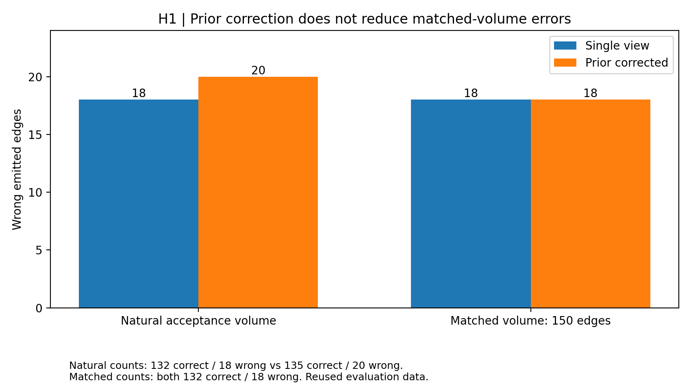

## 3. H2: Dependence-robust lineage certificates

A fact is a disjunction of conjunctive proofs. Instead of multiplying primitive marginals, enumerate Boolean worlds for at most eight atoms and constrain their nonnegative joint masses to match the supplied marginals and sum to one. Two linear programs minimize and maximize the fact indicator. We use [SciPy linear programming](https://docs.scipy.org/doc/scipy/reference/generated/scipy.optimize.linprog.html), but do not trust a numerical success flag as a safety certificate: dual coefficients are converted to rational numbers, each inequality is checked over every world, and the constant is shifted outward if needed. Rational lower-bound comparison, not rounded display values, governs the 0.95 admission gate. Caps and solver failures return explicit conservative Frechet/union bounds. Certified bounds need not be numerically sharp on every input.

Across 128 seeded arbitrary joint-distribution fixtures, 0 certified intervals exclude supplied truth and 0 false lower-bound admissions occur. The 72 two-atom analytical AND/OR cases have 0 endpoint failures at tolerance 1e-8, with 0 duplicate/order failures. The controlled target is **met**. Mean interval width is 0.318428; this additional uncertainty is the price of removing independence, not a defect to hide.

At the 0.95 gate, the independence-assuming evaluator admits 0/128 random fixtures and the dependence-robust method admits 0/128. Thus the random fixtures test interval validity, not useful acceptance coverage. The explicit correlated-source control below supplies the prevented-admission contrast. The zero random false-admission count must not be presented as evidence of high-coverage deployment safety.

| Correlated-source control | Probability or interval | Admitted at 0.95? |
|---|---:|---|
| Independence-assuming evaluator | 0.96 | Yes, incorrectly |
| Dependence-robust certificate | [0.80, 1.00] | No |
| Actual supplied joint truth | 0.80 | Below threshold |

The control contains two distinct primitive events that are perfectly correlated, each with marginal 0.8. The robust bound prevents the old false admission, but cannot certify an edge whose real dependence is unknown. Conversely, supplying a false marginal of 0.99 for an event whose actual probability is 0.8 still causes an incorrect admission. Certificates are conditional on correct marginals and proof semantics. Jev scores are not established truth marginals; TypeSafe probability outputs do not by themselves establish this assumption ([documentation](https://docs.typesafe.ai/introduction)).

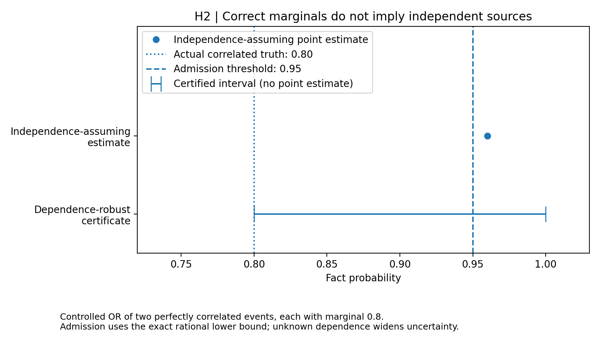

## 4. H3: Protected-fact minimal source repair

Instead of propagating a predetermined source withdrawal, the algorithm chooses a minimum-cost set intersecting every target proof while preserving at least one intact proof of each designated protected fact. It branches on an unhit target proof, prunes destroyed protections and dominated costs, and breaks ties by the sorted withdrawal tuple. A 16-atom and 65,536-state cap prevents an unfinished search from masquerading as an optimum: exhaustion stages the request. No sources are actually deleted.

An independent exhaustive subset oracle evaluates 128 seeded eight-atom fixtures. There are 82 feasible cases and 46 infeasible cases; feasibility, protection and optimum checks have 0 mismatches. Compared with cost-normalized greedy coverage that respects the same protections, 13/82 feasible cases (15.85%) have strictly lower cost or recover from a greedy dead end, exceeding the frozen 5% target. There are 0 cost regressions where greedy completes. The controlled target is **met**.

The improvements separate into 11 strictly cheaper completed repairs and 2 recoveries from greedy dead ends. These outcomes are not additional fixtures.

The fixed greedy trap withdraws a,b,c at cost 6, whereas the exact solution withdraws b,c at cost 4. A protected fact identical to the target makes repair infeasible; the algorithm refuses to silently sacrifice the protection. Costs are supplied positive integer units, not dollars or observed reviewer effort. Protected facts are designated by the fixture, not independently proven true.

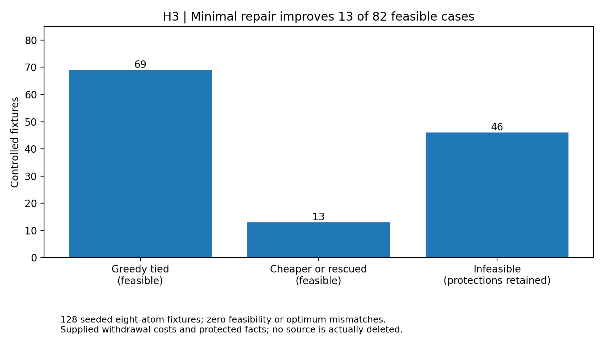

## 5. H4: Bipartite min-cut conflict optimization (concurrent replication)

For each bipartite component up to 256 vertices, a source/sink network computes minimum-weight vertex cover; its complement is a maximum-weight conflict-free assertion set. Cross-edge capacities exceed total priority. Integer max flow, cut capacity, cover membership and positive edge flows form a checkable objective certificate. Nonbipartite graphs retain the actual previous cutset/enumeration/staging implementation. This exploits a different tractable graph family rather than increasing an exponential search cap.

Across 128 small weighted bipartite fixtures and 32 general-graph controls, plus five analytical large cases, there are 0 oracle failures and 0 utility regressions against the previous solver. Duplicate/direction/order checks have 0 failures. The controlled target is **met**.

| Complete bipartite graph | Vertices | Prior cutset utility | Priority-greedy utility | Flow utility | Analytic optimum |
|---|---:|---:|---:|---:|---:|
| K(8,9) | 17 | 0 | 27 | 27 | 27 |
| K(16,16) | 32 | 0 | 48 | 48 | 48 |
| K(32,32) | 64 | 0 | 96 | 96 | 96 |
| K(64,64) | 128 | 0 | 192 | 192 | 192 |
| K(128,128) | 256 | 0 | 384 | 384 | 384 |

Left priorities are 2 and right priorities 3. Priority greedy also reaches the optimum on these large fixtures: the result is expanded certified coverage relative to the previous bounded solver, not superiority over every heuristic. A dense 17-clique still stages. A conflicting false assertion with priority 9 defeats a true assertion with priority 8: structural consistency and optimal supplied utility do not establish factual truth.

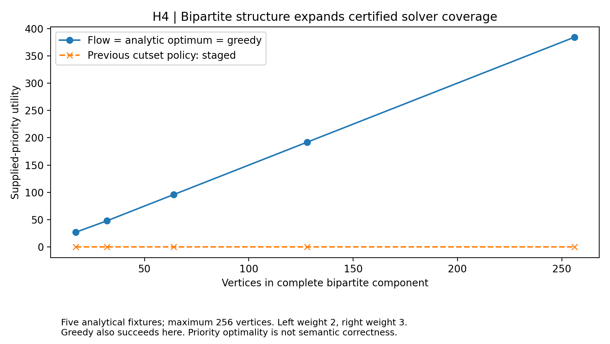

## 6. H5: Indexed interval conflict construction

Assertions are validated, partitioned by subject/predicate/scope, sorted by start time and swept with an expiry heap. Half-open intervals expire when end <= next start; None endpoints remain unbounded. Only simultaneously active assertions within a partition need semantic collision tests. Unsupported qualifiers stage, and duplicate or missing IDs are rejected. The baseline calls the existing pairwise conflict predicate on all supported pairs, including its per-pair validation. The indexed route validates once and hoists those repeated checks; both differences can affect runtime.

The 128 random cases include bounded/unbounded intervals, scope separation, opposing polarity, functional collisions and malformed qualifiers. There are 0 edge/staging mismatches, 0 failures against independent finite-instant truth, and 0 order failures. The controlled target is **met**.

| Workload | Rows | Pairwise checks | Indexed checks | Identical conflict edges | Pair-check reduction |
|---|---:|---:|---:|---:|---:|
| Sparse | 256 | 32,640 | 464 | 240 | 98.5784% |
| Sparse | 512 | 130,816 | 928 | 480 | 99.2906% |
| Sparse | 1024 | 523,776 | 1,856 | 960 | 99.6457% |
| Sparse | 2048 | 2,096,128 | 3,712 | 1,920 | 99.8229% |
| Dense control | 256 | 32,640 | 32,640 | 32,640 | 0.0000% |

Validation still visits every assertion; partitioning and sorting remain necessary, with O(n log n) comparison sorting overall. Active-pair work remains quadratic for mutually overlapping same-key assertions, and explicit output itself can be quadratic. The measured pair-check reduction is not an inferred end-to-end speedup.

### Separately measured construction runtime

Five alternating-order elapsed-time repeats per method were run on `Linux-6.17.0-1022-azure-x86_64-with-glibc2.39`, Python 3.12.14, NumPy 2.5.3, SciPy 1.18.0. Medians below include validation, grouping/sorting, collision tests and edge-list construction; input generation and I/O are excluded. These host-specific measurements are stored separately from deterministic result replay.

| Workload | Pairwise median (s) | Indexed median (s) |
|---|---:|---:|
| sparse_2048 | 3.597575 | 0.006361 |
| dense_256 | 0.085737 | 0.023884 |

Dense-case timing differences include hoisted validation and reduced Python overhead, not fewer pairs or subquadratic behavior. These are not service latency, database I/O or universally transferable speedup estimates.

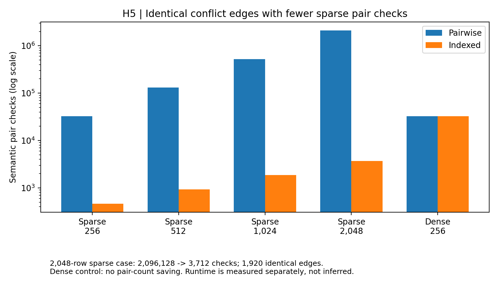

## 7. Interpretation and remaining falsification

The semantic adaptation target failed despite a plausible development-to-target prior shift. Therefore, this evidence does not justify changing the default Jev decision rule. In contrast, the controlled tests identify distinct opt-in engineering paths: represent dependence uncertainty rather than manufacture confidence; optimize a proposed repair while honoring explicit protections; recognize bipartite conflict structure before falling back to bounded generic solving; and index conflict construction rather than report solver-only savings.

The structural passes remain conditional. Incorrect marginals, incomplete proofs, mistaken protections, false priorities and erroneous scope/interval qualifiers can invalidate semantic conclusions even when every algorithm is correct. Results do not measure candidate generation, novel entity discovery, independent source truth, actual reviewer behavior, production database concurrency, or comparative end-to-end graph quality. A policy frozen before a new source-disjoint independently adjudicated corpus, with matched evidence and resource budgets against an external system such as KARMA, remains unexecuted by this extension.

## 8. Reproducibility and evidence preservation

```bash
python -m pip install -r graph_synthesis/novel_mechanisms/requirements.txt
python -B -m graph_synthesis.novel_mechanisms.run --timings
python -B -m unittest discover -s graph_synthesis/novel_mechanisms/tests -v
python -B -m graph_synthesis.novel_mechanisms.run --check
python -B -m graph_synthesis.novel_mechanisms.report --figures --update-paper
python -B -m graph_synthesis.render_current_paper --output manuscript/paper-current.pdf
```

The results preserve per-candidate predictions and selections, fitted priors, arbitrary joint tables, rational dual certificates, proof/repair fixtures, solver certificates, interval assertions, finite oracles and SHA-256 inputs. Replay disables network connections and uses the existing disclosed narrow numeric comparison tolerance; exact rational certificate strings are retained. Timings are not replay-equality claims. Five SVG/PNG pairs and summary.csv are generated from recorded results. The extension manifest binds its files; the shared manuscript uses its own build manifest. Current-paper insertion is additive and idempotent, retaining all earlier studies and limitations.

<!-- NOVEL_MECHANISMS_RESEARCH_END -->

<!-- INTERVAL_REGRET_RESEARCH_START -->

# Interval-priority regret: fifth distinct addition after concurrent overlap

Timothy Wayne Gregg | AI-assisted author-review research extension | September 18, 2026

## Novelty reconciliation

Concurrent main-branch work independently added bipartite flow optimization. Original H4 is therefore retained as replication rather than counted as a distinct new mechanism. The five distinct additions in this PR are H1 label-shift correction, H2 dependence-robust bounds, H3 protected-fact repair, H5 indexed conflicts, and H6 interval-priority regret. Both original and replacement protocols remain in ancestry. This is repository-scoped novelty, not a new mathematical invention.

The [replacement protocol](../graph_synthesis/novel_mechanisms/REGRET_PROTOCOL.md) was frozen in `7a624f79c3f79b4c23a0879006bbe34412f126d9` before execution against the expanded main baseline `7e2ce2fce28f29ebc6a2b462d063ea558b656cc1`. The original experiments and unfavorable outcomes were not retuned. Fresh Jev service calls: 0.

## Hypothesis and falsification

Point-priority optimization can choose a fragile conflict-free set when priorities are uncertain. Test whether minimizing worst-case regret over supplied integer intervals reduces the maximum gap from an interval-consistent optimal selection. Regret is R(S)=max_w[max_T w(T)-w(S)]. For interval boxes this equals max_T[upper(T minus S)-lower(S minus T)]; the comparator is the actual previous nominal-priority solver. A separate oracle enumerates every endpoint scenario and computes utilities directly, rather than using this identity.

Enumeration is capped at 12 vertices and 1,000,000 candidate/rival comparisons. Exhaustion stages with no partial optimum. Exact ties maximize nominal utility and then use lexicographic assertion IDs. A rival set and endpoint priority assignment witness the returned worst-case gap. No graph writes are performed.

The frozen primary target requires zero oracle, consistency and witness failures, no regret regression, and strictly lower worst-case regret in at least 10% of 128 seeded eight-vertex fixtures. Edge densities alternate 0.15/0.35/0.55/0.75; priorities and intervals are generated under the protocol, seed 20260923.

## Executed results

| Measure | Observed |
|---|---:|
| Primary target | Met |
| Strictly lower worst-case regret | 62/128 (48.44%) |
| Oracle / consistency / witness failures | 0 / 0 / 0 |
| Regret regressions | 0 |
| Cases sacrificing nominal utility | 44/128 |

In the fixed conflicting-pair control, nominal optimization chooses a (priority 9, interval [0,10]) over b (priority 8, interval [8,8]). Its worst-case regret is 8. The robust policy chooses b with regret 2, sacrificing one nominal utility unit. Zero-width intervals restore a zero-regret nominal optimum. The supplied intervals, not Jev probabilities, define the robustness claim.

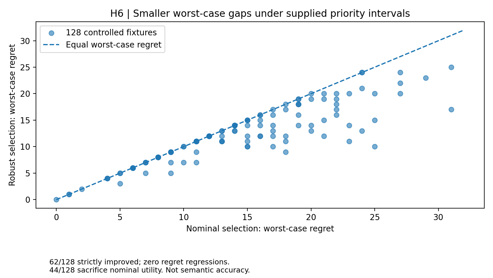

## Limits and negative controls

A smaller worst-case supplied-priority gap is not higher semantic accuracy. The random results explicitly report nominal utility sacrifices. Incorrect or overly narrow uncertainty intervals void the guarantee: actual priorities a=10,b=0 are outside the fixed control intervals and give the robust choice regret 10. Complete interval boxes may also be too pessimistic when priorities are dependent. No useful interval-estimation method, large-graph scalability, service latency or superiority to KARMA is established. Malformed inputs, cap exhaustion, nonmutation, edge-order invariance, equal/zero-width intervals and empty/disconnected graphs are regression-tested.

## Reproduction and attribution

```bash
python -B -m graph_synthesis.novel_mechanisms.regret
python -B -m graph_synthesis.novel_mechanisms.regret --check
python -B -m graph_synthesis.novel_mechanisms.regret --report
```

The first command executes the experiment and writes per-case intervals, baseline/proposed selections, regret, independent oracle results, witnesses and input hashes. The second disables network access and checks exact replay. The third publishes the extra figure, standalone report and additive combined manuscript section. This is a deterministic bounded application of established minimax-regret ideas, not a reproduction of randomized or double-oracle algorithms: [Mastin, Jaillet and Chin](https://arxiv.org/abs/1401.7043); [Gilbert and Spanjaard](https://arxiv.org/abs/1602.01764).

<!-- INTERVAL_REGRET_RESEARCH_END -->

<!-- FRONTIER_RESEARCH_START -->

# Structural frontiers for evidence-preserving Jev graph synthesis

Timothy Wayne Gregg | AI-assisted author-review research extension | September 18, 2026

## Abstract

Five frozen extensions test whether explicit source dependence, heterogeneous review assumptions and structural recognition address limitations exposed by PR #17. Latent-source marginalization matches an independent joint-world oracle on 96 supplied-model fixtures and prevents 9 false threshold admissions made by the independent-marginal comparator. Cost- and noise-aware review allocation fails its frozen downstream target: at 40 proxy effort units it leaves 13.043478 expected contaminated source groups, identical to both comparison policies. Compile-once decision diagrams exactly evaluate ten connected lineage formulas with 17–256 primitives beyond the previous blanket component cap. Certified bipartite optimization attains nine analytic large-graph optima previously staged. A fixed-path segment tree reduces counted summary-maintenance transitions by 96.47% across a 1,024-vertex, 256-update workload, excluding separately reported linear witness decoding. These are bounded engineering results, not new Jev semantic-accuracy evidence or proof of worldwide algorithmic novelty.

## 1. Motivation, novelty scope and frozen design

The [preceding reliability study](../graph_synthesis/reliability/RESULTS.md) found that better average calibration bias need not improve Brier score; source identity errors invalidate independent-event probabilities; capped exact solvers leave some structured cases unresolved; review effectiveness depends on assumptions; and whole-component caching provides no solver saving on a connected graph. The five present mechanisms address these particular limitations rather than adding more correlated Jev calls. TypeSafe's typed outputs and probabilities do not themselves establish graph truth ([TypeSafe documentation](https://docs.typesafe.ai/introduction)).

The [protocol](../graph_synthesis/frontier/PROTOCOL.md) was committed as `ef8fc308d0a50cd37a6cdd3b7546e050093349c8` before implementation and benchmark execution, against `a62a3257645d8e35cd4e45be53bfa9511d27724b`. Prior results were inspected and informed hypothesis selection. This is exploratory follow-up, not independent preregistration. H2 reuses 73 development candidates in 40 groups and 263 evaluation candidates in 149 groups. These are already published observations, not a new holdout. **Fresh service calls: 0.** Raw requests, response parsing, group separation and input hashes are checked before scoring. The other four hypotheses evaluate supplied models or graph structures, not newly extracted scientific facts.

| Hypothesis | Proposed extension | Frozen target | Evidence class |
|---|---|---|---|
| H1 | Latent-source-conditioned lineage | Met | Controlled algorithm |
| H2 | Cost/noise-aware group review | Not met | Replay + reviewer assumptions |
| H3 | Reusable state-bounded lineage diagrams | Met | Controlled algorithm |
| H4 | Certified bipartite conflict optimization | Met | Controlled algorithm |
| H5 | Connected-path incremental optimization | Met | Controlled algorithm |

“Met” refers only to the predeclared conjunction on its specified fixture population. These rows must not be pooled into a semantic-success percentage. The [novelty audit](../graph_synthesis/frontier/NOVELTY.md) distinguishes repository-new implementations from established source modeling, knowledge compilation, flow optimization and dynamic programming. It does not assert that no person has ever tried an equivalent idea.

**Concurrent integration disclosure.** While this frozen extension was executing, main advanced to `a21314d17c33c639b75522ecce120586ef8dab35` with the [structural refinement](../graph_synthesis/structural/RESULTS.md) and [source-structural](../graph_synthesis/source_structural/RESULTS.md) studies. Both are preserved unchanged. The source-structural study also implements certified bipartite optimization: H4 here is therefore a parallel implementation and additional frozen test suite, not a mechanism unique to the reconciled main branch. Its frontier-width lineage evaluator overlaps H3's goal but differs from the reusable decision-diagram state budget tested here. Source-setup review differs from H2's heterogeneous per-edge effort/noise model; source-revision invalidation differs from H5's connected-path summary maintenance. Repository-new claims are limited to the protocol's original pinned baseline, not the later integration snapshot. No thresholds, fixtures or numerical results were retuned after examining the concurrent studies. Reused semantic captures must not be pooled as independent observations.

**Further concurrent integration.** Main subsequently advanced through PR #24 to `6530321dd0060c9c7f13bb69d6f1c88346a8e1e2`. Its [assumption-aware study](../graph_synthesis/assumption_aware/RESULTS.md) is also preserved unchanged. Its dependence-robust probability envelopes address unknown joint dependence rather than H1's supplied latent-source conditional model. Its connected-tree ancestor-message updates overlap H5's objective, but H5 uses a balanced segment tree on a fixed path, with a different update mechanism and counted work metric. These results are parallel extensions of the same pinned baseline, not independent replications, combined semantic observations, or claims of unique worldwide invention. Frozen frontier hypotheses, implementations, fixture seeds and numerical results are unchanged; only additive reporting and combined regression coverage expand.

**Final integration snapshot.** Main also received PR #21, the [uncertainty and grounding study](../graph_synthesis/uncertainty/RESULTS.md), at `114450ef08736c21c97c8725de700d8d2c6ca94d`. That study and all three earlier concurrent extensions are preserved unchanged. Its dependence-agnostic bounds and query-loss-directed review further overlap the broad research questions here, but use different supplied-information assumptions and controlled objectives. This frontier study does not claim to be the unique first repository implementation on the reconciled main branch; its dated novelty comparison remains the frozen PR #17 baseline. All frozen numerical outcomes remain unchanged and overlapping captured observations are not pooled.

## 2. H1: Source-conditioned evidence probability

Distinct evidence atoms can still depend on a common unreliable source. Instead of treating their marginal probabilities as independent, the proposed model supplies a binary quality state for each source, a prior for that state, and two conditional probabilities for each assigned atom. Source states are assumed mutually independent; primitive events are independent only conditional on those states. For a monotone proof formula F, compute P(F) = sum_z P(z) P(F given z). Each conditional formula uses the existing bounded exact lineage evaluator. This is exact marginalization within the supplied model, not discovery of the correct dependence structure.

The 96 seeded fixtures contain 2–8 primitives and 1–3 sources. The independent oracle enumerates joint source-plus-primitive assignments, rather than calling the proposed marginalization/evaluation routine. There are **0 oracle discrepancies above 1e-12**, **0 failures in 288 order/duplicate checks**, and **0 proposed false admissions at 0.95**. Independent marginals make 9 false admissions on these random fixtures. Mean absolute probability error is 0.055531 for independent marginals and 1.31e-16 for the supplied dependence model.

| Shared-source query | Independent marginals | Conditioned model | Joint-world truth |
|---|---:|---:|---:|
| At least one of two copies (OR) | 0.96 | 0.80 | 0.80 |
| Both copies (AND) | 0.64 | 0.80 | 0.80 |

The OR control prevents an unjustified 0.95 admission; the AND control shows that dependence errors do not always inflate probability. The target is **met**. Inputs over eight sources or sixteen primitives are explicitly staged with [0,1], not assigned an exact probability. Conditional evaluator exhaustion retains conservative bounds.


**Assumption-breaking control:** two declared independent latent sources that actually share one cause still yield 0.96 when the actual probability is 0.80. The extension therefore moves the necessary independence assumption to the source layer; it does not remove it. Primitive reliabilities and source assignments are fixture inputs, not calibrated model scores or independently adjudicated provenance. Bayesian source-quality modeling already has substantial prior art, including [Zhao et al. (2012)](https://arxiv.org/abs/1203.0058); this experiment does not reproduce or outperform their truth-discovery system.

## 3. H2: Review allocation under effort and reviewer errors

The proposed allocator uses the prior study's development-only single-view risk estimator. Evaluation gold, compact-view predictions and observed review outcomes are unavailable to selection. The supplied per-edge effort is min(8, 1 + floor(recorded single-call input tokens / 1000)). This is a bounded proxy, not measured annotation time, cognitive difficulty, monetary cost or new service expenditure. At base detection s0, detection for cost c is s0 / (1 + 0.05(c−1)); a supplied false-removal probability applies to correct reviewed edges.

For selected review IDs A, the modeled source-group contamination is 1 − product_i[1 − p_i(1 − s_i I(i in A))]. The objective is total modeled group cleaning minus expected correct-edge removals with unit penalty. Enumerate subsets within each group of at most twelve candidates, then allocate across groups using integer-budget multiple-choice knapsack. Larger groups receive no optimized review; **0 primary groups exceed the cap**. No-review remains an available option. The baselines are the actual previous group-aware order packed into the same budget, and marginal-model-benefit-per-cost greedy. Equal budgets do not require identical spending.

The fixed acceptance population contains 150 single-view positive judgments: 132 correct and 18 wrong, spread across 15 contaminated groups before review. This is not the earlier study's separate matched-volume top-145 comparison. Primary scoring uses all 149 evaluation source groups, including groups with no accepted edges. The reviewer simulation removes an actually wrong edge with its supplied detection probability and removes a correct one with its supplied false-removal probability. No human reviewed these edges in this experiment.

The frozen primary scenario is budget 40, s0 = 0.75 and false-removal probability 0.01. The target requires at least 5% fewer expected contaminated groups than **both** comparators, while allowing at most 0.25 additional expected correct-edge removals versus either.

| Policy | Effort spent | Edges reviewed | Expected contaminated groups | Expected correct removed |
|---|---:|---:|---:|---:|
| no review | 0 | 0 | 15.000000 | 0.0000 |
| optimal | 40 | 10 | 13.043478 | 0.0600 |
| packed prior | 37 | 9 | 13.043478 | 0.0600 |
| ratio greedy | 40 | 10 | 13.043478 | 0.0600 |

The target is **not met**. All three review policies have the same primary expected contamination and correct-edge loss. The optimizer's modeled gain (3.078385) exceeds packed prior (3.060146) but ties ratio greedy (3.078385). Improved optimization of an imperfect model is not a demonstrated graph-quality gain. There are 0 objective discrepancies on 64 independent finite-enumeration checks; solver correctness does not rescue the empirical target.


All 36 combinations of budgets 20/40/80/160 and detection/false-removal scenarios are retained in results.json; selection is recalculated from features and supplied assumptions only. The 4,000 paired group-bootstrap draws at fixed primary selections give a 95% and 99% proposed-minus-comparator contamination-rate interval of [0,0] for both comparisons because their per-group expected outcomes are identical. **This degeneracy is not evidence of known population equivalence.** These descriptive intervals omit model-fitting and reviewer-model uncertainty, and published-data reuse prevents independent confirmation. A deliberately incorrect-risk control spends its only review on an actually correct edge and misses the wrong one. Prior research already demonstrates the relevance of real annotation costs ([Settles et al., 2008](https://burrsettles.com/pub/settles.nips08ws.pdf)); our token-based proxy is not a measurement of those costs.

## 4. H3: Compile once, bound by decision-diagram state count

The previous evaluator rejects connected lineage components above sixteen atoms even when their Boolean structure is simple. The proposed compiler canonicalizes a monotone disjunction of conjunctions, chooses frequency-descending/lexical atom order, memoizes residual formulas and merges identical decision nodes. A compiled reduced ordered binary decision diagram can then be evaluated with changing supplied probabilities without recompiling its structure. Children precede parents, so evaluation is a bottom-up weighted sum. Conditional expansion preserves the represented Boolean function; merging identical subfunctions preserves every probability assignment under independent primitive events.

The safety boundaries are 512 atoms, 4,096 input proofs and 32,768 visited residual states. Input-cap violations stage. State-budget exhaustion returns conservative previous lineage bounds with an explicit nonexact status, never a partially evaluated point estimate. Compilation remains potentially exponential; these caps are operational safeguards, not a polynomial-time theorem.

There are 0 probability discrepancies across 128 random formulas with five assignments each, ten analytic large fixtures, 64 updates on one reused 128-atom chain, and the state-cap control. All ten connected large fixtures are exact under the new compiler and nonexact under the actual previous evaluator. Duplicate/input-order checks have 0 failures.

| Formula | Primitives | Decision nodes | Prior lower bound | Exact probability |
|---|---:|---:|---:|---:|
| fan | 17 | 17 | 0.495 | 0.989984894 |
| fan | 32 | 32 | 0.495 | 0.990000000 |
| fan | 64 | 64 | 0.495 | 0.990000000 |
| fan | 128 | 128 | 0.495 | 0.990000000 |
| fan | 256 | 256 | 0.495 | 0.990000000 |
| chain | 17 | 57 | 0.250 | 0.968101501 |
| chain | 32 | 117 | 0.250 | 0.998672193 |
| chain | 64 | 245 | 0.250 | 0.999998494 |
| chain | 128 | 501 | 0.250 | 1.000000000 |
| chain | 256 | 1013 | 0.250 | 1.000000000 |

The shared-fan oracle is 0.99(1−0.5^(n−1)). The adjacent-pair chain oracle uses an independent two-state recurrence for the probability of no adjacent successes. The 128-atom reuse workload performs 1 compilation with 501 decision nodes, then 64 changed-probability evaluations totaling 32,064 decision-node visits. The target is **met**. Diagram size, compile-state visits and evaluation-node visits are separate quantities; none is a measured service-latency saving.


Knowledge compilation for probabilistic data is established ([Fink et al., 2012](https://arxiv.org/abs/1201.6569)); provenance maintenance and hybrid compilation approaches for uncertain knowledge graphs are also established ([Gaur et al., 2021](https://arxiv.org/abs/2108.07758)). The contribution here is the bounded reusable implementation and its tests against this repository's earlier cap, not invention of decision diagrams or superiority over those systems. H3 still assumes independent primitive inputs; it does not automatically incorporate H1's source model.

## 5. H4: Certified bipartite conflict optimization

The cycle-cutset solver in PR #17 can stage a bipartite graph with many cycles even though its supplied-priority maximum independent set has a tractable reduction. The extension first recognizes bipartite components with at most 512 vertices. For bipartition L/R, create source-to-L and R-to-sink capacities equal to nonnegative integer priorities and L-to-R conflict arcs of capacity total priority plus one. A minimum cut cannot profitably cross a conflict arc, since cutting every priority arc is cheaper. Its vertex-side choices therefore give a minimum-weight vertex cover; the complement is a maximum-weight independent set.

The returned certificate contains a capacity-feasible flow, flow conservation at every internal node, a source/sink separating cut of equal value, and the complementary selected witness. A separate verifier checks these conditions without invoking an optimizer. A feasible flow lower-bounds any cut; equality certifies cut optimality, and the cover reduction certifies the selected supplied-priority objective. Nonbipartite components retain the unmodified prior solver and its staging behavior. No additional budget constraint is imposed; adding such constraints changes the complexity ([Doron-Arad and Shachnai, 2023](https://arxiv.org/abs/2307.08592)).

There are 0 optimum discrepancies, 0 certificate errors and 0 prior-utility regressions across 128 random bipartite and 64 general small graphs plus nine analytic large fixtures. The large comparator values below come from the actual imported previous solver, not a renamed reimplementation. Zero previous utility means the unsupported component was staged, not that no positive-utility solution exists.

| Structure | Vertices | Prior utility | Greedy utility | Certified utility | Oracle |
|---|---:|---:|---:|---:|---:|
| complete bipartite | 18 | 0 | 18 | 18 | 18 |
| complete bipartite | 32 | 0 | 32 | 32 | 32 |
| complete bipartite | 64 | 0 | 64 | 64 | 64 |
| complete bipartite | 128 | 0 | 128 | 128 | 128 |
| complete bipartite | 256 | 0 | 256 | 256 | 256 |
| grid | 32 | 0 | 16 | 16 | 16 |
| grid | 64 | 0 | 32 | 32 | 32 |
| grid | 128 | 0 | 64 | 64 | 64 |
| grid | 256 | 0 | 128 | 128 | 128 |

The target is **met**. Complete bipartite fixtures have side weights one and two, giving optimum total weight on the heavier side. Rectangular unit grids have an independent checkerboard half; a perfect matching gives the corresponding upper bound. Certificate-tampering tests, zero weights, invalid endpoints, odd cycles and a dense 17-clique are retained. The odd clique still stages. Priority greedy also attains all nine large analytic optima; the extension adds an optimality certificate and recovery versus prior staging, not an observed large-fixture utility advantage over greedy.


The semantic negative control remains decisive: a false assertion with supplied priority 9 defeats a conflicting true assertion with priority 8. An exact optimizer can be exactly wrong about factual truth when its priorities are wrong. No graph-extraction, clinical-validity or KARMA-superiority claim follows.

## 6. H5: Connected-path summary maintenance

Whole-component invalidation cannot exploit a local weight update inside one connected graph. For the deliberately narrower case of a fixed connected path, the proposed data structure stores the skip/take dynamic-programming transition for each vertex in a max-plus segment tree. Two-state transitions compose associatively; a leaf update requires recomputing only its ancestors. The root gives optimal utility without emitting the entire selected graph. Topology is validated at construction. Invalid or unknown-vertex weight updates are rejected before mutation; changing topology requires rebuilding. Stars and cycles are rejected rather than silently treated as paths.

Across 64 random paths with sixteen updates each and the 1,024-vertex path with 256 updates, there are **0 utility or independent-witness discrepancies** against independent full linear dynamic programming. The primary workload includes cold construction and every update.

| Work quantity | Count | Interpretation |
|---|---:|---|
| Full recomputation transition candidates | 789,504 | Three scalar candidates per vertex per build/update |
| Segment-tree transition candidates | 27,864 | Eight per internal 2-by-2 composition, including cold build |
| Segment summary-work reduction | 96.47% | Only the two transition-candidate counts above |
| Cold topology validation visits | 3,070 | Vertex plus adjacency visits, separately recorded |
| Full witness-decoding node visits | 526,079 | Every output decoded for validation; remains linear |

The frozen 90% counted summary-work reduction target is **met**. The 27,864 versus 789,504 transition comparison is not a total runtime or database-I/O measurement. Witness decoding adds 526,079 tree-node visits under a different operation metric and is explicitly not included in that percentage. A consumer needing the complete selected graph after every update still pays linear output/decoding work. Python overhead, memory traffic, initial sorting, dictionary operations and persistence are not captured by scalar transition counts.


## 7. Interpretation and next falsification boundary

The results favor identifying the tractable structure of a supplied problem over imposing blanket size restrictions: declared dependence changes which probabilities are valid; compact formula structure permits reusable exact evaluation; bipartiteness permits certified optimization despite many cycles; and a fixed path permits local summary updates despite being one connected component. These conclusions are conditional on correct metadata and supported topology. They do not establish that those structures dominate real Jev-generated graphs.

The review result is a useful negative finding. A more exact allocator can improve a modeled objective yet fail to improve the frozen downstream source-contamination measure. This counsels against promoting the allocator on optimization quality alone. Prospective human-cost/detection measurements, source-disjoint independently adjudicated documents, policies frozen before those labels are seen, and matched evidence/resource budgets against external graph-synthesis systems remain necessary for semantic or deployment claims. H1 and H3 reliability inputs must be estimated and audited separately; raw model confidence cannot simply be substituted.

The methods remain opt-in research utilities. No default compiler policy or production graph is changed. Failure controls and all prior studies remain in the complete manuscript. Each target is falsifiable on its specified population, but a passed finite benchmark is not a proof of correctness for all inputs or real-world superiority.

## 8. Reproducibility and audit

```bash
python -B -m graph_synthesis.frontier.run
python -B -m unittest discover -s graph_synthesis/frontier/tests -v
python -B -m graph_synthesis.frontier.run --check
python -B -m graph_synthesis.frontier.report --figures --update-paper
python -B -m graph_synthesis.render_current_paper --output manuscript/paper-current.pdf
python -B -m graph_synthesis.frontier.verify
```

The machine-readable results retain source and code hashes, source-group counts, all random fixtures or complete generating specifications, review IDs and scenarios, independent-oracle outputs, flow/cut witnesses, update sequences and decoded-witness hashes. The five figures are generated directly from those results as SVG and PNG pairs; summary.csv preserves target classifications without pooling them. The [implementation log](../graph_synthesis/frontier/IMPLEMENTATION.md) records validation corrections without changing the protocol or endpoints. Original evidence integrity is checked against the immutable inventory. Source, result and figure hashes are bound in the extension manifest; the complete current PDF has a separate source/renderer/PDF hash record.

<!-- FRONTIER_RESEARCH_END -->

<!-- CERTIFICATES_RESEARCH_START -->

# Dependence-aware certificates for Jev graph synthesis

Timothy Wayne Gregg | AI-assisted author-review research extension | September 18, 2026

## Abstract

Five frozen exploratory tests extend the graph pipeline beyond independent-source assumptions and a single chosen repair. A development-fitted beta-binomial source model changes contamination Brier from 0.140410 to 0.131444, a 6.39% reduction; its primary target is not met. Dependence-aware probability bounds prevent 20/20 independence-induced false admissions in supplied correlated-source controls. Integer flow certificates recover all seven analytic bipartite optima, including 2,048-vertex cycles previously staged. Query classification agrees with finite enumeration, and delta-indexed updates match full recomputation across 640 random mutations. Declared boundary graph-element visits fall by 99.11% on the fixed local-update workload, but by 0.00% on its connected control. These are conditional algorithm and saved-response findings, not new Jev semantic-accuracy evidence or a comparison against KARMA.

## 1. Motivation, novelty boundary and frozen methodology

The preceding [reliability study](../graph_synthesis/reliability/RESULTS.md) exposed three limitations: its calibration multiplier worsened Brier; exact lineage probabilities remained conditional on independent primitives; and incremental maintenance still scanned the global snapshot. Its conflict optimizer also returned one optimum and staged components outside its cutset/cap limits. The five extensions here test these specific gaps without changing candidate extraction, accepted Jev edges or production policy.

At the frozen PR #17 baseline, the inspected inventory did not contain these five integrated experiments. At merge time, several parallel studies overlap with H2-H4; those methods are concurrent extensions or replications, not five distinct new mechanisms relative to current main. See the [merge-time overlap audit](../graph_synthesis/certificates/MERGE_AUDIT.md). This is a **new-experiment claim scoped to the frozen baseline, not to the current inventory or worldwide priority**. Beta-binomial random effects, extremal-probability linear programs, weighted bipartite covers, consistent query answering across repairs and incremental maintenance all have antecedents. A targeted primary-source search and its references are recorded in the [protocol](../graph_synthesis/certificates/PROTOCOL.md). The [concurrent-main reconciliation](../graph_synthesis/certificates/RECONCILIATION.md) preserves PR #18 and distinguishes its related experiments. Established ingredients do not become novel algorithms merely through new names or integration.

Protocol commit `bc70b76621daca198b3b97eb4f698b17d4c40a0b` precedes this suite's implementation/execution; the inspected baseline is `a62a3257645d8e35cd4e45be53bfa9511d27724b`. Hypotheses were informed by already public results, so this is exploratory follow-up rather than independent preregistration. H1 reuses 73 development candidates in 40 groups and 263 previously inspected evaluation candidates in 149 disjoint groups. Saved calls are reconstructed and hashes checked before use. **Fresh service calls: 0.** H2-H5 use controlled fixtures rather than additional Jev observations.

| Hypothesis | Frozen primary requirement | Result | Evidence class |
|---|---|---|---|
| H1: Source random-effects forecasting | At least 10% lower Brier than same-marginal independence, absolute bias <=0.03, and no regression versus prior feature risk | Not met | Previously inspected saved-response forecasts |
| H2: Dependence-aware lineage bounds | Zero finite-oracle/bound/invariance failures; prevent all 20 correlated-source false admissions | Met | Supplied finite probability models |
| H3: Bipartite flow certificates | Zero finite-oracle/certificate failures, no small-case regression, all seven large analytic optima recovered | Met | Supplied conflict graphs and integer priorities |
| H4: Repair-invariant queries | Zero classification/witness failures; preserve all oracle-certain answers and reject the tie-control false certainty | Met | Priority-relative graph-repair semantics |
| H5: Delta-indexed graph updates | Zero mutation mismatches/invalid-state changes; at least 75% fewer declared boundary visits on the frozen local workload | Met | In-memory controlled graph mutations |

These outcomes must not be combined into a semantic success percentage. A failed conjunction remains failed even when one endpoint improves.

## 2. H1: Source-random-effects contamination forecasts

For each source, n counts base1 SUPPORTS/REFUTES decisions and k counts disagreements with the stored gold relation label. Empty accepted groups are excluded. The development-only marginal error estimate is (sum(k)+0.5)/(sum(n)+1). A grid of intraclass correlations {0,0.01,0.05,0.1,0.2,0.4,0.6,0.8} is selected by beta-binomial development log likelihood with a lower-correlation tie rule. At positive rho, alpha=mu(1/rho-1) and beta=(1-mu)(1/rho-1); contamination is 1-B(alpha,beta+n)/B(alpha,beta). The rho=0 comparator has the identical marginal estimate and uses 1-(1-mu)^n. Predictions consume only source exposure counts, not evaluation labels.

Development selects mu=0.121622 and rho=0.6. All 40 source-excluded development sensitivity fits are retained; held-out source IDs do not enter their training fits. Evaluation uses 98 nonempty source groups, of which 60 are singletons. Singletons cannot distinguish these dependence models at fixed marginal error rate.

| Forecast | Brier | Clipped log loss | Predicted contaminated | Observed contaminated | Bias |
|---|---:|---:|---:|---:|---:|
| Prior feature-risk model | 0.128923 | 0.467074 | 8.04% | 15.31% | -7.26% |
| Prior development-selected multiplier | 0.134900 | 0.441344 | 13.64% | 15.31% | -1.67% |
| Same-marginal independence | 0.140410 | 0.457499 | 17.38% | 15.31% | +2.07% |
| Source random effects | 0.131444 | 0.435042 | 14.07% | 15.31% | -1.24% |

The new-minus-same-marginal Brier difference is -0.008966; its descriptive paired 95% interval is [-0.021889, +0.001383], and its 99% interval is [-0.026211, +0.004667]. The frozen conjunction is **not met**. The forecast can improve relative to its matched marginal comparator while still failing the improvement threshold or regressing versus the richer prior feature model. No accepted edge is changed.

Positive correlation lowers the probability of at least one error at fixed marginal error probability and exposure, because errors cluster rather than spread across groups. It does not universally make an underpredicted contamination rate more accurate. The fitted exchangeable beta-binomial model is neither a distribution-shift guarantee nor a calibration certificate.


## 3. H2: Lineage bounds without assumed independence

A monotone DNF formula is evaluated over at most 1,024 Boolean worlds for at most ten atoms. Nonnegative world masses sum to one and satisfy supplied marginal and optional conjunction constraints. Two linear programs minimize and maximize the DNF truth indicator. They use SciPy HiGHS; solver failures, infeasibility and capacity excess return [0,1] with no admission certificate. These probabilities are supplied model inputs, not Jev scores reinterpreted as fact probabilities.

For a minimization objective c, equality matrix A, target b and returned dual y, c dot z >= b dot y + min(0,min(c-A-transpose y)) for every feasible simplex vector z. The implementation subtracts an additional 1e-9 times (1+sum(abs(y))) outward pad. It saves primal support, duals and residuals. This is a checked, outward-padded floating-point bound conditional on supplied constraints, **not formal interval-arithmetic verification or an unconditional truth guarantee**.

The 128 seeded arbitrary-joint fixtures have 0 containment, constraint-monotonicity, invariance or control failures. The 50 two-event OR/AND grid cases match their analytic Frechet bounds within 1e-8. Mean interval width is 0.326563 using marginals alone and 0.239902 with one valid conjunction constraint. The primary target is **met**.

| Two 0.8-marginal sources supporting an OR | Probability or interval | Admission at 0.95 |
|---|---:|---|
| Assume independence without justification | 0.96 | Yes; false under perfect correlation |
| Actual perfectly correlated sources | 0.80 | No |
| Marginals only, arbitrary dependence | Approximately [0.80,1.00] | No |
| Explicit joint probability 0.80 | Approximately [0.80,0.80] | No |
| Explicit joint probability 0.64 | Approximately [0.96,0.96] | Yes, conditional on this constraint |

Across 20 marginal settings, the method prevents 20 false admissions from an unjustified independence assumption. It also withholds 20 genuinely high-probability admissions when only marginals are provided, and recovers 20 when the correct joint constraint is supplied. That conservatism is a real information tradeoff, not free accuracy. Infeasible and 11-atom cases stage. The false-premise control supplies 0.99 for an actually 0.50-probability atom; the resulting conditional bound still admits it. Arithmetic cannot repair incorrect evidence metadata.


## 4. H3: Integer-flow certificates for bipartite conflicts

A bipartite conflict component is reduced to minimum weighted vertex cover: source-to-left and right-to-sink capacities are supplied priorities, and conflict arcs have capacity one greater than total priority. An integer max-flow/min-cut certificate gives a minimum cover; its complement is a maximum-weight independent set. The verifier reconstructs the original network, checks capacity bounds and conservation, proves flow equals cut capacity, checks the cover/independent-set relationship and verifies the reported utility. No hidden tie-breaking weight perturbation changes the objective.

The new route supports components up to 2,048 vertices and 50,000 edges. Non-bipartite components use the actual prior cutset solver with its original limits; unsupported cases stage rather than silently accepting a heuristic solution. These are explicit conflict graphs, not newly extracted relationships.

All 128 small bipartite cases match independent subset enumeration and their flow certificates. Another 128 small general graphs have no utility regression. Reordering or repeating edges preserves outputs. Total failures: 0. The primary target is **met**.

| Analytic topology | Vertices | Edges | Previous utility | New utility | Oracle utility |
|---|---:|---:|---:|---:|---:|
| complete bipartite | 32 | 256 | 0 | 48 | 48 |
| complete bipartite | 64 | 1024 | 0 | 96 | 96 |
| complete bipartite | 128 | 4096 | 0 | 192 | 192 |
| complete bipartite | 256 | 16384 | 0 | 384 | 384 |
| even cycle | 512 | 512 | 0 | 256 | 256 |
| even cycle | 1024 | 1024 | 0 | 512 | 512 |
| even cycle | 2048 | 2048 | 0 | 1024 | 1024 |

Complete-bipartite fixtures assign priority 3 on one balanced side and 2 on the other; cycles use unit priorities. Prior zero utility means staged, not an incorrect accepted graph. The 2,050-cycle and 50,176-edge complete-bipartite controls stage; a 17-cycle still uses the prior exact route, while the dense 17-clique remains unsupported. A false assertion of priority 9 still defeats a true conflicting assertion of priority 8. Certified optimality concerns supplied priorities, not semantic truth.


## 5. H4: Queries invariant across admissible graph repairs

Let U be maximum supplied priority. Admissible repairs are all independent sets with utility at least U-epsilon, using epsilon=0 and floor(0.05U). For a conjunction of up to eight required vertices, constrained inclusion tests whether some admissible repair contains the conjunction. Constrained exclusion of each required vertex tests whether any admissible repair falsifies it. Answers are certain, ambiguous or impossible, with an explicit counterexample for ambiguity. Staged optimization propagates unsupported status rather than false certainty.

Across 128 seeded general graphs and two tolerance settings, classifications and witnesses have 0 oracle failures. Every oracle-certain answer is retained and larger tolerance creates no new certain answers. Among exact-optimum random cases, 2 affirmative answers from one selected optimum are not invariant across all optima. The explicit equal-weight conflict control also returns an alternative repair that falsifies the chosen optimum's affirmative answer. Primary target: **met**.

| Repair tolerance | Certain conjunctions | Ambiguous conjunctions | Impossible conjunctions |
|---|---:|---:|---:|
| Exact maximum priority | 69 | 7 | 52 |
| Within floor(5% of optimum) | 65 | 12 | 51 |

Some sampled conjunctions are empty and hence tautological; these counts describe the fixture distribution, not a population query-success rate. Conflicting conjunctions are impossible. Zero-priority optional vertices can be ambiguous. The high-priority false assertion is still repair-certain under its supplied objective: repair certainty must not be presented as factual certainty.


## 6. H5: Delta-indexed maintenance without global snapshot rescans

The in-memory index validates an initial graph and maintains private adjacency, priorities, component membership and cached solutions. An explicit mutation API supports weight changes, vertex insertion/deletion and edge insertion/deletion. It copies, validates, discovers and solves only affected old components and their replacements before publication. Bridge insertion joins two scopes; bridge or vertex deletion discovers splits inside the affected old scope. Unaffected solutions are reused. Mutations return selection/staging deltas and aggregate utility rather than forcing a full graph materialization. Snapshot audit is a separate operation.

Independent full-snapshot mutation and optimization checks find 0 failures across 640 seeded mutations, deliberate bridge controls and locality/stress workloads. Each of the five mutation types appears 128 times in the randomized test. Invalid mutations produce 0 state changes; tests also inject a solver exception before publication. This is not a concurrent or durable database transaction protocol.

| Workload, including cold build | Delta-index boundary visits | Full-rescan boundary visits | Reduction |
|---|---:|---:|---:|
| 512 eight-vertex components; 128 local updates | 65,920 | 7,391,616 | 99.11% |
| One 64-vertex component; 128 updates | 123,096 | 123,096 | 0.00% |

The frozen primary target is **met**. The comparator uses the same optimizer but copies, validates, discovers and prepares every component on every update. The boundary metric counts declared passes for graph copying, validation, discovery, solver input, mutation validation and publication. It explicitly excludes sorting, optimizer-internal work, certificate-check work and the audit materialization. Therefore the percentage is **not** a measured reduction in all CPU operations, service latency or database I/O. It improves on the previous study's solver-vertex-only scope, but is still an instrumented boundary measure.

### Separate single-host timing measurements

Three repetitions alternate policy order. Timings include cold construction and 64 updates, but exclude snapshot comparison for both policies. Medians below are descriptive, not a primary endpoint or a portable speed guarantee. All individual measurements and environment details are retained in [timings.json](../graph_synthesis/certificates/timings.json).

| Components | Vertices | Delta-index median seconds | Full-rescan median seconds | Ratio |
|---:|---:|---:|---:|---:|
| 16 | 128 | 0.009904 | 0.115459 | 11.66x |
| 64 | 512 | 0.015691 | 0.530766 | 33.83x |
| 256 | 2048 | 0.039344 | 2.307374 | 58.65x |
| 512 | 4096 | 0.070781 | 4.719908 | 66.68x |


## 7. Interpretation, uncertainty and falsifying controls

H1 uses 4,000 paired source-group bootstrap draws with seed 20260922 and fixed fitted policies. The 95% and 99% percentile intervals are descriptive, not simultaneous; they omit fitting uncertainty and cannot undo repeated use of the same evaluation corpus. Neither a favorable score nor a passed point threshold would establish out-of-distribution calibration. H2-H5 finite/analytic fixtures test implementation behavior under supplied assumptions rather than estimates of Jev accuracy.

The retained negative controls are essential: incorrect marginal probabilities defeat lineage certificates; false priorities defeat semantic interpretation of flow certificates and repair certainty; uncertain dependence withholds some valid admissions; unsupported topologies stage; and connected updates remove locality savings. The structural methods remain opt-in research prototypes. Candidate-generation recall, semantic relation qualifiers, source independence discovery and real database behavior are not solved by this suite.

The next independent semantic claim still requires a policy frozen before inspecting a new source-disjoint, independently adjudicated corpus, and matched evidence/resource budgets against an implemented external system such as KARMA. This suite does not claim that such a comparison ran.

## 8. Reproducibility and artifact integrity

```bash
python -m pip install -r graph_synthesis/certificates/requirements.txt
python -B -m graph_synthesis.certificates.run --timings
python -B -m unittest discover -s graph_synthesis/certificates/tests -v
python -B -m graph_synthesis.certificates.run --check
python -B -m graph_synthesis.certificates.report --figures --update-paper
python -B -m graph_synthesis.render_current_paper --output manuscript/paper-current.pdf
```

The [machine-readable results](../graph_synthesis/certificates/results.json) preserve fit candidates, held-source exclusions, predictions, complete fixture inputs, joint-world probabilities, LP witnesses, graph certificates, mutation events, oracle outputs and source hashes. Timings are deliberately separate from deterministic replay. Five SVG/PNG figure pairs and a summary CSV are regenerated from recorded results; the extension manifest hashes its source and artifacts. Original raw evidence and the archived manuscript remain unchanged, and the complete current manuscript retains every preceding study.

## 9. Primary foundations

- [SciPy beta-binomial definition](https://docs.scipy.org/doc/scipy-1.17.0/reference/generated/scipy.stats.betabinom.html) and [HiGHS linear programming and dual marginals](https://docs.scipy.org/doc/scipy-1.17.0/reference/optimize.linprog-highs.html).
- [Optimal Union Probability Interval Is NP-Hard](https://arxiv.org/abs/2605.03556), situating finite-world extremal-probability programs and their complexity.
- [Distributed CONGEST Approximation of Weighted Vertex Covers and Matchings](https://arxiv.org/abs/2111.10577), an antecedent for weighted bipartite cover formulations.
- [Computational Complexity of Preferred Subset Repairs on Data-Graphs](https://arxiv.org/abs/2402.09265) and [Consistent Query Answers in the Presence of Universal Constraints](https://arxiv.org/abs/0809.1551).
- [A Feature-based Classification of Model Repair Approaches](https://arxiv.org/html/1504.03947v1) and the [TypeSafe typed-decision interface](https://docs.typesafe.ai/introduction).

These sources motivate established components; they do not validate this implementation or certify worldwide novelty.

<!-- CERTIFICATES_RESEARCH_END -->

<!-- POST_CERTIFICATES_RESEARCH_START -->

# Five post-certificate improvements for Jev graph synthesis

Timothy Wayne Gregg | AI-assisted author-review research extension | September 18, 2026

## Abstract

The dependence-aware certificate study left an asymmetric frontier: its source-random-effects forecast improved Brier by only 6.39% and missed its frozen target, while its dependence bounds, flow certificates, repair-invariant queries and local delta maintenance passed controlled tests. This pre-execution-frozen follow-up tests five responses to those remaining boundaries. The outcomes are: H1 **not met**, H2 **met**, H3 **met**, H4 **met**, and H5 **met**. No fresh Jev calls are made. H1 reuses previously inspected saved responses; H2–H5 are controlled algorithmic experiments. These results are not new semantic-accuracy evidence and are not a comparison against KARMA or another external graph system.

## 1. Frozen methodology and novelty boundary

The protocol was committed as `f923e8d41ca5953d9793fadcc3730cfe9fc70b3a` against merged baseline `9d2e4a60a6c79e616ab1d352cd5da9fe414e6c98` before implementation or execution. It fixes generators, thresholds, comparators and seed 20260923. Existing package studies already contain relation-level stacking, fixed pairwise-dependence sensitivity analyses, bipartite flow, repair ambiguity and exact-marginal credal bounds. The five experiments here test different package-level integrations: source-group forecast stacking, active dependence-constraint acquisition, verified small-separator conditioning beyond bipartite graphs, reusable singleton repair margins and interval-valued marginal premises. This is a repository-scoped experiment distinction, not a worldwide novelty claim.

**Fresh Jev service calls: 0.** No production graph policy is changed. The controlled structural fixtures do not establish real-world source truth, reviewer behavior, calibrated Jev probabilities or end-to-end database latency. A pass means only that the frozen target for the stated evidence population was met.

| Hypothesis | Frozen primary requirement | Result | Evidence class |
|---|---|---|---|
| H1: exposure-stratified source-risk stacking | Beat random-effects Brier by >=3%, do not regress feature-risk Brier, absolute bias <=0.03 | Not met | Previously inspected saved-response source forecasts |
| H2: active dependence constraints | Zero containment/widening failures; mean width <=75% marginal-only and <=90% lexicographic same-budget | Met | Supplied finite joint distributions |
| H3: near-bipartite separator solver | Exact small oracles; solve all 512/1024/2048 residual cases; safe controls | Met | Supplied weighted conflict graphs |
| H4: repair-margin query index | Zero query/witness mismatches and >=70% fewer frozen-count optimization invocations | Met | Repeated controlled singleton queries |
| H5: interval marginals | Zero containment failures; prevent 20/20 designed false admissions; fail closed on malformed inputs | Met | Supplied joint distributions and uncertainty intervals |

## 2. H1 — Exposure-stratified source-risk stacking

The certificate result suggested that within-source dependence contains information but did not outperform the richer feature-risk forecast. H1 therefore combines the two forecasts without using evaluation labels for fitting. Leave-one-source-group-out development predictions select convex weights separately for singleton and multi-edge exposure strata when each stratum has at least eight folds; otherwise the global development weight is used.

Development selected feature weights: global **1.0**, singleton **1.0**, multi-edge **1.0**. Development fold counts are 23 total, 14 singleton and 9 multi-edge. Evaluation scoring uses the identical 98 nonempty source groups as the comparators (60 singleton, 38 multi-edge).

| Forecast | Brier | Clipped log loss | Bias |
|---|---:|---:|---:|
| Existing feature-risk | 0.128923 | 0.467074 | -0.072629 |
| Certificate random effects | 0.131444 | 0.435042 | -0.012382 |
| Exposure-stratified stack | 0.128923 | 0.467074 | -0.072629 |

The stacked-minus-feature paired Brier mean is +0.000000, with descriptive 95% interval [+0.000000, +0.000000]. The stacked-minus-random-effects mean is -0.002522, with 95% interval [-0.028381, +0.021169]. The frozen conjunction is **not met**. These intervals condition on the selected development weights and reuse already inspected evaluation data; they are not independent validation.

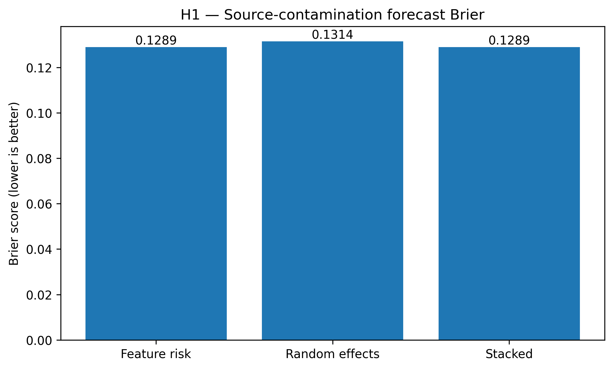

## 3. H2 — Greedy acquisition of dependence constraints

Marginal-only dependence bounds are safe but can be wide. H2 treats exact pairwise intersections from each fixture's supplied joint distribution as controlled observations and asks which three would most narrow the conclusion interval. At each step the policy evaluates every not-yet-observed pair and selects the one giving the smallest certified width; the comparator spends the same budget on the first three lexicographic pairs.

Across 128 fixtures, mean width is **0.326563** from marginals alone, **0.176527** after the lexicographic budget and **0.096687** after the greedy budget. Truth-containment failures: **0**. Chosen-step widening failures: **0**. The frozen target is **met**.

This is an oracle value-of-information experiment: it assumes the selected pairwise intersections can be supplied exactly. It does not show that those quantities are observable cheaply, that Jev scores are source reliabilities, or that a production estimator would preserve the same benefit.

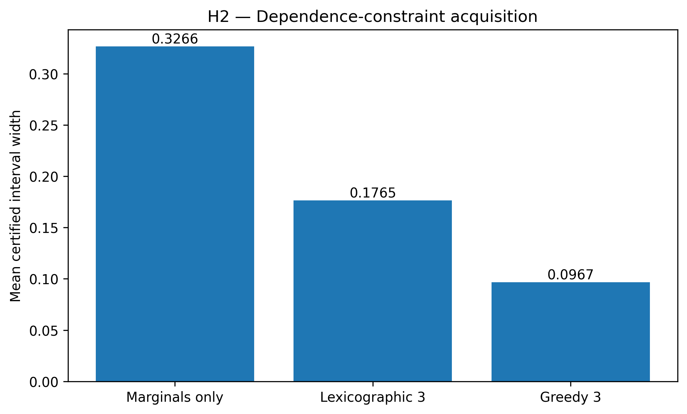

## 4. H3 — Separator-conditioned near-bipartite exact optimization

The prior flow certificate handles bipartite components but stages sufficiently large non-bipartite ones. H3 accepts a supplied separator of at most four vertices, verifies that deleting it leaves a bipartite graph, enumerates every independent separator choice and solves each residual branch with the existing certified bipartite solver. An invalid separator is not trusted; it stages.

The 128 small exhaustive fixtures have **0** oracle failures and **0** order/duplicate-invariance failures. Large residual-cycle results are 512→258/258, 1024→514/514, 2048→1026/1026, written as residual vertices → obtained/analytic utility. The current generic solver stages respectively **513, 1025, 2049** vertices on those fixtures. Malformed and non-transversal controls stage safely: **True**. The frozen target is **met**.

The supplied priorities and conflict edges remain premises. Exact maximum supplied-priority utility does not establish that a selected assertion is factually true.

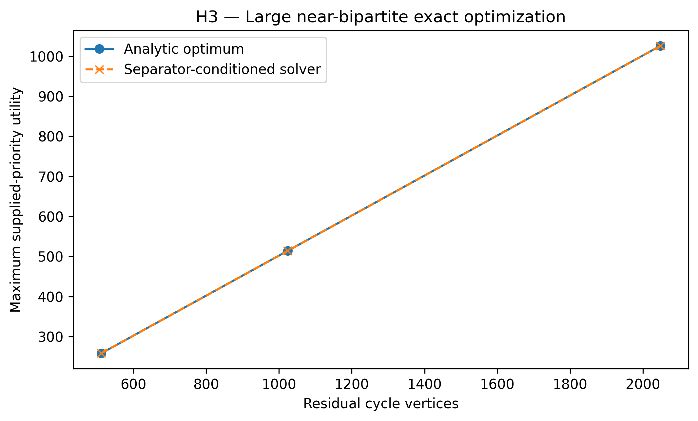

## 5. H4 — Reusable repair-margin singleton query index

The certificate query implementation recomputes a base optimum plus forced-in/forced-out alternatives for repeated questions. H4 precomputes each vertex's inclusion and exclusion margin once, then classifies any singleton query at any tested tolerance by comparing those margins with the tolerance threshold.

Across **2653** repeated singleton queries, classification mismatches are **0** and witness failures are **0**. Under the frozen top-level solve-count accounting, repeated queries require **7,959** invocations versus **1,814** for index construction, a **77.21%** reduction. A control using the existing query's realized early-exit count gives a still-separated descriptive reduction of **74.41%**. The frozen target is **met**.

This index is deliberately limited to singleton queries and in-memory top-level optimization calls. It is not a measured SQL/database speedup or a semantic guarantee.

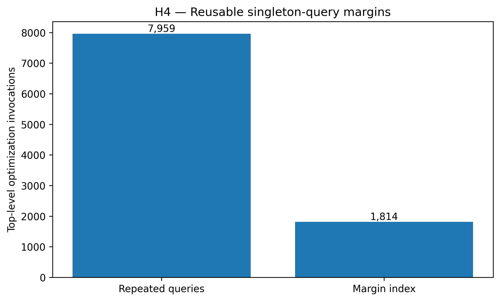

## 6. H5 — Interval-marginal dependence certificates

Previous dependence-safe methods remain conditional on exact atom marginals. H5 instead supplies each atom with a lower and upper probability and optimizes over all Boolean-world distributions whose marginals lie inside those intervals. Reported endpoints use independently checked, outward-padded dual bounds rather than treating numerical primal optima as certificates. Exact point marginals are a special case. Invalid, infeasible or over-cap inputs return a non-certifying [0,1] stage.

Across 128 arbitrary-joint fixtures, truth-containment failures are **0**. Mean point-bound width is **0.361057** and mean interval-marginal width is **0.467497**, exposing the cost of premise uncertainty rather than hiding it. On 20 deliberately biased singleton point estimates, the interval policy prevents **20/20** designed false admissions. Malformed inputs returning a certifying interval: **0**. The frozen target is **met**.

The interval itself is still a supplied assumption. If the real marginal falls outside it, the certificate can again be wrong. This test converts one known premise-error mode into explicit uncertainty; it does not validate how such intervals should be estimated from real sources.

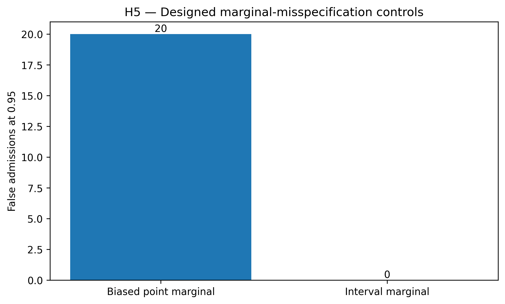

## 7. Interpretation and falsification boundary

The five experiments are intentionally heterogeneous. H1 asks whether two already observed forecast signals combine on reused response data. H2 asks whether a constrained information budget can reduce dependence uncertainty on finite controlled worlds. H3 and H4 test exact structural reuse. H5 asks whether uncertainty in the probability premises can be represented rather than ignored. Their pass/fail outcomes must not be pooled into a semantic success percentage.

The strongest remaining scientific boundary is unchanged: freeze a policy before observing a new source-disjoint, independently adjudicated corpus and compare full graph quality, downstream queries, provenance errors, reviewer mistakes, resource budgets and staging against appropriate external baselines. None of the controlled algorithmic passes can substitute for that prospective semantic evaluation.

## 8. Reproduction

```bash
python -m pip install -r graph_synthesis/post_certificates/requirements.txt
python -B -m graph_synthesis.post_certificates.run
python -B -m unittest discover -s graph_synthesis/post_certificates/tests -v
python -B -m graph_synthesis.post_certificates.run --check
python -B -m graph_synthesis.post_certificates.report --figures --update-paper
python -B -m graph_synthesis.render_current_paper --output manuscript/paper-current.pdf
```

The machine-readable results retain the controlled fixtures, selected pair constraints, optimization witnesses, development-only weights, uncertainty intervals and falsifying controls. The five PNG/SVG pairs and summary table are generated from those recorded results. Earlier study artifacts are not rewritten.

<!-- POST_CERTIFICATES_RESEARCH_END -->

# Do additional Jev calls improve graph edges?

Timothy Wayne Gregg — exploratory research addendum, September 18, 2026

## Design and evidence boundary

This study uses 73 development candidates in 40 connected source groups and 263 test candidates in 149 other groups. These are previously unused within the archived Jev runs, taken from public SciFact training data. They are not a new domain, private benchmark, or guaranteed absent from vendor training. The frozen protocol, data split, prompt implementation and seed were committed before calls in `2eb44a1`. No development tuning or test-based prompt/threshold selection occurred. All seven policies were retained.

The single arm uses the previous six-example relation contract. Repeated voting uses three identical-payload fresh calls. Blind voting combines the first answer with two different evidence-only reviewers that never see another answer. Targeted checks use a first judgment, six dimensional checks in one shared request, then adjudication against original evidence. Indexed evidence preserves every sentence and adds explicit IDs. Contrastive examples replace the six original demonstrations with six fixed synthetic boundary examples. Selective routing applies targeted checks only when the first maximum score is below 0.90 or the first call fails; it is reconstructed retrospectively because all branches were actually executed. Three targeted calls contain eight typed decisions, whereas three voting calls contain three. Neither agreement nor a mean score is treated as independent or calibrated evidence.

## Test results

| Policy | Correct / wrong edges | Precision | Recall | Macro-F1 | Errors / abstentions |
|---|---:|---:|---:|---:|---:|
| Single call | 132 / 18 | 88.00% | 86.27% | 0.8497 | 1 / 0 |
| Repeated vote | 131 / 18 | 87.92% | 85.62% | 0.8480 | 2 / 0 |
| Blind vote | 136 / 20 | 87.18% | 88.89% | 0.8503 | 3 / 0 |
| Targeted checks | 126 / 19 | 86.90% | 82.35% | 0.8363 | 21 / 0 |
| Indexed evidence | 132 / 19 | 87.42% | 86.27% | 0.8510 | 0 / 0 |
| Contrastive examples | 129 / 17 | 88.36% | 84.31% | 0.8426 | 0 / 0 |
| Selective routing | 133 / 20 | 86.93% | 86.93% | 0.8486 | 8 / 0 |


All 263 cases remain in classification denominators. Wrong polarity counts as an incorrect accepted edge and a missed gold edge. NOT_ENOUGH_INFO is a legitimate classification that creates no positive edge. Probability failures are not silently normalized or discarded.

## Equal accepted-edge volume

Each policy is ranked by its declared score, with ID tie-breaking, and restricted to the same 145 accepted edges. Scores order proposals; they are not comparable calibrated probabilities. This is an evaluation diagnostic, not a deployed threshold.

| Policy | Correct / wrong | Precision difference vs single | Paired 95% interval |
|---|---:|---:|---:|
| Single call | 128 / 17 | +0.00 pp | reference |
| Repeated vote | 128 / 17 | +0.00 pp | [-0.27, +0.27] pp |
| Blind vote | 127 / 18 | -0.69 pp | [-2.21, +0.29] pp |
| Targeted checks | 126 / 19 | -1.38 pp | [-4.37, +1.45] pp |
| Indexed evidence | 126 / 19 | -1.38 pp | [-3.26, -0.06] pp |
| Contrastive examples | 128 / 17 | +0.00 pp | [-0.40, +0.45] pp |
| Selective routing | 125 / 20 | -2.07 pp | [-4.92, +0.40] pp |


Intervals use 2,000 paired source-group bootstrap draws. They are pointwise, unadjusted and exploratory across multiple methods/endpoints, conditional on the selected ID sets and observed groups. Selected sets are fixed before resampling; per-draw edge counts can differ. Hidden cross-group dependence is not ruled out. Equal volume does not imply equal token budget.

## Calls, tokens and efficiency

| Policy | Test calls required | Test input tokens | Correct edges / million tokens |
|---|---:|---:|---:|
| Single call | 263 | 941,809 | 140.2 |
| Repeated vote | 789 | 2,825,427 | 46.4 |
| Blind vote | 789 | 1,387,869 | 98.0 |
| Targeted checks | 789 | 1,709,341 | 73.7 |
| Indexed evidence | 263 | 973,369 | 135.6 |
| Contrastive examples | 263 | 332,438 | 388.0 |
| Selective routing | 401 | 1,139,381 | 116.7 |

The entire executed study made 3,024 calls and used 6,858,163 reported input tokens, including development and every branch. There were 31 failed calls and 0 calls with unknown usage. The table attributes shared calls to each hypothetical policy; summing its rows would double-count them. Selective costs are retrospective required-call estimates, not separately observed routed-service latency. Single-call latency across actual requests was p50 370 ms, p95 483 ms and p99 764 ms; these are not end-to-end policy latencies.


## Error dependence and graph consequences


This heatmap counts wrong-label agreement on common-valid cases, not independent corroboration. Diagonal entries are individual error counts. Different prompts and repeated calls still share the same model and evidence.

| Policy | Complete and clean positive groups | Contaminated groups |
|---|---:|---:|
| Single call | 76/97 | 15/149 |
| Repeated vote | 75/97 | 15/149 |
| Blind vote | 78/97 | 17/149 |
| Targeted checks | 69/97 | 17/149 |
| Indexed evidence | 76/97 | 16/149 |
| Contrastive examples | 75/97 | 15/149 |
| Selective routing | 75/97 | 17/149 |


The graph is the first multi-candidate test group in sorted group-ID order, without selecting for favorable outcomes. Whole-group correctness is different from average edge precision. A clean but incomplete or empty graph is not full synthesis.

## Operational failures and secondary diagnostic

Across development and test, failures by call site were: {"adjudicate": 2, "base1": 1, "base3": 1, "blind1": 2, "blind2": 1, "checks": 24}. Error reasons were: {"Probabilities must sum to one": 28, "choice must be a highest-probability option": 3}. The six-question check request exposes multiple probability vectors to the strict validation rule. A single invalid prerequisite invalidates the targeted pipeline under the frozen policy; these failures are not repaired after observing test outcomes.

After observing these failures, we added a secondary **common-valid** diagnostic on the 239 test cases where every policy returned a valid decision. This outcome-conditioned subset does not replace the operational comparison or demonstrate deployment quality.

| Policy | Common-valid accuracy | Correct / wrong edges |
|---|---:|---:|
| Single call | 86.61% | 118 / 16 |
| Repeated vote | 86.61% | 118 / 16 |
| Blind vote | 87.87% | 123 / 18 |
| Targeted checks | 87.45% | 123 / 19 |
| Indexed evidence | 86.19% | 118 / 17 |
| Contrastive examples | 85.77% | 116 / 15 |
| Selective routing | 87.45% | 123 / 19 |

The first two repeated calls shared 36 wrong answers across 262 common-valid test cases; 36 had the same wrong label. This explains why an additional call need not supply new corrective evidence. The product of marginal error rates predicts 5.23 shared errors as a descriptive independence reference, not a hypothesis test.

The strongest efficiency lead is the shorter contrastive-example prompt: 64.70% fewer test input tokens than the single-call original-demonstration prompt, with equal wrong-edge count at matched volume. At its natural operating point it also recovers fewer correct edges. This is not a noninferiority or statistical-equivalence finding, and different demonstration content plus length prevents attributing the outcome to contrast alone.

## Interpretation

- **Repeated vote:** +0 correct edges versus single at equal volume; the interval includes zero; no resolved matched-volume advantage.
- **Blind vote:** -1 correct edges versus single at equal volume; the interval includes zero; no resolved matched-volume advantage.
- **Targeted checks:** -2 correct edges versus single at equal volume; the interval includes zero; no resolved matched-volume advantage.
- **Indexed evidence:** -2 correct edges versus single at equal volume; the interval is negative; an exploratory matched-volume degradation.
- **Contrastive examples:** +0 correct edges versus single at equal volume; the interval includes zero; no resolved matched-volume advantage.
- **Selective routing:** -3 correct edges versus single at equal volume; the interval includes zero; no resolved matched-volume advantage.

No policy is promoted automatically. A positive pointwise interval would still require independent confirmation and a matched-resource comparison before claiming general superiority. More calls can expose mistakes, reinforce the same error, or reject correct edges. These bounded claim–abstract decisions do not measure open-ended candidate discovery, database-scale synthesis, world-truth validation or safe unattended writes. Public training-data reuse, a single pinned service revision, synthetic contrast demonstrations, unequal prompt lengths, shared-context check dependence, and modest source-group counts limit generalization.

## Reproduction

The directory includes the pre-call plan/protocol/source snapshots, raw responses, decoded predictions, costs, source-group intervals, CSV tables, seven SVG/PNG figures and a deterministic graph example. `python -B -m graph_synthesis.analyze_multicall --directory experiments/jev-multicall-20260918 --verify` validates raw inputs/responses, split isolation and distinct repeat call sites, prohibits network access during replay, and reproduces predictions and analyses. `python -B -m graph_synthesis.report_multicall --directory experiments/jev-multicall-20260918` rebuilds this report and charts. Prior results and the original immutable manuscript remain separately archived.


---

# Prior same-data rerun and original study (historical evidence)

# Fresh Jev execution and graph-synthesis falsification

Timothy Wayne Gregg — updated research draft, September 18, 2026

## Evidence scope

This update executes a fresh pinned Jev 1.13.0 service run of the original development, calibration, evaluation, fixture, repeatability and batching protocol. It uses the same data and development-only selection rule. It is a same-data service repeat, not independent validation, a new preregistration, or a new training run. No evaluation labels were used to retune the prompts. The separate 48-case public synthetic challenge uses its exact gold-free exported inputs and fixed question contract; its AI-assisted labels remain provisional pending human adjudication.

## Fresh results

| Task | Run | Arm | Accuracy | Macro-F1 | Invalid responses |
|---|---|---|---:|---:|---:|
| entity_resolution | Original | baseline_noul | 98.0630% | 0.960452 | 0 |
| entity_resolution | Original | fewshot_contract | 99.2736% | 0.985860 | 0 |
| entity_resolution | Fresh | baseline_noul | 98.0630% | 0.960452 | 0 |
| entity_resolution | Fresh | fewshot_contract | 98.7893% | 0.976434 | 0 |
| relation_support | Original | baseline_choice | 85.2507% | 0.850824 | 1 |
| relation_support | Original | fewshot_contract | 84.9558% | 0.852728 | 2 |
| relation_support | Fresh | baseline_choice | 84.3658% | 0.843208 | 1 |
| relation_support | Fresh | fewshot_contract | 85.5457% | 0.856576 | 2 |


**entity_resolution:** selected-minus-baseline macro-F1 = +0.015982; exploratory paired 95% interval [-0.008627, +0.042517]. No resolved improvement in raw operational macro F1: the paired interval includes zero or evidence is unavailable.

**relation_support:** selected-minus-baseline macro-F1 = +0.013367; exploratory paired 95% interval [-0.017452, +0.042768]. No resolved improvement in raw operational macro F1: the paired interval includes zero or evidence is unavailable.

Entity baseline: 8 false merges and 0 missed matches. Service failures, if any, are separately retained in the table.
Entity selected: 3 false merges and 2 missed matches. Service failures, if any, are separately retained in the table.

The intervention bundles explicit instructions, typed question format and demonstrations. These runs cannot isolate causal contributions of each ingredient. Intervals are conditional on development selection, unadjusted and exploratory. Repeating this test set does not increase its number of independent entities or documents.


Calibration temperatures are fitted on the separate calibration partition. Brier scores use valid eligible responses, while operational accuracy and F1 retain failures. Calibration changes probability scores, not the selected labels; improvements in one scoring rule do not establish calibrated transaction-level safety.

## Fresh repeatability and resource accounting

- entity_resolution / baseline_noul: 20/20 examples had identical labels across the three fresh responses; 0 pairwise argmax flips.
- entity_resolution / fewshot_contract: 20/20 examples had identical labels across the three fresh responses; 0 pairwise argmax flips.
- relation_support / baseline_choice: 19/20 examples had identical labels across the three fresh responses; 2 pairwise argmax flips.
- relation_support / fewshot_contract: 19/20 examples had identical labels across the three fresh responses; 1 pairwise argmax flips.

Across the original and fresh held-out evaluations (distinct from the within-run 20-case panels):

| Task / arm | Common valid pairs | Changed labels | Identical distributions |
|---|---:|---:|---:|
| entity_resolution / baseline_noul | 413/413 | 2 | 247 |
| entity_resolution / fewshot_contract | 413/413 | 2 | 341 |
| relation_support / baseline_choice | 337/339 | 3 | 209 |
| relation_support / fewshot_contract | 335/339 | 4 | 189 |

The main run records 3,404 logical calls, 3,404 HTTP attempts, 4,792,410 input tokens and 4 failed calls. Estimated cost at the original protocol price is $0.201281; this is not a current price quote or invoice. The challenge adds 48 requests and 22,880 input tokens. Probability variation remains distinct from label stability.

## Fresh synthetic challenge

Against provisional labels, Jev classified 46/48 correctly and got both cases correct in 22/24 paired groups. It accepted 35 positive edges, of which 2 were wrong. These small, public, hand-constructed cases are diagnostics, not a deployment-risk estimate.


| Case | Family | Provisional gold | Jev |
|---|---|---|---|
| case-027 | multi_hop_context | NOT_ENOUGH_INFO | REFUTES |
| case-038 | schema_typing | REFUTES | SUPPORTS |

The generic imported-journal evaluator retains `fresh_execution_verified: false`: hashes alone do not authenticate provider execution. The companion live execution audit and raw journals separately record the actual HTTPS responses and bind their requests. Gold labels, rationales, families and pair IDs were excluded from inference payloads.

## Reproduced graph falsification findings

PR #10's reference results reproduce exactly. On the original unequal-acceptance SciFact operating points, complete, error-free positive components fall from 140/164 to 126/164 with few-shot prompting, despite improved edge precision. The paired interval for the component difference is approximately [-13.30, -3.70] percentage points. This is not a matched-volume comparison and does not contradict the earlier unresolved matched-volume result. The formulations share 34 errors across 336 common-success examples, including 31 wrong-label agreements; their judgments are not independent corroboration. Five of 73 few-shot positive actions scored exactly 1.0 were wrong.


Candidate-loss bands describe variation over 100 synthetic removal masks, not confidence intervals or new retrieval measurements. Compiler witnesses remain constructed: a false identity bridge between two 100-record clusters induces 10,000 false cross-cluster identities; explicit retraction repairs them. Exact qualifier comparison misses overlapping temporal intervals. Twenty seeded repair episodes exercise 1,600 assertions and 782 withdrawals. These deterministic properties do not establish Jev factual correctness.

## Interpretation and next experiment

The original entity macro-F1 interval excluded zero; the fresh-run interval includes it. The descriptive entity advantage persists but its interval-based finding does not reproduce in this run. Neither task establishes a resolved fresh macro-F1 improvement. Independent identity-disjoint data and larger clusters remain necessary. Relation precision, recall, component completeness and total accuracy answer different questions. Do not select a universal winner from one metric, promote correlated fusion without matched-cost benefit, or infer production safety from typed outputs. Prioritize independent entity-matching confirmation and controlled ablations before further prompt tuning on this already inspected test set.

## Artifacts and reproduction

The run directory contains the frozen plan, captured source, raw requests/responses, prediction journal, calibration, analysis, verification, challenge evidence and figures. `python -B -m graph_synthesis.report_fresh_run --run-dir experiments/jev-rerun-20260918` regenerates this update and its four graphics without inference. The original study and its 161-file inventory remain unchanged. The current full manuscript incorporates this update before the original study as explicitly historical evidence.


---

<!-- FOLLOWUP_RESEARCH_START -->

# Follow-up: five evidence-driven improvements

This study builds on the ten-theory suite and the September 18 service rerun. **No fresh Jev requests were made in this follow-up.** H1-H3 replay captured observations; H4-H5 execute controlled algorithms against finite oracles. These are different evidence types, not five independent tests of improved model accuracy.

Baseline `1e03d0e7dfbf0b0deb1e39ecf133e66e05be141b`; protocol committed as `49975b97464ce4ee8e5c67250d6690aaebeaea73` before suite execution. Prior results were already known, so this is exploratory, not independent preregistration. Policies were not retuned after viewing the following outcomes.

## Summary of fixed operational targets

| Hypothesis | Evidence | Primary target met? |
|---|---|---|
| H1: Guarded probability calibration | Captured Jev replay | False |
| H2: Edge-aware economical routing | Captured-token routing counterfactual | True |
| H3: Cross-run stability gate | Paired captured observations | False |
| H4: Scope and interval conflicts | Finite controlled oracle | True |
| H5: Duplicate/shared-lineage bounds | Finite independent-event oracle | True |

A target pass is a point-estimate engineering result, not a statistically established general improvement. Do not pool the indicators into a success rate.

## H1: Guarded probability calibration

Tables label the original capture old and the September 18 rerun new; base denotes the baseline formulation.

The fresh rerun showed that optimizing log loss could worsen Brier score. The proposed change fits a temperature on half of the original calibration components, then chooses a raw/temperature mixture on the other half with a no-worse-Brier constraint. Both components of this mixture preserve label order. No rerun labels enter the fit.

For the primary relation few-shot arm, selected temperature is 8 and mixture weight is 0; fit/guard valid observations are 62/88.

| Task / arm | Run | Raw log loss | Temp log loss | Guard log loss | Raw Brier | Temp Brier | Guard Brier |
|---|---|---:|---:|---:|---:|---:|---:|
| Entity / base | old | 0.1067 | 0.0744 | 0.0744 | 0.0408 | 0.0317 | 0.0317 |
| Entity / base | new | 0.1067 | 0.0730 | 0.0730 | 0.0407 | 0.0317 | 0.0317 |
| Entity / few-shot | old | 0.0335 | 0.0269 | 0.0268 | 0.0184 | 0.0149 | 0.0150 |
| Entity / few-shot | new | 0.0333 | 0.0275 | 0.0270 | 0.0181 | 0.0154 | 0.0152 |
| Relation / base | old | 1.2415 | 0.5385 | 0.4535 | 0.2340 | 0.3048 | 0.2282 |
| Relation / base | new | 1.2402 | 0.5396 | 0.4546 | 0.2342 | 0.3036 | 0.2280 |
| Relation / few-shot | old | 1.2401 | 0.5435 | 1.2401 | 0.2306 | 0.3127 | 0.2306 |
| Relation / few-shot | new | 1.3207 | 0.5542 | 1.3207 | 0.2244 | 0.3151 | 0.2244 |

Primary target met: **False**. Rerun valid probability N=337; failures=2; label changes=0. Guard-minus-raw descriptive paired 95% component intervals: log loss [0.0, 0.0]; Brier [0.0, 0.0].

The no-harm constraint holds on the guard partition only. It is not an out-of-sample guarantee, and preserving labels means this intervention cannot improve classification accuracy. Temperature-only here is fitted on the same half-calibration data as the guarded method, not the larger full-calibration fit reported in the previous paper.


## H2: Edge-aware economical routing

The earlier macro-F1/cost cascade could save tokens while admitting more wrong relationships. This follow-up explicitly constrains correct edges, wrong edges and precision during calibration-only selection. Positive and negative baseline labels have separate escalation thresholds; failed baseline calls escalate. Always-few-shot is an explicit fallback that avoids unnecessary baseline cost.

Primary selected policy: `{"direct": false, "negative_threshold": 0, "positive_threshold": 0.95}`.
Earlier macro-F1 rule, refitted on the same original calibration: threshold 0.

| Task | Run | Policy | Correct edges | Wrong edges | Precision | Input tokens | Macro-F1 |
|---|---|---|---:|---:|---:|---:|---:|
| Entity | old | baseline | 350 | 8 | 97.77% | 174,370 | 0.9605 |
| Entity | old | fewshot | 349 | 2 | 99.43% | 627,844 | 0.9859 |
| Entity | old | macro cascade | 350 | 8 | 97.77% | 174,370 | 0.9605 |
| Entity | old | edge cascade | 349 | 2 | 99.43% | 237,835 | 0.9859 |
| Entity | new | baseline | 350 | 8 | 97.77% | 174,370 | 0.9605 |
| Entity | new | fewshot | 348 | 3 | 99.15% | 627,844 | 0.9764 |
| Entity | new | macro cascade | 350 | 8 | 97.77% | 174,370 | 0.9605 |
| Entity | new | edge cascade | 348 | 3 | 99.15% | 242,280 | 0.9764 |
| Relation | old | baseline | 187 | 37 | 83.48% | 258,495 | 0.8508 |
| Relation | old | fewshot | 172 | 20 | 89.58% | 1,213,458 | 0.8527 |
| Relation | old | macro cascade | 187 | 37 | 83.48% | 262,102 | 0.8524 |
| Relation | old | edge cascade | 175 | 21 | 89.29% | 449,791 | 0.8581 |
| Relation | new | baseline | 185 | 38 | 82.96% | 258,495 | 0.8432 |
| Relation | new | fewshot | 173 | 19 | 90.10% | 1,213,458 | 0.8566 |
| Relation | new | macro cascade | 185 | 38 | 82.96% | 262,342 | 0.8448 |
| Relation | new | edge cascade | 173 | 19 | 90.10% | 442,640 | 0.8566 |

Primary target met: **True**. Input-token saving 63.52%; correct-edge retention 100.00%. The joint target requires at least 20% saving, 98% retention, and no extra wrong edges versus all-few-shot.

The edge-aware and all-few-shot rerun policies differ on 2 labels. These are recorded input-token counterfactuals, not measured new API latency or billing. Baseline requests are charged even when a fallback is needed. Calibration feasibility does not guarantee evaluation safety. A macro-F1-only success is not substituted for the stated graph target.

Descriptive paired 95% rate-difference intervals versus all-few-shot: correct edges [-0.008645533141, 0.008928571429]; wrong edges [0.0, 0.0]. This is not an equivalence test.


## H3: Cross-run stability gate

The intervention accepts only positive labels that agree across exact-input original/rerun observations. Compare it with rerun confidence ranking and a uniform-random subset at exactly the same accepted volume. Stability is not independent corroboration; the two calls share model identity and evidence.

| Task / arm | Rerun correct / wrong | Stable correct / wrong | Matched confidence wrong | Random expected wrong | Retention |
|---|---:|---:|---:|---:|---:|
| Entity / base | 350 / 8 | 350 / 7 | 7 | 7.978 | 100.00% |
| Entity / few-shot | 348 / 3 | 348 / 2 | 2 | 2.991 | 100.00% |
| Relation / base | 185 / 38 | 185 / 37 | 37 | 37.830 | 100.00% |
| Relation / few-shot | 173 / 19 | 170 / 18 | 17 | 18.604 | 98.27% |

Primary target met: **False**. The primary arm has 335 common-valid pairs, 45 double errors and 45 agreements on a wrong label; 5 stable wrong positive edges have rerun score exactly one.
Two-run input cost is 2,426,916 versus 1,213,458 for the rerun alone.

Uniform-subset counts are exact expectations, not new random experiments or a significance test. Small volume reductions are not evidence of superiority when matched-volume confidence does better. A same-data repeat does not double the number of independent documents.


## H4: Scope- and interval-aware conflicts

Exact qualifier equality can miss contradictory assertions valid over overlapping time ranges. The opt-in guard checks half-open integer interval intersection, compatible known scope, polarity, and explicitly declared functional predicates. Unsupported/missing qualifiers return unknown and must be staged rather than silently accepted. It does not select which contradictory assertion is true.

Executed 5,408 exhaustive supported pairs, including 1,160 oracle conflicts.
| Guard | Missed conflicts | False conflict flags |
|---|---:|---:|
| exact_qualifier | 1108 | 0 |
| interval_scope | 0 | 0 |
| qualifier_blind | 0 | 1544 |

Unknown/malformed cases staged: 5/5. Primary target met: **True**.

The independent oracle enumerates integer instants. This exhausts the declared finite fixture space, not arbitrary interval semantics or extracted real-world qualifiers. No production GraphStore policy is changed, and correct qualifier extraction remains untested.


## H5: Duplicate/shared-lineage probability bounds

Alternative proofs cannot be treated as independent when they share sources. This intervention deduplicates identical atom sets, connects overlapping proofs, bounds each component using maximum and summed proof probabilities, and combines disjoint components only under the supplied independent-atom model. An independent finite-state enumeration supplies exact probabilities.

Executed 1,536 configurations from 384 parameter/proof settings with 1, 2, 5 and 20 copies. These copies are interventions, not independent samples.

| Aggregator | False admissions at 0.95 | Correct high-probability admissions |
|---|---:|---:|
| dedup_or | 44 | 364 |
| lineage_lower | 0 | 336 |
| naive_or | 628 | 364 |

Bound violations: 0; duplication-invariance failures: 0. Mean interval width 0.1014, maximum 0.6000. Exact high-probability configurations: 364. Primary target met: **True**.

The conservative lower-bound gate loses 28 correct high-probability admissions compared with naive aggregation; lower false confidence comes with a retention cost.

**Negative control:** falsely declaring two aliases for one source independent produces lower bound 0.96 for actual probability 0.80, and incorrectly passes the 0.95 gate. Thus lineage discovery and provenance integrity are necessary, not optional implementation details.

These probabilities concern synthetic sufficient-proof validity events, not actual scientific truth. **Raw Jev confidence is not a certified primitive-event probability.** The control shows what the algorithm can guarantee under supplied assumptions and exactly how those assumptions can fail.


## Source separation, uncertainty and limitations

Both original/rerun empirical evaluations contain 339 relation candidates and 413 entity pairs; they are repeated observations of the same items. Original calibration component counts and purge audit are in results.json. Group construction uses claim/document or record IDs, not gold identity groups. Exact response reconstruction and pinned SHA-256 checks run before every analysis.

H1 and H2 intervals use 1,000 paired connected-component bootstrap draws with seed 20260918. They are descriptive 95% intervals, unadjusted for multiple comparisons. No p-value, confirmatory claim, external-model win, candidate-generation recall improvement or deployed graph-risk guarantee is inferred. Invalid responses remain operational errors, with explicit valid-only probability denominators. The source-disjoint independent corpus and matched KARMA comparison remain unexecuted.

## Reproduction and implementation status

```bash
python -B -m unittest discover -s graph_synthesis/followup/tests -v
python -B -m graph_synthesis.followup.run --check
python -B -m graph_synthesis.followup.report --figures --update-paper
python -B -m graph_synthesis.render_current_paper --output manuscript/paper-current.pdf
```

All numerical findings are generated from results.json. Existing frozen evidence and the default compiler remain unchanged. The methods are opt-in research implementations, not validated production replacements. All conclusions remain an AI-assisted author-review draft. See [PROTOCOL.md](../graph_synthesis/followup/PROTOCOL.md) for the frozen criteria and [CLAIM_EVIDENCE.md](../graph_synthesis/followup/CLAIM_EVIDENCE.md) for evidence boundaries.

<!-- FOLLOWUP_RESEARCH_END -->

# Original study (historical evidence; unchanged text)

---
title: "Improving Typed Entity Decisions with Jev: A Reproducible Same-Model Case Study"
subtitle: "Positive evidence for bibliographic matching, an inconclusive relation-verification result, and explicit limits on repeatability"
date: "2026-09-18"
bibliography: "references.bib"
---

# Manuscript status

This is a detailed empirical manuscript draft grounded in the completed `run-20260918` artifacts. It is suitable for author review and development into a paper, not a claim of submission readiness. Author names, affiliations, contributions, funding, conflicts of interest, venue format, and final data-distribution permissions require the authors' confirmation. No independent replication, new adjudicated dataset, or additional experiment is implied by packaging the study.

The [frozen protocol](../reproduction/results/jev/PROTOCOL.md), [complete results](../reproduction/results/jev/run-20260918/RESULTS.md), [methods supplement](../supplementary/METHODS_AND_REPRODUCIBILITY.md), and [submission-readiness assessment](../supplementary/SUBMISSION_READINESS.md) are companion documents. Citation keys refer to the package bibliography. Tables below are rounded presentations; machine-readable artifacts retain full precision.

# Abstract

Typed semantic decision services offer bounded outputs, but the quality and repeatability of those outputs must be measured on the intended task. We investigate whether changes to request formulation improve a fixed Jev model without replacing or fine-tuning it. A locally frozen protocol compares four formulations per task, selects one alternative using 60 training-derived development examples, fits scalar temperature calibration on a separate split, and evaluates the retained alternative against a corrected baseline. On 413 identity-disjoint DBLP–ACM bibliographic pairs, a bundled intervention comprising explicit identity instructions, a typed Choice contract, and six training demonstrations raises operational macro-F1 from 0.9605 to 0.9859. The paired 95% percentile bootstrap interval for the difference is [0.0010, 0.0540]. Predictions of identity on different-entity pairs fall from 8/63 to 2/63, while missed matches increase from 0/350 to 1/350. On 339 SciFact claim–cited-abstract examples, selected-formulation macro-F1 changes from 0.8508 to 0.8527, with an interval spanning zero. Calibration has task- and metric-dependent effects. Cached replay reconstructs all 3,644 predictions exactly; three fresh calls on 20 fixed examples per task preserve selected-formulation labels while probabilities vary. The study uses 3,405 HTTP calls and 4.79 million input tokens, with approximately $0.20 estimated provider charges. These results support further independent evaluation of the entity-matching formulation, not general Jev superiority, a causal claim about demonstrations alone, or a guarantee of safe graph mutation.

**Keywords:** entity resolution; typed decisions; Jev; scientific claim verification; calibration; reproducibility; probabilistic interfaces.

# 1. Introduction

Entity resolution and evidence verification are consequential components of knowledge construction. A system that conflates two publications may attach subsequent information to the wrong identity. A system that mistakes a related abstract for support may preserve a well-formed but unsupported claim. Typed outputs make these decisions easier to parse and inspect, but they do not determine whether the decisions are correct.

This study examines a narrower and directly testable question than autonomous graph synthesis: **with the decision service, candidate records, and candidate evidence fixed, can request formulation improve Jev's decisions in a repeatable experiment?** The practical objective is an improved decision component whose benefits and failure modes can be traced to saved observations. End-to-end graph construction, candidate discovery, cluster consistency, database mutation, and schema evolution are outside the experiment.

The study uses TypeSafe's Jev service with the requested model identifier `jev-1.13.0`. Its documented interface accepts shared state and typed questions, including Choice distributions over supplied alternatives and Noul probabilities for propositions [@typesafe_api_2026; @typesafe_choice_2026; @typesafe_noul_2026]. We compare a valid generic baseline with explicit task criteria, a task-specific alternative primitive where applicable, and training demonstrations. A corrected transport and parser are shared by all arms. Repairing a broken integration is therefore distinguished from improving semantic classification.

Two tasks test whether an apparently helpful intervention transfers across decision types. Bibliographic entity matching asks whether two supplied records describe the same publication. Scientific claim verification asks whether a supplied abstract supports, refutes, or leaves unresolved a supplied claim. Both tasks use fixed candidates; neither includes retrieval. The same local selection procedure chooses the demonstration-bearing formulation for both tasks. The evaluation outcomes differ: entity matching improves on the primary metric, whereas claim verification does not show a resolved gain.

The empirical contributions are threefold. First, we provide a bounded same-model comparison with separate demonstration, development, calibration, and evaluation uses of data. Second, we report a positive bibliographic matching result alongside its costs, error tradeoff, task-specific uncertainty, and an inconclusive companion result. Third, we provide an auditable experiment record that distinguishes deterministic reconstruction of stored service outputs from variation in fresh service calls. These are contributions of an empirical case study and its artifact package. We make no priority claim for typed classification, prompt engineering, few-shot learning, temperature scaling, or using Jev for entity matching.

# 2. Related work and positioning

Entity matching has established supervised and language-model approaches. Ditto frames matching using pretrained language models and provides the serialized DBLP–ACM source used here [@li2020ditto]. This study does not rerun Ditto or evaluate a new matcher architecture. It reuses source records under a custom identity-disjoint split and changes requests to one fixed remote model. Published scores on another split or protocol are not directly comparable with the scores reported here.

SciFact provides scientific claims, abstracts, and evidence annotations [@wadden2020scifact]. Our derived task classifies supplied cited abstracts from official development claims. It does not evaluate open-corpus evidence retrieval, rationale extraction, or the complete original benchmark. The repository's internal task name, `relation_support`, should be read as evidence classification in this paper; it does not mean that the experiment evaluated arbitrary graph relations.

TypeSafe already documents entity alignment with Jev and a cascade combining generative extraction with Jev verification [@typesafe_entity_alignment_2026; @typesafe_extraction_cascade_2026]. Accordingly, using Jev for entity resolution is not a novelty claim. The present study asks whether specific changes improve measured outcomes over a corrected baseline on fixed records and preserves the evidence necessary to audit that comparison. Vendor documentation establishes interface semantics; it is not independent evidence of task accuracy or calibration.

Temperature scaling is an established postprocessing approach to calibration [@guo2017calibration]. Here it is applied to clipped log probabilities returned by the service, rather than to internal model logits. This distinction matters because output quantization and clipping can discard information unavailable to the calibrator. Positive scalar temperature normally preserves the top-label ordering; its effect is evaluated with probability metrics rather than credited as an accuracy improvement.

Paired resampling and careful selection of the statistical test are established practices in evaluating language-processing systems [@koehn2004significance; @dror2018testing]. Our bootstrap implementation preserves dependence between arms and resamples claim/document components for SciFact. These intervals are conditional on the selected formulations and observed service outputs. They neither repeat the entire selection process nor establish robustness across model deployments or datasets.

# 3. Research questions and scope

The primary question is whether the best predeclared nonbaseline formulation selected on development data improves operational macro-F1 over the corrected baseline on the fixed evaluation split. The question is evaluated separately for each task. The study additionally asks how probability calibration, fresh-call variation, batching, integration failures, and token use affect interpretation.

The protocol was locally frozen at **2026-09-18 00:41:53 UTC**, before live development. The executable manifest was created before research requests began at 00:50:07 UTC. The protocol is a timestamped local design record, not an external preregistration. Public labels and original fixtures had already appeared in earlier repository research. They were held out from this Jev selection procedure, not independently blinded from the research environment. Both qualifications limit confirmatory interpretation.

The requested model identifier, candidate evidence bytes, label meanings, parser validation, and scoring procedure are fixed. The few-shot arm deliberately adds six labeled training examples. It therefore receives additional training information and consumes additional tokens, although the evaluated candidate and its evidence remain unchanged. The entity-matching primary comparison bundles instructions, a Noul-to-Choice change, explicit option descriptions, demonstrations, and their request context. It cannot identify the separate causal effect of demonstrations or of any other one component.

# 4. Data construction

## 4.1 Scientific claim verification

The source is the pinned SciFact release archive, checked against a recorded SHA-256 digest. For each claim, the preprocessing code creates one row per supplied cited document. It uses the document's complete abstract, preserves the actual claim, and maps annotated `SUPPORT` and `CONTRADICT` labels to `SUPPORTS` and `REFUTES`. A cited document with no corresponding evidence annotation is assigned `NOT_ENOUGH_INFO`. This operational label derivation is part of the experiment; an absence of a dataset annotation is not an independent proof that a document is semantically irrelevant.

Official development claims supply the evaluation rows. Whole training claims are purged if any cited document or duplicate abstract overlaps evaluation; 272 training claims are removed. Connected components link claims, documents, and identical abstract content. The remaining training components are divided deterministically into training and calibration. The result is 459 training rows, 150 calibration rows, and 339 evaluation rows. Evaluation contains 247 connected components and 138 SUPPORTS, 71 REFUTES, and 130 NOT_ENOUGH_INFO labels.

The service receives only the supplied claim and abstract sentences. Gold labels and rationale sentence indices are not used to select evidence or appear in the evaluated input. The full abstract is available; there is no gold-rationale extraction advantage.

## 4.2 Bibliographic entity matching

The source is the DBLP–ACM serialization in Ditto revision `52985564a93fb11308439516d3e17a033d43ec8f`. The original train, validation, and test source files are pooled for a new split. Each record's serialized attributes are parsed into a structured object, and hashes identify exact record representations. Positive pair labels define identity components for grouping. These labels are used to create disjoint partitions, not as input features for the evaluated record pair.

Seven conflicting serialized pairs cause their affected identity components to be quarantined, excluding 92 pairs. No additional inconsistent positive component is found by the subsequent consistency check. Identity components are assigned deterministically to training, calibration, or evaluation with nominal 60/20/20 hash buckets. Pairs crossing partitions are dropped, removing 5,623 pairs. Calibration and evaluation then use deterministic maximal matchings over identity components so that no underlying identity is reused within each held-out set. This removes another 457 calibration candidates and 536 evaluation candidates.

The final splits contain 4,592 training, 390 calibration, and 413 evaluation pairs. The evaluation pairs are identity-disjoint but not a representative random sample of all candidate pairs. In particular, the label mixture changes from 1,309 same versus 3,283 different in training to 350 same versus 63 different in evaluation. Cross-partition filtering and maximal matching sacrifice coverage to reduce dependence. This selection-induced shift limits extrapolation to production candidate populations and comparison with standard DBLP–ACM results.

## 4.3 Development, demonstrations, and diagnostic fixtures

Each task uses six deterministically chosen training demonstrations and 60 additional training-derived development rows. SciFact demonstrations contain two examples per class from distinct components. Entity demonstrations contain three same and three different pairs with no reused identity. Negative entity demonstrations prioritize a lowercased-title `difflib.SequenceMatcher` ratio of at least 0.65; seeded hashes order candidates within priority tiers. If a tier lacks enough eligible examples, the deterministic ordering continues into the remaining candidates. Selection uses labels and lexical similarity, not Jev performance.

Development selection excludes every demonstration component or identity. SciFact then selects one row per component; entity matching greedily selects identity-disjoint pairs. The fixed seed is `20260917`. The achieved development compositions are 18 SUPPORTS, 15 REFUTES, and 27 NOT_ENOUGH_INFO for SciFact, and 21 same versus 39 different for entity matching. Remaining training rows do not train a model in this experiment.

Two original repository fixture sets provide secondary diagnostics: 50 relation examples and 100 entity examples. Of the entity fixtures, 88 have binary labels and 12 are marked uncertain. The latter are retained in response records but excluded from binary correctness and probability metrics. The fixtures have development history and lack independent adjudication; they are not a second natural-data benchmark or a valid source of confirmatory sample size.

**Table 1. Data used by the same-model study.** Demonstrations and development are disjoint subsets of prepared training, rather than extra public-data splits.

| Task | Prepared training | Demonstrations | Development | Calibration | Evaluation | Evaluation resampling unit |
|---|---:|---:|---:|---:|---:|---|
| SciFact cited-abstract classification | 459 | 6 | 60 | 150 | 339 | 247 connected components |
| DBLP–ACM identity matching | 4,592 | 6 | 60 | 390 | 413 | 413 identity-disjoint pairs |

# 5. Decision formulations and execution

## 5.1 Valid baseline and probability interpretation

All arms use the same repaired adapter and `jev-1.13.0` request. The earlier integration sent obsolete or incorrect field meanings and mishandled returned probabilities. The study adapter instead sends documented `state`, `questions`, `instructions`, and `criteria` fields; maps Choice probabilities separately from its selected-string output; and fails on a missing Noul response. Those shared repairs establish a meaningful baseline and are not included in the semantic improvement claim [@typesafe_api_2026].

For a Choice result, the canonical distribution maps option identifiers explicitly to task labels. A Noul value supplies P(yes), mapped to P(same) and P(different) for identity questions [@typesafe_choice_2026; @typesafe_noul_2026]. Vendor confidence and the maximum canonical probability remain distinct quantities. Neither is multiplied by the other as if it were independent evidence; the documented confidence describes distribution shape [@typesafe_confidence_2026].

The adapter rejects wrong identifiers, label keys, missing values, nonfinite numbers, out-of-range values, and distributions whose sums violate the frozen tolerance. It validates the reported model identifier. A matching identifier does not prove immutable remote weights. Raw responses, including rejected distributions, are retained. Errors remain operational failures rather than being replaced by a neutral distribution.

## 5.2 Arms

**Table 2. Predeclared formulations.** Exact byte-level question specifications and demonstrations are in `plan.json`.

| Task | Arm | Formulation |
|---|---|---|
| SciFact | `baseline_choice` | Generic support/refute/insufficient-information Choice with canonical label names. |
| SciFact | `evidence_contract` | Choice with explicit entailment, contradiction, and insufficiency criteria, including scope, negation, qualifiers, and population. |
| SciFact | `conditional_nouls` | Binary support question and a second refutation question explicitly conditional on lack of support; fixed chain mapping. |
| SciFact | `fewshot_contract` | Evidence-contract Choice plus six labeled training examples and instruction to classify only the current input. |
| Entity matching | `baseline_noul` | Generic proposition that the two records refer to the same underlying entity. |
| Entity matching | `identity_contract` | Choice with explicit same/different identity criteria and instructions covering missing fields, spelling variation, relatedness, and distinct publications. |
| Entity matching | `identity_noul` | Refined identity instructions with the Noul primitive. |
| Entity matching | `fewshot_contract` | Identity-contract Choice plus six labeled training examples and instruction to classify only the current input. |

For the conditional Noul arm, let `s` be the support answer and `r` the answer to refutation conditional on no support. The constructed score is

\[
p(\mathrm{SUPPORTS})=s,\qquad
p(\mathrm{REFUTES})=(1-s)r,\qquad
p(\mathrm{NEI})=(1-s)(1-r).
\]

This mapping normalizes valid binary values by construction. It does not demonstrate that independently produced semantic judgments form a calibrated joint model. Both answers must validate for the logical arm prediction to succeed.

## 5.3 Batching, selection, and frozen evaluation

During development, the three non-few-shot arms share the same evidence state in one request. Few-shot arms use a separate state containing demonstrations and the current input, so baseline requests receive no demonstrations. The changed co-question context is recorded and later examined with a batching control. All evaluation comparisons use only the baseline and selected arm; unselected variants are not promoted after evaluation inspection.

For each task, the selected alternative maximizes development operational macro-F1 over the three nonbaseline variants, breaking ties by lower full-sum Brier score and then lexical arm identifier. The rule selects an alternative even if no alternative exceeds the baseline. The selection is recorded before calibration fitting or evaluation calls. Both tasks select `fewshot_contract`. On entity development, all three refined alternatives reach macro-F1 1.0, and Brier determines the winner. Therefore, evaluation cannot establish that the demonstration-bearing arm is better than the two unselected identity formulations.

The runner enforces four concurrent requests, at most two retries per request, a 4,000-attempt cap, and a 20-million-input-token accounting cap. No retries occur in the completed run. Requests go to the fixed documented TypeSafe endpoint. Exact payload hashes distinguish stored responses from fresh repeats; a resumed stage reuses recorded responses rather than silently issuing new inference.

# 6. Calibration, metrics, and statistical analysis

## 6.1 Temperature fitting

One scalar temperature is fitted separately for each task's baseline and selected arm using only valid responses in the reserved calibration split. For a canonical probability vector `p`, the transformation is

\[
p_T(k)=\frac{\exp(\log(\max(p(k),10^{-15}))/T)}
{\sum_j\exp(\log(\max(p(j),10^{-15}))/T)}.
\]

The scalar lies in `[0.05, 20]` and minimizes mean natural-log loss. The procedure includes `T=1` and prefers it for equal minima. Temperatures, fit membership, and diagnostics are frozen before evaluation. Calibration applies to the existing evaluation responses and incurs no new model call. It changes confidence estimates while preserving label ranking except possible clipping ties.

## 6.2 Classification and probability metrics

The primary endpoint is selected-minus-baseline **operational macro-F1** on all eligible evaluation rows. For each canonical class, failures contribute false negatives for the true class. `ERROR` is not a new semantic class included in the macro average. Accuracy counts every service failure as incorrect. Balanced accuracy, confusion matrices, class-specific metrics, and failure counts are reported alongside the primary endpoint.

Probability scores use valid responses. Brier is the mean full sum of squared deviations across all canonical labels, including both binary coordinates, so its range is 0 to 2. Log loss uses natural logarithms and clips gold probabilities at `10^-15`. Different service-success sets can confound unpaired probability comparisons; paired probability deltas therefore use only common-success rows. Separate common-success classification analysis assesses sensitivity to operational failures.

For entity matching, the reported false-merge rate is `predicted same and gold different / gold different`. This is a false-positive rate among negative pairs, not the fraction of predicted merges that are false. A false merge here means an incorrect identity prediction: no database merge is executed, and downstream cluster damage is not measured.

Ten fixed confidence bins and fixed confidence thresholds `0, 0.5, 0.7, 0.8, 0.9, 0.95` describe reliability and accuracy/coverage. These analyses do not choose a deployment threshold using evaluation labels or establish an automatic-mutation risk bound.

## 6.3 Paired uncertainty intervals

The analysis uses 2,000 paired percentile bootstrap draws with seed `20260917`. For SciFact, a draw samples connected claim/document components and retains all constituent rows. For entity matching, it samples identity-disjoint evaluation pairs. Both arms use the same sampled units in each draw, and nonlinear metrics are recomputed. Probability comparisons restrict to common-success responses.

The reported 95% intervals are unadjusted exploratory intervals, conditional on fixed development selection, calibration data, model identifier, and recorded responses. They do not incorporate uncertainty from rerunning prompt selection, choosing a different split, changing demonstrations, or service evolution. The two task endpoints and additional secondary measures are not presented as familywise-controlled discoveries.

# 7. Results

## 7.1 Development selection

**Table 3. All predeclared development arms.** Each row has 60 eligible examples. The probability denominator is 59 for the three non-few-shot SciFact variants because one shared request fails validation, and 60 otherwise.

| Task | Arm | Accuracy | Macro-F1 | Brier | Errors |
|---|---|---:|---:|---:|---:|
| SciFact | Baseline Choice | 0.7833 | 0.7932 | 0.2838 | 1 |
| SciFact | Evidence contract | 0.8333 | 0.8419 | 0.2379 | 1 |
| SciFact | Conditional Nouls | 0.8500 | 0.8576 | 0.2249 | 1 |
| SciFact | Few-shot contract, selected | 0.9000 | 0.8963 | 0.1977 | 0 |
| Entity matching | Baseline Noul | 0.9833 | 0.9819 | 0.0411 | 0 |
| Entity matching | Identity contract | 1.0000 | 1.0000 | 0.0192 | 0 |
| Entity matching | Identity Noul | 1.0000 | 1.0000 | 0.0323 | 0 |
| Entity matching | Few-shot contract, selected | 1.0000 | 1.0000 | 0.0092 | 0 |

The larger SciFact development gain does not predict a resolved evaluation gain. This discrepancy is evidence for retaining the frozen selection/evaluation separation, rather than selecting a different prompt after seeing evaluation results.

## 7.2 Primary held-out comparisons

**Table 4. Raw operational evaluation results.** Intervals are selected minus baseline. Accuracy and macro-F1 use all eligible rows, including failures.

| Task and measure | Baseline | Selected | Difference | Paired 95% interval |
|---|---:|---:|---:|---|
| Entity accuracy, N=413 | 0.9806 (405/413) | 0.9927 (410/413) | +0.0121 | [0.0000, 0.0242] |
| Entity macro-F1 | 0.9605 | 0.9859 | +0.0254 | [0.0010, 0.0540] |
| Entity false-merge rate, 63 negatives | 0.1270 (8/63) | 0.0317 (2/63) | −0.0952 | [−0.1739, −0.0308] |
| SciFact accuracy, N=339 | 0.8525 (289/339) | 0.8496 (288/339) | −0.0029 | [−0.0380, 0.0310] |
| SciFact macro-F1 | 0.8508 | 0.8527 | +0.0019 | [−0.0314, 0.0337] |

Entity matching improves on the predeclared primary endpoint in this split: the unadjusted macro-F1 interval is above zero. The accuracy interval includes zero. All 413 responses validate for both arms, so the matching improvement is not explained by differing service-success coverage. The selected arm reduces false-positive identity predictions but introduces one missed match. It is a promising formulation for subsequent validation, not an error-free matcher.

SciFact does not show a resolved primary improvement. Baseline has one failed evaluation response and the selected arm has two. Restricting classification to the 336 rows where both succeed yields the same accuracy, 0.8542, and macro-F1 0.8512 versus 0.8545. The common-success macro-F1 difference is 0.0033, with an interval [−0.0286, 0.0353]. Thus, excluding failures does not reverse the task-level conclusion.


**Figure 1.** Selected-minus-baseline held-out effects and paired bootstrap uncertainty. Positive macro-F1 differences favor the selected formulation; lower Brier and false-merge rate are better. The figure is generated from saved results, not from additional inference.

## 7.3 Probability quality and calibration

**Table 5. Evaluation probability metrics.** Lower is better. Each arm's raw and calibrated values use the same successful response set. SciFact denominators are 338 baseline and 337 selected; entity denominators are 413 for both.

| Task | Arm | Temperature | Raw Brier | Calibrated Brier | Raw log loss | Calibrated log loss |
|---|---|---:|---:|---:|---:|---:|
| Entity matching | Baseline | 0.2997 | 0.0408 | 0.0312 | 0.1067 | 0.0653 |
| Entity matching | Selected | 0.6239 | 0.0184 | 0.0156 | 0.0335 | 0.0261 |
| SciFact | Baseline | 4.8030 | 0.2340 | 0.2769 | 1.2415 | 0.5639 |
| SciFact | Selected | 3.1500 | 0.2306 | 0.2505 | 1.2401 | 0.6256 |

On entity matching, the selected arm's raw Brier reduction is 0.0225, with a paired interval for selected minus baseline of [−0.0333, −0.0122]. Calibration also reduces both entity arms' evaluation Brier and log loss. On SciFact, temperatures above one soften the distributions: evaluation log loss improves markedly within each arm, while Brier worsens. Calibration is therefore not uniformly beneficial across scoring rules. After calibration, the selected SciFact arm has lower Brier than calibrated baseline on common-success rows, but its log loss is higher than calibrated baseline. Neither probability comparison supplies evidence for a classification gain.

Calibration uses 149/150 valid SciFact baseline responses and all 150 selected responses, and all 390 responses for each entity arm. Calibration log loss falls from 0.7950 to 0.4726 for SciFact baseline, 0.6125 to 0.4358 for SciFact selected, 0.0824 to 0.0117 for entity baseline, and 0.0175 to 0.0144 for entity selected. All fitted temperatures lie inside the declared interval. These fitted losses describe optimization on calibration data; the evaluation metrics are the relevant generalization check.

## 7.4 Confusion-based error analysis

**Table 6. Entity evaluation confusion.** Rows are gold labels. Columns are predictions.

| Arm | Gold | Same | Different | Error |
|---|---|---:|---:|---:|
| Baseline | Same | 350 | 0 | 0 |
| Baseline | Different | 8 | 55 | 0 |
| Selected | Same | 349 | 1 | 0 |
| Selected | Different | 2 | 61 | 0 |

The entity improvement is concentrated in recognizing distinct records. Recall for different pairs increases from 55/63 (0.8730) to 61/63 (0.9683), while recall for same pairs changes from 1.0000 to 0.9971. Balanced accuracy increases from 0.9365 to 0.9827. This pattern is consistent with the intended distinction between identity and superficial similarity, but the experiment does not establish that distinction as the causal mechanism: the selected intervention is bundled, and no independently adjudicated error taxonomy was collected.

**Table 7. SciFact evaluation confusion.** `NEI` abbreviates NOT_ENOUGH_INFO.

| Arm | Gold | SUPPORTS | REFUTES | NEI | Error |
|---|---|---:|---:|---:|---:|
| Baseline | SUPPORTS | 122 | 6 | 10 | 0 |
| Baseline | REFUTES | 4 | 65 | 2 | 0 |
| Baseline | NEI | 14 | 13 | 102 | 1 |
| Selected | SUPPORTS | 110 | 5 | 22 | 1 |
| Selected | REFUTES | 2 | 62 | 7 | 0 |
| Selected | NEI | 6 | 7 | 116 | 1 |

The selected SciFact formulation recognizes more NEI examples but misses more supported and refuted claims. NEI correct predictions rise from 102 to 116; correct SUPPORTS predictions fall from 122 to 110. This is a change in the error tradeoff, not a broadly improved verifier. A deployment valuing particular error types would require an explicit loss function and fresh validation of the resulting decision policy.

## 7.5 Original fixture diagnostics

On the 88 binary entity fixtures, baseline accuracy is 84/88 (0.9545) and selected accuracy is 87/88 (0.9886). Baseline makes three false-positive identity predictions among 12 negatives; selected makes none. Both miss one of 76 positive cases. The 12 uncertain cases are reported separately and receive no correctness credit.

On the 50 relation fixtures, accuracy changes from 46/50 (0.9200) to 45/50 (0.9000). These descriptive outcomes are compatible with the task-level distinction observed on public data, but they do not constitute independent confirmation. No fixture label drives prompt selection, calibration, or a claim of statistical significance.

# 8. Repeatability, operational behavior, and cost

## 8.1 Cached replay

An isolated copy of the run was replayed with HTTP access disabled. The runner reconstructed all 3,644 prediction records from the saved exact request/response journal without a network call. The replay check also reproduced byte-identical calls, predictions, calibration, and results when the copied original manifest was restored before analysis. Normal replay appends offline stage records to the copied manifest; this provenance change legitimately changes a regenerated report's manifest hash. The [replay proof](../reproduction/results/jev/run-20260918/replay_verification.json) records the comparison and hashes.

This establishes repeatable computation from recorded outputs. It does not show that the service returns the same output on another day or even on an immediate new request.

## 8.2 Fresh service calls

Twenty evaluation examples per task were fixed by seeded ID hashing before outcomes were inspected. Each retained arm produced three fresh outputs per example, comprising the original evaluation request and two additional requests with identical complete semantic payloads. These are distinct recorded HTTP calls; their existence does not reveal whether the provider uses an internal cache.

**Table 8. Fresh repeat panel.** Each row contains 20 examples, 60 fresh outputs, and 60 within-example pairwise comparisons. Pairwise comparisons are dependent and are not 60 independent examples. TV denotes total variation distance.

| Task | Arm | Examples with all three labels identical | Pairwise label agreement | Exact vector matches | Mean TV | Maximum TV |
|---|---|---:|---:|---:|---:|---:|
| Entity matching | Baseline | 20/20 | 60/60 | 32/60 | 0.0083 | 0.0500 |
| Entity matching | Selected | 20/20 | 60/60 | 51/60 | 0.0060 | 0.0900 |
| SciFact | Baseline | 19/20 | 58/60 | 35/60 | 0.0110 | 0.1400 |
| SciFact | Selected | 20/20 | 60/60 | 27/60 | 0.0207 | 0.2200 |

All repeated responses validate. Selected-arm labels are stable on this small immediate panel, but selected SciFact probabilities show the largest observed drift. The panel spans approximately 00:53–00:56 UTC on 2026-09-18. It does not establish bitwise determinism, multiday stability, or robustness to vendor changes. Stable labels also do not mean correct labels.

## 8.3 Batching sensitivity and validation failures

For each task, 20 preselected development examples compare original shared-state non-few-shot requests with fresh separate-question requests. All six task/arm combinations retain labels on all 20 examples, while probabilities vary. Maximum total variation ranges from 0.0200 to 0.0700. This is an exploratory systems control on development data. It is too small to establish general batching invariance or remove co-question context as a potential confounder.

Five calls produce probability vectors that fail the frozen normalization criterion. They occur in development, calibration, and evaluation and are retained as failures rather than renormalized after inspection. One failed shared development request affects three arm predictions. These events illustrate the distinction between a typed API contract and the stricter numerical contract required by an evaluator. They do not justify modifying validation selectively after observing performance.

## 8.4 Complete experiment resource accounting

**Table 9. Recorded resource use for the complete study, including the small toy-input probe and diagnostics.**

| Quantity | Recorded value |
|---|---:|
| HTTP calls / attempts | 3,405 / 3,405 |
| Retries | 0 |
| Questions in request payloads | 3,726 |
| Arm prediction records | 3,644 |
| Input tokens | 4,792,778 |
| Output tokens | 139,613 |
| Calls with reported usage | 3,405 / 3,405 |
| Failed calls | 5 |
| Request latency p50 / p95 / p99 | 387.5 / 611.1 / 1,403.3 ms |
| Sum of recorded stage wall durations | 378.5 s |
| Estimated provider charges | USD 0.2013 |

The charge estimate uses the recorded documentation rate of $0.042 per million input tokens and zero output-token charge [@typesafe_models_2026]. It is not an invoice or a guarantee of future pricing. Token usage is summed once per call, including failed calls with known usage, rather than multiplied by the number of predictions produced by a shared request. All attempt usage is known in this run.

The recorded stage wall duration measures the inference stages under concurrency four. It is not total project labor, installation time, end-to-end execution time, or the sum of individual request latencies. The study does not establish an efficiency advantage over a specialist model or another service. Its few-shot arms incur extra context cost; low absolute provider charges do not by themselves establish a superior quality/cost tradeoff for deployment.

# 9. Reproducibility and artifact design

The package preserves exact question specifications, six demonstrations per task, candidate inputs, selected IDs, fixed source versions, data hashes, selected-arm identities, calibration fits, raw service responses, canonical predictions, runtime manifests, and analysis outputs. Source snapshots protect the relationship between an observation and the code used to parse and score it. Current source hashes are checked before replay or resumed live execution.

An independent artifact verifier checks phase completeness, training/development/held-out isolation, payload reconstruction, raw-response validation, operational point metrics, frozen selection and calibration timing, retry/token accounting, and fresh-repeat payload identity. Its [saved report](../reproduction/results/jev/run-20260918/verification.json) passes. This verifier recomputes point scores but does not independently regenerate the bootstrap intervals or rerun remote inference. Automated tests validate the implementation; their success does not substitute for independent scientific replication.

Offline reproduction needs the recorded responses and matching source, not an API credential. A fresh experiment requires a TypeSafe credential supplied through the process environment, a new run directory, and access to the pinned service and source data. Source byte changes intentionally fail hash checks until reviewed. The runner is not a crash-durable billing system: interruption after a response but before journal append can leave an unrecorded request and cause a later retry on resume. Recorded usage is auditable but is not a replacement for billing records.

The package's [methods supplement](../supplementary/METHODS_AND_REPRODUCIBILITY.md) provides execution detail, and its table generator derives presentation tables from saved artifacts. The original run is treated as immutable evidence. Subsequent experiments or corrected policies require a new record identifying what results were already known.

# 10. Limitations and threats to validity

**Selection and statistical uncertainty.** Development has only 60 examples per task and uses one deterministic selection. The confidence intervals condition on this selection, are unadjusted for multiple comparisons, and are based on one evaluation split. Entity macro-F1 clears zero only narrowly at the lower interval endpoint. Independent confirmation is required before treating the result as a general model improvement.

**Bundled intervention.** The entity contrast changes primitive, instructions, option definitions, demonstrations, and request context. Its gain cannot be attributed solely to six examples. Both refined identity alternatives without demonstrations already achieve perfect development macro-F1. They were not evaluated on the held-out set under this protocol. A subsequent factorial or otherwise controlled study needs new evaluation data.

**Population selection.** DBLP–ACM identity isolation and maximal matching substantially change the label distribution and exclude many candidate pairs. Results apply to the resulting bibliographic comparison set, not to all record linkage, all biomedical entities, or deployment candidate streams. Pairwise accuracy does not establish transitive cluster consistency or safe canonicalization.

**Evidence and labels.** SciFact uses cited abstracts supplied to the classifier, not retrieval. Derived NEI labels follow annotation absence, and source annotations are not newly adjudicated for this study. Dataset membership and labels were not independently blinded from earlier repository work. Original fixtures are especially limited by development history and uncertain labels.

**Service observability.** A requested and returned model identifier does not prove fixed weights, fixed inference infrastructure, or known training data. Potential pretraining exposure to public benchmarks is unknown. Fresh repeats cover only 20 examples per task in one short window. Probabilities vary even when labels agree.

**Probability interpretation.** Choice and Noul outputs, normalized chain scores, vendor confidence, and calibrated probabilities have different meanings. Successful scalar fitting does not guarantee subgroup reliability, distribution-shift robustness, or bounded transaction-level error. Quantization and strict validation affect coverage. The experiment provides no formal semantic-risk guarantee.

**External comparison and novelty.** No newly executed cross-model comparison is part of this study. Historical specialist and compiler experiments in the wider repository are separate evidence and cannot be silently pooled into a superiority claim. Neither generic Jev entity alignment nor few-shot prompting is novel. A publishable contribution needs appropriate positioning and comparison for its intended venue.

**Operational scope.** No graph mutations are committed, no graph lifecycle benchmark is run, and no human review policy is validated. False identity predictions may imply risks for downstream merges, but actual downstream damage, recall of candidate generation, cluster metrics, and correction cost remain unmeasured. The measured provider charge omits research labor and infrastructure overhead.

# 11. Data ethics, disclosure, and release considerations

The experiment sends public benchmark abstracts and bibliographic records, together with repository fixtures, to a third-party inference service. It does not collect participant data or evaluate clinical recommendations. Scientific claims in source documents remain dataset content; model classifications should not be interpreted as medical advice or independently verified world truth.

The SciFact source license distinguishes claims and annotations under CC BY 4.0 from abstracts under ODC-By 1.0; the Leipzig DBLP–ACM source page links to CC BY 4.0 [@scifact_license_2026; @leipzig_er_data_2026]. The package's source and licensing notes should be reviewed before public archival release, especially because plans and raw requests contain source text. These notices must be carried through to derived artifacts, and a repository code license does not replace dataset attribution requirements. Provider terms, provenance acknowledgments, and retention obligations should also be checked for the intended release.

API credentials are not stored in the research artifacts. Raw journals contain evidence text, requests, responses, and usage, not authorization headers. Pattern-based secret screening reduces accidental disclosure risk but is not proof that every possible sensitive string is absent. Authors must confirm the final public release contents.

The implementation, analysis, and drafting involved AI-assisted work. Human authors must review claims, citations, data permissions, and final manuscript text and supply accurate contributions and disclosures under the target venue's policy. No author list, affiliation, funding relationship, or vendor independence statement is inferred from the local workspace.

# 12. Discussion and next experiments

The immediate practical outcome is a candidate Jev formulation for bibliographic entity matching with fewer false-positive identity decisions on the chosen split. The result makes a focused entity-matching use case worth pursuing. The observed single missed match and residual false merges mean that risk-sensitive deployment still needs an explicit policy, representative validation, and downstream checks.

The companion SciFact result prevents a broader conclusion that the selected style universally improves Jev. Its development advantage, null evaluation effect, and changed confusion profile suggest that request formulation must be assessed task by task. More explicit criteria may redistribute errors without improving aggregate quality.

The next empirical step is an independent entity-matching confirmation with new identity-disjoint data and a preregistered primary endpoint. A controlled comparison should separate instruction refinement, primitive selection, demonstrations, and batching context; vary demonstration sets using declared seeds; and include relevant exact-match, lexical, specialist, and constrained-output baselines under matched evidence access. Confidence and review policies should be fitted on separate calibration data and evaluated at a declared loss or coverage target. Cluster-level and graph-update consequences require an additional experiment rather than a relabeling of pairwise scores.

Longer-term repeat panels should sample multiple days and record model identifiers and service metadata. For relation verification, revised prompts need fresh development data and a new evaluation set; the present evaluation set should remain an audit record rather than become an unacknowledged tuning set. A qualitative error taxonomy should be independently adjudicated before claiming a mechanism for the improvements.

# 13. Conclusion

A fixed Jev service benefits from a selected bundle of explicit identity instructions, a typed Choice contract, and six training demonstrations on one identity-disjoint bibliographic matching split. Operational macro-F1 rises from 0.9605 to 0.9859, while false-positive identity predictions decline from eight to two and one true match is missed. A parallel scientific claim-verification experiment shows no resolved classification gain. Calibration improves some probability metrics and worsens others; fresh probabilities vary despite mostly stable labels. The saved protocol, source, responses, and replay evidence make these findings inspectable and reproducible from recorded outputs. They support a narrow use case and a concrete independent-replication agenda, not a general claim about Jev superiority or autonomous graph correctness.

# References

The package bibliography supplies the citation entries used above. The source-verification notes distinguish interface documentation, original papers, dataset provenance, and remaining licensing or metadata questions.
