<!-- ADAPTIVE_RESEARCH_START -->

# Adaptive verification and joint conflict resolution for Jev graph synthesis

Timothy Wayne Gregg | AI-assisted author-review research extension | September 18, 2026

## Abstract

Following the multicall study, we execute five falsifiable improvements rather than assume that additional model calls improve graph quality. Compact disagreement routing saves 34.38% of recorded input tokens, preserves the single baseline's wrong-edge count, and recovers one additional correct edge, but misses its frozen 40% saving target. Dependency-safe fallback eliminates operational failures while admitting more incorrect relationships. Development-learned redundancy capping does not establish a matched-volume advantage. Group-aware review reduces source-group contamination under an explicitly simulated reviewer, and joint conflict optimization improves supplied priority utility in bounded controlled graphs. None of these results establishes independent semantic generalization, safe autonomous writes or superiority to KARMA.

## Research question and provenance

The protocol was committed in `8c404bc997dad7a2b01b453429f566e47dfd3b2f` before executing this extension, against baseline `a1555ade897a570be811039f4760ef17e55b793a`. Prior multicall test results were already inspected to formulate the hypotheses. This is an exploratory follow-on, not independent preregistration. H1-H3 replay authentic saved responses; H4 simulates review on observed source groups; H5 executes algorithms against an independent finite oracle. **Fresh service calls in this extension: 0.** The prior 3,024 calls are not counted as new inference.

The original split remains 73 development candidates in 40 source groups and 263 test candidates in 149 groups. H3 clusters and H4 risk estimates use development labels only. Every decision policy receives gold-free inputs. Hash checks, raw response reconstruction, group isolation and the original offline replay run before the new analysis. These published test items are not a new holdout.

The motivating evidence is the [multicall report](../experiments/jev-multicall-20260918/REPORT.md) and [previous follow-up](../graph_synthesis/followup/RESULTS.md). The [frozen protocol](../graph_synthesis/adaptive/PROTOCOL.md) specifies all five conjunctions below. Typed output validity, semantic correctness and graph-level consistency remain separate properties. See the [TypeSafe documentation](https://docs.typesafe.ai/introduction) and [KARMA paper](https://arxiv.org/abs/2502.06472) for the respective bounded-decision and broader enrichment contexts; neither is a newly executed external baseline.

## Frozen operational targets

| Hypothesis | Target | Outcome and evidence boundary |
|---|---|---|
| H1: Compact disagreement routing | 40% token saving; 98% correct-edge retention; no extra wrong edges | Not met; Saved-response counterfactual |
| H2: Dependency-safe fallback | 75% fewer operational failures; 98% retention; no extra wrong edges | Not met; Saved-response counterfactual |
| H3: Redundancy-capped voting | 20% fewer matched-volume errors than flat voting; 95% retention | Not met; Development-fit response replay |
| H4: Group-aware review | Fewer contaminated groups than individual-risk review at budget 20; no lower retention | Met; Simulated ideal reviewer only |
| H5: Joint conflict optimization | Zero oracle errors; never below greedy utility; strict gain on at least 10% of random fixtures | Met; Finite controlled graph oracle only |

A target pass is a point-estimate engineering result, not a statistically established general improvement. Do not pool these different evidence types into a success rate.

## H1: Compact disagreement-triggered escalation

The compact contrastive prompt and the short evidence-only blind1 reviewer are evaluated first. Agreement keeps the compact answer; disagreement or invalid output invokes the rich base1 answer. The two views still share Jev and source evidence. The ablation replaces disagreement with the fixed 0.90 compact-confidence threshold. Every required preliminary, fallback and failed call is charged.

| Policy | Correct / wrong edges | Precision | Recall | Required calls | Input tokens |
|---|---:|---:|---:|---:|---:|
| Single rich prompt | 132 / 18 | 88.00% | 86.27% | 263 | 941,809 |
| Compact prompt | 129 / 17 | 88.36% | 84.31% | 263 | 332,438 |
| Compact confidence route | 132 / 18 | 88.00% | 86.27% | 340 | 608,117 |
| Compact disagreement route | 133 / 18 | 88.08% | 86.93% | 544 | 617,985 |

Disagreement routing retains 100.76% of baseline correct edges and saves 34.38% of tokens. Its quality point targets are met but the 40% cost target is not. It also requires more physical calls than the single baseline, so token savings cannot be presented as measured latency savings. The confidence ablation is slightly cheaper; disagreement gains one correct edge in this capture, not an established general advantage.

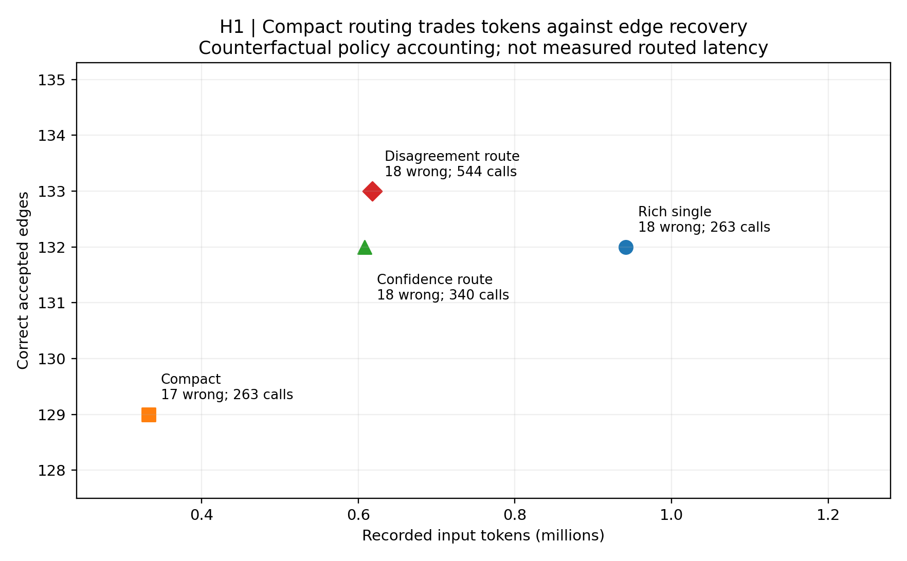

## H2: Dependency-safe fallback for invalid typed checks

An invalid base1 call falls back to the independent standalone compact request. With a valid base1 answer, invalid check vectors preserve base1 and do not authorize adjudication. Valid prerequisites permit adjudication; an invalid adjudicator falls back to base1. “Standalone” means not conditioned on the invalid checks, not statistically independent. The policy neither normalizes invalid vectors nor invents unobserved responses.

| Policy | Correct / wrong edges | Operational errors | Input tokens |
|---|---:|---:|---:|
| Single rich prompt | 132 / 18 | 1 | 941,809 |
| Original targeted | 126 / 19 | 21 | 1,709,341 |
| Dependency-safe fallback | 137 / 21 | 0 | 1,680,906 |

Operational failures fall from 21 to 0. However, the recovered coverage raises incorrect edges to 21 versus 18 for the single baseline. The frozen safety conjunction is therefore not met. A valid typed answer is not necessarily a correct graph edge; failure recovery must be evaluated alongside semantic harm.

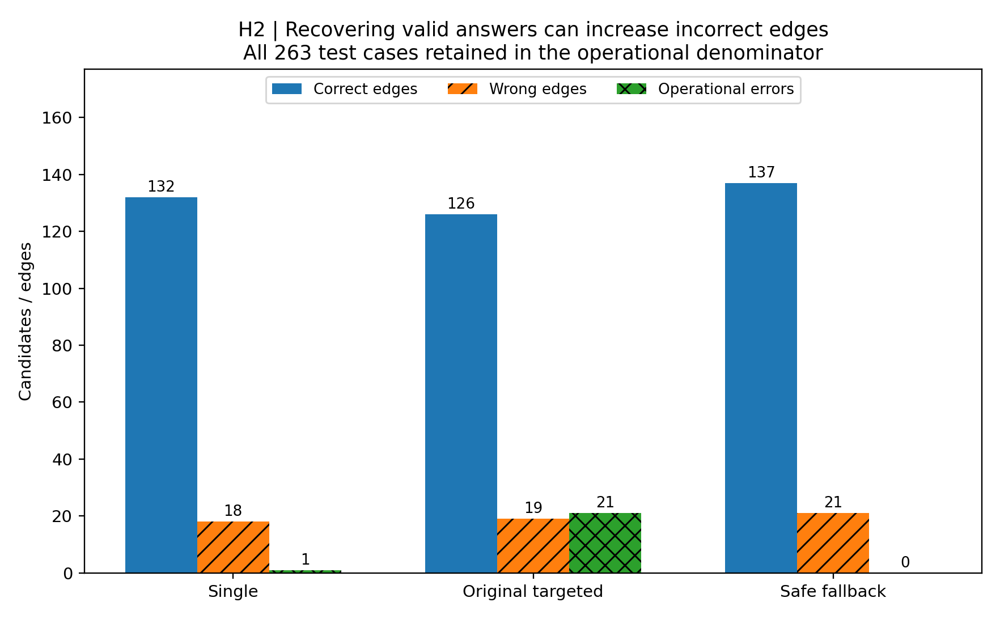

## H3: Redundancy-capped voting

Development error overlap clusters the seven views, using a fixed 0.80 same-wrong-label intersection/union threshold. Each cluster casts at most one vote. Positive acceptance requires a strict majority and at least two supporting clusters. At least one valid view is required in every cluster; otherwise the policy remains an operational error. These are empirical error-redundancy clusters, not independent sources or calibrated evidence units.

Learned clusters: `base1, base2, base3, structured`; `blind1`; `blind2`; `contrastive`.

At the natural operating point, capped voting yields 131 correct edges, 18 wrong edges, 7 abstentions and 2 errors. At a fixed 148 accepted edges:

| Policy | Correct / wrong | Precision | Input tokens for all candidate decisions |
|---|---:|---:|---:|
| Single rich prompt | 131 / 17 | 88.51% | 941,809 |
| Flat seven-view vote | 129 / 19 | 87.16% | 4,577,294 |
| Redundancy-capped vote | 130 / 18 | 87.84% | 4,577,294 |

The capped-versus-flat matched precision difference has a descriptive 95% interval of [-0.12, +2.10] pp and 99% interval of [-0.25, +2.84] pp. Both include zero. The 20% error-reduction target is not met; the single baseline also has fewer matched-volume mistakes. All seven calls are charged. Error diversity alone is insufficient evidence of useful or economical corroboration.

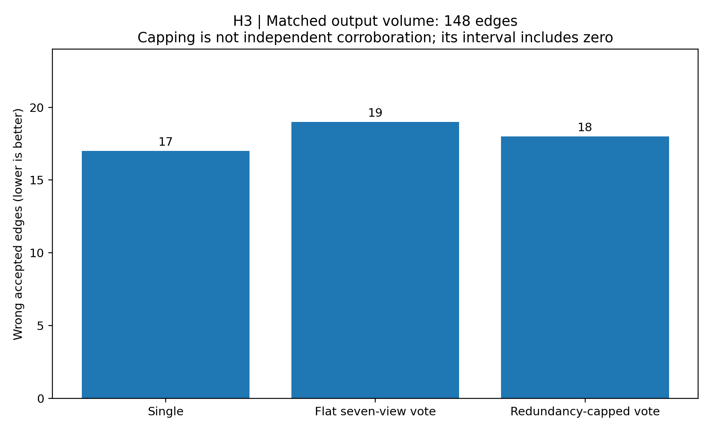

## H4: Group-aware review allocation

Development-only shrinkage estimates edge error risk from label, the 0.90 score indicator, and disagreement with the compact view. Individual review sorts by that risk. Group-aware review greedily maximizes the estimated reduction in source-group contamination: an edge risk times the product of the remaining edges' estimated correctness. This independence-shaped product is only a ranking heuristic; it is not a risk certificate under correlated errors. Selection sees no test labels.

The primary simulated reviewer removes wrong accepted edges, retains correct accepted edges and adds no missing edge. A source group is contaminated when any remaining accepted edge has the wrong label. These groups are source-dependence units, not measured database topology.

| Review budget | Individual: wrong edges / contaminated groups | Group-aware: wrong edges / contaminated groups | Correct edges retained (both) |
|---|---:|---:|---:|
| 10 | 14 / 12 | 14 / 12 | 132 |
| 20 | 13 / 11 | 11 / 9 | 132 |
| 30 | 11 / 9 | 9 / 7 | 132 |
| 40 | 9 / 7 | 9 / 7 | 132 |

At budget 20, the ideal-review point target is met. The advantage is budget-dependent: the policies tie at budgets 10 and 40. Human-review accuracy and cost were not measured. Both rankings use the same observed features; obtaining those features entails single-plus-compact decisions for every candidate, not free additional evidence.

The recorded feature-acquisition total is 1,274,247 input tokens, before any actual review cost. Under a 5% false-removal rate, the following analytic sensitivity analysis applies at budget 20:

| Wrong-edge detection sensitivity | Individual: expected contaminated groups / correct edges | Group-aware: expected contaminated groups / correct edges |
|---|---:|---:|
| 50% | 13.25 / 131.25 | 12.25 / 131.35 |
| 75% | 12.19 / 131.25 | 10.69 / 131.35 |
| 100% | 11.00 / 131.25 | 9.00 / 131.35 |

These expectations assume independent reviewer detection across reviewed wrong edges and the specified false-removal rate; they are not additional observed trials. Full sensitivity combinations and selected IDs are in results.json.

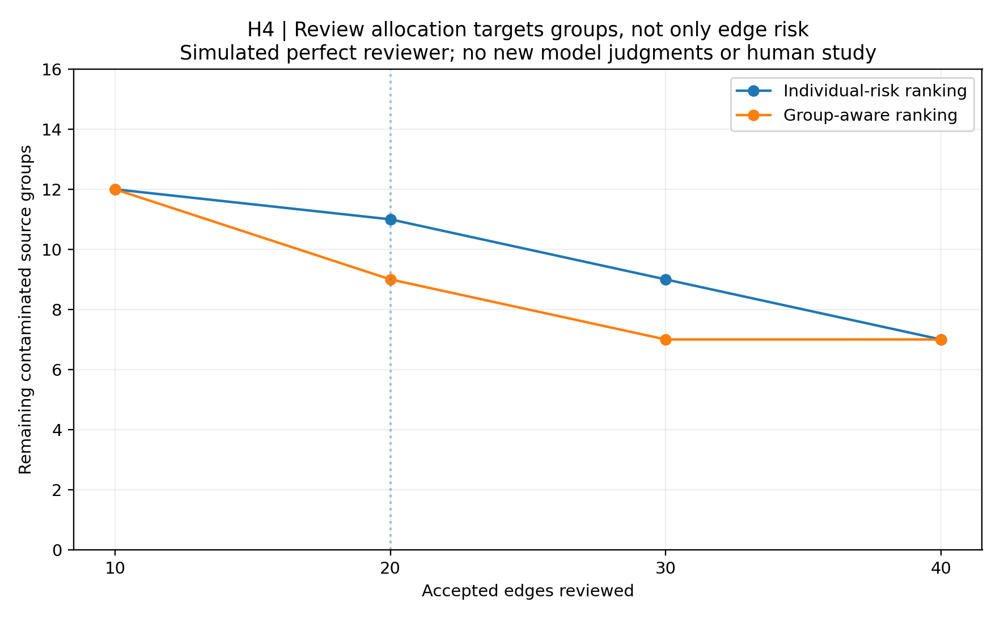

## H5: Joint optimization of conflict components

The previous interval/scope guard detects incompatible assertions but does not choose a consistent batch. The new opt-in optimizer builds a conflict graph, separates connected components, and enumerates all subsets within components of at most 16 assertions. It chooses the maximum supplied priority sum among compatible assertions, with deterministic ID tie-breaking. Unsupported assertions and larger components are staged. This exponential method is deliberately bounded, not a database-scale algorithm.

On 128 seeded eight-assertion fixtures, it matches an independent integer-time active-fact oracle with 0 oracle/consistency failures. There are 0 failures across 1,024 input-order checks. Joint utility strictly exceeds priority-first greedy on 33/128 fixtures (25.78%); it is never lower.

| Method | Aggregate supplied priority utility |
|---|---:|
| Input-order greedy | 3,106 |
| Priority-first greedy | 3,530 |
| Joint bounded optimizer | 3,656 |

An explicit counterexample gives greedy utility 5 versus joint utility 6: one wide interval can block two compatible narrower assertions with greater combined priority. The 17-assertion over-limit control stages all 17 and writes none.

**Falsifying semantic control:** two conflicting assertions have supplied weights 9 and 8, but the higher-weight assertion is labeled false by the controlled truth assignment. The optimizer selects the false assertion. Constraint consistency and maximum supplied utility therefore do not establish semantic truth. Priorities are not Jev-calibrated truth probabilities, and mis-specified priorities can favor the wrong graph.

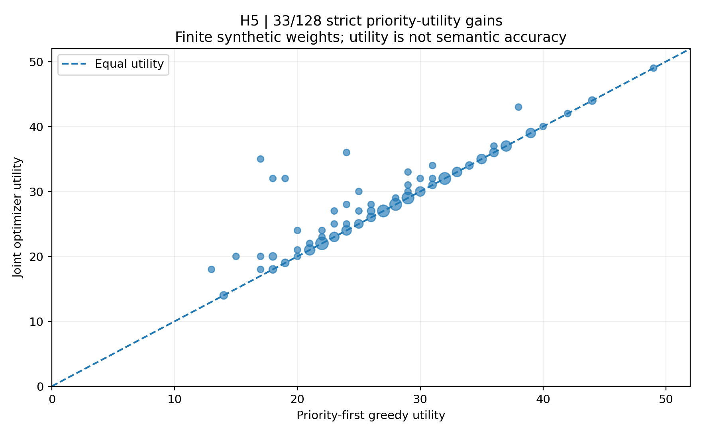

## Uncertainty, failure criteria and interpretation

H1-H3 use 4,000 paired source-group bootstrap draws with seed 20260919. Policies, development fits and matched-volume ID sets remain fixed during resampling. The 95% and wider 99% percentile intervals are descriptive and exploratory; they are not simultaneous confidence intervals for all endpoints, do not include fitting uncertainty, and do not erase previous test exposure. Different accepted-set denominators can vary during a group bootstrap. Operational errors and abstentions remain in the full classification denominator, and wrong polarity is both an incorrect accepted edge and a missed gold edge.

| Prespecified comparison | 95% interval | 99% interval |
|---|---:|---:|
| H1: recall difference vs single | [+0.00, +2.16] pp | [+0.00, +2.90] pp |
| H2: wrong-edge rate difference vs single | [-0.39, +2.87] pp | [-0.86, +3.44] pp |
| H3: matched precision difference vs flat vote | [-0.12, +2.10] pp | [-0.25, +2.84] pp |

The evidence favors treating token efficiency, operational resilience, semantic accuracy and graph maintenance as separate optimization goals. Compact routing remains an efficiency candidate; fallback needs explicit error-risk constraints; repeated or correlated votes are not independent corroboration. Group-level review and bounded joint optimization warrant broader tests, but their controlled gains must not be promoted to independent Jev-accuracy claims. No default policy is changed.

## Reproducibility and next falsification gates

```bash
python -B -m unittest discover -s graph_synthesis/adaptive/tests -v
python -B -m graph_synthesis.adaptive.run --check
python -B -m graph_synthesis.adaptive.report --figures --update-paper
python -B -m graph_synthesis.render_current_paper --output manuscript/paper-current.pdf
```

results.json contains all five outcomes, source hashes, group intervals, clusters, review selections, sensitivity settings and controlled graph fixtures. predictions.json preserves every new policy outcome and required-call attribution for all development and test cases. summary.csv and five SVG/PNG figures are generated from those records. The artifact manifest binds source, outputs and validation logs. Original evidence and the archived original manuscript remain unchanged.

Independent source-disjoint semantic validation, prospective routed-service latency, real reviewer studies, correct qualifier/lineage extraction and matched-resource external baselines remain unexecuted. Candidate generation and open-ended relation discovery are outside this extension. The next decisive experiment should freeze a policy on these development results and test it on previously unseen source groups or a new corpus, without selecting the policy after seeing that evaluation.

<!-- ADAPTIVE_RESEARCH_END -->

<!-- RISK_CONTROL_RESEARCH_START -->

# Risk control, targeted verification and structural tractability in Jev graph synthesis

Timothy Wayne Gregg | AI-assisted author-review research extension | September 18, 2026

## Abstract

Five refinements of the expanded Jev experiments are evaluated against frozen operational targets. A development-learned routing policy falls back to the rich prompt, achieving no token saving. A source-group risk gate reduces wrong accepted edges from 18 to 11, but retains only 77.27% of the baseline correct edges. Direct qualifier verification produces no valid semantic veto and performs worse descriptively at matched accepted volume. Exact review allocation satisfies its controlled optimization tests but does not improve the observed-label reviewer simulation. A forest-aware conflict solver meets all controlled targets and processes the tested acyclic components of up to 256 assertions that the previous 16-assertion-limited optimizer stages. These findings separate risk reduction, coverage loss, objective optimization and structural consistency from semantic truth. No fresh Jev calls, independent semantic-validation result or production-policy change is claimed.

## 1. Motivation, scope and provenance

The [preceding adaptive extension](../graph_synthesis/adaptive/RESULTS.md) showed that additional verification can reduce operational errors without reducing wrong graph edges. It also exposed the cost of acquiring redundant views and the limited component size of exact conflict enumeration. We therefore test compact-only learned routing, source-group risk-constrained recovery, direct use of qualifier checks without adjudication, budget-optimal review with imperfect detection, and exploitation of acyclic conflict structure. These are new experiments and integrations in this package, not claims of newly invented statistical or optimization mathematics.

The [protocol](../graph_synthesis/risk_control/PROTOCOL.md) was committed as `12b74f2772ba50f4b40e76b39a4ac0bf980802e4` before execution, against baseline `88f271a92e901039877f906894e65ee55bc6962e`. Earlier public results and the test set had already informed hypothesis selection. The extension is exploratory, not independent preregistration. The captured multicall study supplies 73 development candidates in 40 source groups and 263 evaluation candidates in 149 source groups. Fitting uses development labels only; execution functions accept no gold labels. Source-group overlap, source hashes and raw-response reconstruction are checked before analysis. The evaluation cases are not a fresh holdout.

**Fresh service calls in this extension: 0.** H1-H3 execute counterfactual policies over authentic saved requests and responses. H4 combines observed source groups with explicitly assumed reviewer behavior; H5 uses controlled graphs and independent finite or analytic oracles. The earlier 3,024 physical calls are not recounted as new inference. Recorded token totals charge every call that the hypothetical policy would require, including failed and preliminary calls. They do not measure prospective service latency, new invoices or human-review cost.

A correct accepted edge has a positive label (SUPPORTS or REFUTES) equal to the gold label. A wrong polarity is both a wrong accepted edge and a missed gold edge. NOT_ENOUGH_INFO is not a written edge. Operational errors and abstentions remain distinct and remain in full classification denominators. A contaminated source group contains at least one wrong accepted edge; source groups are dependence units, not measured database-connected components.

## 2. Frozen falsification criteria

| Hypothesis | Required primary conjunction | Outcome |
|---|---|---|
| H1: Compact-only value routing | At least 40% token saving; at least 98% correct-edge retention; no extra wrong edges | Not met |
| H2: Source-group risk gate | Nonempty qualifying risk gate; at least 90% correct-edge retention; all-group contamination at most 15% | Not met |
| H3: Support-only qualifier veto | At least 20% fewer matched-volume wrong edges; at least 95% correct-edge retention; tokens at most 1.5 times single | Not met |
| H4: Budget-optimal review | At budget 20, strictly fewer expected contaminated observed groups than sensitivity-aware greedy; no lower correct-edge retention | Not met |
| H5: Forest-aware conflict solver | Zero supported-oracle failures; no small-component utility regression; all ten large forest fixtures optimal without staging | Met, controlled algorithms only |

The criteria are conjunctions: satisfying one clause does not make a hypothesis pass. An engineering target pass is not a general statistical discovery. The evidence types must not be pooled into a semantic success percentage.

## 3. H1: Compact-only expected-value routing

To avoid the second preliminary call used by disagreement routing, the policy learns whether a rich call is worth obtaining from compact label and the fixed score-at-least-0.90 indicator alone. Development utility is +1 for a correct positive edge, -5 for a wrong positive edge and zero for a nonedge. Each bin estimates rich-minus-compact utility with two global-prior pseudo-observations. Seven frozen token-cost penalties are considered. Invalid compact calls always escalate; unseen bins also escalate. The cheapest development-feasible action table must retain at least 98% of rich-prompt correct edges and introduce no extra wrong edges. Direct-rich is an explicit fallback that does not pay compact overhead.

All seven learned candidates produce 31 correct and three wrong development edges, versus 32 correct and four wrong for direct-rich. Their 31/32 = 96.875% retention fails the 98% constraint despite better supplied utility and lower cost. The selected policy is consequently direct-rich. The choice was not changed after inspecting test outcomes.

| Policy | Correct / wrong edges | Required calls | Recorded input tokens |
|---|---:|---:|---:|
| Single rich prompt | 132 / 18 | 263 | 941,809 |
| Compact prompt | 129 / 17 | 263 | 332,438 |
| Compact confidence route | 132 / 18 | 340 | 608,117 |
| Compact disagreement route | 133 / 18 | 544 | 617,985 |
| Learned value route | 132 / 18 | 263 | 941,809 |

H1 retains 100.00% of the baseline correct edges and saves 0.00% of tokens. Its primary target is not met. The raw compact prompt's earlier efficiency result is not a newly validated routed-policy result. The guard exposes a real tradeoff: the available development evidence does not identify a compact-only action table satisfying the frozen recall constraint. All paired differences versus single-rich are exactly zero because the selected policies coincide.

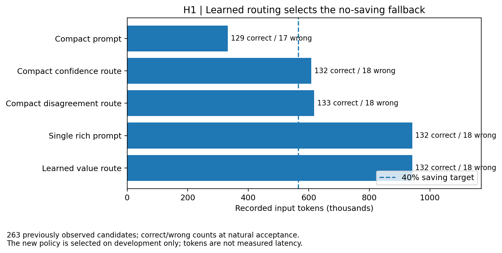

## 4. H2: Source-group risk-constrained recovery

The previous dependency-safe fallback is gated at five fixed positive-score thresholds: 0, 0.90, 0.95, 0.99 and 1. For each development source group, loss is one if any accepted edge is wrong and zero otherwise, including groups with no accepted edge. For k contaminated groups out of n, a one-sided exact binomial upper bound is obtained by solving P(Binomial(n, U) <= k) = 0.01. This is alpha = 0.05/5 for five candidates. A candidate qualifies if its upper bound is at most 0.15 and its accepted set is nonempty. The qualifying candidate with greatest development accepted volume is selected, with lower-threshold tie-breaking. No qualifying candidate would cause explicit stage-all, which cannot satisfy the nonempty target.

This diagnostic is motivated by [Learn then Test](https://arxiv.org/abs/2110.01052) and [risk-controlling prediction sets](https://arxiv.org/abs/2101.02703). Binomial sampling assumptions, representative independent calibration groups and untouched policy-selection evidence are not established by repeated analysis of this research set. The arithmetic bound is therefore not presented as a prospective deployment certificate. In particular, a bound on all-group contamination is not a bound on edge error or on contamination conditional on a nonempty graph.

| Cutoff | Accepted (dev) | Wrong groups / 40 | Upper bound | Pass |
|---:|---:|---:|---:|---|
| 0.00 | 39 | 4 / 40 | 26.36% | No |
| 0.90 | 23 | 0 / 40 | 10.87% | Yes |
| 0.95 | 21 | 0 / 40 | 10.87% | Yes |
| 0.99 | 18 | 0 / 40 | 10.87% | Yes |
| 1.00 | 13 | 0 / 40 | 10.87% | Yes |

The selected threshold is 0.90. Its development count is zero contaminated groups out of 40, giving U = 1 - 0.01^(1/40) = 10.87%. This is not zero risk.

| Policy | Correct / wrong edges | Precision | Correct retention vs single | Input tokens |
|---|---:|---:|---:|---:|
| Single rich prompt | 132 / 18 | 88.00% | 100.00% | 941,809 |
| Dependency-safe fallback | 137 / 21 | 86.71% | 103.79% | 1,680,906 |
| Group-risk gate | 102 / 11 | 90.27% | 77.27% | 1,680,906 |

The test gate yields 9 contaminated groups out of 149 (6.04%) overall, but 9 out of 79 (11.39%) among groups with accepted edges. It stages 45 candidates and retains only 77.27% of single-rich correct edges, below the 90% target. It also retains the fallback's full recorded acquisition cost. Lower contamination is partly bought through reduced coverage; it does not establish a superior all-purpose graph compiler.

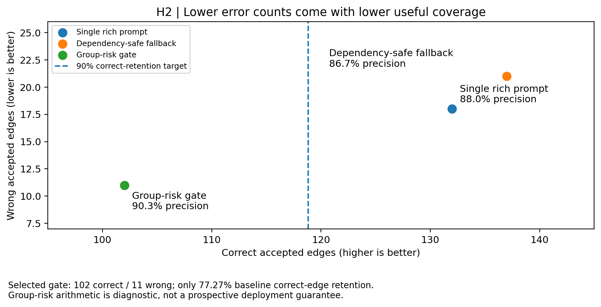

## 5. H3: Direct, SUPPORTS-only qualifier veto

Only a base1 SUPPORTS answer obtains the six existing qualifier checks. A valid MISMATCH probability of at least 0.90 in any dimension stages that edge. Other base labels remain unchanged: a mismatch can be legitimate evidence for REFUTES. An invalid check vector remains an operational error; it is never normalized. The adjudicator is never requested. The invalid-only ablation runs the same checks but never vetoes a valid answer. This distinguishes semantic filtering from accidental rejection caused by invalid responses.

| Policy | Correct / wrong edges | Operational errors | Calls | Input tokens |
|---|---:|---:|---:|---:|
| Single rich prompt | 132 / 18 | 1 | 263 | 941,809 |
| Original targeted | 126 / 19 | 21 | 789 | 1,709,341 |
| Invalid-only check gate | 121 / 17 | 13 | 366 | 1,091,084 |
| Direct qualifier veto | 121 / 17 | 13 | 366 | 1,091,084 |

There are 0 valid semantic vetoes and 12 invalid SUPPORTS check calls. The veto policy is identical to the invalid-only ablation on this capture. Its natural-point reduction in wrong accepted edges must therefore not be attributed to successful qualifier reasoning.

At the fixed matched volume of 138 accepted edges:

| Policy | Correct / wrong | Precision |
|---|---:|---:|
| Single rich prompt | 124 / 14 | 89.86% |
| Direct qualifier veto | 121 / 17 | 87.68% |

The qualifier policy retains 91.67% of single-rich correct edges, below 95%, while using 1.158 times its tokens. Matched-volume errors increase rather than decrease. The matched precision difference has descriptive 95% interval [-5.87, +0.07] pp and 99% interval [-6.98, +0.34] pp; both include zero. Its natural recall difference has 95% interval [-11.69, -3.40] pp. The frozen primary conjunction fails. This does not falsify all qualifier checking; it rejects the specified high-confidence veto using these saved checks.

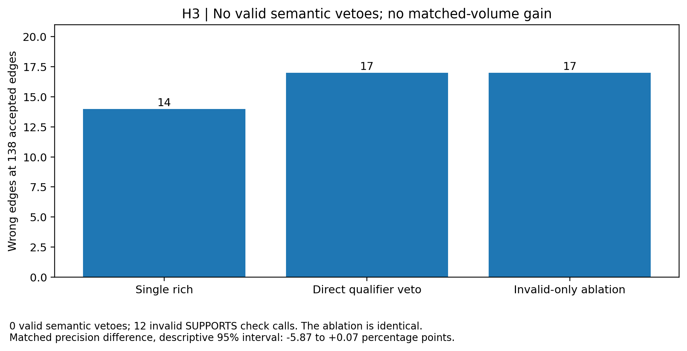

## 6. H4: Budget-optimal review with imperfect detection

The development-only risk model from the previous extension supplies edge risks p. With assumed reviewer sensitivity s = 0.75, a reviewed edge contributes clean probability 1-p+sp rather than 1-p. Group contamination is one minus the product of these factors. A group option for k reviews chooses its k highest estimated risks; dynamic programming allocates an exact global budget across those options. The comparator is sensitivity-aware greedy review using the same objective. A second comparator preserves the prior ideal-review greedy order. The false-removal probability of a correct reviewed edge is assumed to be 0.05 and is evaluated separately; it is not included in the allocation objective.

Independent subset enumeration on 64 eight-edge fixtures finds 0 optimization failures. In the explicit complementarity counterexample, the optimum reviews both high-risk edges in one group, with modeled loss 0.599375, versus 0.972500 for greedy. At the tested real-data budgets, the optimum never has worse modeled loss, with a small strict gain at budget 40. These controlled facts satisfy the algorithmic secondary target, not the empirical primary target.

| Review budget | Greedy: expected contaminated groups | Optimal: expected contaminated groups | Expected correct edges (both) |
|---:|---:|---:|---:|
| 10 | 12.7500 | 12.7500 | 131.70 |
| 20 | 10.6875 | 10.6875 | 131.35 |
| 30 | 9.1875 | 9.1875 | 130.95 |
| 40 | 9.1875 | 9.1875 | 130.45 |

At the primary budget 20, both select the same 20 edges and leave 10.6875 expected contaminated observed groups and 131.35 expected correct edges. The required strict improvement is absent. More importantly, the fitted independent-risk model predicts only 4.0491 contaminated groups for that selection. Its discrepancy from the observed-label simulation is evidence against treating the estimated objective as a calibrated description of these test outcomes.

Risk-feature acquisition costs 1,274,247 recorded input tokens for single-plus-compact decisions, before any reviewer cost. results.json includes fixed-selection sensitivities s in {0.5, 0.75, 1} and false-removal rates in {0, 0.01, 0.05}. These are analytic expectations under assumed independent reviewer detection, not measured human-review trials. No accuracy or cost claim about actual reviewers follows.

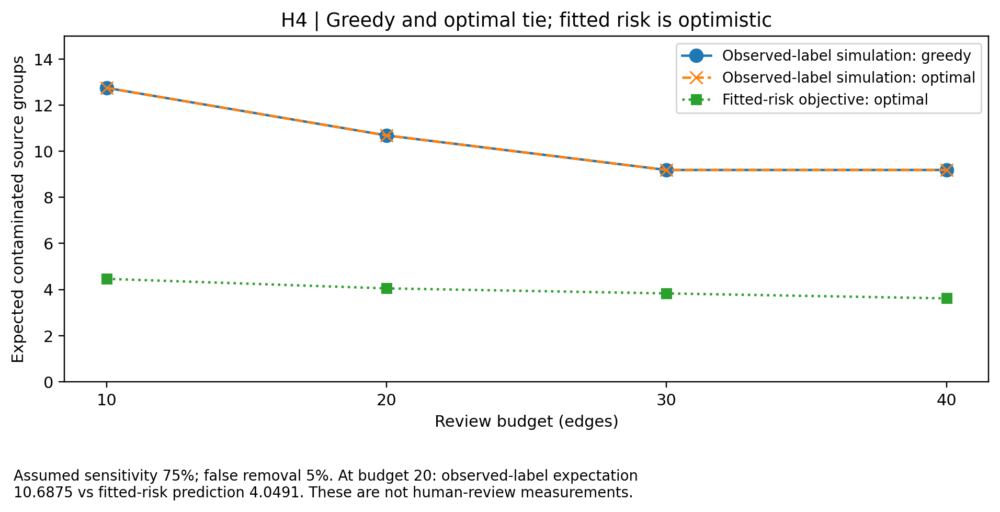

## 7. H5: Forest-aware conflict optimization

The previous exact optimizer stages conflict components larger than 16 assertions. The new opt-in solver detects acyclic components and uses include/exclude tree dynamic programming to maximize the sum of nonnegative integer priorities. Cyclic components of at most 16 retain exact subset enumeration; larger cyclic components and any component exceeding 256 assertions are staged. Unsupported scopes, qualifiers or priorities are staged explicitly. Ties are deterministic within components. Building the conflict graph remains quadratic in input size; no unbounded database-scale or measured-latency claim is made.

The solver has 0 optimum/consistency failures on 64 weighted eight-assertion fixtures, 0 on 64 corresponding unweighted fixtures, and 0 failures across 512 input-order checks. Independent integer-time active-fact enumeration supplies the small-graph oracle. Analytic star and path optima validate larger components. This supplements, rather than replaces, the previous bounded oracle evidence.

| Structure | Assertions | Prior optimizer utility | Priority-greedy utility | Forest-aware / oracle utility |
|---|---:|---:|---:|---:|
| Star | 17 | 0 | 15 | 16 / 16 |
| Star | 32 | 0 | 15 | 31 / 31 |
| Star | 64 | 0 | 15 | 63 / 63 |
| Star | 128 | 0 | 15 | 127 / 127 |
| Star | 256 | 0 | 15 | 255 / 255 |
| Path | 17 | 0 | 60 | 60 / 60 |
| Path | 32 | 0 | 114 | 114 / 114 |
| Path | 64 | 0 | 221 | 221 / 221 |
| Path | 128 | 0 | 447 | 447 / 447 |
| Path | 256 | 0 | 882 | 882 / 882 |

All ten large fixtures are optimal and consistent without staging. The previous optimizer stages every assertion in each of those over-limit components. The 17-node odd-cycle control stages 17 vertices; the 257-assertion over-limit forest stages 257 assertions. The odd cycle tests the generic conflict-graph backend; it is not a claim about extraction of that topology from scientific documents.

The semantic negative control remains decisive: of two conflicting assertions with supplied priorities 9 and 8, the higher-priority assertion is assigned false by the controlled truth label. The optimizer still selects it. Exact constraint satisfaction and maximum supplied utility cannot establish factual truth or turn Jev confidence into a calibrated reliability weight. The primary controlled target is met, but no default production graph policy changes.

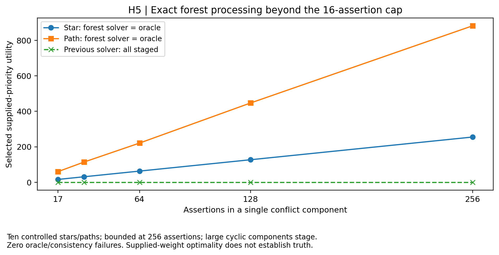

## 8. Uncertainty and inference boundaries

H1 and H3 use 4,000 paired source-group bootstrap draws, seed 20260920. The fitted policies and matched accepted-ID sets remain fixed. The 95% and 99% percentile intervals are descriptive, are not simultaneous confidence intervals, exclude fitting uncertainty, and do not undo previous test exposure. All policies in a comparison use the same resampled groups. An operational target miss is retained even if one endpoint looks favorable.

| Comparison / endpoint | Descriptive 95% interval | Descriptive 99% interval |
|---|---:|---:|
| H1: recall minus single | [+0.00, +0.00] pp | [+0.00, +0.00] pp |
| H3: recall minus single | [-11.69, -3.40] pp | [-13.19, -2.47] pp |
| H3: wrong-edge rate minus single | [-1.23, +0.00] pp | [-1.65, +0.00] pp |
| H3: matched precision minus single | [-5.87, +0.07] pp | [-6.98, +0.34] pp |

H2 has a separate development calibration calculation, not a bootstrap deployment guarantee. H4 expectations depend on an unvalidated risk model and assumed reviewer behavior. H5 tests software and combinatorial optimization with supplied inputs and priorities, not model extraction of correct qualifiers or lineage. All five hypotheses were informed by prior results on related or identical data. The reported null and unfavorable results limit the conclusions.

## 9. Implications and the next decisive experiment

The main new positive finding is structural tractability: acyclic conflict sets need not inherit an exponential-enumeration size limit. The main semantic lesson is that restrictive verification can appear safer by suppressing useful output. Development constraints can reject economical routes; lower group contamination can hide coverage loss; invalid check failures can mimic semantic filtering; and exact review optimization can optimize a poorly calibrated objective. These are distinct failure modes and require distinct measurement.

The next semantic test should freeze an end-to-end candidate-generation, qualifier-extraction and acceptance policy, then evaluate new source-disjoint documents with human-adjudicated edge truth and prospective token, latency and review-cost measurements. External systems such as KARMA require matched input evidence and resource budgets before any superiority comparison. This extension neither runs such a baseline nor demonstrates autonomous graph-synthesis readiness. The current evidence supports opt-in engineering experiments, not a claim that all five improvements work.

## 10. Reproducibility and claim traceability

```bash
python -B -m unittest discover -s graph_synthesis/risk_control/tests -v
python -B -m graph_synthesis.risk_control.run --check
python -B -m graph_synthesis.risk_control.report --figures --update-paper
python -B -m graph_synthesis.render_current_paper --output manuscript/paper-current.pdf
```

[results.json](../graph_synthesis/risk_control/results.json) records all targets, fits, intervals, selected IDs, controlled fixtures and source hashes. [predictions.json](../graph_synthesis/risk_control/predictions.json) retains every development/test policy decision and physical-call attribution. [summary.csv](../graph_synthesis/risk_control/summary.csv), five SVG/PNG figures and this text are generated from that evidence. [CLAIM_EVIDENCE.md](../graph_synthesis/risk_control/CLAIM_EVIDENCE.md) locates each claim. The artifact manifest binds new source, outputs and validation logs; the archived original evidence and preceding experiment packages remain unchanged. The current full paper is an additive author-review draft, not a claim of independent peer review.

<!-- RISK_CONTROL_RESEARCH_END -->

# Do additional Jev calls improve graph edges?

Timothy Wayne Gregg — exploratory research addendum, September 18, 2026

## Design and evidence boundary

This study uses 73 development candidates in 40 connected source groups and 263 test candidates in 149 other groups. These are previously unused within the archived Jev runs, taken from public SciFact training data. They are not a new domain, private benchmark, or guaranteed absent from vendor training. The frozen protocol, data split, prompt implementation and seed were committed before calls in `2eb44a1`. No development tuning or test-based prompt/threshold selection occurred. All seven policies were retained.

The single arm uses the previous six-example relation contract. Repeated voting uses three identical-payload fresh calls. Blind voting combines the first answer with two different evidence-only reviewers that never see another answer. Targeted checks use a first judgment, six dimensional checks in one shared request, then adjudication against original evidence. Indexed evidence preserves every sentence and adds explicit IDs. Contrastive examples replace the six original demonstrations with six fixed synthetic boundary examples. Selective routing applies targeted checks only when the first maximum score is below 0.90 or the first call fails; it is reconstructed retrospectively because all branches were actually executed. Three targeted calls contain eight typed decisions, whereas three voting calls contain three. Neither agreement nor a mean score is treated as independent or calibrated evidence.

## Test results

| Policy | Correct / wrong edges | Precision | Recall | Macro-F1 | Errors / abstentions |
|---|---:|---:|---:|---:|---:|
| Single call | 132 / 18 | 88.00% | 86.27% | 0.8497 | 1 / 0 |
| Repeated vote | 131 / 18 | 87.92% | 85.62% | 0.8480 | 2 / 0 |
| Blind vote | 136 / 20 | 87.18% | 88.89% | 0.8503 | 3 / 0 |
| Targeted checks | 126 / 19 | 86.90% | 82.35% | 0.8363 | 21 / 0 |
| Indexed evidence | 132 / 19 | 87.42% | 86.27% | 0.8510 | 0 / 0 |
| Contrastive examples | 129 / 17 | 88.36% | 84.31% | 0.8426 | 0 / 0 |
| Selective routing | 133 / 20 | 86.93% | 86.93% | 0.8486 | 8 / 0 |

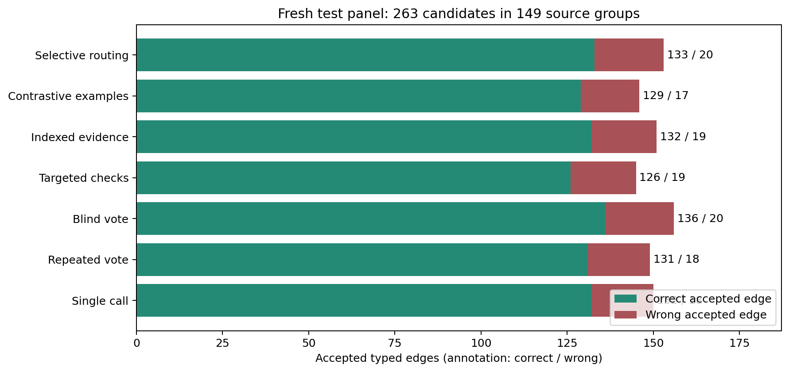

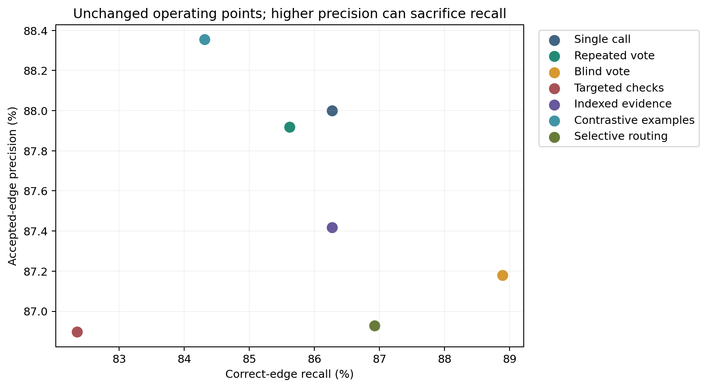

All 263 cases remain in classification denominators. Wrong polarity counts as an incorrect accepted edge and a missed gold edge. NOT_ENOUGH_INFO is a legitimate classification that creates no positive edge. Probability failures are not silently normalized or discarded.

## Equal accepted-edge volume

Each policy is ranked by its declared score, with ID tie-breaking, and restricted to the same 145 accepted edges. Scores order proposals; they are not comparable calibrated probabilities. This is an evaluation diagnostic, not a deployed threshold.

| Policy | Correct / wrong | Precision difference vs single | Paired 95% interval |
|---|---:|---:|---:|
| Single call | 128 / 17 | +0.00 pp | reference |
| Repeated vote | 128 / 17 | +0.00 pp | [-0.27, +0.27] pp |
| Blind vote | 127 / 18 | -0.69 pp | [-2.21, +0.29] pp |
| Targeted checks | 126 / 19 | -1.38 pp | [-4.37, +1.45] pp |
| Indexed evidence | 126 / 19 | -1.38 pp | [-3.26, -0.06] pp |
| Contrastive examples | 128 / 17 | +0.00 pp | [-0.40, +0.45] pp |
| Selective routing | 125 / 20 | -2.07 pp | [-4.92, +0.40] pp |

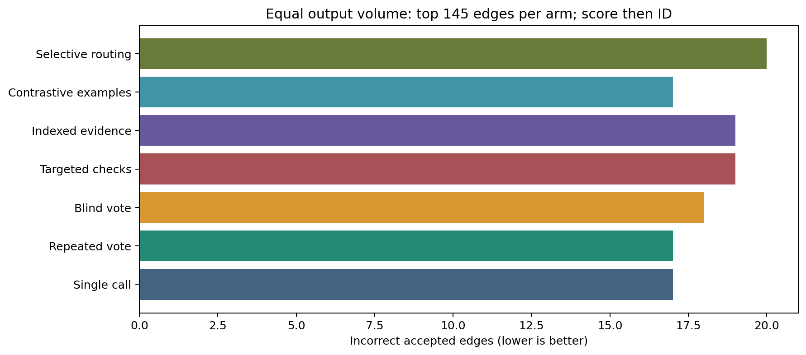

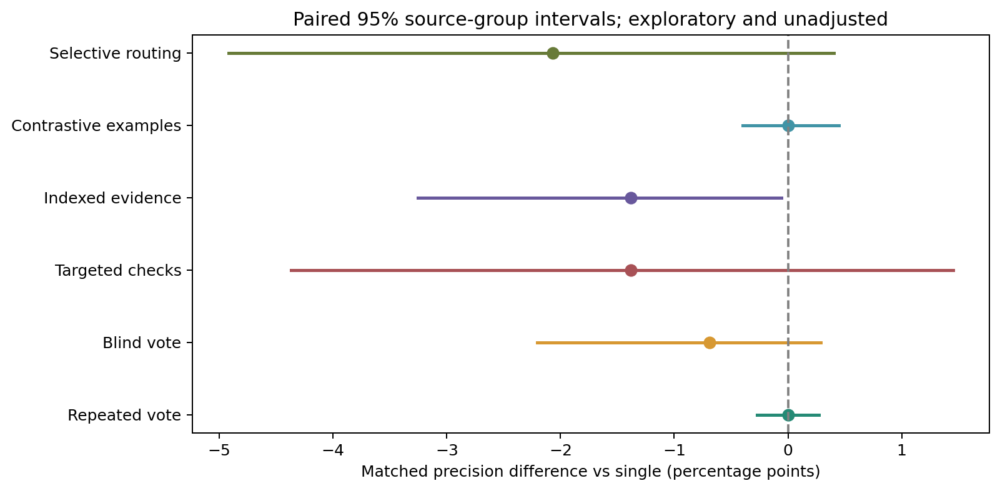

Intervals use 2,000 paired source-group bootstrap draws. They are pointwise, unadjusted and exploratory across multiple methods/endpoints, conditional on the selected ID sets and observed groups. Selected sets are fixed before resampling; per-draw edge counts can differ. Hidden cross-group dependence is not ruled out. Equal volume does not imply equal token budget.

## Calls, tokens and efficiency

| Policy | Test calls required | Test input tokens | Correct edges / million tokens |
|---|---:|---:|---:|
| Single call | 263 | 941,809 | 140.2 |
| Repeated vote | 789 | 2,825,427 | 46.4 |
| Blind vote | 789 | 1,387,869 | 98.0 |
| Targeted checks | 789 | 1,709,341 | 73.7 |
| Indexed evidence | 263 | 973,369 | 135.6 |
| Contrastive examples | 263 | 332,438 | 388.0 |
| Selective routing | 401 | 1,139,381 | 116.7 |

The entire executed study made 3,024 calls and used 6,858,163 reported input tokens, including development and every branch. There were 31 failed calls and 0 calls with unknown usage. The table attributes shared calls to each hypothetical policy; summing its rows would double-count them. Selective costs are retrospective required-call estimates, not separately observed routed-service latency. Single-call latency across actual requests was p50 370 ms, p95 483 ms and p99 764 ms; these are not end-to-end policy latencies.

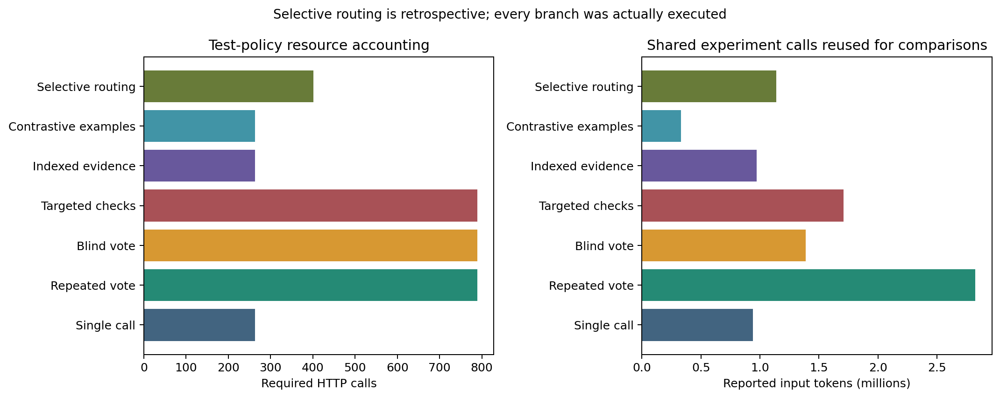

## Error dependence and graph consequences

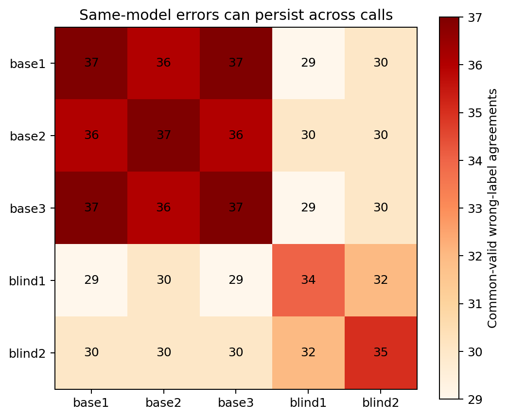

This heatmap counts wrong-label agreement on common-valid cases, not independent corroboration. Diagonal entries are individual error counts. Different prompts and repeated calls still share the same model and evidence.

| Policy | Complete and clean positive groups | Contaminated groups |
|---|---:|---:|
| Single call | 76/97 | 15/149 |
| Repeated vote | 75/97 | 15/149 |
| Blind vote | 78/97 | 17/149 |
| Targeted checks | 69/97 | 17/149 |
| Indexed evidence | 76/97 | 16/149 |
| Contrastive examples | 75/97 | 15/149 |
| Selective routing | 75/97 | 17/149 |

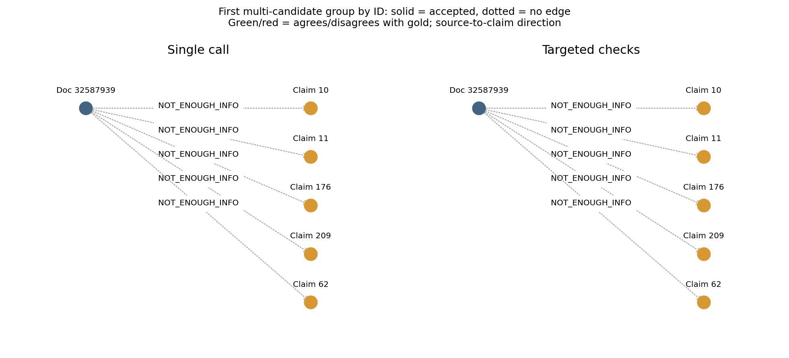

The graph is the first multi-candidate test group in sorted group-ID order, without selecting for favorable outcomes. Whole-group correctness is different from average edge precision. A clean but incomplete or empty graph is not full synthesis.

## Operational failures and secondary diagnostic

Across development and test, failures by call site were: {"adjudicate": 2, "base1": 1, "base3": 1, "blind1": 2, "blind2": 1, "checks": 24}. Error reasons were: {"Probabilities must sum to one": 28, "choice must be a highest-probability option": 3}. The six-question check request exposes multiple probability vectors to the strict validation rule. A single invalid prerequisite invalidates the targeted pipeline under the frozen policy; these failures are not repaired after observing test outcomes.

After observing these failures, we added a secondary **common-valid** diagnostic on the 239 test cases where every policy returned a valid decision. This outcome-conditioned subset does not replace the operational comparison or demonstrate deployment quality.

| Policy | Common-valid accuracy | Correct / wrong edges |
|---|---:|---:|
| Single call | 86.61% | 118 / 16 |
| Repeated vote | 86.61% | 118 / 16 |
| Blind vote | 87.87% | 123 / 18 |
| Targeted checks | 87.45% | 123 / 19 |
| Indexed evidence | 86.19% | 118 / 17 |
| Contrastive examples | 85.77% | 116 / 15 |
| Selective routing | 87.45% | 123 / 19 |

The first two repeated calls shared 36 wrong answers across 262 common-valid test cases; 36 had the same wrong label. This explains why an additional call need not supply new corrective evidence. The product of marginal error rates predicts 5.23 shared errors as a descriptive independence reference, not a hypothesis test.

The strongest efficiency lead is the shorter contrastive-example prompt: 64.70% fewer test input tokens than the single-call original-demonstration prompt, with equal wrong-edge count at matched volume. At its natural operating point it also recovers fewer correct edges. This is not a noninferiority or statistical-equivalence finding, and different demonstration content plus length prevents attributing the outcome to contrast alone.

## Interpretation

- **Repeated vote:** +0 correct edges versus single at equal volume; the interval includes zero; no resolved matched-volume advantage.
- **Blind vote:** -1 correct edges versus single at equal volume; the interval includes zero; no resolved matched-volume advantage.
- **Targeted checks:** -2 correct edges versus single at equal volume; the interval includes zero; no resolved matched-volume advantage.
- **Indexed evidence:** -2 correct edges versus single at equal volume; the interval is negative; an exploratory matched-volume degradation.
- **Contrastive examples:** +0 correct edges versus single at equal volume; the interval includes zero; no resolved matched-volume advantage.
- **Selective routing:** -3 correct edges versus single at equal volume; the interval includes zero; no resolved matched-volume advantage.

No policy is promoted automatically. A positive pointwise interval would still require independent confirmation and a matched-resource comparison before claiming general superiority. More calls can expose mistakes, reinforce the same error, or reject correct edges. These bounded claim–abstract decisions do not measure open-ended candidate discovery, database-scale synthesis, world-truth validation or safe unattended writes. Public training-data reuse, a single pinned service revision, synthetic contrast demonstrations, unequal prompt lengths, shared-context check dependence, and modest source-group counts limit generalization.

## Reproduction

The directory includes the pre-call plan/protocol/source snapshots, raw responses, decoded predictions, costs, source-group intervals, CSV tables, seven SVG/PNG figures and a deterministic graph example. `python -B -m graph_synthesis.analyze_multicall --directory experiments/jev-multicall-20260918 --verify` validates raw inputs/responses, split isolation and distinct repeat call sites, prohibits network access during replay, and reproduces predictions and analyses. `python -B -m graph_synthesis.report_multicall --directory experiments/jev-multicall-20260918` rebuilds this report and charts. Prior results and the original immutable manuscript remain separately archived.


---

# Prior same-data rerun and original study (historical evidence)

# Fresh Jev execution and graph-synthesis falsification

Timothy Wayne Gregg — updated research draft, September 18, 2026

## Evidence scope

This update executes a fresh pinned Jev 1.13.0 service run of the original development, calibration, evaluation, fixture, repeatability and batching protocol. It uses the same data and development-only selection rule. It is a same-data service repeat, not independent validation, a new preregistration, or a new training run. No evaluation labels were used to retune the prompts. The separate 48-case public synthetic challenge uses its exact gold-free exported inputs and fixed question contract; its AI-assisted labels remain provisional pending human adjudication.

## Fresh results

| Task | Run | Arm | Accuracy | Macro-F1 | Invalid responses |
|---|---|---|---:|---:|---:|
| entity_resolution | Original | baseline_noul | 98.0630% | 0.960452 | 0 |
| entity_resolution | Original | fewshot_contract | 99.2736% | 0.985860 | 0 |
| entity_resolution | Fresh | baseline_noul | 98.0630% | 0.960452 | 0 |
| entity_resolution | Fresh | fewshot_contract | 98.7893% | 0.976434 | 0 |
| relation_support | Original | baseline_choice | 85.2507% | 0.850824 | 1 |
| relation_support | Original | fewshot_contract | 84.9558% | 0.852728 | 2 |
| relation_support | Fresh | baseline_choice | 84.3658% | 0.843208 | 1 |
| relation_support | Fresh | fewshot_contract | 85.5457% | 0.856576 | 2 |

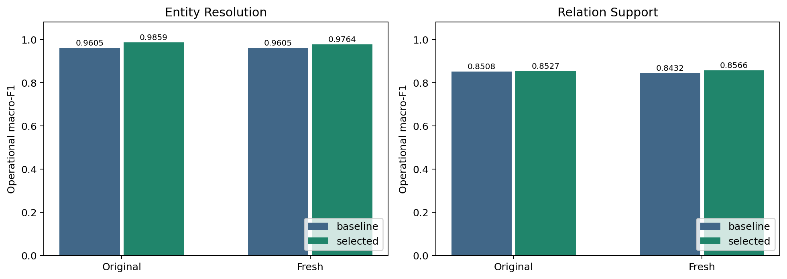

**entity_resolution:** selected-minus-baseline macro-F1 = +0.015982; exploratory paired 95% interval [-0.008627, +0.042517]. No resolved improvement in raw operational macro F1: the paired interval includes zero or evidence is unavailable.

**relation_support:** selected-minus-baseline macro-F1 = +0.013367; exploratory paired 95% interval [-0.017452, +0.042768]. No resolved improvement in raw operational macro F1: the paired interval includes zero or evidence is unavailable.

Entity baseline: 8 false merges and 0 missed matches. Service failures, if any, are separately retained in the table.
Entity selected: 3 false merges and 2 missed matches. Service failures, if any, are separately retained in the table.

The intervention bundles explicit instructions, typed question format and demonstrations. These runs cannot isolate causal contributions of each ingredient. Intervals are conditional on development selection, unadjusted and exploratory. Repeating this test set does not increase its number of independent entities or documents.

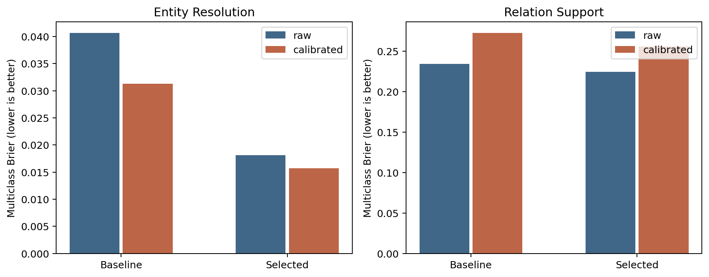

Calibration temperatures are fitted on the separate calibration partition. Brier scores use valid eligible responses, while operational accuracy and F1 retain failures. Calibration changes probability scores, not the selected labels; improvements in one scoring rule do not establish calibrated transaction-level safety.

## Fresh repeatability and resource accounting

- entity_resolution / baseline_noul: 20/20 examples had identical labels across the three fresh responses; 0 pairwise argmax flips.
- entity_resolution / fewshot_contract: 20/20 examples had identical labels across the three fresh responses; 0 pairwise argmax flips.
- relation_support / baseline_choice: 19/20 examples had identical labels across the three fresh responses; 2 pairwise argmax flips.
- relation_support / fewshot_contract: 19/20 examples had identical labels across the three fresh responses; 1 pairwise argmax flips.

Across the original and fresh held-out evaluations (distinct from the within-run 20-case panels):

| Task / arm | Common valid pairs | Changed labels | Identical distributions |
|---|---:|---:|---:|
| entity_resolution / baseline_noul | 413/413 | 2 | 247 |
| entity_resolution / fewshot_contract | 413/413 | 2 | 341 |
| relation_support / baseline_choice | 337/339 | 3 | 209 |
| relation_support / fewshot_contract | 335/339 | 4 | 189 |

The main run records 3,404 logical calls, 3,404 HTTP attempts, 4,792,410 input tokens and 4 failed calls. Estimated cost at the original protocol price is $0.201281; this is not a current price quote or invoice. The challenge adds 48 requests and 22,880 input tokens. Probability variation remains distinct from label stability.

## Fresh synthetic challenge

Against provisional labels, Jev classified 46/48 correctly and got both cases correct in 22/24 paired groups. It accepted 35 positive edges, of which 2 were wrong. These small, public, hand-constructed cases are diagnostics, not a deployment-risk estimate.

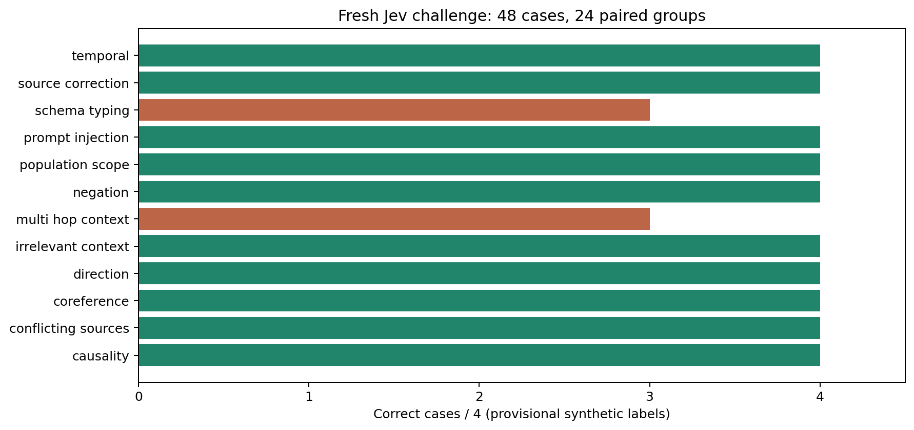

| Case | Family | Provisional gold | Jev |
|---|---|---|---|
| case-027 | multi_hop_context | NOT_ENOUGH_INFO | REFUTES |
| case-038 | schema_typing | REFUTES | SUPPORTS |

The generic imported-journal evaluator retains `fresh_execution_verified: false`: hashes alone do not authenticate provider execution. The companion live execution audit and raw journals separately record the actual HTTPS responses and bind their requests. Gold labels, rationales, families and pair IDs were excluded from inference payloads.

## Reproduced graph falsification findings

PR #10's reference results reproduce exactly. On the original unequal-acceptance SciFact operating points, complete, error-free positive components fall from 140/164 to 126/164 with few-shot prompting, despite improved edge precision. The paired interval for the component difference is approximately [-13.30, -3.70] percentage points. This is not a matched-volume comparison and does not contradict the earlier unresolved matched-volume result. The formulations share 34 errors across 336 common-success examples, including 31 wrong-label agreements; their judgments are not independent corroboration. Five of 73 few-shot positive actions scored exactly 1.0 were wrong.

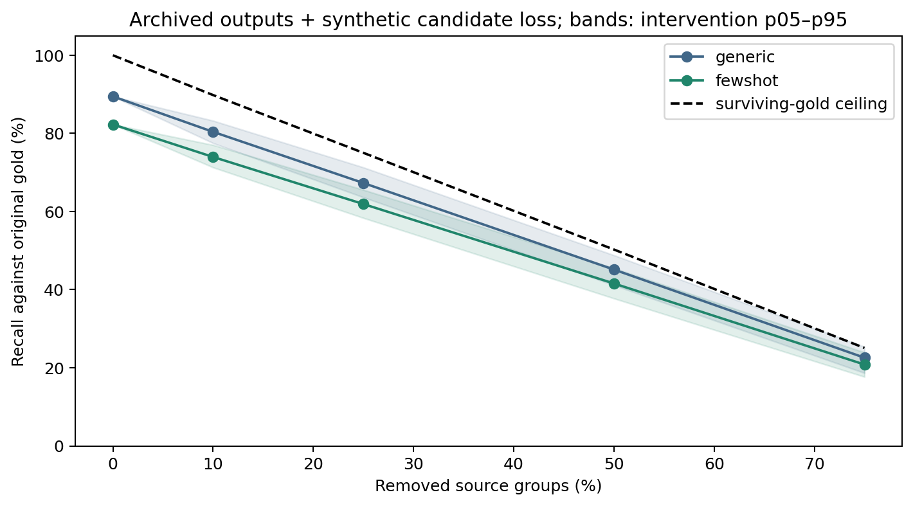

Candidate-loss bands describe variation over 100 synthetic removal masks, not confidence intervals or new retrieval measurements. Compiler witnesses remain constructed: a false identity bridge between two 100-record clusters induces 10,000 false cross-cluster identities; explicit retraction repairs them. Exact qualifier comparison misses overlapping temporal intervals. Twenty seeded repair episodes exercise 1,600 assertions and 782 withdrawals. These deterministic properties do not establish Jev factual correctness.

## Interpretation and next experiment

The original entity macro-F1 interval excluded zero; the fresh-run interval includes it. The descriptive entity advantage persists but its interval-based finding does not reproduce in this run. Neither task establishes a resolved fresh macro-F1 improvement. Independent identity-disjoint data and larger clusters remain necessary. Relation precision, recall, component completeness and total accuracy answer different questions. Do not select a universal winner from one metric, promote correlated fusion without matched-cost benefit, or infer production safety from typed outputs. Prioritize independent entity-matching confirmation and controlled ablations before further prompt tuning on this already inspected test set.

## Artifacts and reproduction

The run directory contains the frozen plan, captured source, raw requests/responses, prediction journal, calibration, analysis, verification, challenge evidence and figures. `python -B -m graph_synthesis.report_fresh_run --run-dir experiments/jev-rerun-20260918` regenerates this update and its four graphics without inference. The original study and its 161-file inventory remain unchanged. The current full manuscript incorporates this update before the original study as explicitly historical evidence.


---

<!-- FOLLOWUP_RESEARCH_START -->

# Follow-up: five evidence-driven improvements

This study builds on the ten-theory suite and the September 18 service rerun. **No fresh Jev requests were made in this follow-up.** H1-H3 replay captured observations; H4-H5 execute controlled algorithms against finite oracles. These are different evidence types, not five independent tests of improved model accuracy.

Baseline `1e03d0e7dfbf0b0deb1e39ecf133e66e05be141b`; protocol committed as `49975b97464ce4ee8e5c67250d6690aaebeaea73` before suite execution. Prior results were already known, so this is exploratory, not independent preregistration. Policies were not retuned after viewing the following outcomes.

## Summary of fixed operational targets

| Hypothesis | Evidence | Primary target met? |
|---|---|---|
| H1: Guarded probability calibration | Captured Jev replay | False |
| H2: Edge-aware economical routing | Captured-token routing counterfactual | True |
| H3: Cross-run stability gate | Paired captured observations | False |
| H4: Scope and interval conflicts | Finite controlled oracle | True |
| H5: Duplicate/shared-lineage bounds | Finite independent-event oracle | True |

A target pass is a point-estimate engineering result, not a statistically established general improvement. Do not pool the indicators into a success rate.

## H1: Guarded probability calibration

Tables label the original capture old and the September 18 rerun new; base denotes the baseline formulation.

The fresh rerun showed that optimizing log loss could worsen Brier score. The proposed change fits a temperature on half of the original calibration components, then chooses a raw/temperature mixture on the other half with a no-worse-Brier constraint. Both components of this mixture preserve label order. No rerun labels enter the fit.

For the primary relation few-shot arm, selected temperature is 8 and mixture weight is 0; fit/guard valid observations are 62/88.

| Task / arm | Run | Raw log loss | Temp log loss | Guard log loss | Raw Brier | Temp Brier | Guard Brier |
|---|---|---:|---:|---:|---:|---:|---:|
| Entity / base | old | 0.1067 | 0.0744 | 0.0744 | 0.0408 | 0.0317 | 0.0317 |
| Entity / base | new | 0.1067 | 0.0730 | 0.0730 | 0.0407 | 0.0317 | 0.0317 |
| Entity / few-shot | old | 0.0335 | 0.0269 | 0.0268 | 0.0184 | 0.0149 | 0.0150 |
| Entity / few-shot | new | 0.0333 | 0.0275 | 0.0270 | 0.0181 | 0.0154 | 0.0152 |
| Relation / base | old | 1.2415 | 0.5385 | 0.4535 | 0.2340 | 0.3048 | 0.2282 |
| Relation / base | new | 1.2402 | 0.5396 | 0.4546 | 0.2342 | 0.3036 | 0.2280 |
| Relation / few-shot | old | 1.2401 | 0.5435 | 1.2401 | 0.2306 | 0.3127 | 0.2306 |
| Relation / few-shot | new | 1.3207 | 0.5542 | 1.3207 | 0.2244 | 0.3151 | 0.2244 |

Primary target met: **False**. Rerun valid probability N=337; failures=2; label changes=0. Guard-minus-raw descriptive paired 95% component intervals: log loss [0.0, 0.0]; Brier [0.0, 0.0].

The no-harm constraint holds on the guard partition only. It is not an out-of-sample guarantee, and preserving labels means this intervention cannot improve classification accuracy. Temperature-only here is fitted on the same half-calibration data as the guarded method, not the larger full-calibration fit reported in the previous paper.

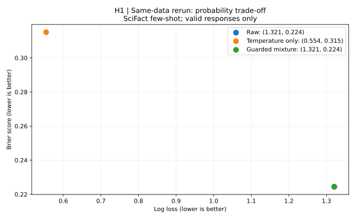

## H2: Edge-aware economical routing

The earlier macro-F1/cost cascade could save tokens while admitting more wrong relationships. This follow-up explicitly constrains correct edges, wrong edges and precision during calibration-only selection. Positive and negative baseline labels have separate escalation thresholds; failed baseline calls escalate. Always-few-shot is an explicit fallback that avoids unnecessary baseline cost.

Primary selected policy: `{"direct": false, "negative_threshold": 0, "positive_threshold": 0.95}`.
Earlier macro-F1 rule, refitted on the same original calibration: threshold 0.

| Task | Run | Policy | Correct edges | Wrong edges | Precision | Input tokens | Macro-F1 |
|---|---|---|---:|---:|---:|---:|---:|
| Entity | old | baseline | 350 | 8 | 97.77% | 174,370 | 0.9605 |
| Entity | old | fewshot | 349 | 2 | 99.43% | 627,844 | 0.9859 |
| Entity | old | macro cascade | 350 | 8 | 97.77% | 174,370 | 0.9605 |
| Entity | old | edge cascade | 349 | 2 | 99.43% | 237,835 | 0.9859 |
| Entity | new | baseline | 350 | 8 | 97.77% | 174,370 | 0.9605 |
| Entity | new | fewshot | 348 | 3 | 99.15% | 627,844 | 0.9764 |
| Entity | new | macro cascade | 350 | 8 | 97.77% | 174,370 | 0.9605 |
| Entity | new | edge cascade | 348 | 3 | 99.15% | 242,280 | 0.9764 |
| Relation | old | baseline | 187 | 37 | 83.48% | 258,495 | 0.8508 |
| Relation | old | fewshot | 172 | 20 | 89.58% | 1,213,458 | 0.8527 |
| Relation | old | macro cascade | 187 | 37 | 83.48% | 262,102 | 0.8524 |
| Relation | old | edge cascade | 175 | 21 | 89.29% | 449,791 | 0.8581 |
| Relation | new | baseline | 185 | 38 | 82.96% | 258,495 | 0.8432 |
| Relation | new | fewshot | 173 | 19 | 90.10% | 1,213,458 | 0.8566 |
| Relation | new | macro cascade | 185 | 38 | 82.96% | 262,342 | 0.8448 |
| Relation | new | edge cascade | 173 | 19 | 90.10% | 442,640 | 0.8566 |

Primary target met: **True**. Input-token saving 63.52%; correct-edge retention 100.00%. The joint target requires at least 20% saving, 98% retention, and no extra wrong edges versus all-few-shot.

The edge-aware and all-few-shot rerun policies differ on 2 labels. These are recorded input-token counterfactuals, not measured new API latency or billing. Baseline requests are charged even when a fallback is needed. Calibration feasibility does not guarantee evaluation safety. A macro-F1-only success is not substituted for the stated graph target.

Descriptive paired 95% rate-difference intervals versus all-few-shot: correct edges [-0.008645533141, 0.008928571429]; wrong edges [0.0, 0.0]. This is not an equivalence test.

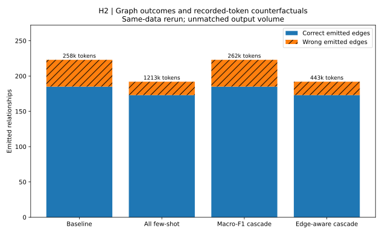

## H3: Cross-run stability gate

The intervention accepts only positive labels that agree across exact-input original/rerun observations. Compare it with rerun confidence ranking and a uniform-random subset at exactly the same accepted volume. Stability is not independent corroboration; the two calls share model identity and evidence.

| Task / arm | Rerun correct / wrong | Stable correct / wrong | Matched confidence wrong | Random expected wrong | Retention |
|---|---:|---:|---:|---:|---:|
| Entity / base | 350 / 8 | 350 / 7 | 7 | 7.978 | 100.00% |
| Entity / few-shot | 348 / 3 | 348 / 2 | 2 | 2.991 | 100.00% |
| Relation / base | 185 / 38 | 185 / 37 | 37 | 37.830 | 100.00% |
| Relation / few-shot | 173 / 19 | 170 / 18 | 17 | 18.604 | 98.27% |

Primary target met: **False**. The primary arm has 335 common-valid pairs, 45 double errors and 45 agreements on a wrong label; 5 stable wrong positive edges have rerun score exactly one.
Two-run input cost is 2,426,916 versus 1,213,458 for the rerun alone.

Uniform-subset counts are exact expectations, not new random experiments or a significance test. Small volume reductions are not evidence of superiority when matched-volume confidence does better. A same-data repeat does not double the number of independent documents.

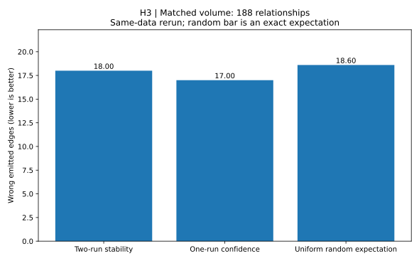

## H4: Scope- and interval-aware conflicts

Exact qualifier equality can miss contradictory assertions valid over overlapping time ranges. The opt-in guard checks half-open integer interval intersection, compatible known scope, polarity, and explicitly declared functional predicates. Unsupported/missing qualifiers return unknown and must be staged rather than silently accepted. It does not select which contradictory assertion is true.

Executed 5,408 exhaustive supported pairs, including 1,160 oracle conflicts.
| Guard | Missed conflicts | False conflict flags |
|---|---:|---:|
| exact_qualifier | 1108 | 0 |
| interval_scope | 0 | 0 |
| qualifier_blind | 0 | 1544 |

Unknown/malformed cases staged: 5/5. Primary target met: **True**.

The independent oracle enumerates integer instants. This exhausts the declared finite fixture space, not arbitrary interval semantics or extracted real-world qualifiers. No production GraphStore policy is changed, and correct qualifier extraction remains untested.

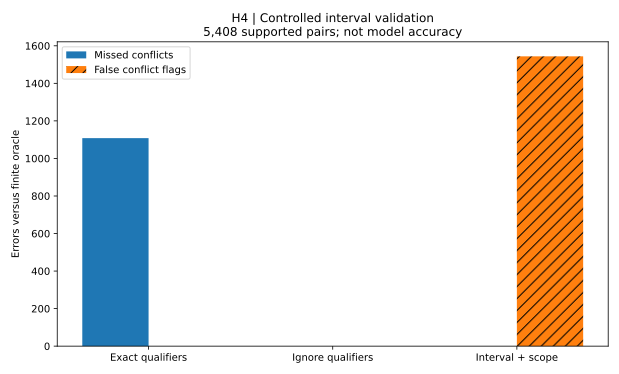

## H5: Duplicate/shared-lineage probability bounds

Alternative proofs cannot be treated as independent when they share sources. This intervention deduplicates identical atom sets, connects overlapping proofs, bounds each component using maximum and summed proof probabilities, and combines disjoint components only under the supplied independent-atom model. An independent finite-state enumeration supplies exact probabilities.

Executed 1,536 configurations from 384 parameter/proof settings with 1, 2, 5 and 20 copies. These copies are interventions, not independent samples.

| Aggregator | False admissions at 0.95 | Correct high-probability admissions |
|---|---:|---:|
| dedup_or | 44 | 364 |
| lineage_lower | 0 | 336 |
| naive_or | 628 | 364 |

Bound violations: 0; duplication-invariance failures: 0. Mean interval width 0.1014, maximum 0.6000. Exact high-probability configurations: 364. Primary target met: **True**.

The conservative lower-bound gate loses 28 correct high-probability admissions compared with naive aggregation; lower false confidence comes with a retention cost.

**Negative control:** falsely declaring two aliases for one source independent produces lower bound 0.96 for actual probability 0.80, and incorrectly passes the 0.95 gate. Thus lineage discovery and provenance integrity are necessary, not optional implementation details.

These probabilities concern synthetic sufficient-proof validity events, not actual scientific truth. **Raw Jev confidence is not a certified primitive-event probability.** The control shows what the algorithm can guarantee under supplied assumptions and exactly how those assumptions can fail.

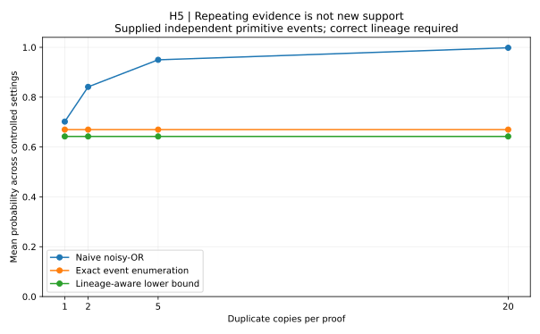

## Source separation, uncertainty and limitations

Both original/rerun empirical evaluations contain 339 relation candidates and 413 entity pairs; they are repeated observations of the same items. Original calibration component counts and purge audit are in results.json. Group construction uses claim/document or record IDs, not gold identity groups. Exact response reconstruction and pinned SHA-256 checks run before every analysis.

H1 and H2 intervals use 1,000 paired connected-component bootstrap draws with seed 20260918. They are descriptive 95% intervals, unadjusted for multiple comparisons. No p-value, confirmatory claim, external-model win, candidate-generation recall improvement or deployed graph-risk guarantee is inferred. Invalid responses remain operational errors, with explicit valid-only probability denominators. The source-disjoint independent corpus and matched KARMA comparison remain unexecuted.

## Reproduction and implementation status

```bash
python -B -m unittest discover -s graph_synthesis/followup/tests -v
python -B -m graph_synthesis.followup.run --check
python -B -m graph_synthesis.followup.report --figures --update-paper
python -B -m graph_synthesis.render_current_paper --output manuscript/paper-current.pdf
```

All numerical findings are generated from results.json. Existing frozen evidence and the default compiler remain unchanged. The methods are opt-in research implementations, not validated production replacements. All conclusions remain an AI-assisted author-review draft. See [PROTOCOL.md](../graph_synthesis/followup/PROTOCOL.md) for the frozen criteria and [CLAIM_EVIDENCE.md](../graph_synthesis/followup/CLAIM_EVIDENCE.md) for evidence boundaries.

<!-- FOLLOWUP_RESEARCH_END -->

# Original study (historical evidence; unchanged text)

---
title: "Improving Typed Entity Decisions with Jev: A Reproducible Same-Model Case Study"
subtitle: "Positive evidence for bibliographic matching, an inconclusive relation-verification result, and explicit limits on repeatability"
date: "2026-09-18"
bibliography: "references.bib"
---

# Manuscript status

This is a detailed empirical manuscript draft grounded in the completed `run-20260918` artifacts. It is suitable for author review and development into a paper, not a claim of submission readiness. Author names, affiliations, contributions, funding, conflicts of interest, venue format, and final data-distribution permissions require the authors' confirmation. No independent replication, new adjudicated dataset, or additional experiment is implied by packaging the study.

The [frozen protocol](../reproduction/results/jev/PROTOCOL.md), [complete results](../reproduction/results/jev/run-20260918/RESULTS.md), [methods supplement](../supplementary/METHODS_AND_REPRODUCIBILITY.md), and [submission-readiness assessment](../supplementary/SUBMISSION_READINESS.md) are companion documents. Citation keys refer to the package bibliography. Tables below are rounded presentations; machine-readable artifacts retain full precision.

# Abstract

Typed semantic decision services offer bounded outputs, but the quality and repeatability of those outputs must be measured on the intended task. We investigate whether changes to request formulation improve a fixed Jev model without replacing or fine-tuning it. A locally frozen protocol compares four formulations per task, selects one alternative using 60 training-derived development examples, fits scalar temperature calibration on a separate split, and evaluates the retained alternative against a corrected baseline. On 413 identity-disjoint DBLP–ACM bibliographic pairs, a bundled intervention comprising explicit identity instructions, a typed Choice contract, and six training demonstrations raises operational macro-F1 from 0.9605 to 0.9859. The paired 95% percentile bootstrap interval for the difference is [0.0010, 0.0540]. Predictions of identity on different-entity pairs fall from 8/63 to 2/63, while missed matches increase from 0/350 to 1/350. On 339 SciFact claim–cited-abstract examples, selected-formulation macro-F1 changes from 0.8508 to 0.8527, with an interval spanning zero. Calibration has task- and metric-dependent effects. Cached replay reconstructs all 3,644 predictions exactly; three fresh calls on 20 fixed examples per task preserve selected-formulation labels while probabilities vary. The study uses 3,405 HTTP calls and 4.79 million input tokens, with approximately $0.20 estimated provider charges. These results support further independent evaluation of the entity-matching formulation, not general Jev superiority, a causal claim about demonstrations alone, or a guarantee of safe graph mutation.

**Keywords:** entity resolution; typed decisions; Jev; scientific claim verification; calibration; reproducibility; probabilistic interfaces.

# 1. Introduction

Entity resolution and evidence verification are consequential components of knowledge construction. A system that conflates two publications may attach subsequent information to the wrong identity. A system that mistakes a related abstract for support may preserve a well-formed but unsupported claim. Typed outputs make these decisions easier to parse and inspect, but they do not determine whether the decisions are correct.

This study examines a narrower and directly testable question than autonomous graph synthesis: **with the decision service, candidate records, and candidate evidence fixed, can request formulation improve Jev's decisions in a repeatable experiment?** The practical objective is an improved decision component whose benefits and failure modes can be traced to saved observations. End-to-end graph construction, candidate discovery, cluster consistency, database mutation, and schema evolution are outside the experiment.

The study uses TypeSafe's Jev service with the requested model identifier `jev-1.13.0`. Its documented interface accepts shared state and typed questions, including Choice distributions over supplied alternatives and Noul probabilities for propositions [@typesafe_api_2026; @typesafe_choice_2026; @typesafe_noul_2026]. We compare a valid generic baseline with explicit task criteria, a task-specific alternative primitive where applicable, and training demonstrations. A corrected transport and parser are shared by all arms. Repairing a broken integration is therefore distinguished from improving semantic classification.

Two tasks test whether an apparently helpful intervention transfers across decision types. Bibliographic entity matching asks whether two supplied records describe the same publication. Scientific claim verification asks whether a supplied abstract supports, refutes, or leaves unresolved a supplied claim. Both tasks use fixed candidates; neither includes retrieval. The same local selection procedure chooses the demonstration-bearing formulation for both tasks. The evaluation outcomes differ: entity matching improves on the primary metric, whereas claim verification does not show a resolved gain.

The empirical contributions are threefold. First, we provide a bounded same-model comparison with separate demonstration, development, calibration, and evaluation uses of data. Second, we report a positive bibliographic matching result alongside its costs, error tradeoff, task-specific uncertainty, and an inconclusive companion result. Third, we provide an auditable experiment record that distinguishes deterministic reconstruction of stored service outputs from variation in fresh service calls. These are contributions of an empirical case study and its artifact package. We make no priority claim for typed classification, prompt engineering, few-shot learning, temperature scaling, or using Jev for entity matching.

# 2. Related work and positioning

Entity matching has established supervised and language-model approaches. Ditto frames matching using pretrained language models and provides the serialized DBLP–ACM source used here [@li2020ditto]. This study does not rerun Ditto or evaluate a new matcher architecture. It reuses source records under a custom identity-disjoint split and changes requests to one fixed remote model. Published scores on another split or protocol are not directly comparable with the scores reported here.

SciFact provides scientific claims, abstracts, and evidence annotations [@wadden2020scifact]. Our derived task classifies supplied cited abstracts from official development claims. It does not evaluate open-corpus evidence retrieval, rationale extraction, or the complete original benchmark. The repository's internal task name, `relation_support`, should be read as evidence classification in this paper; it does not mean that the experiment evaluated arbitrary graph relations.

TypeSafe already documents entity alignment with Jev and a cascade combining generative extraction with Jev verification [@typesafe_entity_alignment_2026; @typesafe_extraction_cascade_2026]. Accordingly, using Jev for entity resolution is not a novelty claim. The present study asks whether specific changes improve measured outcomes over a corrected baseline on fixed records and preserves the evidence necessary to audit that comparison. Vendor documentation establishes interface semantics; it is not independent evidence of task accuracy or calibration.

Temperature scaling is an established postprocessing approach to calibration [@guo2017calibration]. Here it is applied to clipped log probabilities returned by the service, rather than to internal model logits. This distinction matters because output quantization and clipping can discard information unavailable to the calibrator. Positive scalar temperature normally preserves the top-label ordering; its effect is evaluated with probability metrics rather than credited as an accuracy improvement.

Paired resampling and careful selection of the statistical test are established practices in evaluating language-processing systems [@koehn2004significance; @dror2018testing]. Our bootstrap implementation preserves dependence between arms and resamples claim/document components for SciFact. These intervals are conditional on the selected formulations and observed service outputs. They neither repeat the entire selection process nor establish robustness across model deployments or datasets.

# 3. Research questions and scope

The primary question is whether the best predeclared nonbaseline formulation selected on development data improves operational macro-F1 over the corrected baseline on the fixed evaluation split. The question is evaluated separately for each task. The study additionally asks how probability calibration, fresh-call variation, batching, integration failures, and token use affect interpretation.

The protocol was locally frozen at **2026-09-18 00:41:53 UTC**, before live development. The executable manifest was created before research requests began at 00:50:07 UTC. The protocol is a timestamped local design record, not an external preregistration. Public labels and original fixtures had already appeared in earlier repository research. They were held out from this Jev selection procedure, not independently blinded from the research environment. Both qualifications limit confirmatory interpretation.

The requested model identifier, candidate evidence bytes, label meanings, parser validation, and scoring procedure are fixed. The few-shot arm deliberately adds six labeled training examples. It therefore receives additional training information and consumes additional tokens, although the evaluated candidate and its evidence remain unchanged. The entity-matching primary comparison bundles instructions, a Noul-to-Choice change, explicit option descriptions, demonstrations, and their request context. It cannot identify the separate causal effect of demonstrations or of any other one component.

# 4. Data construction

## 4.1 Scientific claim verification

The source is the pinned SciFact release archive, checked against a recorded SHA-256 digest. For each claim, the preprocessing code creates one row per supplied cited document. It uses the document's complete abstract, preserves the actual claim, and maps annotated `SUPPORT` and `CONTRADICT` labels to `SUPPORTS` and `REFUTES`. A cited document with no corresponding evidence annotation is assigned `NOT_ENOUGH_INFO`. This operational label derivation is part of the experiment; an absence of a dataset annotation is not an independent proof that a document is semantically irrelevant.

Official development claims supply the evaluation rows. Whole training claims are purged if any cited document or duplicate abstract overlaps evaluation; 272 training claims are removed. Connected components link claims, documents, and identical abstract content. The remaining training components are divided deterministically into training and calibration. The result is 459 training rows, 150 calibration rows, and 339 evaluation rows. Evaluation contains 247 connected components and 138 SUPPORTS, 71 REFUTES, and 130 NOT_ENOUGH_INFO labels.

The service receives only the supplied claim and abstract sentences. Gold labels and rationale sentence indices are not used to select evidence or appear in the evaluated input. The full abstract is available; there is no gold-rationale extraction advantage.

## 4.2 Bibliographic entity matching

The source is the DBLP–ACM serialization in Ditto revision `52985564a93fb11308439516d3e17a033d43ec8f`. The original train, validation, and test source files are pooled for a new split. Each record's serialized attributes are parsed into a structured object, and hashes identify exact record representations. Positive pair labels define identity components for grouping. These labels are used to create disjoint partitions, not as input features for the evaluated record pair.

Seven conflicting serialized pairs cause their affected identity components to be quarantined, excluding 92 pairs. No additional inconsistent positive component is found by the subsequent consistency check. Identity components are assigned deterministically to training, calibration, or evaluation with nominal 60/20/20 hash buckets. Pairs crossing partitions are dropped, removing 5,623 pairs. Calibration and evaluation then use deterministic maximal matchings over identity components so that no underlying identity is reused within each held-out set. This removes another 457 calibration candidates and 536 evaluation candidates.

The final splits contain 4,592 training, 390 calibration, and 413 evaluation pairs. The evaluation pairs are identity-disjoint but not a representative random sample of all candidate pairs. In particular, the label mixture changes from 1,309 same versus 3,283 different in training to 350 same versus 63 different in evaluation. Cross-partition filtering and maximal matching sacrifice coverage to reduce dependence. This selection-induced shift limits extrapolation to production candidate populations and comparison with standard DBLP–ACM results.

## 4.3 Development, demonstrations, and diagnostic fixtures

Each task uses six deterministically chosen training demonstrations and 60 additional training-derived development rows. SciFact demonstrations contain two examples per class from distinct components. Entity demonstrations contain three same and three different pairs with no reused identity. Negative entity demonstrations prioritize a lowercased-title `difflib.SequenceMatcher` ratio of at least 0.65; seeded hashes order candidates within priority tiers. If a tier lacks enough eligible examples, the deterministic ordering continues into the remaining candidates. Selection uses labels and lexical similarity, not Jev performance.

Development selection excludes every demonstration component or identity. SciFact then selects one row per component; entity matching greedily selects identity-disjoint pairs. The fixed seed is `20260917`. The achieved development compositions are 18 SUPPORTS, 15 REFUTES, and 27 NOT_ENOUGH_INFO for SciFact, and 21 same versus 39 different for entity matching. Remaining training rows do not train a model in this experiment.

Two original repository fixture sets provide secondary diagnostics: 50 relation examples and 100 entity examples. Of the entity fixtures, 88 have binary labels and 12 are marked uncertain. The latter are retained in response records but excluded from binary correctness and probability metrics. The fixtures have development history and lack independent adjudication; they are not a second natural-data benchmark or a valid source of confirmatory sample size.

**Table 1. Data used by the same-model study.** Demonstrations and development are disjoint subsets of prepared training, rather than extra public-data splits.

| Task | Prepared training | Demonstrations | Development | Calibration | Evaluation | Evaluation resampling unit |
|---|---:|---:|---:|---:|---:|---|
| SciFact cited-abstract classification | 459 | 6 | 60 | 150 | 339 | 247 connected components |
| DBLP–ACM identity matching | 4,592 | 6 | 60 | 390 | 413 | 413 identity-disjoint pairs |

# 5. Decision formulations and execution

## 5.1 Valid baseline and probability interpretation

All arms use the same repaired adapter and `jev-1.13.0` request. The earlier integration sent obsolete or incorrect field meanings and mishandled returned probabilities. The study adapter instead sends documented `state`, `questions`, `instructions`, and `criteria` fields; maps Choice probabilities separately from its selected-string output; and fails on a missing Noul response. Those shared repairs establish a meaningful baseline and are not included in the semantic improvement claim [@typesafe_api_2026].

For a Choice result, the canonical distribution maps option identifiers explicitly to task labels. A Noul value supplies P(yes), mapped to P(same) and P(different) for identity questions [@typesafe_choice_2026; @typesafe_noul_2026]. Vendor confidence and the maximum canonical probability remain distinct quantities. Neither is multiplied by the other as if it were independent evidence; the documented confidence describes distribution shape [@typesafe_confidence_2026].

The adapter rejects wrong identifiers, label keys, missing values, nonfinite numbers, out-of-range values, and distributions whose sums violate the frozen tolerance. It validates the reported model identifier. A matching identifier does not prove immutable remote weights. Raw responses, including rejected distributions, are retained. Errors remain operational failures rather than being replaced by a neutral distribution.

## 5.2 Arms

**Table 2. Predeclared formulations.** Exact byte-level question specifications and demonstrations are in `plan.json`.

| Task | Arm | Formulation |
|---|---|---|
| SciFact | `baseline_choice` | Generic support/refute/insufficient-information Choice with canonical label names. |
| SciFact | `evidence_contract` | Choice with explicit entailment, contradiction, and insufficiency criteria, including scope, negation, qualifiers, and population. |
| SciFact | `conditional_nouls` | Binary support question and a second refutation question explicitly conditional on lack of support; fixed chain mapping. |
| SciFact | `fewshot_contract` | Evidence-contract Choice plus six labeled training examples and instruction to classify only the current input. |
| Entity matching | `baseline_noul` | Generic proposition that the two records refer to the same underlying entity. |
| Entity matching | `identity_contract` | Choice with explicit same/different identity criteria and instructions covering missing fields, spelling variation, relatedness, and distinct publications. |
| Entity matching | `identity_noul` | Refined identity instructions with the Noul primitive. |
| Entity matching | `fewshot_contract` | Identity-contract Choice plus six labeled training examples and instruction to classify only the current input. |

For the conditional Noul arm, let `s` be the support answer and `r` the answer to refutation conditional on no support. The constructed score is

\[
p(\mathrm{SUPPORTS})=s,\qquad
p(\mathrm{REFUTES})=(1-s)r,\qquad
p(\mathrm{NEI})=(1-s)(1-r).
\]

This mapping normalizes valid binary values by construction. It does not demonstrate that independently produced semantic judgments form a calibrated joint model. Both answers must validate for the logical arm prediction to succeed.

## 5.3 Batching, selection, and frozen evaluation

During development, the three non-few-shot arms share the same evidence state in one request. Few-shot arms use a separate state containing demonstrations and the current input, so baseline requests receive no demonstrations. The changed co-question context is recorded and later examined with a batching control. All evaluation comparisons use only the baseline and selected arm; unselected variants are not promoted after evaluation inspection.

For each task, the selected alternative maximizes development operational macro-F1 over the three nonbaseline variants, breaking ties by lower full-sum Brier score and then lexical arm identifier. The rule selects an alternative even if no alternative exceeds the baseline. The selection is recorded before calibration fitting or evaluation calls. Both tasks select `fewshot_contract`. On entity development, all three refined alternatives reach macro-F1 1.0, and Brier determines the winner. Therefore, evaluation cannot establish that the demonstration-bearing arm is better than the two unselected identity formulations.

The runner enforces four concurrent requests, at most two retries per request, a 4,000-attempt cap, and a 20-million-input-token accounting cap. No retries occur in the completed run. Requests go to the fixed documented TypeSafe endpoint. Exact payload hashes distinguish stored responses from fresh repeats; a resumed stage reuses recorded responses rather than silently issuing new inference.

# 6. Calibration, metrics, and statistical analysis

## 6.1 Temperature fitting

One scalar temperature is fitted separately for each task's baseline and selected arm using only valid responses in the reserved calibration split. For a canonical probability vector `p`, the transformation is

\[
p_T(k)=\frac{\exp(\log(\max(p(k),10^{-15}))/T)}
{\sum_j\exp(\log(\max(p(j),10^{-15}))/T)}.
\]

The scalar lies in `[0.05, 20]` and minimizes mean natural-log loss. The procedure includes `T=1` and prefers it for equal minima. Temperatures, fit membership, and diagnostics are frozen before evaluation. Calibration applies to the existing evaluation responses and incurs no new model call. It changes confidence estimates while preserving label ranking except possible clipping ties.

## 6.2 Classification and probability metrics

The primary endpoint is selected-minus-baseline **operational macro-F1** on all eligible evaluation rows. For each canonical class, failures contribute false negatives for the true class. `ERROR` is not a new semantic class included in the macro average. Accuracy counts every service failure as incorrect. Balanced accuracy, confusion matrices, class-specific metrics, and failure counts are reported alongside the primary endpoint.

Probability scores use valid responses. Brier is the mean full sum of squared deviations across all canonical labels, including both binary coordinates, so its range is 0 to 2. Log loss uses natural logarithms and clips gold probabilities at `10^-15`. Different service-success sets can confound unpaired probability comparisons; paired probability deltas therefore use only common-success rows. Separate common-success classification analysis assesses sensitivity to operational failures.

For entity matching, the reported false-merge rate is `predicted same and gold different / gold different`. This is a false-positive rate among negative pairs, not the fraction of predicted merges that are false. A false merge here means an incorrect identity prediction: no database merge is executed, and downstream cluster damage is not measured.

Ten fixed confidence bins and fixed confidence thresholds `0, 0.5, 0.7, 0.8, 0.9, 0.95` describe reliability and accuracy/coverage. These analyses do not choose a deployment threshold using evaluation labels or establish an automatic-mutation risk bound.

## 6.3 Paired uncertainty intervals

The analysis uses 2,000 paired percentile bootstrap draws with seed `20260917`. For SciFact, a draw samples connected claim/document components and retains all constituent rows. For entity matching, it samples identity-disjoint evaluation pairs. Both arms use the same sampled units in each draw, and nonlinear metrics are recomputed. Probability comparisons restrict to common-success responses.

The reported 95% intervals are unadjusted exploratory intervals, conditional on fixed development selection, calibration data, model identifier, and recorded responses. They do not incorporate uncertainty from rerunning prompt selection, choosing a different split, changing demonstrations, or service evolution. The two task endpoints and additional secondary measures are not presented as familywise-controlled discoveries.

# 7. Results

## 7.1 Development selection

**Table 3. All predeclared development arms.** Each row has 60 eligible examples. The probability denominator is 59 for the three non-few-shot SciFact variants because one shared request fails validation, and 60 otherwise.

| Task | Arm | Accuracy | Macro-F1 | Brier | Errors |
|---|---|---:|---:|---:|---:|
| SciFact | Baseline Choice | 0.7833 | 0.7932 | 0.2838 | 1 |
| SciFact | Evidence contract | 0.8333 | 0.8419 | 0.2379 | 1 |
| SciFact | Conditional Nouls | 0.8500 | 0.8576 | 0.2249 | 1 |
| SciFact | Few-shot contract, selected | 0.9000 | 0.8963 | 0.1977 | 0 |
| Entity matching | Baseline Noul | 0.9833 | 0.9819 | 0.0411 | 0 |
| Entity matching | Identity contract | 1.0000 | 1.0000 | 0.0192 | 0 |
| Entity matching | Identity Noul | 1.0000 | 1.0000 | 0.0323 | 0 |
| Entity matching | Few-shot contract, selected | 1.0000 | 1.0000 | 0.0092 | 0 |

The larger SciFact development gain does not predict a resolved evaluation gain. This discrepancy is evidence for retaining the frozen selection/evaluation separation, rather than selecting a different prompt after seeing evaluation results.

## 7.2 Primary held-out comparisons

**Table 4. Raw operational evaluation results.** Intervals are selected minus baseline. Accuracy and macro-F1 use all eligible rows, including failures.

| Task and measure | Baseline | Selected | Difference | Paired 95% interval |
|---|---:|---:|---:|---|
| Entity accuracy, N=413 | 0.9806 (405/413) | 0.9927 (410/413) | +0.0121 | [0.0000, 0.0242] |
| Entity macro-F1 | 0.9605 | 0.9859 | +0.0254 | [0.0010, 0.0540] |
| Entity false-merge rate, 63 negatives | 0.1270 (8/63) | 0.0317 (2/63) | −0.0952 | [−0.1739, −0.0308] |
| SciFact accuracy, N=339 | 0.8525 (289/339) | 0.8496 (288/339) | −0.0029 | [−0.0380, 0.0310] |
| SciFact macro-F1 | 0.8508 | 0.8527 | +0.0019 | [−0.0314, 0.0337] |

Entity matching improves on the predeclared primary endpoint in this split: the unadjusted macro-F1 interval is above zero. The accuracy interval includes zero. All 413 responses validate for both arms, so the matching improvement is not explained by differing service-success coverage. The selected arm reduces false-positive identity predictions but introduces one missed match. It is a promising formulation for subsequent validation, not an error-free matcher.

SciFact does not show a resolved primary improvement. Baseline has one failed evaluation response and the selected arm has two. Restricting classification to the 336 rows where both succeed yields the same accuracy, 0.8542, and macro-F1 0.8512 versus 0.8545. The common-success macro-F1 difference is 0.0033, with an interval [−0.0286, 0.0353]. Thus, excluding failures does not reverse the task-level conclusion.

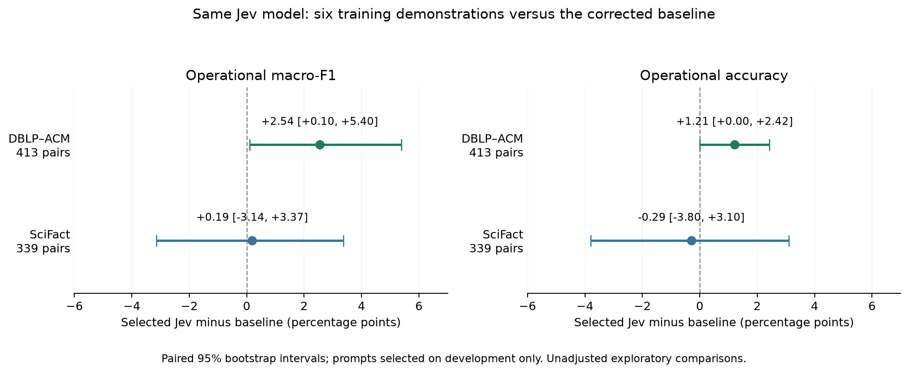

**Figure 1.** Selected-minus-baseline held-out effects and paired bootstrap uncertainty. Positive macro-F1 differences favor the selected formulation; lower Brier and false-merge rate are better. The figure is generated from saved results, not from additional inference.

## 7.3 Probability quality and calibration

**Table 5. Evaluation probability metrics.** Lower is better. Each arm's raw and calibrated values use the same successful response set. SciFact denominators are 338 baseline and 337 selected; entity denominators are 413 for both.

| Task | Arm | Temperature | Raw Brier | Calibrated Brier | Raw log loss | Calibrated log loss |
|---|---|---:|---:|---:|---:|---:|
| Entity matching | Baseline | 0.2997 | 0.0408 | 0.0312 | 0.1067 | 0.0653 |
| Entity matching | Selected | 0.6239 | 0.0184 | 0.0156 | 0.0335 | 0.0261 |
| SciFact | Baseline | 4.8030 | 0.2340 | 0.2769 | 1.2415 | 0.5639 |
| SciFact | Selected | 3.1500 | 0.2306 | 0.2505 | 1.2401 | 0.6256 |

On entity matching, the selected arm's raw Brier reduction is 0.0225, with a paired interval for selected minus baseline of [−0.0333, −0.0122]. Calibration also reduces both entity arms' evaluation Brier and log loss. On SciFact, temperatures above one soften the distributions: evaluation log loss improves markedly within each arm, while Brier worsens. Calibration is therefore not uniformly beneficial across scoring rules. After calibration, the selected SciFact arm has lower Brier than calibrated baseline on common-success rows, but its log loss is higher than calibrated baseline. Neither probability comparison supplies evidence for a classification gain.

Calibration uses 149/150 valid SciFact baseline responses and all 150 selected responses, and all 390 responses for each entity arm. Calibration log loss falls from 0.7950 to 0.4726 for SciFact baseline, 0.6125 to 0.4358 for SciFact selected, 0.0824 to 0.0117 for entity baseline, and 0.0175 to 0.0144 for entity selected. All fitted temperatures lie inside the declared interval. These fitted losses describe optimization on calibration data; the evaluation metrics are the relevant generalization check.

## 7.4 Confusion-based error analysis

**Table 6. Entity evaluation confusion.** Rows are gold labels. Columns are predictions.

| Arm | Gold | Same | Different | Error |
|---|---|---:|---:|---:|
| Baseline | Same | 350 | 0 | 0 |
| Baseline | Different | 8 | 55 | 0 |
| Selected | Same | 349 | 1 | 0 |
| Selected | Different | 2 | 61 | 0 |

The entity improvement is concentrated in recognizing distinct records. Recall for different pairs increases from 55/63 (0.8730) to 61/63 (0.9683), while recall for same pairs changes from 1.0000 to 0.9971. Balanced accuracy increases from 0.9365 to 0.9827. This pattern is consistent with the intended distinction between identity and superficial similarity, but the experiment does not establish that distinction as the causal mechanism: the selected intervention is bundled, and no independently adjudicated error taxonomy was collected.

**Table 7. SciFact evaluation confusion.** `NEI` abbreviates NOT_ENOUGH_INFO.

| Arm | Gold | SUPPORTS | REFUTES | NEI | Error |
|---|---|---:|---:|---:|---:|
| Baseline | SUPPORTS | 122 | 6 | 10 | 0 |
| Baseline | REFUTES | 4 | 65 | 2 | 0 |
| Baseline | NEI | 14 | 13 | 102 | 1 |
| Selected | SUPPORTS | 110 | 5 | 22 | 1 |
| Selected | REFUTES | 2 | 62 | 7 | 0 |
| Selected | NEI | 6 | 7 | 116 | 1 |

The selected SciFact formulation recognizes more NEI examples but misses more supported and refuted claims. NEI correct predictions rise from 102 to 116; correct SUPPORTS predictions fall from 122 to 110. This is a change in the error tradeoff, not a broadly improved verifier. A deployment valuing particular error types would require an explicit loss function and fresh validation of the resulting decision policy.

## 7.5 Original fixture diagnostics

On the 88 binary entity fixtures, baseline accuracy is 84/88 (0.9545) and selected accuracy is 87/88 (0.9886). Baseline makes three false-positive identity predictions among 12 negatives; selected makes none. Both miss one of 76 positive cases. The 12 uncertain cases are reported separately and receive no correctness credit.

On the 50 relation fixtures, accuracy changes from 46/50 (0.9200) to 45/50 (0.9000). These descriptive outcomes are compatible with the task-level distinction observed on public data, but they do not constitute independent confirmation. No fixture label drives prompt selection, calibration, or a claim of statistical significance.

# 8. Repeatability, operational behavior, and cost

## 8.1 Cached replay

An isolated copy of the run was replayed with HTTP access disabled. The runner reconstructed all 3,644 prediction records from the saved exact request/response journal without a network call. The replay check also reproduced byte-identical calls, predictions, calibration, and results when the copied original manifest was restored before analysis. Normal replay appends offline stage records to the copied manifest; this provenance change legitimately changes a regenerated report's manifest hash. The [replay proof](../reproduction/results/jev/run-20260918/replay_verification.json) records the comparison and hashes.

This establishes repeatable computation from recorded outputs. It does not show that the service returns the same output on another day or even on an immediate new request.

## 8.2 Fresh service calls

Twenty evaluation examples per task were fixed by seeded ID hashing before outcomes were inspected. Each retained arm produced three fresh outputs per example, comprising the original evaluation request and two additional requests with identical complete semantic payloads. These are distinct recorded HTTP calls; their existence does not reveal whether the provider uses an internal cache.

**Table 8. Fresh repeat panel.** Each row contains 20 examples, 60 fresh outputs, and 60 within-example pairwise comparisons. Pairwise comparisons are dependent and are not 60 independent examples. TV denotes total variation distance.

| Task | Arm | Examples with all three labels identical | Pairwise label agreement | Exact vector matches | Mean TV | Maximum TV |
|---|---|---:|---:|---:|---:|---:|
| Entity matching | Baseline | 20/20 | 60/60 | 32/60 | 0.0083 | 0.0500 |
| Entity matching | Selected | 20/20 | 60/60 | 51/60 | 0.0060 | 0.0900 |
| SciFact | Baseline | 19/20 | 58/60 | 35/60 | 0.0110 | 0.1400 |
| SciFact | Selected | 20/20 | 60/60 | 27/60 | 0.0207 | 0.2200 |

All repeated responses validate. Selected-arm labels are stable on this small immediate panel, but selected SciFact probabilities show the largest observed drift. The panel spans approximately 00:53–00:56 UTC on 2026-09-18. It does not establish bitwise determinism, multiday stability, or robustness to vendor changes. Stable labels also do not mean correct labels.

## 8.3 Batching sensitivity and validation failures

For each task, 20 preselected development examples compare original shared-state non-few-shot requests with fresh separate-question requests. All six task/arm combinations retain labels on all 20 examples, while probabilities vary. Maximum total variation ranges from 0.0200 to 0.0700. This is an exploratory systems control on development data. It is too small to establish general batching invariance or remove co-question context as a potential confounder.

Five calls produce probability vectors that fail the frozen normalization criterion. They occur in development, calibration, and evaluation and are retained as failures rather than renormalized after inspection. One failed shared development request affects three arm predictions. These events illustrate the distinction between a typed API contract and the stricter numerical contract required by an evaluator. They do not justify modifying validation selectively after observing performance.

## 8.4 Complete experiment resource accounting

**Table 9. Recorded resource use for the complete study, including the small toy-input probe and diagnostics.**

| Quantity | Recorded value |
|---|---:|
| HTTP calls / attempts | 3,405 / 3,405 |
| Retries | 0 |
| Questions in request payloads | 3,726 |
| Arm prediction records | 3,644 |
| Input tokens | 4,792,778 |
| Output tokens | 139,613 |
| Calls with reported usage | 3,405 / 3,405 |
| Failed calls | 5 |
| Request latency p50 / p95 / p99 | 387.5 / 611.1 / 1,403.3 ms |
| Sum of recorded stage wall durations | 378.5 s |
| Estimated provider charges | USD 0.2013 |

The charge estimate uses the recorded documentation rate of $0.042 per million input tokens and zero output-token charge [@typesafe_models_2026]. It is not an invoice or a guarantee of future pricing. Token usage is summed once per call, including failed calls with known usage, rather than multiplied by the number of predictions produced by a shared request. All attempt usage is known in this run.

The recorded stage wall duration measures the inference stages under concurrency four. It is not total project labor, installation time, end-to-end execution time, or the sum of individual request latencies. The study does not establish an efficiency advantage over a specialist model or another service. Its few-shot arms incur extra context cost; low absolute provider charges do not by themselves establish a superior quality/cost tradeoff for deployment.

# 9. Reproducibility and artifact design

The package preserves exact question specifications, six demonstrations per task, candidate inputs, selected IDs, fixed source versions, data hashes, selected-arm identities, calibration fits, raw service responses, canonical predictions, runtime manifests, and analysis outputs. Source snapshots protect the relationship between an observation and the code used to parse and score it. Current source hashes are checked before replay or resumed live execution.

An independent artifact verifier checks phase completeness, training/development/held-out isolation, payload reconstruction, raw-response validation, operational point metrics, frozen selection and calibration timing, retry/token accounting, and fresh-repeat payload identity. Its [saved report](../reproduction/results/jev/run-20260918/verification.json) passes. This verifier recomputes point scores but does not independently regenerate the bootstrap intervals or rerun remote inference. Automated tests validate the implementation; their success does not substitute for independent scientific replication.

Offline reproduction needs the recorded responses and matching source, not an API credential. A fresh experiment requires a TypeSafe credential supplied through the process environment, a new run directory, and access to the pinned service and source data. Source byte changes intentionally fail hash checks until reviewed. The runner is not a crash-durable billing system: interruption after a response but before journal append can leave an unrecorded request and cause a later retry on resume. Recorded usage is auditable but is not a replacement for billing records.

The package's [methods supplement](../supplementary/METHODS_AND_REPRODUCIBILITY.md) provides execution detail, and its table generator derives presentation tables from saved artifacts. The original run is treated as immutable evidence. Subsequent experiments or corrected policies require a new record identifying what results were already known.

# 10. Limitations and threats to validity

**Selection and statistical uncertainty.** Development has only 60 examples per task and uses one deterministic selection. The confidence intervals condition on this selection, are unadjusted for multiple comparisons, and are based on one evaluation split. Entity macro-F1 clears zero only narrowly at the lower interval endpoint. Independent confirmation is required before treating the result as a general model improvement.

**Bundled intervention.** The entity contrast changes primitive, instructions, option definitions, demonstrations, and request context. Its gain cannot be attributed solely to six examples. Both refined identity alternatives without demonstrations already achieve perfect development macro-F1. They were not evaluated on the held-out set under this protocol. A subsequent factorial or otherwise controlled study needs new evaluation data.

**Population selection.** DBLP–ACM identity isolation and maximal matching substantially change the label distribution and exclude many candidate pairs. Results apply to the resulting bibliographic comparison set, not to all record linkage, all biomedical entities, or deployment candidate streams. Pairwise accuracy does not establish transitive cluster consistency or safe canonicalization.

**Evidence and labels.** SciFact uses cited abstracts supplied to the classifier, not retrieval. Derived NEI labels follow annotation absence, and source annotations are not newly adjudicated for this study. Dataset membership and labels were not independently blinded from earlier repository work. Original fixtures are especially limited by development history and uncertain labels.

**Service observability.** A requested and returned model identifier does not prove fixed weights, fixed inference infrastructure, or known training data. Potential pretraining exposure to public benchmarks is unknown. Fresh repeats cover only 20 examples per task in one short window. Probabilities vary even when labels agree.

**Probability interpretation.** Choice and Noul outputs, normalized chain scores, vendor confidence, and calibrated probabilities have different meanings. Successful scalar fitting does not guarantee subgroup reliability, distribution-shift robustness, or bounded transaction-level error. Quantization and strict validation affect coverage. The experiment provides no formal semantic-risk guarantee.

**External comparison and novelty.** No newly executed cross-model comparison is part of this study. Historical specialist and compiler experiments in the wider repository are separate evidence and cannot be silently pooled into a superiority claim. Neither generic Jev entity alignment nor few-shot prompting is novel. A publishable contribution needs appropriate positioning and comparison for its intended venue.

**Operational scope.** No graph mutations are committed, no graph lifecycle benchmark is run, and no human review policy is validated. False identity predictions may imply risks for downstream merges, but actual downstream damage, recall of candidate generation, cluster metrics, and correction cost remain unmeasured. The measured provider charge omits research labor and infrastructure overhead.

# 11. Data ethics, disclosure, and release considerations

The experiment sends public benchmark abstracts and bibliographic records, together with repository fixtures, to a third-party inference service. It does not collect participant data or evaluate clinical recommendations. Scientific claims in source documents remain dataset content; model classifications should not be interpreted as medical advice or independently verified world truth.

The SciFact source license distinguishes claims and annotations under CC BY 4.0 from abstracts under ODC-By 1.0; the Leipzig DBLP–ACM source page links to CC BY 4.0 [@scifact_license_2026; @leipzig_er_data_2026]. The package's source and licensing notes should be reviewed before public archival release, especially because plans and raw requests contain source text. These notices must be carried through to derived artifacts, and a repository code license does not replace dataset attribution requirements. Provider terms, provenance acknowledgments, and retention obligations should also be checked for the intended release.

API credentials are not stored in the research artifacts. Raw journals contain evidence text, requests, responses, and usage, not authorization headers. Pattern-based secret screening reduces accidental disclosure risk but is not proof that every possible sensitive string is absent. Authors must confirm the final public release contents.

The implementation, analysis, and drafting involved AI-assisted work. Human authors must review claims, citations, data permissions, and final manuscript text and supply accurate contributions and disclosures under the target venue's policy. No author list, affiliation, funding relationship, or vendor independence statement is inferred from the local workspace.

# 12. Discussion and next experiments

The immediate practical outcome is a candidate Jev formulation for bibliographic entity matching with fewer false-positive identity decisions on the chosen split. The result makes a focused entity-matching use case worth pursuing. The observed single missed match and residual false merges mean that risk-sensitive deployment still needs an explicit policy, representative validation, and downstream checks.

The companion SciFact result prevents a broader conclusion that the selected style universally improves Jev. Its development advantage, null evaluation effect, and changed confusion profile suggest that request formulation must be assessed task by task. More explicit criteria may redistribute errors without improving aggregate quality.

The next empirical step is an independent entity-matching confirmation with new identity-disjoint data and a preregistered primary endpoint. A controlled comparison should separate instruction refinement, primitive selection, demonstrations, and batching context; vary demonstration sets using declared seeds; and include relevant exact-match, lexical, specialist, and constrained-output baselines under matched evidence access. Confidence and review policies should be fitted on separate calibration data and evaluated at a declared loss or coverage target. Cluster-level and graph-update consequences require an additional experiment rather than a relabeling of pairwise scores.

Longer-term repeat panels should sample multiple days and record model identifiers and service metadata. For relation verification, revised prompts need fresh development data and a new evaluation set; the present evaluation set should remain an audit record rather than become an unacknowledged tuning set. A qualitative error taxonomy should be independently adjudicated before claiming a mechanism for the improvements.

# 13. Conclusion

A fixed Jev service benefits from a selected bundle of explicit identity instructions, a typed Choice contract, and six training demonstrations on one identity-disjoint bibliographic matching split. Operational macro-F1 rises from 0.9605 to 0.9859, while false-positive identity predictions decline from eight to two and one true match is missed. A parallel scientific claim-verification experiment shows no resolved classification gain. Calibration improves some probability metrics and worsens others; fresh probabilities vary despite mostly stable labels. The saved protocol, source, responses, and replay evidence make these findings inspectable and reproducible from recorded outputs. They support a narrow use case and a concrete independent-replication agenda, not a general claim about Jev superiority or autonomous graph correctness.

# References

The package bibliography supplies the citation entries used above. The source-verification notes distinguish interface documentation, original papers, dataset provenance, and remaining licensing or metadata questions.
